# Screen and Experience Map

| Field | Value |
|---|---|
| Version | 1.1 reconciliation candidate |
| Status | Current implementation evidence plus approved semantic-destination authority candidate |
| Evidence snapshot | 2026-07-20 |
| Owner | Product Experience; Core Platform and Operating Systems retain destination ownership |

## 1. Purpose

Separate three things that older screen maps combined:

1. **current implementation inventory** — routes/screens verified in source;
2. **approved UX destinations** — semantic outcomes required by v1.1 architecture; and
3. **future design candidates** — screens/routes that remain unauthorized until later design and
   feature-specification approval.

No proposed route in an older document remains target authority. Exact URL design is deferred.

## 2. Classification

| Classification | Meaning |
|---|---|
| Current evidence | Observable route/screen; not target architecture |
| Approved semantic destination | Required experience outcome; exact screen/route count undecided |
| Proposed future screen | Design candidate requiring wireframe/specification review |
| Not authorized | Must not be implemented from this document |
| Historical terminology | Preserved only as provenance, not current authority |

## 3. Current Implementation Inventory

The inventory contains one Landing page, 15 Core page routes, and 20 Commerce page routes. Core
`/verify` re-exports `/verify-email` and is a compatibility alias. These paths are evidence only.

### 3.1 Landing

| Current route | Observed screen | Source | Authority status |
|---|---|---|---|
| `/` | Marketing/entry page; current primary actions lead to Core identity entry | `apps/landing/src/app/page.tsx`, `apps/landing/src/sections/hero/hero.tsx`, `apps/landing/src/sections/navbar/navbar.tsx` | Current evidence |

### 3.2 Core Platform

| Current route | Observed screen | Source | Authority status |
|---|---|---|---|
| `/` | Redirect to Login | `apps/core-platform/app/page.tsx` | Current evidence |
| `/login` | Email/password login | `apps/core-platform/app/login/page.tsx` | Current evidence; compatible entry exists |
| `/register` | Registration | `apps/core-platform/app/register/page.tsx` | Current evidence; compatible entry exists |
| `/forgot-password` | Recovery request/code/new-password flow | `apps/core-platform/app/forgot-password/page.tsx` | Current evidence |
| `/reset-password` | Standalone reset form | `apps/core-platform/app/reset-password/page.tsx` | Current evidence |
| `/verify` | Compatibility alias | `apps/core-platform/app/verify/page.tsx` | Current evidence |
| `/verify-email` | Email-verification mock | `apps/core-platform/app/verify-email/page.tsx` | Current evidence |
| `/welcome` | Workspace-creation introduction | `apps/core-platform/app/welcome/page.tsx` | Current evidence; requires reconciliation |
| `/onboarding` | Workspace → OS → plan mock sequence | `apps/core-platform/app/onboarding/page.tsx` | Current evidence; conflicts with v1.1 sequence |
| `/dashboard` | Core Dashboard with Commerce summary/setup actions | `apps/core-platform/app/dashboard/page.tsx` | Current evidence; requires reconciliation |
| `/dashboard/apps` | Product/application cards | `apps/core-platform/app/dashboard/apps/page.tsx` | Current evidence; Product Hub candidate surface |
| `/dashboard/billing` | Billing/subscription presentation | `apps/core-platform/app/dashboard/billing/page.tsx` | Current evidence |
| `/dashboard/integrations` | Integration cards | `apps/core-platform/app/dashboard/integrations/page.tsx` | Current evidence |
| `/dashboard/settings` | Workspace, locale, appearance, team, billing, advanced tabs | `apps/core-platform/app/dashboard/settings/page.tsx` | Current evidence |
| `/dashboard/team` | Team/invitation/permission-matrix mock | `apps/core-platform/app/dashboard/team/page.tsx` | Current evidence; role catalog not authority |

### 3.3 Commerce

| Current route | Observed screen | Source | Authority status |
|---|---|---|---|
| `/` | Redirect to Commerce Dashboard | `apps/commerce/app/page.tsx` | Current evidence |
| `/setup` | Commerce-owned setup | `apps/commerce/app/setup/page.tsx` | Current evidence; owner aligned |
| `/dashboard` | Operational Dashboard | `apps/commerce/app/(commerce)/dashboard/page.tsx` | Current evidence |
| `/pos` | Sale/checkout | `apps/commerce/app/(commerce)/pos/page.tsx` | Current evidence |
| `/pos/success` | Sale confirmation and document actions | `apps/commerce/app/(commerce)/pos/success/page.tsx` | Current evidence |
| `/products` | Product list/search/filter | `apps/commerce/app/(commerce)/products/page.tsx` | Current evidence |
| `/products/new` | Create/edit Product presentation | `apps/commerce/app/(commerce)/products/new/page.tsx` | Current evidence |
| `/inventory` | Inventory projection/adjustment | `apps/commerce/app/(commerce)/inventory/page.tsx` | Current evidence |
| `/inventory/transfers` | Transfer creation/history | `apps/commerce/app/(commerce)/inventory/transfers/page.tsx` | Current evidence |
| `/customers` | Customer list/create/update | `apps/commerce/app/(commerce)/customers/page.tsx` | Current evidence |
| `/customers/[id]` | Customer detail/history | `apps/commerce/app/(commerce)/customers/[id]/page.tsx` | Current evidence |
| `/orders` | Order list | `apps/commerce/app/(commerce)/orders/page.tsx` | Current evidence |
| `/orders/[id]` | Order detail/return initiation | `apps/commerce/app/(commerce)/orders/[id]/page.tsx` | Current evidence |
| `/invoices` | Invoice list/preview | `apps/commerce/app/(commerce)/invoices/page.tsx` | Current evidence |
| `/invoices/[id]` | Invoice detail | `apps/commerce/app/(commerce)/invoices/[id]/page.tsx` | Current evidence |
| `/invoices/[id]/document` | Printable invoice | `apps/commerce/app/(commerce)/invoices/[id]/document/page.tsx` | Current evidence |
| `/returns/[id]/document` | Printable return; no Returns list verified | `apps/commerce/app/(commerce)/returns/[id]/document/page.tsx` | Current evidence; incomplete destination |
| `/reports` | Commerce reporting | `apps/commerce/app/(commerce)/reports/page.tsx` | Current evidence |
| `/settings` | Commerce settings/Branch management | `apps/commerce/app/(commerce)/settings/page.tsx` | Current evidence |
| `/settings/documents` | Document-template settings | `apps/commerce/app/(commerce)/settings/documents/page.tsx` | Current evidence |

Detailed current quality ratings remain in the [Screen Status Matrix](./12-SCREEN-STATUS-MATRIX.md).

## 4. Approved Experience Progression

```mermaid
flowchart LR
  Entry --> Discovery[Business Discovery]
  Discovery --> Candidate[Candidate Understanding]
  Candidate --> Preview[Value Preview]
  Preview --> Identity[Register or Login]
  Entry --> Identity
  Identity --> Context[Workspace and Business resolution]
  Context --> Review[Authenticated Candidate Review]
  Review --> Approval[Explicit Publication Approval]
  Approval --> DNA[Business DNA v1]
  DNA --> Activation[Guided Activation]
  Activation --> Blueprint[Business Blueprint]
  Blueprint --> Dashboard[Platform Dashboard]
  Blueprint -. optional .-> Recommendations
  Dashboard --> Hub[Product Hub]
  Recommendations --> Hub
  Hub --> Setup[OS-Specific Setup]
  Setup --> OS[Operating System Ready]
```

This is semantic progression, not a mandatory linear wizard or route map.

## 5. Approved Semantic Destinations

All destinations require English/LTR and Arabic/RTL parity, responsive continuity, keyboard/focus
support, semantic structure, and applicable loading/empty/error/permission/recovery outcomes.
“Future milestone” identifies the next artifact owner; it does not authorize implementation.

| ID / semantic name | Actor and context | Purpose | Authority | Current / target | Localization | Accessibility | Responsive | Dependencies / deferrals | Future milestone |
|---|---|---|---|---|---|---|---|---|---|
| UXD-01 Public Entry | Visitor; no tenant context | Explain platform and offer Discovery plus Register/Login | Freeze 5.1, ADR-042/043 | Landing exists / reconcile | English/Arabic parity; open-ended locales | Landmarks, CTA names, keyboard/focus | Mobile/desktop CTA hierarchy | Final CTA hierarchy; analytics deferred | UX design + Foundation spec |
| UXD-02 Business Discovery | Visitor or authenticated customer; no anonymous Workspace | Acquire knowledge by best approved method | Freeze 5.2 | Missing / approved | Method/content parity; mixed-direction sources | Accessible method alternatives; status/recovery | Method must work without desktop-only layout | Methods, retention, privacy, conversion deferred | UX design + feature spec |
| UXD-03 Candidate Reflection and Value Preview | Visitor; temporary candidate | Show correctable reflection with confidence/provenance | Freeze 5.3–5.4 | Missing / approved | Labels translated; sources as entered | Semantic distinctions; non-color confidence | Summary/detail reflows without losing sources | Composition and retention deferred | UX design + feature spec |
| UXD-04 Login | Returning/direct-entry customer | Establish identity and continue safely | Freeze 5.5 | Exists / compatible | Full identity/recovery parity | Labels, errors, focus, status | Single coherent task on all viewports | Production identity behavior deferred | Identity feature spec |
| UXD-05 Register and Verify | New direct-entry or converting visitor | Establish identity without publishing DNA | Freeze 5.5 | Partial / compatible | Full verification parity | Instructions, code input, errors, timeout recovery | Input/action continuity | Exact verification/recovery deferred | Identity feature spec |
| UXD-06 Workspace Resolution | Authenticated member | Select/create tenant boundary | Freeze 5.5–5.6; ADR-003 | Partial mock / approved | Workspace names preserved; UI translated | Context named; denied/empty states | Selector/creation reflow | Create/select and authorization contract deferred | Organization feature spec |
| UXD-07 Business Resolution | Member in Workspace | Select/create Business owning DNA | Freeze 5.5–5.6; ADR-004/005 | No canonical destination / approved | Business names preserved; UI translated | Hierarchy/context and errors explicit | Multi-item selection remains usable | Legacy BusinessUnit reconciliation | Organization feature spec |
| UXD-08 Business Architect Entry/Resume | Authorized selected-Business participant | Enter/resume governed pipeline | Freeze 5.6; ADR-016/043 | Missing / approved | Method/pipeline parity; answers as entered | Session condition, focus, recovery | Focused flow continuous across devices | Resume contract deferred; inherited states retained | Foundation feature spec |
| UXD-09 Candidate Review and Correction | Authorized selected-Business participant | Review/correct candidate evidence | Freeze 5.4–5.6 | Missing / approved | Source and explanation direction preserved | Headings, comparison, error summary, correction focus | Evidence/detail becomes sequential | Materiality/evidence/correction deferred | UX design + feature spec |
| UXD-10 Explicit First-Publication Approval | Authorized Business approver | Deliberately request DNA v1 publication | Freeze 5.5; ADR-043 | Missing / approved | Consequence equivalent in both launch languages | Dedicated named action, confirmation, result focus | Consequence/action never hidden | Permission/owner contract deferred | UX design + feature spec |
| UXD-11 Guided Activation | Authorized participant; published DNA | Continue adaptive validation | Freeze 5.7 | Missing / approved | Full gap/revision parity | Progress/recovery without state invention | Resume/action continuity | Completion/readiness presentation deferred | Foundation feature spec |
| UXD-12 Business Blueprint | Authorized Business viewer | Present governed non-writing projection | Freeze 5.8 | Missing / approved | Long-form bilingual; facts as entered | Headings, summaries, chart alternatives, source status | Long form/tables reflow or provide alternative | Composition/correction entry deferred | Projection UX + spec |
| UXD-13 Business Insights | Authorized Business viewer | Present conceptual Business Brain output | Freeze 5.9; BB compatibility | Missing / approved | Insight explanations translated | Non-color priority/confidence; data alternatives | Cards/charts adapt without meaning loss | No physical extraction; projection deferred | BB/Core projection spec |
| UXD-14 Optional Recommendations | Authorized Business viewer | Present capability-first advice and choice | Freeze 5.10; ADR-013/014 | Missing / approved | Reasoning/options parity | Evidence/alternatives accessible; no coercive default | Comparisons become sequential | Lifecycle/review policy deferred | Recommendation UX/spec |
| UXD-15 Platform Dashboard | Authenticated Workspace member | Orient Core before OS readiness | G-CP-48/49 | Exists but mock-gated / approved | All cards/actions localized | Landmarks, headings, partial/error status | Priorities preserved across layouts | Destination policy deferred | Core shell feature spec |
| UXD-16 Product Hub | Authenticated authorized context | Compose lifecycle/access and hand off | Freeze 6.4; ADR-019/020 | Partial / approved | Product/state parity | Distinct textual lifecycle/permission states | Cards/actions adapt without status loss | Subscription successor/projections deferred | Product Hub spec |
| UXD-17 Workspace Administration | Authorized Workspace member | Manage membership/settings | Freeze 6.1 | Partial mock / approved | UI translated; names as entered | Forms/tables/errors/permission states | Dense data adapts accessibly | Permission catalog/contracts deferred | Core administration specs |
| UXD-18 OS-Specific Setup | Authorized OS user/context | Perform OS-owned setup | Freeze 6.5; ADR-018/024 | Commerce evidence / owner destination | OS must meet global locale parity | Step/error/recovery accessibility | OS chooses responsive composition | Each OS defines its own spec | OS feature spec |
| UXD-19 OS Operational Entry | Authorized actor; OS Ready | Enter independent OS operations | Preserved guarantees | Commerce evidence / owner-controlled | OS must meet global locale parity | Task-specific keyboard/semantic evidence | Operational continuity | Production contracts/lifecycles separate | OS specs |
| UXD-20 Recovery and Safe Return | Any actor | Recover from interruption, denial, or failure | Freeze compatibility/prohibitions | Uneven / required | Error/recovery parity | Focus-safe status and protected denial | Recovery remains visible/actionable | Retention/retry/owner errors deferred | Each feature spec |

## 6. Current Core and Commerce Supporting Destinations

The following remain legitimate semantic areas but require their own approved specifications before
material change: account recovery, Workspace selector/settings, memberships/users, scoped roles and
permissions, billing/subscriptions, integrations, notifications, profile, localization settings,
Audit presentation, Commerce Dashboard, Products, Inventory, Stock Movements, Transfers, Customers,
Orders, Invoices, Returns, POS, Reports, and Commerce Settings. Their current routes are evidence;
their owners remain those defined by the v1.1 Freeze and applicable OS authority.

## 7. Proposed Future Screens

Wireframe work may later decide whether UXD-01–UXD-20 require separate screens, embedded regions,
drawers, steps, or combined responsive layouts. None of those screen-count or route decisions is
approved here.

## 8. Not Authorized

- exact new routes or route aliases;
- a mandatory public Discovery screen/wizard;
- a combined Discovery/Business Architect/Guided Activation state machine;
- direct registration that bypasses candidate review/publication approval;
- Blueprint editing or canonical storage;
- a separate Business Insight owner/service;
- Core-owned OS setup or OS operational screens; and
- any frontend/backend implementation.

## 9. Open Questions

The exact route scheme, screen decomposition, role/action catalog, context-switch confirmation,
Discovery retention, candidate conversion, Recommendation review policy, and owner contracts remain
with later authorized milestones.

## 10. Relationships and Verified Against

- [Platform Experience](./01-PLATFORM-EXPERIENCE.md)
- [Information Architecture](./04-INFORMATION-ARCHITECTURE.md)
- [Screen Status Matrix](./12-SCREEN-STATUS-MATRIX.md)
- [Wireframe Authority](./08-WIREFRAMES.md)
- `docs/99-architecture-freeze/CORE-PLATFORM-v1.1-FREEZE.md`
- `docs/00-governance/ADR/ADR-043-foundation-discovery-and-business-architect-composition.md`
- `docs/03-business-brain/13-BUSINESS-BRAIN-FOUNDATION-COMPATIBILITY-v1.0.md`
- `apps/landing/`, `apps/core-platform/`, and `apps/commerce/` (current evidence only)
