# Screen Map

**Status:** Current-route inventory plus canonical product-experience map
**Snapshot date:** 2026-07-19
**Implementation scope:** Landing, Core Platform, and Commerce frontend only

## 1. Purpose

This document maps the target customer experience to verified frontend routes and screens. A
screen is marked existing only when a route file or a specific embedded shell component was found
in the repository. Proposed routes are product-experience planning values; they are not backend
contracts and do not authorize implementation.

The Core Platform/Commerce boundary is already established. This map preserves Core ownership of
platform identity, Workspace and organization context, memberships, commercial/access context,
Business Architect, Business Blueprint, Recommendations, Platform Dashboard, Product Hub, and
approved projections. It preserves Commerce ownership of Commerce setup, operations, UI, and
persistence.

## 2. Classification and priority

### Implementation status

- **Existing and aligned:** The route/surface exists and its current owner and purpose align with
  the target experience. It may still use the approved temporary frontend compatibility runtime.
- **Existing but needs reconciliation:** The route exists, but sequence, terminology, state,
  localization, permission, or lifecycle behavior must be reconciled with the target experience.
- **Existing but incomplete:** A partial or embedded surface exists, but the requested screen or
  required states are not complete.
- **Planned:** No current screen was verified; the target experience requires it.
- **Deferred:** Valid later product surface, not needed for the first target journey.
- **Out of scope:** Not part of the current Core Platform and Commerce experience horizon.

### Priority

| Priority | Meaning |
|---|---|
| P0 | Required to make the canonical onboarding and Platform-entry journey coherent |
| P1 | Required for a useful Core/Commerce MVP after the P0 journey |
| P2 | Important platform administration or operational completeness |
| P3 | Later enhancement or deferred screen |

### State baseline

Every planned or reconciled protected screen requires loading, empty/not-started, error with
recovery, unauthorized/unavailable, and success/ready states where applicable. Lists additionally
require empty/filter-empty and stale/partial states. Mutations require validation, pending,
success, failure, and safe retry behavior. Exact state machines remain with their canonical owners.

## 3. Verified current route inventory

The current repository contains one Landing route, 15 Core Platform page routes, and 20 Commerce
page routes. Core `/verify` re-exports `/verify-email`; it is a compatibility alias rather than a
distinct implementation.

Detailed per-screen completion, mock-data, responsive, localization, RTL, state, role, priority,
and action ratings are maintained in the dated
[Screen Status Matrix](./12-SCREEN-STATUS-MATRIX.md). This Screen Map remains the authority for
route discovery and current/planned classification; the matrix is its completion assessment.

### 3.1 Landing

| Current route | Observed screen | Source |
|---|---|---|
| `/` | Public marketing/entry page; current primary CTA targets Core `/login` | `apps/landing/src/app/page.tsx`, `apps/landing/src/sections/navbar/navbar.tsx`, `apps/landing/src/sections/hero/hero.tsx` |

### 3.2 Core Platform

| Current route | Observed screen | Source |
|---|---|---|
| `/` | Redirect to `/login` | `apps/core-platform/app/page.tsx` |
| `/login` | Two-step email/password login | `apps/core-platform/app/login/page.tsx` |
| `/register` | Two-step email/details registration | `apps/core-platform/app/register/page.tsx` |
| `/forgot-password` | Multi-step reset request, code, and new password flow | `apps/core-platform/app/forgot-password/page.tsx` |
| `/reset-password` | Standalone reset form | `apps/core-platform/app/reset-password/page.tsx` |
| `/verify` | Alias of `/verify-email` | `apps/core-platform/app/verify/page.tsx` |
| `/verify-email` | Six-digit email verification mock | `apps/core-platform/app/verify-email/page.tsx` |
| `/welcome` | Authenticated introduction to Workspace creation | `apps/core-platform/app/welcome/page.tsx` |
| `/onboarding` | Current Workspace → OS → plan flow | `apps/core-platform/app/onboarding/page.tsx` |
| `/dashboard` | Core dashboard with Commerce summary/setup links | `apps/core-platform/app/dashboard/page.tsx` |
| `/dashboard/apps` | Current Product Hub/application cards | `apps/core-platform/app/dashboard/apps/page.tsx` |
| `/dashboard/billing` | Billing and subscription presentation | `apps/core-platform/app/dashboard/billing/page.tsx` |
| `/dashboard/integrations` | Integration catalog/presentation | `apps/core-platform/app/dashboard/integrations/page.tsx` |
| `/dashboard/settings` | Workspace, localization, appearance, team, billing, and advanced tabs | `apps/core-platform/app/dashboard/settings/page.tsx` |
| `/dashboard/team` | Team list, invitation UI, and embedded permission matrix | `apps/core-platform/app/dashboard/team/page.tsx` |

### 3.3 Commerce

| Current route | Observed screen | Source |
|---|---|---|
| `/` | Redirect to `/dashboard` | `apps/commerce/app/page.tsx` |
| `/setup` | Commerce-owned setup flow | `apps/commerce/app/setup/page.tsx` |
| `/dashboard` | Commerce operational dashboard | `apps/commerce/app/(commerce)/dashboard/page.tsx` |
| `/pos` | POS sale interaction and checkout | `apps/commerce/app/(commerce)/pos/page.tsx` |
| `/pos/success` | Completed-sale confirmation and receipt/invoice actions | `apps/commerce/app/(commerce)/pos/success/page.tsx` |
| `/products` | Product list/search/filter | `apps/commerce/app/(commerce)/products/page.tsx` |
| `/products/new` | Create Product; `?edit=<id>` reuses the route for editing | `apps/commerce/app/(commerce)/products/new/page.tsx` |
| `/inventory` | Inventory projection and stock adjustment | `apps/commerce/app/(commerce)/inventory/page.tsx` |
| `/inventory/transfers` | Transfer creation and transfer history | `apps/commerce/app/(commerce)/inventory/transfers/page.tsx` |
| `/customers` | Customer list, search, create, and update drawer | `apps/commerce/app/(commerce)/customers/page.tsx` |
| `/customers/[id]` | Customer profile/history | `apps/commerce/app/(commerce)/customers/[id]/page.tsx` |
| `/orders` | Order list and links | `apps/commerce/app/(commerce)/orders/page.tsx` |
| `/orders/[id]` | Order detail and current return initiation | `apps/commerce/app/(commerce)/orders/[id]/page.tsx` |
| `/invoices` | Invoice list and preview | `apps/commerce/app/(commerce)/invoices/page.tsx` |
| `/invoices/[id]` | Invoice detail | `apps/commerce/app/(commerce)/invoices/[id]/page.tsx` |
| `/invoices/[id]/document` | Printable invoice document | `apps/commerce/app/(commerce)/invoices/[id]/document/page.tsx` |
| `/returns/[id]/document` | Printable return document; no Returns list route exists | `apps/commerce/app/(commerce)/returns/[id]/document/page.tsx` |
| `/reports` | Commerce sales/reporting view | `apps/commerce/app/(commerce)/reports/page.tsx` |
| `/settings` | Commerce settings and Branch management | `apps/commerce/app/(commerce)/settings/page.tsx` |
| `/settings/documents` | Commerce document-template settings | `apps/commerce/app/(commerce)/settings/documents/page.tsx` |

## 4. Target journey flow

```mermaid
flowchart LR
    Landing[Landing] --> Register[Register]
    Register --> Verify[Verify Email]
    Verify --> Workspace[Create Workspace]
    Workspace --> Intro[Business Architect Introduction]
    Intro --> Interview[Guided Business Interview]
    Interview --> Review[Review Answers]
    Review --> Analysis[Deterministic Analysis]
    Analysis --> Blueprint[Business Blueprint]
    Blueprint --> Recs[Recommendations]
    Recs --> Access[Plan Selection or Available Access]
    Access --> WorkspaceSetup[Core Workspace Setup]
    WorkspaceSetup --> Dashboard[Platform Dashboard]
    Dashboard --> Hub[Product Hub]
    Hub -->|enabled and authorized| Commerce[Commerce Setup or Dashboard]
    Commerce -->|safe return| Hub
```

The Hub-to-Commerce arrow represents the already established cross-application ownership boundary.
Feature 054 verified the current frontend projection/handoff seam; this map does not classify that
separation as missing or propose a merged application.

## 5. Authentication screens

### 5.1 Routes, ownership, status, and sources

| ID | Screen | Proposed route | Current route | Owner | Status | Source files | Priority |
|---|---|---|---|---|---|---|---|
| AUTH-01 | Login | `/login` | `/login` | Core Platform | Existing but needs reconciliation | `apps/core-platform/app/login/page.tsx` | P0 |
| AUTH-02 | Register | `/register` | `/register` | Core Platform | Existing but needs reconciliation | `apps/core-platform/app/register/page.tsx` | P0 |
| AUTH-03 | Forgot Password | `/forgot-password` | `/forgot-password` | Core Platform | Existing but needs reconciliation | `apps/core-platform/app/forgot-password/page.tsx` | P1 |
| AUTH-04 | Reset Password | `/reset-password` | `/reset-password`; reset is also embedded in `/forgot-password` | Core Platform | Existing but needs reconciliation | `apps/core-platform/app/reset-password/page.tsx`, `apps/core-platform/app/forgot-password/page.tsx` | P1 |
| AUTH-05 | Verify Email | `/verify-email` | `/verify-email`; `/verify` alias | Core Platform | Existing but needs reconciliation | `apps/core-platform/app/verify-email/page.tsx`, `apps/core-platform/app/verify/page.tsx` | P0 |

### 5.2 Behavior, access, concerns, and dependencies

| ID | Purpose | Entry points → Exit points | Required states | Access roles | Known architectural concerns | Dependencies |
|---|---|---|---|---|---|---|
| AUTH-01 | Establish a returning account session | Landing/login link, protected-route recovery → resumable Core stage | Initial, email step, password step, pending, invalid, unavailable, success | Public; authenticated users redirect by approved resume state | Current redirect uses generic onboarding completion and routes completed users directly to Product Hub; hard-coded English remains | Core identity/session presentation; approved resume routing |
| AUTH-02 | Create an account | Landing primary CTA or Login → Verify Email | Initial, step validation, pending, duplicate email, failure, success | Public | Landing currently targets `/login`, not `/register`; current browser mock is not production identity | Landing CTA alignment; Core identity UI |
| AUTH-03 | Start account recovery | Login → code/new-password stage or Login | Request, pending, sent, invalid/expired code, resend, failure, success | Public recovery context | Current route contains reset behavior also represented by AUTH-04; exact future recovery mechanism is deferred | Core identity recovery UX |
| AUTH-04 | Set a new password | Approved recovery continuation → Login | Initial, token/code invalid, validation, pending, success, failure | Valid recovery context | Duplicate presentation paths require UX reconciliation; no backend mechanism is defined here | AUTH-03; Core identity recovery UX |
| AUTH-05 | Verify account email | Register or resend link → Create Workspace | Awaiting input, incomplete, pending, resend, invalid/expired, failure, success | Current account verification context | `/verify` and `/verify-email` are aliases; current mock accepts any complete six-digit input and auto-navigates | AUTH-02; Core identity verification UX |

## 6. Workspace and Core onboarding screens

### 6.1 Routes, ownership, status, and sources

| ID | Screen | Proposed route | Current route | Owner | Status | Source files | Priority |
|---|---|---|---|---|---|---|---|
| WS-01 | Create Workspace | `/onboarding` | `/welcome` introduction and `/onboarding` step 1 | Core Platform | Existing but needs reconciliation | `apps/core-platform/app/welcome/page.tsx`, `apps/core-platform/app/onboarding/page.tsx` | P0 |
| WS-02 | Workspace Selector | Shell control; no standalone route | Embedded Core shell menu | Core Platform | Existing but incomplete | `apps/core-platform/components/shell/ContextSwitcher.tsx` | P1 |
| WS-03 | Workspace Settings | `/dashboard/settings` | `/dashboard/settings` Workspace tab | Core Platform | Existing but incomplete | `apps/core-platform/app/dashboard/settings/page.tsx` | P1 |
| WS-04 | Plan Selection or Available Access | `/onboarding/access` | Plan step inside `/onboarding`; no available-access branch | Core Platform | Existing but needs reconciliation | `apps/core-platform/app/onboarding/page.tsx`, `apps/core-platform/app/dashboard/billing/page.tsx` | P0 |
| WS-05 | Core Workspace Setup | `/onboarding/workspace-setup` | Settings are split between `/onboarding` and `/dashboard/settings`; no distinct target stage | Core Platform | Planned | No current route; related presentation in `apps/core-platform/app/onboarding/page.tsx` and `apps/core-platform/app/dashboard/settings/page.tsx` | P0 |

### 6.2 Behavior, access, concerns, and dependencies

| ID | Purpose | Entry points → Exit points | Required states | Access roles | Known architectural concerns | Dependencies |
|---|---|---|---|---|---|---|
| WS-01 | Establish the customer/tenant boundary without treating Workspace as Business or OS | Verify Email → Business Architect Introduction | Empty form, validation, pending, failure/retry, created | Authenticated actor authorized to create a Workspace | Current copy calls Workspace a company/group and current flow immediately chooses OS and plan; current model has no canonical Business | AUTH-05; canonical Workspace terminology; BA entry |
| WS-02 | Select an authorized Workspace context | Core shell and context-recovery action → same authorized Core destination | Loading, one Workspace, multiple Workspaces, unavailable, unauthorized, success | Authenticated User with relevant active Workspace Membership | Current menu presents only the current Workspace and is not a complete multi-Workspace selector | Core membership/context projection; shell guards |
| WS-03 | Manage Workspace-level settings without absorbing Business/OS settings | Dashboard/settings navigation → Dashboard or same tab | Loading, current values, validation, pending, error, unauthorized, success | Actor with the applicable Workspace setting permission | Current “save” is presentation-only; localization preference ownership/precedence is not fully accepted | Platform Dashboard; Core settings/localization policy |
| WS-04 | Select an eligible plan or continue with approved existing access | Recommendations → Core Workspace Setup | Loading/stale access, plans, no eligible plan, available access, pending, error, success | Workspace member; purchase/manage action requires explicit commercial permission | Current route forces one of three mock plans and uses collapsed onboarding state; ADR-023 leaves legacy enablement successor unresolved | Recommendations; owner commercial/access projection; Product/Plan catalog |
| WS-05 | Complete Core preferences/context before Platform Dashboard | Plan/access continuation → Platform Dashboard | Not started, partial, optional/required distinctions, pending, error, success | Authenticated Workspace member; setting mutations require their permissions | Must not become Commerce setup or define localization precedence; no current distinct route | WS-01, BA/Blueprint/Recommendations, WS-04 |

## 7. Business Architect and Business Blueprint screens

### 7.1 Routes, ownership, status, and sources

| ID | Screen | Proposed route | Current route | Owner | Status | Source files | Priority |
|---|---|---|---|---|---|---|---|
| BA-01 | Introduction | `/onboarding/business-architect` | None | Core Platform | Planned | No current page under `apps/core-platform/app/` | P0 |
| BA-02 | Interview | `/onboarding/business-architect/interview` | None | Core Platform | Planned | No current page under `apps/core-platform/app/` | P0 |
| BA-03 | Evidence or Supporting Information | `/onboarding/business-architect/evidence` | None | Core Platform | Planned | No current page under `apps/core-platform/app/` | P1 |
| BA-04 | Review | `/onboarding/business-architect/review` | None | Core Platform | Planned | No current page under `apps/core-platform/app/` | P0 |
| BA-05 | Analysis | `/onboarding/business-architect/analysis` | None | Core Platform | Planned | No current page under `apps/core-platform/app/` | P0 |
| BA-06 | Business Blueprint | `/onboarding/business-architect/blueprint` | None | Core Platform | Planned | No current page under `apps/core-platform/app/` | P0 |
| BA-07 | Recommendations | `/onboarding/business-architect/recommendations` | None | Core Platform | Planned | No current page under `apps/core-platform/app/` | P0 |
| BA-08 | Resume incomplete interview | `/onboarding/business-architect/interview` resolved to next incomplete point | None | Core Platform | Planned | No current page; current generic onboarding restarts from local step state | P0 |

### 7.2 Behavior, access, concerns, and dependencies

| ID | Purpose | Entry points → Exit points | Required states | Access roles | Known architectural concerns | Dependencies |
|---|---|---|---|---|---|---|
| BA-01 | Explain the guided process, outcome, use of information, and resume behavior | Workspace creation or Dashboard resume → Interview | Context loading, no session, resumable session, completed session, inaccessible/failed context | Authenticated Workspace member with selected Business access | A selected canonical Business is required, but current frontend has only legacy BusinessUnit-as-Business compatibility; placement of Business creation/selection is open | WS-01; approved Business context UX; ADR-016 |
| BA-02 | Conduct an adaptive, conversational Business interview | BA Introduction/resume/edit → Review | Prompt loading, answer draft, validation, skip/clarify, save/pause, retry, completed | Authorized participant for the selected Business | Must not be a static exhaustive form or unstructured chatbot; no raw answer becomes published DNA automatically | BA-01; question/evidence mock client; bilingual conversation design |
| BA-03 | Let the customer inspect or supply relevant supporting context | Interview prompt or Review → originating prompt/review | No evidence, available evidence, adding, validating, rejected/unavailable, success | Same Business access; evidence visibility may be narrower | Physical upload/storage and evidence policy are not selected; first slice can use non-file supporting information | BA-02; later approved privacy/storage policy |
| BA-04 | Confirm/correct material answers, inferences, assumptions, and gaps | Interview completion or correction return → Analysis or edited prompt | Loading, complete, incomplete, conflict, correction pending, error, confirmed | Business participant; analysis/publication action requires applicable Core permission | Materiality threshold remains unresolved; review cannot hide provenance or conflate draft/published DNA | BA-02/03; ADR-016 review checkpoint |
| BA-05 | Show deterministic analysis progress and recovery | Confirmed Review/resume → Business Blueprint | Queued/starting, progress, blocked, retryable failure, validation-required, completed | Authorized Business viewer; retry/trigger permission as applicable | No deterministic Business Brain runtime exists yet; frontend-first presentation must not invent canonical rules or AI-only decisions | BA-04; governed deterministic fixtures for UX validation |
| BA-06 | Present the customer-facing Business Blueprint | Analysis completion, Dashboard, resume → Recommendations or correction | Loading/partial, complete, optional section unavailable, stale/source failure, error, ready | Authorized Business viewer; section-level minimization as needed | Blueprint is a projection, not a new aggregate; must stay distinct from the Platform Blueprint and Recommendations | BA-05; Business DNA/analysis projections; product decision PD-004 |
| BA-07 | Present capability-first explainable recommendations after the Blueprint | Blueprint → Plan/access, Blueprint, or later resume | Loading, recommendations, none yet, partial/stale, explanation, disposition pending, error | Authorized Business viewer; disposition/next actions require applicable permissions | Product options cannot precede business need; Recommendation lifecycle remains separate from Blueprint/DNA | BA-06; deterministic Decision/Recommendation fixtures; PD-005 |
| BA-08 | Return to the exact safe incomplete interview point | Login, Dashboard, BA Introduction → Interview/Review/Analysis/Blueprint according to session | Resolving, resumable, expired, superseded, inaccessible, completed | Same authorized Business context as the session | Resume state is separate from generic onboarding completion and published DNA | BA-01/02/04/05; resumable frontend session seam |

## 8. Platform screens

### 8.1 Routes, ownership, status, and sources

| ID | Screen | Proposed route | Current route | Owner | Status | Source files | Priority |
|---|---|---|---|---|---|---|---|
| CORE-01 | Platform Dashboard | `/dashboard` | `/dashboard` | Core Platform | Existing but needs reconciliation | `apps/core-platform/app/dashboard/page.tsx`, `apps/core-platform/app/dashboard/layout.tsx` | P0 |
| CORE-02 | Product Hub | `/dashboard/apps` | `/dashboard/apps` | Core Platform | Existing but needs reconciliation | `apps/core-platform/app/dashboard/apps/page.tsx` | P0 |
| CORE-03 | Applications | `/dashboard/apps` as a Product Hub collection, not a separate owner | `/dashboard/apps` | Core Platform | Existing and aligned | `apps/core-platform/app/dashboard/apps/page.tsx`, `apps/core-platform/components/shell/CoreShell.tsx` | P1 |
| CORE-04 | Integrations | `/dashboard/integrations` | `/dashboard/integrations` | Core Platform coordination surface | Existing but incomplete | `apps/core-platform/app/dashboard/integrations/page.tsx` | P2 |
| CORE-05 | Users | `/dashboard/team` | `/dashboard/team` | Core Identity and Access | Existing but incomplete | `apps/core-platform/app/dashboard/team/page.tsx`, `apps/core-platform/components/dashboard/InviteUserModal.tsx` | P1 |
| CORE-06 | Roles | `/dashboard/team` embedded access view until a canonical catalog is approved | Permission modal in `/dashboard/team` | Core foundations plus each owning domain | Existing but incomplete | `apps/core-platform/app/dashboard/team/page.tsx` | P2 |
| CORE-07 | Billing | `/dashboard/billing` | `/dashboard/billing` | Core commercial control | Existing but incomplete | `apps/core-platform/app/dashboard/billing/page.tsx` | P1 |
| CORE-08 | Subscription | `/dashboard/billing` subscription section | `/dashboard/billing` | Core commercial control | Existing but incomplete | `apps/core-platform/app/dashboard/billing/page.tsx` | P1 |
| CORE-09 | Notifications | `/dashboard/notifications` | Shell dropdown only | Core shared Notification service/surface | Existing but incomplete | `apps/core-platform/components/dashboard/NotificationsDropdown.tsx` | P2 |
| CORE-10 | Profile | `/dashboard/profile` | Shell user menu only | Core identity/settings | Existing but incomplete | `apps/core-platform/components/dashboard/UserMenuDropdown.tsx` | P2 |
| CORE-11 | Localization | `/dashboard/settings` Language & Region tab | Settings tab and shell locale toggle | Core Settings and Localization coordination | Existing but needs reconciliation | `apps/core-platform/app/dashboard/settings/page.tsx`, `apps/core-platform/components/dashboard/LocaleToggle.tsx` | P0 cross-cutting |
| CORE-12 | Audit Logs | `/dashboard/audit` | None | Core Audit service/surface | Planned | No current page under `apps/core-platform/app/dashboard/` | P2 |

### 8.2 Behavior, access, concerns, and dependencies

| ID | Purpose | Entry points → Exit points | Required states | Access roles | Known architectural concerns | Dependencies |
|---|---|---|---|---|---|---|
| CORE-01 | Core home and next-action orientation before any OS launch | Workspace Setup/login/resume → Product Hub or Core administration | Shell loading, new Workspace, ready, partial/stale projection, unauthorized, error/recovery | Authorized Workspace Member; each card/action separately permissioned | Current dashboard layout requires `completedOS` to contain Commerce and redirects otherwise; this delays Platform value and conflates Core/OS readiness | WS-05; Core context guard reconciliation; BA/Blueprint projections |
| CORE-02 | Business-context discovery, recommendations, access/readiness composition, and OS handoff | Dashboard/Recommendations → Commerce setup/dashboard or Core recovery | Loading per owner, no options, available, setup required, ready, paused/stale, partial failure, unauthorized | Authorized Workspace/Business member; purchase/setup/launch actions permission-specific | Current UI exists and Feature 054 enforces read-only projections/handoff, but current browser lifecycle and Business context remain compatibility state | CORE-01; BA-07; approved commercial/access projections; Feature 054 seam |
| CORE-03 | Display applications/options inside Product Hub | Product Hub → option detail, setup, launch, billing | Loading, empty, available, coming later, inaccessible, error | Authorized viewer; action-specific permission | Must remain Product Hub composition, not a separate source of truth or static catalog detached from recommendations | CORE-02; Product/Plan metadata and recommendations |
| CORE-04 | Present approved integrations and connection status | Core shell/settings → integration detail or return | Loading, none, available, connected, degraded, error, unauthorized | Authorized Workspace viewer/manager as applicable | Current screen is mostly static cards/toasts; integration ownership and executable lifecycle are not defined here | CORE-01; approved integration specifications later |
| CORE-05 | Manage Workspace Membership presentation and invitations | Core shell/settings → invitation/member detail or return | Loading, empty, list, invite pending/sent/failed, unauthorized | Actor with membership management permission; exact role names unresolved | Current invitation state is component-local and does not establish canonical membership lifecycle or Audit | Core identity/membership UI specification; authorization context |
| CORE-06 | Inspect/manage scoped roles and permissions when approved | Team/access entry → team or scope detail | Loading, no assignments, matrix, validation, pending, unauthorized, success/failure | Actor with explicit access-management permission | Current hard-coded role names and matrix are mock presentation; authoritative docs do not approve a complete role catalog | CORE-05; permission catalog/assignment product decision |
| CORE-07 | Present billing account and invoices/charges when approved | Core shell/Product Hub → billing action or return | Loading, no billable state, current, past due, unavailable, error, unauthorized | Actor with billing view/manage permission | Current data is mock presentation; billing does not imply operational access | Core commercial/billing owner projection; WS-04 |
| CORE-08 | Present OS subscription and plan state distinctly | Billing/Product Hub → plan/access action or return | Loading, none, trial/active/paused/etc. only when owner-approved, stale, error | Authorized subscription viewer/manager | Must not use legacy `OSEnablement` as canonical or collapse setup/readiness/access | CORE-07; ADR-023 successor decision before canonical implementation |
| CORE-09 | Show and manage platform notifications | Shell indicator/direct route → source destination or Dashboard | Loading, empty, unread/read, partial failure, preferences unavailable, unauthorized | Authorized recipient within applicable Workspace/resource scope | Current dropdown is presentation only; notification source ownership and sensitive content minimization remain owner-bound | Notification owner projections; CORE-01 |
| CORE-10 | View/manage personal identity and preferences | User menu → Dashboard/settings | Loading, ready, validation, pending, error, unauthorized | Authenticated User; admin actions separate | Current menu does not provide a full Profile page; personal and Workspace settings must remain distinct | Core identity/settings UX |
| CORE-11 | Select and understand presentation language/direction | Shell/settings/pre-auth entry → same destination | Resolving, supported options, fallback/degraded, pending, success/error | Public session selection or authenticated User/authorized Workspace setting as policy allows | Arabic/English switching exists, but many strings are hard-coded and proposed ADR-041 is not Accepted; preference precedence must not be guessed | Translation completion; approved localization governance |
| CORE-12 | Present append-only consequential action history | Core shell/settings/resource link → subject detail or return | Loading, empty, filtered list, detail, unavailable, unauthorized, error | Explicit audit-view permission and data-minimized scope | No current screen/runtime; the UI must not imply mutable audit records | Audit architecture/specification; trusted owner projections later |

## 9. Commerce screens

### 9.1 Routes, ownership, status, and sources

| ID | Screen | Proposed route | Current route | Owner | Status | Source files | Priority |
|---|---|---|---|---|---|---|---|
| COM-01 | Commerce Dashboard | `/dashboard` | `/dashboard` | Commerce | Existing and aligned | `apps/commerce/app/(commerce)/dashboard/page.tsx` | P1 |
| COM-02 | Setup | `/setup` | `/setup` | Commerce | Existing but needs reconciliation | `apps/commerce/app/setup/page.tsx` | P1 |
| COM-03 | Products | `/products`; `/products/new`; edit remains query-compatible | Same | Commerce Product Catalog presentation | Existing and aligned | `apps/commerce/app/(commerce)/products/page.tsx`, `apps/commerce/app/(commerce)/products/new/page.tsx` | P1 |
| COM-04 | Inventory | `/inventory` | `/inventory` | Commerce Inventory | Existing and aligned | `apps/commerce/app/(commerce)/inventory/page.tsx` | P1 |
| COM-05 | Stock Movements | `/inventory/movements` | No page; movement data participates in current compatibility state | Commerce Inventory | Planned | No current route; related compatibility behavior in `apps/commerce/features/inventory/` | P2 |
| COM-06 | Transfers | `/inventory/transfers` | `/inventory/transfers` | Commerce Transfer lifecycle with Inventory effects through owner boundary | Existing and aligned | `apps/commerce/app/(commerce)/inventory/transfers/page.tsx` | P1 |
| COM-07 | Customers | `/customers`; `/customers/[id]` | Same | Commerce Transactional Customers | Existing and aligned | `apps/commerce/app/(commerce)/customers/page.tsx`, `apps/commerce/app/(commerce)/customers/[id]/page.tsx` | P1 |
| COM-08 | Orders | `/orders`; `/orders/[id]` | Same | Commerce Orders | Existing and aligned | `apps/commerce/app/(commerce)/orders/page.tsx`, `apps/commerce/app/(commerce)/orders/[id]/page.tsx` | P1 |
| COM-09 | Invoices | `/invoices`; `/invoices/[id]`; document subroute | Same | Commerce Invoice/Documents | Existing and aligned | `apps/commerce/app/(commerce)/invoices/page.tsx`, `apps/commerce/app/(commerce)/invoices/[id]/page.tsx`, `apps/commerce/app/(commerce)/invoices/[id]/document/page.tsx` | P1 |
| COM-10 | Returns | `/returns`; `/returns/[id]`; document subroute | Only return initiation in `/orders/[id]` and `/returns/[id]/document` | Commerce Returns | Existing but incomplete | `apps/commerce/app/(commerce)/orders/[id]/page.tsx`, `apps/commerce/app/(commerce)/returns/[id]/document/page.tsx`, `apps/commerce/features/returns/` | P2 |
| COM-11 | POS | `/pos`; `/pos/success` | Same | Commerce POS/checkout orchestration | Existing and aligned | `apps/commerce/app/(commerce)/pos/page.tsx`, `apps/commerce/app/(commerce)/pos/success/page.tsx` | P1 |
| COM-12 | Reports | `/reports` | `/reports` | Commerce Reporting | Existing but needs reconciliation | `apps/commerce/app/(commerce)/reports/page.tsx` | P2 |
| COM-13 | Commerce Settings | `/settings`; `/settings/documents`; setup links | Same | Commerce | Existing and aligned | `apps/commerce/app/(commerce)/settings/page.tsx`, `apps/commerce/app/(commerce)/settings/documents/page.tsx` | P1 |

### 9.2 Behavior, access, concerns, and dependencies

| ID | Purpose | Entry points → Exit points | Required states | Access roles | Known architectural concerns | Dependencies |
|---|---|---|---|---|---|---|
| COM-01 | Orient daily Commerce operations and next actions | Accepted Product Hub handoff/Commerce shell → owned module | Context loading, setup required, ready, empty, partial data, error, unauthorized | Authorized Commerce actor with applicable Workspace/Business Unit/Branch scope and permission | Owner/route is aligned; current state is browser compatibility data and many strings remain English-only | COM-02; Commerce context/access projection; Feature 054 handoff |
| COM-02 | Select/create operational context and configure Commerce-owned behavior | Product Hub handoff or incomplete Dashboard → Commerce Dashboard | Missing/rejected context, Business Unit/Branch selection, partial setup, validation, pending, failure, success | Authorized Commerce setup actor; Core identity/context is revalidated, not recreated | Feature 054 removed fallback Core-identity writes, but current handoff and legacy BusinessUnit model are temporary; no Core/Commerce merge is needed | CORE-02; accepted handoff; organization write protocol decision for canonical cutover |
| COM-03 | List/create/edit Products through the current frontend repository seam | Dashboard/nav → editor/list | Loading, empty/filter-empty, error/retry, validation, pending, success, not found/unauthorized | Commerce actor with Product view/manage permission at applicable scope | Feature 052 is a frontend-internal legacy seam; combined Price/Tax/Stock/media fields are not canonical ownership decisions | COM-02; Feature 052 contracts/hooks; locale completion |
| COM-04 | View Inventory and perform current stock adjustment | Dashboard/nav → transfer or same view | Loading, empty, low/out, error/retry, adjustment pending/failure/success, unauthorized | Commerce actor with Inventory view/adjust permission and Branch scope | Feature 053 read boundary and Feature 054 write service exist; current scope checks are not production authorization | Products projection; Inventory owner service; Branch context |
| COM-05 | Inspect immutable/traceable stock movement presentation | Inventory/nav → source transaction or Inventory | Loading, empty, list/filter, detail, partial/stale, error, unauthorized | Commerce actor with Inventory movement view permission | No current screen; exact movement lifecycle/filter/export behavior must remain Inventory-owned and spec-defined | COM-04; approved Inventory movement read model |
| COM-06 | Create/review transfers between authorized Branches | Inventory → Inventory/transfer history | Loading, no destination, empty history, validation, pending, partial failure, success, unauthorized | Commerce actor with transfer permission in source/destination scope | Current service is owner-bounded by Feature 054, but canonical transaction/compensation policy remains deferred | COM-04; two-Branch context; Inventory/Transfer owner boundaries |
| COM-07 | Manage transactional Customers and view history | Dashboard/POS/nav → profile/POS/list | Loading, empty/filter-empty, error/retry, create/update pending/failure/success, not found/unauthorized | Commerce actor with Customer permissions | Feature 053 supports frontend list/get/create/update only; no future API/schema can be inferred | Feature 053 repository/hook; COM-11 selection |
| COM-08 | View Orders and inspect current sale outcomes | Dashboard/nav/POS success → detail/invoice/return | Loading, empty/filter-empty, error/retry, not found, related-data partial, unauthorized | Commerce actor with Order view; creation flows through authorized POS command | Feature 055 establishes the current browser command boundary without defining final lifecycle, transaction, or backend contract | COM-11; Feature 053 reads; Feature 055 commands |
| COM-09 | View Invoice records and printable documents | Orders/nav/POS success → detail/document/return document | Loading, empty/filter-empty, error/retry, not found, printable, unauthorized | Commerce actor with Invoice/Document permission | Current records are browser compatibility snapshots; tax/payment/document lifecycle remains owner-governed | COM-08; Invoice/Documents owner seam |
| COM-10 | Review and initiate Returns and inspect return documents | Order detail → return list/detail/document or Order | Loading, empty, eligible/ineligible, validation, pending, partial failure, success, unauthorized | Commerce actor with Return permission and source Order scope | No Returns list/detail screen exists; current document route alone is not a full Returns screen; final Return effects remain deferred | COM-08/09; Return owner specification |
| COM-11 | Complete the core sale interaction | Dashboard/nav → success, Order/Invoice, or retry | Loading/context, empty cart, validation, insufficient stock, checkout pending, partial failure/recovery, success, unauthorized | Commerce actor with POS/use and required resource permissions | Feature 055 aligns current owner seams but deliberately preserves browser partial-commit behavior and defines no payment/backend contract | Products, Customers, Inventory, Orders, Invoice ports; Feature 055 |
| COM-12 | Present Commerce-owned operational reporting | Dashboard/nav → source module or same view | Loading, no data, filters, partial/stale, error/retry, unauthorized | Commerce actor with report permission and scoped data access | Current reports derive browser data and include hard-coded English; production source, scale, and Audit remain later | Commerce owner projections; locale/a11y completion |
| COM-13 | Manage Commerce operational settings and documents | Commerce shell → setup/document settings/return | Loading, current values, validation, pending, failure, success, unauthorized | Commerce actor with settings permission; Branch actions separately scoped | Correct Commerce ownership; current Browser compatibility and some Core-coordinated storage projection remain temporary explicit seams | COM-02; Commerce settings owner services; approved Core coordination ports |

## 10. Navigation and ownership rules

1. Landing routes new users to `/register` and returning users to `/login` in the target journey.
2. Verify Email routes to Workspace creation, not OS selection.
3. Workspace creation routes to Business Architect Introduction.
4. Business Architect resume resolves the next safe pipeline stage rather than resetting a generic
   step counter.
5. Business Blueprint always precedes the separate Recommendations stage.
6. Plan/access choice uses owner-approved projection state and must not infer canonical access from
   current browser `OSEnablement` compatibility rows.
7. Platform Dashboard and Product Hub are reachable before Commerce is operational.
8. Product Hub initiates Commerce setup/launch; Commerce validates destination context and owns
   `/setup`, `/dashboard`, and every operational route.
9. Core and Commerce do not import application source from one another. Feature 054's existing
   projection/handoff boundary remains the frontend compatibility seam until a later governed
   integration slice.
10. Arabic/English, RTL/LTR, accessibility, loading, empty, failure, unauthorized, recovery, and
    success behavior are required for every implemented/reconciled route.

## 11. Open Questions

1. **Business identity UX:** Whether canonical Business creation/selection is its own route or a
   bounded step within BA-01 is not decided. No implementation may reuse the current legacy
   `BusinessUnit` label as canonical Business by default.
2. **Roles route:** A dedicated Roles screen should remain unimplemented until the canonical role
   catalog and assignment product scope are approved. The current embedded permission matrix is a
   verified mock presentation, not authority.
3. **Returns information architecture:** The first complete Returns experience has not decided
   whether list and detail need distinct routes or whether detail remains primarily Order-linked.
4. **Business Blueprint portability:** Export/share/history routes are deferred until product,
   privacy, and version-history requirements are confirmed.

## 12. Verified Against

This map was verified against:

- all `page.tsx` and `layout.tsx` files under `apps/core-platform/app/` and
  `apps/commerce/app/`;
- Landing entry sources under `apps/landing/src/app/` and `apps/landing/src/sections/`;
- Core shell, auth, context, localization, onboarding, Product Hub, billing, team, settings, and
  integration components under `apps/core-platform/`;
- Commerce shell, setup, Products, Inventory, Transfers, Customers, Orders, Invoices, Returns,
  POS, Reports, and Settings sources under `apps/commerce/`;
- `packages/contracts/README.md`, `packages/contracts/src/commerce/`, and
  `packages/contracts/src/core/`;
- `packages/sdk/README.md`, `packages/sdk/src/commerce/`, and `packages/sdk/src/core/`;
- `specs/052-frontend-repository-foundation/` through
  `specs/055-commerce-order-command-boundary/`, including Feature 054 implementation evidence;
- `docs/00-governance/PRODUCT-DECISIONS.md`, Accepted ADRs, and the canonical glossary;
- `docs/02-core-platform/`, `docs/08-implementation-audit/`, `docs/11-execution/`, and
  `docs/90-architecture-audit/`; and
- [Platform Experience](./01-PLATFORM-EXPERIENCE.md).
