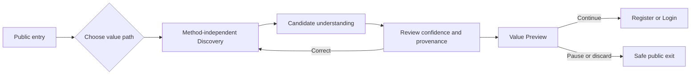
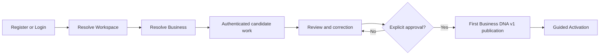
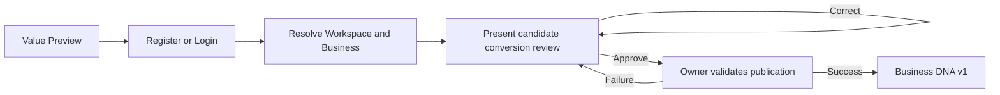
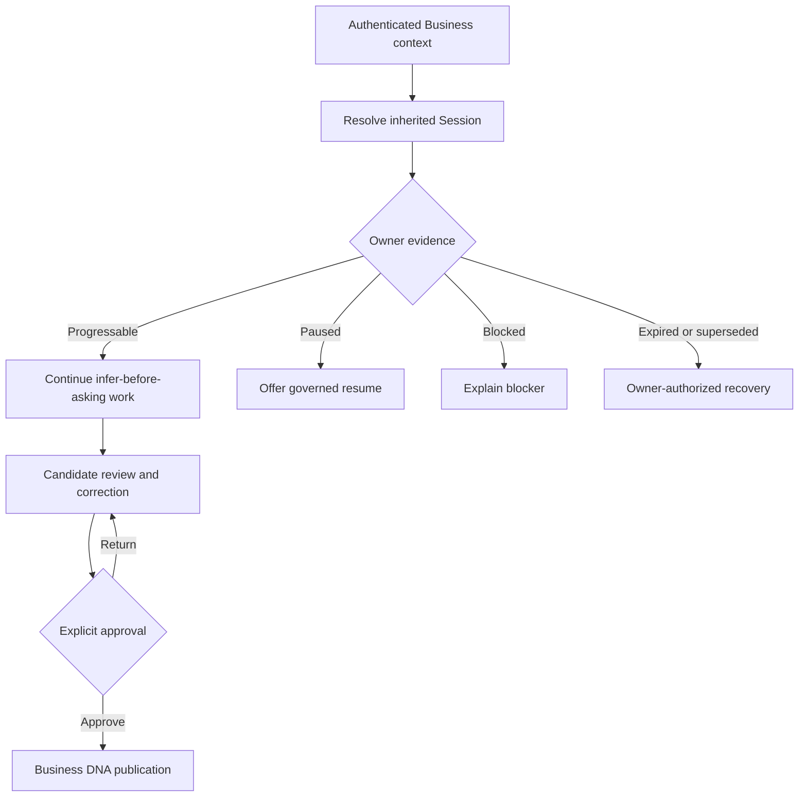
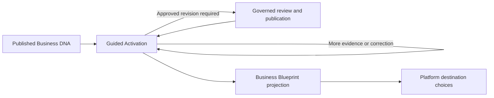
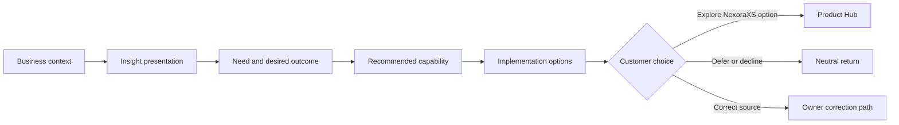
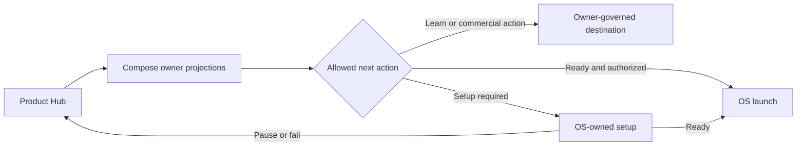
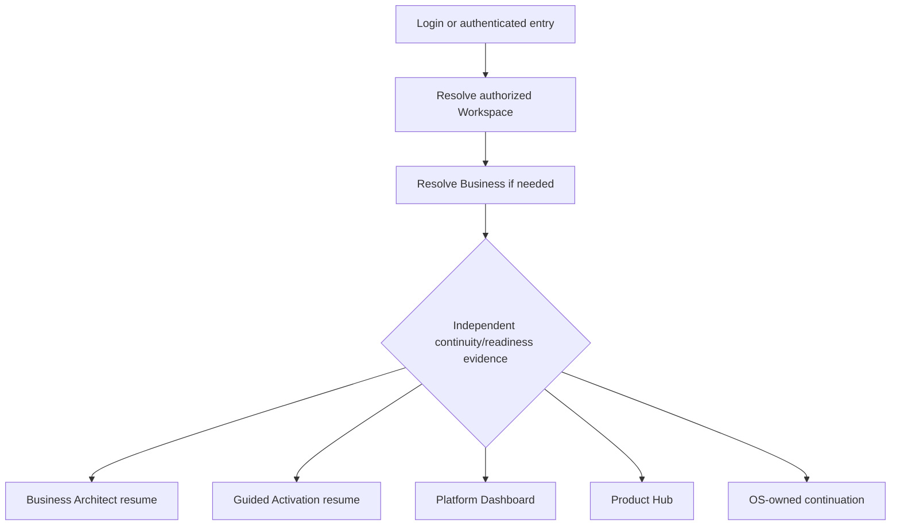
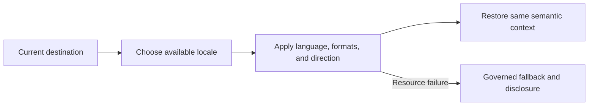
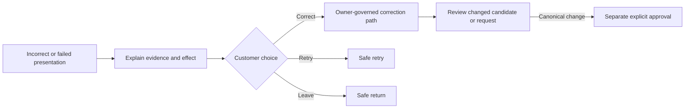

# User Flows

| Field | Value |
|---|---|
| Version | 1.1 reconciliation candidate |
| Status | Canonical presentation-flow authority candidate; implementation not authorized |
| Owner | Product Experience; canonical actions remain owner-controlled |
| Architecture | Core Platform Architecture v1.1 Freeze |

## 1. Purpose

This document expresses approved journeys as semantic presentation flows. Nodes describe customer
intent and system presentation, not routes, services, commands, persistence, or domain states.

## 2. Common Flow Contract

Every flow accounts for entry, context, intent, system response, review, correction, explicit
approval where consequential, exit, interruption/resume, error, no-data, low-confidence, and
permission-denied outcomes where applicable.

Presentation labels such as **loading**, **unavailable**, **retry**, and **resume offered** do not
create domain states. The inherited Business Architect Session lifecycle remains separate from
Discovery continuity, Guided Activation presentation, Business DNA publication, and OS setup.

## 3. F-01 — Public Discovery and Value Preview

- **Entry:** Public experience.
- **Context:** No anonymous Workspace or Business.
- **User intent:** Understand the Business before committing to an account.
- **System response:** Selects or offers an appropriate acquisition method based on goal and gaps;
  shows temporary candidate material with confidence/provenance.
- **Review/correction/approval:** Review and correction are supported; no canonical approval exists
  before authentication.
- **Exit:** Value Preview, authentication, pause, or discard.
- **Interruption/resume:** Only when permitted by the future retention decision; otherwise restart is
  explicit.
- **No-data/low-confidence:** Explain missing evidence and offer another method without pretending
  certainty.
- **Errors/recovery:** Method failure permits retry, alternative method, safe exit, or later return.
- **Permission denied:** Not applicable until protected evidence or authentication is involved.
- **Data source:** Future owner-approved Discovery evidence; none is authorized by this document.
- **Current mock repository/components:** None verified.
- **Definition of Done:** Public value can be evaluated without canonical creation, one method is
  never mistaken for Discovery, and authentication remains optional until conversion.

## 4. F-02 — Direct Registration to First Publication

- **Entry:** Direct Register/Login.
- **Context:** Identity, then authorized Workspace and Business.
- **User intent:** Establish ownership and create governed understanding without public Discovery.
- **System response:** Converges on the authenticated Business Architect candidate/review pipeline.
- **Review/correction/approval:** Material review and a dedicated explicit approval precede first
  publication; “Next” and account creation never count.
- **Exit:** Guided Activation after publication, or safe authenticated pause.
- **Interruption/resume:** Resume inherited pipeline evidence in revalidated context.
- **No-data/low-confidence:** Continue infer-before-asking acquisition; do not fabricate completeness.
- **Errors/recovery:** Context, validation, or publication failure returns safely to review.
- **Permission denied:** Explain access loss and allow safe context change or return.
- **Data source:** Future owner-approved identity, organization, candidate, and Business DNA
  boundaries; no contract is created here.
- **Current mock repository/components:** Current auth/onboarding screens are evidence only and do not
  implement this flow.
- **Definition of Done:** Direct entry preserves all publication controls and introduces no second
  Business DNA owner or onboarding architecture.

## 5. F-03 — Public Candidate Conversion

- **Entry:** Public candidate plus authentication intent.
- **Context:** Temporary candidate transitions to authenticated review association; canonical owner
  is not established before Workspace/Business resolution.
- **User intent:** Carry useful understanding forward without silent conversion.
- **System response:** Re-presents material facts, provenance, confidence, and changed context.
- **Review/correction/approval:** Explicit approval occurs only after authentication and owner
  resolution.
- **Exit:** First publication or safe candidate review pause.
- **Interruption/resume:** Governed by deferred retention/conversion policy.
- **No-data/low-confidence:** Ask only necessary gaps or permit deferral.
- **Errors/recovery:** Invalid/expired continuity explains what is unavailable and offers restart.
- **Permission denied:** No publication; select another authorized context or exit.
- **Data source / mock repository / components:** Deferred; none verified or authorized.
- **Definition of Done:** Candidate/canonical separation and provenance survive handoff visibly.

## 6. F-04 — Business Architect Resume, Review, and Publication

- **Entry:** Selected authenticated Business.
- **Context:** Workspace, Business, actor, and inherited Business Architect Session evidence.
- **User intent:** Continue governed understanding work and publish deliberately.
- **System response:** Presents progress/pause/block/expire/supersede only when owner evidence says so.
- **Review/correction/approval:** Required before publication.
- **Exit:** Published DNA, intentional pause, or authorized recovery.
- **Interruption/resume:** Uses inherited pipeline lifecycle; it is not a Discovery or Guided
  Activation state machine.
- **No-data/low-confidence:** Continue gap-oriented acquisition.
- **Errors/recovery:** Preserve safe input, disclose conflicts, and avoid silent reset.
- **Permission denied:** Withhold content and offer safe return/context change.
- **Data source / mock repository / components:** No canonical frontend source verified.
- **Definition of Done:** The frozen Session lifecycle is visible without being redefined.

## 7. F-05 — Guided Activation and Blueprint

- **Entry:** First or later published Business DNA.
- **Context:** Authenticated selected Business.
- **User intent:** Resolve material gaps and understand the governed result.
- **System response:** Presents adaptive continuation, then a non-writing Blueprint projection.
- **Review/correction/approval:** Any canonical revision uses owner review/approval; Blueprint never
  writes.
- **Exit:** Blueprint, Dashboard, Product Hub, or optional Recommendations as permitted.
- **Interruption/resume:** Presentation resumes from owner evidence without inventing domain states.
- **No-data/low-confidence:** Show partiality and remaining uncertainty.
- **Errors/recovery:** Retry projection or return to safe owner workflow.
- **Permission denied:** Hide protected Business content and provide safe return.
- **Data source / mock repository / components:** No governed source or component verified.
- **Definition of Done:** Publication precedes activation; Blueprint remains a projection; OS setup
  is absent from this flow.

## 8. F-06 — Insight and Optional Recommendation Review

- **Entry:** Blueprint, Dashboard, or allowed Recommendation destination.
- **Context:** Business and viewer authorization.
- **User intent:** Understand advice and choose freely.
- **System response:** Shows evidence, lineage access, assumptions, alternatives, risk, confidence,
  and NexoraXS disclosure.
- **Review/correction/approval:** No consequential action is automatic; correction returns to owner
  workflows.
- **Exit:** Product Hub, defer/decline, or safe return.
- **Interruption/resume:** Re-open from current owner projection; no lifecycle is inferred.
- **No-data/low-confidence:** “No recommendation” and insufficient-confidence are valid outcomes.
- **Errors/recovery:** Withhold misleading result; retry or return.
- **Permission denied:** Withhold protected lineage and Business evidence.
- **Data source / mock repository / components:** Future Business Brain/Recommendation projections;
  none currently verified.
- **Definition of Done:** Business Insight remains conceptual inside Business Brain Decision and
  Product Ethics Law is visible in choices.

## 9. F-07 — Product Hub to OS Handoff

- **Entry:** Product Hub.
- **Context:** Authenticated Workspace and applicable organization/OS scope.
- **User intent:** Discover, obtain access, set up, or launch an OS.
- **System response:** Composes distinct availability, entitlement/subscription, setup, readiness,
  and permission projections.
- **Review/correction/approval:** Commercial and operational actions remain with their owners.
- **Exit:** Owner destination, OS setup, OS operation, or Core safe return.
- **Interruption/resume:** Product Hub shows owner-provided continuation; it does not synthesize it.
- **No-data/low-confidence:** Missing projections are marked unavailable/stale.
- **Errors/recovery:** Preserve Core context and safe return.
- **Permission denied:** Do not imply subscription equals user access.
- **Data source:** Owner projections. **Current mock:** Feature 054 handoff/access seams are evidence
  only. **Components:** Current App Grid/Handoff surfaces are evidence only.
- **Definition of Done:** Core Workspace Ready and OS Ready remain distinct; no ownership transfer.

## 10. F-08 — Returning-Customer Destination Resolution

- **Entry:** Login, deep link, or retained authenticated session.
- **Context:** Revalidated actor, Workspace, Business, resource, and OS scope as applicable.
- **User intent:** Resume or enter normal work.
- **System response:** Chooses only among owner-supported destinations; invalid links degrade safely.
- **Review/correction/approval:** Any candidate publication still requires explicit approval.
- **Exit:** Safe authorized destination.
- **Interruption/resume:** Exact resumption is deferred to feature specification and owner evidence.
- **No-data/low-confidence:** Default to safe Dashboard/context selection, not an invented state.
- **Errors/recovery:** Re-authenticate, change context, retry, or safe parent.
- **Permission denied:** Explain and avoid leaking target content.
- **Data source / current mock:** Current local auth/onboarding redirect is implementation evidence,
  not target authority.
- **Definition of Done:** Core, Business Architect, Guided Activation, and OS readiness are not
  collapsed into one completion flag.

## 11. F-09 — Locale and Direction Change

- **Entry:** Any destination exposing locale choice.
- **Context:** Public or authenticated.
- **User intent:** Change language without losing work or scope.
- **System response:** Applies resources, locale formatting, direction, and language declaration as
  one coherent change.
- **Review/correction/approval:** Not a canonical Business approval.
- **Exit:** Same semantic destination in selected locale.
- **Interruption/resume:** Preserve safe input and context.
- **No-data/low-confidence:** Missing translation uses governed fallback and observable marker, not
  a blank UI.
- **Errors/recovery:** Revert coherently to last usable locale or safe fallback.
- **Permission denied:** Not normally applicable; availability may be governed.
- **Data source / current mock:** Current locale fixtures/components are evidence only.
- **Definition of Done:** English/LTR and Arabic/RTL achieve parity and architecture has no fixed
  two-language ceiling.

## 12. F-10 — Correction and Recovery

- **Entry:** Any stale, incorrect, conflicted, failed, or interrupted experience.
- **Context:** Preserve only authorized and safe information.
- **User intent:** Recover or correct without unintended consequence.
- **System response:** Identifies the affected artifact and offers valid next actions.
- **Review/correction/approval:** Correction and approval remain separate.
- **Exit:** Recovered flow, safe return, or intentional pause.
- **Interruption/resume:** Never silently submits, publishes, purchases, or configures.
- **No-data/low-confidence:** Present absence/uncertainty, not false certainty.
- **Errors/recovery:** Retry is visible; repeated failure exposes safe alternative.
- **Permission denied:** Revalidate context without revealing protected content.
- **Data source / mock repository / components:** Owner-specific; not created here.
- **Definition of Done:** Every critical flow has understandable failure and recovery without domain
  lifecycle invention.

## 13. Flow Traceability

| Flow | Journeys | Semantic destinations | Current implementation evidence |
|---|---|---|---|
| F-01 | J-01, J-04 | Public Discovery, Candidate Reflection, Value Preview | None verified |
| F-02 | J-02, J-07 | Identity, Workspace, Business, Candidate Review, Publication | Partial auth/onboarding routes |
| F-03 | J-01, J-06, J-07 | Conversion Review, Publication | None verified |
| F-04 | J-05–J-07 | Business Architect, Candidate Review | None verified |
| F-05 | J-08–J-09 | Guided Activation, Blueprint | None verified |
| F-06 | J-09, J-11, J-14, J-15 | Insight, Recommendation, Correction | None verified |
| F-07 | J-10, J-12 | Product Hub, OS handoff | Partial Core/Commerce mock evidence |
| F-08 | J-03, J-05, J-13 | Context resolution, Dashboard, resume | Partial mock routing evidence |
| F-09 | Cross-journey | Locale control | Partial Core evidence; uneven Commerce evidence |
| F-10 | J-13–J-15 | Error, correction, safe return | Uneven current evidence |

## 14. Deferred Decisions

Routes, exact lifecycle names, retention, permissions, candidate conversion, data sources, API and
repository boundaries, analytics, Recommendation disposition, and OS setup contracts remain with
their owning future milestones.

## 15. Relationships and Verified Against

- [User Journeys](./05-USER-JOURNEYS.md)
- [Presentation State Authority](./07-STATE-MACHINES.md)
- [Screen Map](./02-SCREEN-MAP.md)
- [Interaction Patterns](../04-design-system/05-INTERACTION-PATTERNS.md)
- `docs/99-architecture-freeze/CORE-PLATFORM-v1.1-FREEZE.md`
- `docs/00-governance/ADR/ADR-043-foundation-discovery-and-business-architect-composition.md`
- `docs/01-genesis/21-FOUNDATION-JOURNEY-SUCCESSOR-ADDENDUM-v1.0.md`

