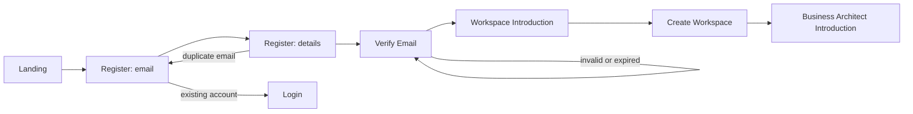
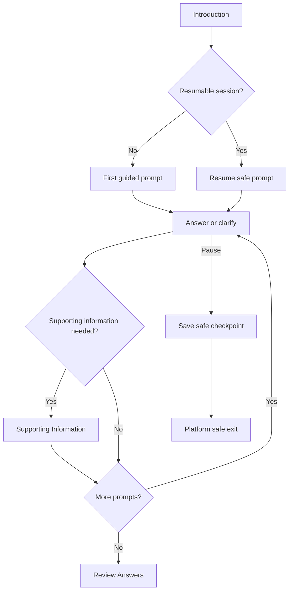
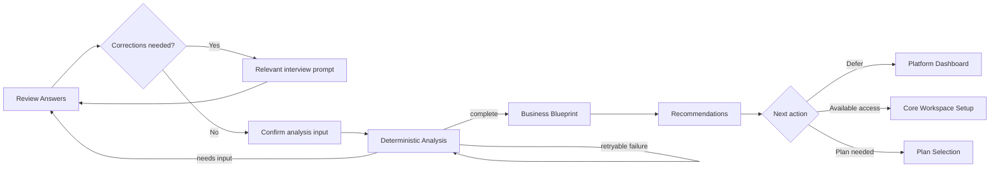
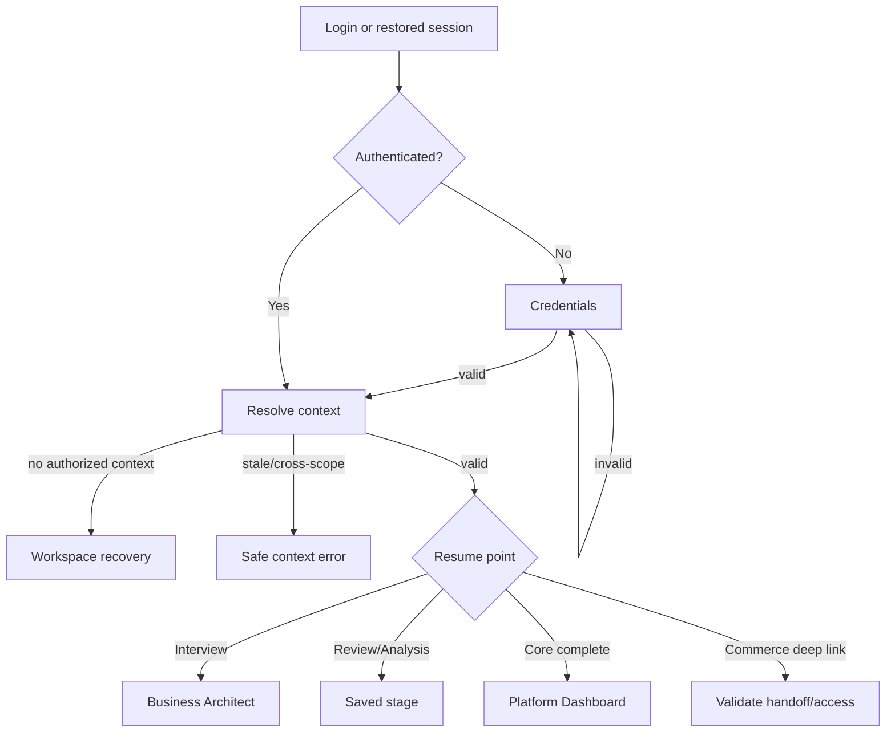
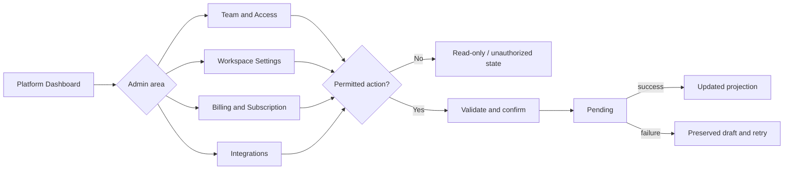
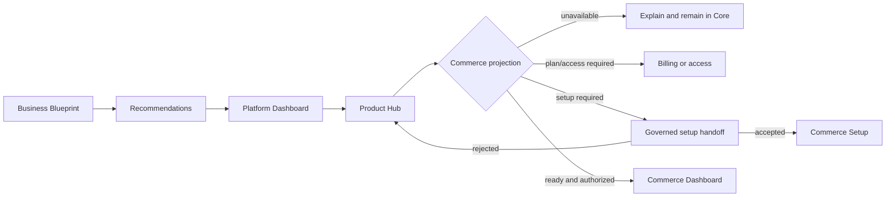
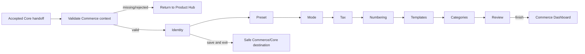
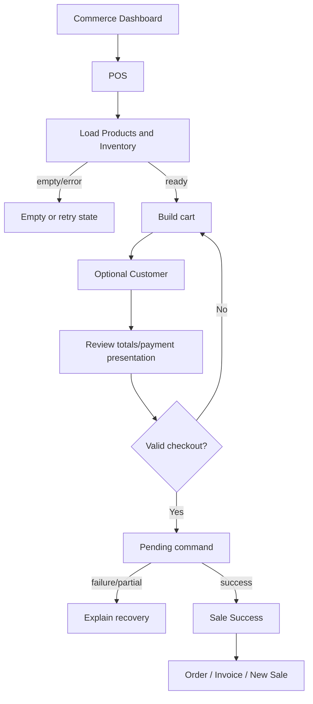
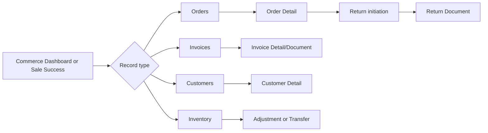
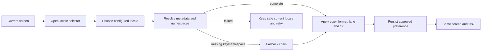

# User Flows

- **Status:** Target frontend flow specification reconciled with current implementation
- **Snapshot date:** 2026-07-19
- **Owner:** Product Experience with the applicable Core Platform or Commerce frontend owner
- **Authority:** Screen and interaction flow only; no backend contract or canonical domain lifecycle authority

## 1. Purpose

This document decomposes the canonical [User Journeys](./05-USER-JOURNEYS.md) into executable
frontend flow boundaries. Current data sources and mock repositories are named where they exist.
For planned Business Architect/Blueprint behavior, “none verified” is deliberate: this document
does not invent a repository, DTO, API, schema, Business Brain rule, or canonical state model.

## 2. Scope

The flows cover account entry, Workspace creation, Business Architect, deterministic analysis,
Business Blueprint, Recommendations, returning/resume behavior, Workspace administration,
Product discovery, Commerce activation, Commerce daily sale/follow-up, and language switching.

## 3. Flow Completion Rules

A flow is done only when:

- all included screens exist or the approved feature scope explicitly limits the slice;
- entry and exit preserve the established Core/Commerce owner boundary;
- loading, empty, error, unauthorized, recovery, and success states are visible where applicable;
- keyboard, focus, Arabic/RTL, English/LTR, and configured-locale behavior are testable;
- mock state remains isolated by the applicable context; and
- current frontend compatibility types are not promoted into backend or canonical contracts.

## 4. Flow F-01 — Registration, Verification, and Workspace Creation

### Flow diagram

### Flow definition

- **Entry:** Landing registration action or Login “Get started.”
- **Exit:** Business Architect Introduction for the newly created Workspace.
- **Data source:** Current account, session, Workspace, locale, country, currency, and timezone
  presentation from `apps/core-platform/lib/store/AppProvider.tsx` and
  `packages/shared/src/mock-db/`.
- **Mock repository:** No named Core repository interface exists. `AppProvider` delegates browser
  persistence to Core storage adapters and the shared mock database. This is current frontend
  evidence, not a future identity or Workspace API.
- **Components:** Landing Navbar/Hero/CTA; `AuthShell`, `SocialAuth`, `PasswordInput`,
  `PasswordStrength`; Verify Email page; Welcome page; `PhaseStepper`, `FlagSelect`, and current
  onboarding page.
- **States:** Initial, email valid/invalid, details valid/invalid, creating, duplicate, verification
  pending/resent/invalid, hydration, Workspace draft/invalid/saving/created, handoff ready.
- **Possible errors:** Invalid email; duplicate email; invalid password; missing current user;
  browser persistence failure; invalid saved locale; required Workspace name missing.
- **Recovery:** Retain safe form values; return to the failed step; use Login for existing account;
  resend verification; retry Workspace creation; never create a second Workspace silently.

### Step-by-step

1. Landing opens Register. Current Landing instead sends its primary CTA to Login and requires
   reconciliation.
2. Register validates email before showing personal/password fields.
3. Account creation writes current mock identity/session and routes through `/verify` to
   `/verify-email`.
4. Verify Email confirms a complete six-digit presentation and routes to `/welcome`.
5. Welcome introduces Workspace creation.
6. Current `/onboarding` step 1 collects Workspace name, country, currency, and timezone.
7. Target flow exits to Business Architect Introduction; current flow instead proceeds directly
   to OS selection and Plan.

### Definition of Done

- Landing, Register, Verify Email, Workspace introduction, and Create Workspace form one coherent
  forward/back sequence.
- The flow has visible pending/failure/retry states and does not blank during hydration.
- The Workspace is not described as a Business, Business Unit, Branch, or Operating System.
- Success routes to Business Architect Introduction, not OS selection.
- Copy and validation use translation keys; locale and direction survive every step.

## 5. Flow F-02 — Business Architect Interview

### Flow diagram

### Flow definition

- **Entry:** Successful Workspace creation, Platform Dashboard resume card, or authorized Business
  Architect deep link.
- **Exit:** Review Answers, safely paused session, or Platform Dashboard.
- **Data source:** Planned Core-owned Business context, question/evidence presentation, and draft
  interview session. No implementation source exists.
- **Mock repository:** None verified. The first frontend slice needs governed fixtures and a
  replaceable mock client defined by an approved feature spec; it must not infer backend DTOs.
- **Components:** No Business Architect components exist. The target requires an introduction,
  conversational prompt surface, answer controls, progress/resume indicator, optional supporting-
  information surface, and safe-exit confirmation. Reusable behavior comes from the Design System.
- **States:** Context resolving, no session, resumable, prompt loading, answering, validation,
  clarification, supporting information absent/available, checkpoint saving, paused, completed,
  inaccessible, error/retry.
- **Possible errors:** No canonical Business selected; prompt fixture unavailable; invalid answer;
  draft persistence failure; supporting information rejected; saved session no longer authorized.
- **Recovery:** Return to Business selection/entry; retry prompt read; preserve the safe answer
  draft; resume the last completed prompt; explain an unavailable supporting item; exit to Core.

### Step-by-step

1. Introduction explains purpose, expected output, use of information, and resume behavior.
2. Resolve Business context and any resumable interview.
3. Present one guided/conversational prompt at a time, not a single static long form.
4. Validate only what is needed for the current prompt; explain why information matters.
5. Let the user clarify, go back, pause, or add permitted supporting information.
6. Save a safe checkpoint after each completed unit without implying published Business DNA.
7. When prompts are complete, open Review Answers.

### Definition of Done

- Introduction, start, pause, resume, back, supporting-information, and completion paths are
  keyboard-operable and localized.
- The screen always identifies current Business context without exposing another scope.
- Raw answers remain interview evidence/draft; the UI does not label them published Business DNA.
- Refresh/resume restores the exact safe point through the mock seam.
- Failure and retry do not duplicate or discard a confirmed answer silently.

## 6. Flow F-03 — Review, Analysis, Business Blueprint, and Recommendations

### Flow diagram

### Flow definition

- **Entry:** Completed Business Architect interview or resumable Review/Analysis result.
- **Exit:** Core Workspace Setup, Plan Selection, Platform Dashboard, or deferred Recommendation.
- **Data source:** Planned Core Business DNA/evidence projections, deterministic Business Brain
  Decision output, Business Blueprint presentation, and Recommendation projections. Each remains
  owned by its frozen architecture boundary.
- **Mock repository:** None verified. Frontend-first fixtures must be deterministic, versioned for
  the scenario, and explainable. They cannot substitute an AI-only result or define backend shapes.
- **Components:** No current components exist. Target surfaces include Review sections, provenance
  and correction controls, Analysis progress/recovery, Blueprint section navigation, readiness
  indicators, capability cards, Recommendation explanations, and defer/continue actions.
- **States:** Review incomplete/conflict/ready, confirmation pending, analysis queued/running/
  blocked/failed/completed, Blueprint loading/partial/stale/ready, Recommendations loading/none/
  ready/deferred/error.
- **Possible errors:** Conflicting inputs; missing material answer; deterministic fixture failure;
  stale source version; partial owner projection; Recommendation unavailable.
- **Recovery:** Return to exact answer; retry analysis with unchanged versioned input; explain the
  blocker; present partial Blueprint without inventing facts; allow Dashboard continuation when
  Recommendations or purchase are optional.

### Step-by-step

1. Group answers, inferred candidates, assumptions, conflicts, and gaps for review.
2. Route corrections to the originating interview prompt and return to Review.
3. Confirm the exact analysis input version.
4. Show deterministic analysis progress with meaningful, non-fabricated stages.
5. On completion, present Business Blueprint before any Recommendations.
6. Compose Blueprint from Business DNA, business summary, needs, challenges, opportunities,
   readiness indicators, relevant capabilities, and implementation roadmap.
7. Keep Recommendations separate and explain rationale, evidence, assumptions, alternatives,
   confidence, expected benefit, and risk where supplied by the owner projection.
8. Let the user defer or continue to available access/Plan without mutating the Blueprint.

### Definition of Done

- The order Review → deterministic Analysis → Business Blueprint → Recommendations is enforced.
- Blueprint is labeled as a presentation/projection, never a new aggregate.
- Recommendation disposition does not rewrite Business DNA or Blueprint.
- Every partial, stale, no-recommendation, and retry state is visible in launch locales and both
  directions.
- Fixture provenance and version are testable without establishing a backend contract.

## 7. Flow F-04 — Login and Exact Resume

### Flow diagram

### Flow definition

- **Entry:** Login, restored browser session, or deep link.
- **Exit:** Exact authorized resume screen, Platform Dashboard, or safe context recovery.
- **Data source:** Current Core session/context from `AppProvider`, Core browser adapters, and shell
  presentation services; planned Business Architect progress source is absent.
- **Mock repository:** Shared mock DB plus Core browser session adapters. Current
  `onboardingState.completedOS` is a coarse compatibility value, not the target resume model.
- **Components:** Login page, `DashboardLayout`, `CoreShell`, `ShellStateNotice`, `ContextSwitcher`,
  planned resume card/screen.
- **States:** Session resolving, unauthenticated, credentials pending/invalid, context loading,
  missing, stale, cross-scope, recovering, valid, resume available, complete.
- **Possible errors:** Invalid credentials; missing session; corrupt storage; missing Workspace;
  cross-scope saved IDs; expired/superseded resume; unauthorized deep link.
- **Recovery:** Password reset; retry context read; choose an authorized Workspace; return to
  Dashboard; discard only an invalid presentation draft after explicit explanation.

### Step-by-step

1. Resolve session without flashing protected content.
2. Authenticate when needed.
3. Resolve Workspace and organization context through Core's read boundary.
4. Reject missing, stale, and cross-scope context with a localized state.
5. Determine resume point independently for Core onboarding, Business Architect, and OS setup.
6. Restore locale/direction/theme and route to the safe target.

### Definition of Done

- Completed users land on Platform Dashboard or requested safe destination, not always Product Hub.
- An incomplete interview resumes at its exact safe checkpoint.
- Commerce readiness does not gate Platform Dashboard entry.
- Stale/cross-scope context never renders protected data.
- Loading, unauthorized, retry, and fallback behavior has end-to-end tests.

## 8. Flow F-05 — Workspace Administration

### Flow diagram

### Flow definition

- **Entry:** Platform Dashboard or Core shell administration link.
- **Exit:** Updated administration view or Platform Dashboard.
- **Data source:** Current `useApp()` mock projections; member and settings actions are partly
  component-local. Final membership, authorization, billing, and integration owners remain Core
  architecture concerns.
- **Mock repository:** No unified administration repository. Browser mock storage plus local
  component state are current evidence.
- **Components:** Core shell/context, Team page, `InviteUserModal`, hard-coded permission matrix,
  Settings tabs, Billing page, Integrations page, toast presentation.
- **States:** Loading, empty, read-only, editable, validating, confirmation, pending, success,
  failed/retryable, stale, unauthorized.
- **Possible errors:** Permission absent; duplicate invitation; invalid data; stale projection;
  unsupported commercial action; local-only success with no persistence.
- **Recovery:** Preserve input; cancel; refresh owner projection; request access; show read-only
  state; return to Dashboard.

### Step-by-step

1. Resolve active Workspace and applicable admin permission.
2. Open one Core-owned administration area.
3. Load the relevant projection and separate view from manage actions.
4. Validate and confirm a permitted action.
5. Show pending and then updated, failed, or stale state.
6. Return with Workspace context unchanged.

### Definition of Done

- Personal, Workspace, commercial, and OS operational settings are visibly distinct.
- Unauthorized actors cannot see active mutation controls.
- Team UI does not present hard-coded mock roles as canonical.
- Every mutation has validation, confirmation where consequential, pending, success, failure, and
  Audit expectation documented by the future feature spec.
- Current mock persistence is isolated and replaceable.

## 9. Flow F-06 — Product Discovery and Commerce Handoff

### Flow diagram

### Flow definition

- **Entry:** Recommendations, Platform Dashboard, or Product Hub.
- **Exit:** Core continuation, Billing/access, Commerce Setup, or Commerce Dashboard.
- **Data source:** Current Product Hub derives browser mock subscription/setup projections through
  `useApp`; handoff URLs are created by `CommerceHandoffAdapter`.
- **Mock repository:** Core browser mock store plus Commerce handoff adapter. This bounded seam is
  frontend-internal and must not become a future HTTP contract.
- **Components:** Core Dashboard, Product Hub cards, subscription summary, setup/launch actions,
  Core and Commerce shells, Commerce missing-context screen.
- **States:** Loading, no products, coming later, available, plan required, subscribed, setup
  required, ready, paused/stale, unauthorized, handoff pending/rejected/accepted.
- **Possible errors:** Missing actor/Workspace/subscription; stale setup state; direct Commerce entry;
  handoff mismatch; Commerce unavailable.
- **Recovery:** Remain in Core; refresh projections; open Billing; request new handoff; return to
  Product Hub; never synthesize Commerce setup in Core.

### Step-by-step

1. Enter Product Hub after Recommendations or from Dashboard.
2. Review each capability/product card and separate availability, commercial state, setup, and
   readiness.
3. Select an allowed action.
4. For Commerce setup, produce the existing bounded handoff and navigate to Commerce.
5. Commerce validates context; rejected handoff returns to Product Hub.
6. Ready Commerce launches its own Dashboard.

### Definition of Done

- Platform Dashboard is usable before Commerce is ready.
- Recommendations precede product choice in the new-user journey but Product Hub remains directly
  accessible later.
- Product Hub performs no Commerce writes or setup behavior.
- Setup and launch actions are separately permissioned in presentation.
- Failed handoff has an explicit safe-return screen in both directions/locales.

## 10. Flow F-07 — Commerce Setup

### Flow diagram

### Flow definition

- **Entry:** Accepted Product Hub setup handoff.
- **Exit:** Commerce Dashboard or Product Hub safe return.
- **Data source:** `apps/commerce/lib/store/AppProvider.tsx`, Commerce setup application service,
  browser setup/operations store, and handoff compatibility context.
- **Mock repository:** `BrowserLegacyCommerceOperationsStore` and current Commerce services
  supplied by `CommerceProviders`. They are browser-only implementation evidence.
- **Components:** Setup `Stepper`, `LogoUpload`, `SetupPreview`, `SetupReceiptPreview`,
  `SetupInvoicePreview`, `PresetStep`, `CategoriesStep`, and field controls inside
  `apps/commerce/app/setup/page.tsx`.
- **States:** Hydrating, missing context, unauthenticated, loading existing setup, draft, step
  valid/invalid, media accepted/rejected, saving, saved, completion pending, failed, ready.
- **Possible errors:** Direct entry; missing Core context; invalid required fields; media/storage
  limit; write failure; setup state corrupt.
- **Recovery:** Return to Product Hub/Login; retry setup read; preserve safe draft; remove/retry
  media; save and exit; retry completion.

### Step-by-step

1. Validate handoff, identity, Workspace, subscription, and compatibility organization context.
2. Load existing Commerce setup or create a local draft.
3. Complete eight Commerce-owned steps with live preview.
4. Persist approved frontend mock changes through the Commerce owner seam.
5. Finish setup and route to Commerce Dashboard.

### Definition of Done

- Direct entry without an accepted context shows recovery, not fallback Core writes.
- Every step has validation, translated labels, focus-safe navigation, and responsive behavior.
- Save/exit and refresh resume the current safe setup state.
- Completion changes Commerce presentation readiness only through its owning service.
- Core identity and organization data are consumed read-only through the accepted handoff seam.

## 11. Flow F-08 — Commerce Sale

### Flow diagram

### Flow definition

- **Entry:** Commerce Dashboard, shell POS link, or keyboard shortcut.
- **Exit:** Sale Success, Order/Invoice detail, a new sale, or recovered POS draft.
- **Data source:** Products, Customers, Inventory, current Branch/setup, POS draft, order command,
  invoice and inventory effects through current Commerce application services.
- **Mock repository:** `BrowserStorageCommerceStore`, feature repositories supplied by
  `CommerceServicesProvider`, `LocalOrderCommandRepository`, and POS last-order adapter. Feature
  055 preserves current partial-commit behavior; it is not a production transaction contract.
- **Components:** POS page product grid, category/search controls, cart, customer drawer/selector,
  totals/payment controls, checkout state, Sale Success page.
- **States:** Loading, catalog empty, query empty, draft empty/ready, invalid quantity,
  insufficient stock, checkout pending, failed, partial outcome, success, last order missing.
- **Possible errors:** Repository read failure; insufficient stock; order write failure; inventory
  effect failure; invoice effect failure; storage quota; missing last-order pointer.
- **Recovery:** Retry reads; preserve or reconstruct safe cart; do not blindly replay a possibly
  committed sale; inspect Order list for outcome; show partial result and next action; start a new
  sale only after outcome is known.

### Step-by-step

1. Load scoped Product and Inventory projections.
2. Search/filter Products and add eligible quantities to cart.
3. Select an optional Customer.
4. Review totals and payment presentation.
5. Validate current scope and stock.
6. Submit through the current owner-bounded order command.
7. Route to Sale Success only when the created Order is known.
8. Offer Order, Invoice, print, and new-sale next actions.

### Definition of Done

- Empty, loading, read-error, validation, checkout-error, partial, and success outcomes are
  visually distinct.
- Retry never duplicates a possibly committed sale.
- POS is fully keyboard-operable and responsive in every configured direction.
- All user-visible strings and number/currency/date values use localization services.
- Scope isolation and existing Feature 055 behavior remain covered by tests.

## 12. Flow F-09 — Commerce Operational Follow-up

### Flow diagram

### Flow definition

- **Entry:** Commerce Dashboard, Sale Success, shell navigation, or authorized deep link.
- **Exit:** Updated list/detail, printable document, transfer/return result, or Commerce Dashboard.
- **Data source:** Current feature hooks and application services for Products, Customers,
  Inventory, Orders, Invoices, Returns, Transfers, Documents, and Reporting.
- **Mock repository:** Current repository seams under `packages/contracts/src/commerce` and
  `packages/sdk/src/commerce`, plus retained Commerce owner write services. These are frontend
  compatibility records only.
- **Components:** Current list/detail pages, customer drawer, Product editor, Inventory adjustment,
  Transfer form/history, Order Return interaction, Invoice/Return document presentations.
- **States:** Loading, empty/filter-empty, ready, not found, related projection missing, validation,
  pending, success, error/retry, printable, unauthorized.
- **Possible errors:** Repository unavailable/corrupt; record outside scope; missing related record;
  insufficient stock; invalid transfer; ineligible Return; document missing.
- **Recovery:** Retry list/read; return to source list; clear filter; preserve safe mutation draft;
  show unavailable related section; navigate to known source record.

### Step-by-step

1. Open a scoped list or detail.
2. Load the primary record separately from optional relations.
3. Present empty/not-found/error accurately.
4. Perform only currently approved owner writes.
5. Invalidate/reload the relevant mock projection and show outcome.
6. Return to the originating module or print document.

### Definition of Done

- Every list has initial loading, true empty, filter-empty, error/retry, and ready states.
- Every detail has loading, not found, optional-relation failure, unauthorized, and ready states.
- Returns list/detail and Stock Movements are separately specified before implementation.
- Tables/documents have compact and print behavior in LTR/RTL.
- No page imports another app or bypasses the Commerce service/repository boundary.

## 13. Flow F-10 — Language Switching

### Flow diagram

### Flow definition

- **Entry:** Any screen with an approved locale selector.
- **Exit:** The same screen and task in the selected or fallback locale.
- **Data source:** Current `en`/`ar` browser session values, `DICT`, Core shell presentation
  translations, Commerce feature message dictionaries, and document `lang`/`dir` effects.
- **Mock repository:** Browser session storage via Core/Commerce AppProviders and Core locale
  adapters. The implementation currently has two Core locale paths (`lib/locale.ts` and store
  adapters), so no unified Locale Engine exists.
- **Components:** Core `LanguageSwitcher`/`LocaleToggle`, Commerce `LocaleToggle`, onboarding locale
  controls, every translatable screen/component, and target locale selector.
- **States:** Resolving configured locales, selected, switching, namespace loading, fallback,
  missing translation diagnostic, persisted, failed/retryable.
- **Possible errors:** Unsupported saved locale; missing key; namespace unavailable; formatter
  failure; direction not applied; mixed Core/Commerce locale state.
- **Recovery:** Keep the last usable locale; apply fallback language; log safe diagnostics; retry;
  retain task data and focus; never show raw translation keys to production users.

### Step-by-step

1. Read the configured locale registry rather than a hard-coded two-option branch.
2. Select a supported locale.
3. Resolve direction, fallback chain, and required namespaces.
4. Atomically apply translated copy, `lang`, `dir`, plural rules, date/time/number/currency
   formatting, and direction-aware layout.
5. Preserve the current form draft, selection, focus, and route.
6. Persist at the approved scope and carry it through accepted cross-app navigation.

### Definition of Done

- English and Arabic launch flows pass; a test locale proves the architecture is not hard-coded to
  two languages.
- No user-facing route string is hard-coded outside the translation path.
- RTL/LTR, mixed-script, plural, date, currency, number, and timezone behavior are covered.
- Missing keys follow fallback/diagnostic policy without exposing raw keys.
- Switching does not navigate away, clear data, or change user-entered Business content.

## 14. Flow-to-Screen Traceability

| Flow | Current screens | Planned screens |
|---|---|---|
| F-01 Registration/Workspace | Landing, Login, Register, Verify Email, Welcome, `/onboarding` Workspace step | Business Architect Introduction as new exit |
| F-02 Business Architect | None | Introduction, Interview, Supporting Information, Review |
| F-03 Analysis/Blueprint/Recommendations | None | Review, Analysis, Business Blueprint, Recommendations, Core Workspace Setup |
| F-04 Login/Resume | Login, Core shell context states, current onboarding redirect | Exact Business Architect/Core resume destinations |
| F-05 Workspace Administration | Team, Settings, Billing, Integrations | Permission-aware completed states |
| F-06 Product Discovery | Platform Dashboard, Product Hub, Commerce handoff | Recommendation-led entry and refined access states |
| F-07 Commerce Setup | Product Hub, `/setup`, Commerce Dashboard | None required for current route skeleton |
| F-08 Commerce Sale | Commerce Dashboard, POS, Sale Success, Orders/Invoices | Stronger partial-outcome recovery |
| F-09 Operational Follow-up | Products, Inventory, Transfers, Customers, Orders, Invoices, documents, Reports, Settings | Returns list/detail; Stock Movements |
| F-10 Language Switching | Core/Commerce locale controls and partially localized routes | Complete app-wide Locale Engine behavior |

## 15. Relationships

- [User Journeys](./05-USER-JOURNEYS.md)
- [State Machines](./07-STATE-MACHINES.md)
- [Screen Status Matrix](./12-SCREEN-STATUS-MATRIX.md)
- [UX Gaps](./13-UX-GAPS.md)
- [Frontend Backlog](./14-FRONTEND-BACKLOG.md)
- [Design System Interaction Patterns](../04-design-system/05-INTERACTION-PATTERNS.md)

## 16. Open Questions

- What approved Core product experience creates/selects the canonical Business before F-02?
- What exact permission catalog governs administrative, Business Architect, Product Hub, and
  Commerce actions?
- What locale preference scope and precedence should replace the current per-browser behavior?

## 17. Verified Against

- all current route files and route-used components under `apps/landing`, `apps/core-platform`, and
  `apps/commerce`;
- current AppProviders, browser adapters, Commerce repositories, feature hooks, application
  services, and shared mock database;
- Features 052–055 and their tests as current compatibility evidence;
- [Platform Experience](./01-PLATFORM-EXPERIENCE.md), [Screen Map](./02-SCREEN-MAP.md),
  [Information Architecture](./04-INFORMATION-ARCHITECTURE.md), and
  [User Journeys](./05-USER-JOURNEYS.md); and
- frozen Core Platform, Business Brain, and Commerce ownership sources plus applicable Accepted
  ADRs.

