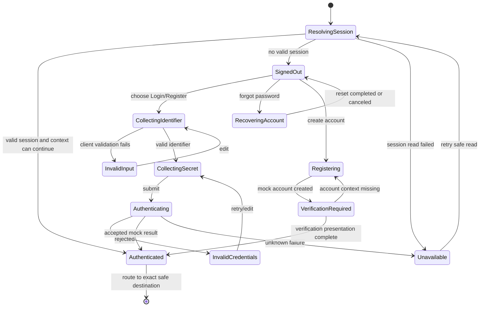
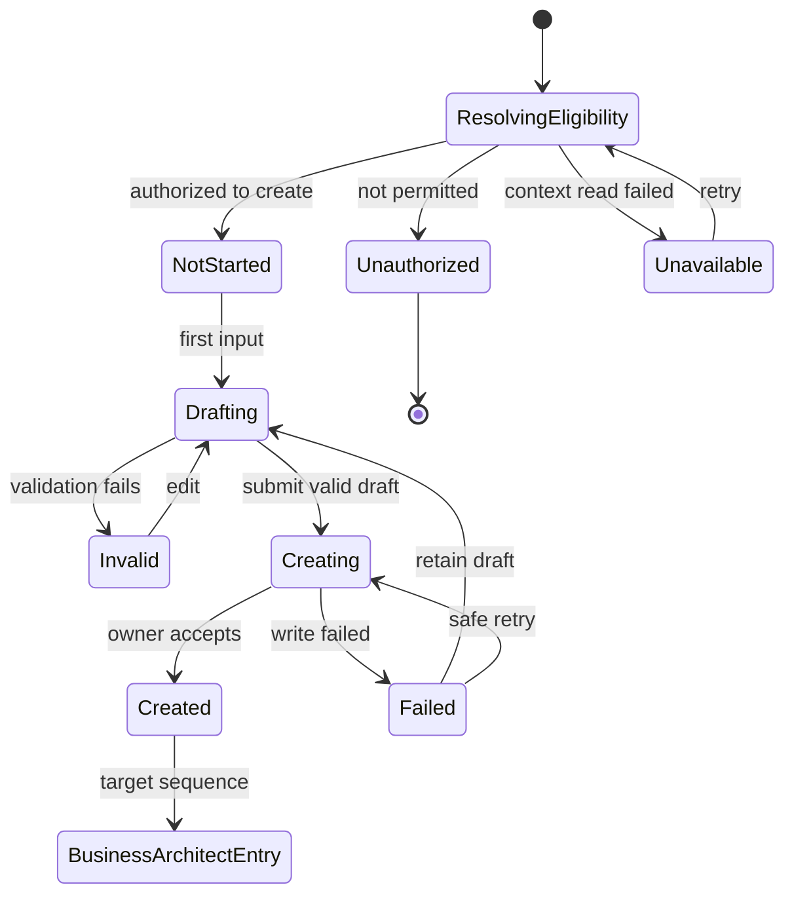
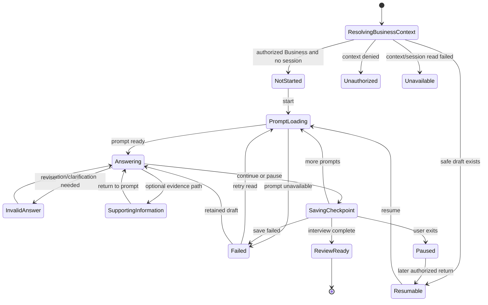
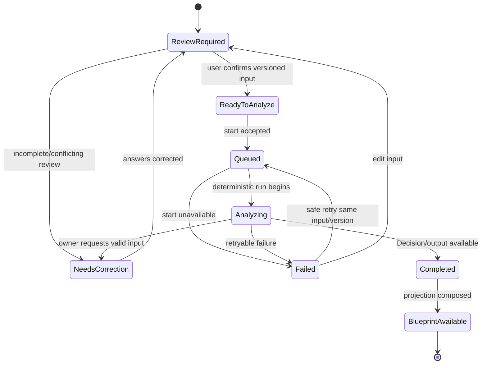
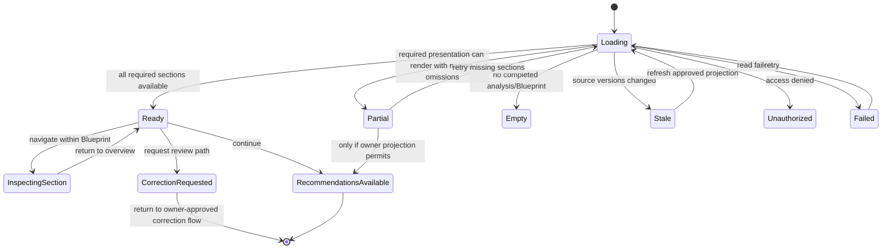
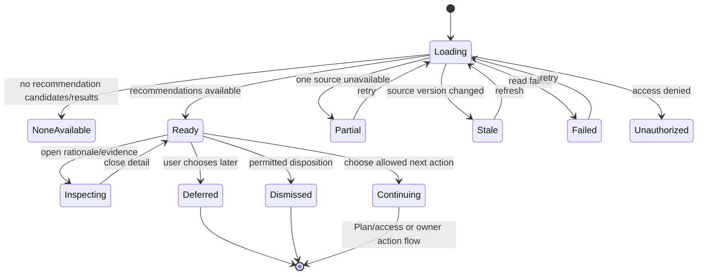
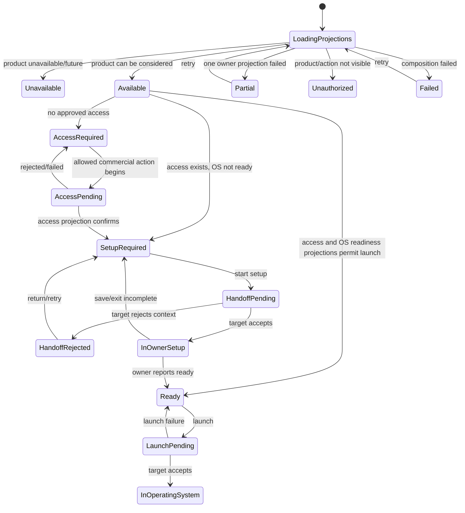
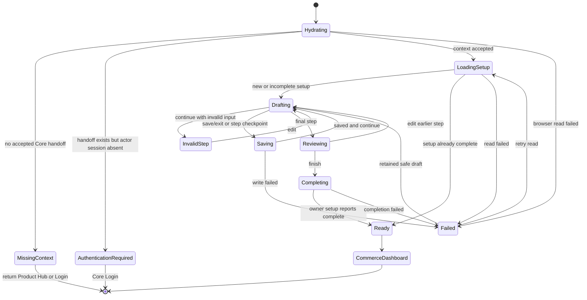

# User-Visible State Machines

- **Status:** Target UX state specification reconciled with current frontend evidence
- **Snapshot date:** 2026-07-19
- **Owner:** Product Experience with the applicable Core Platform or Commerce owner
- **Authority:** Presentation states only

## 1. Purpose

This document defines user-visible states and safe presentation transitions for the major
frontend flows. It does **not** define canonical domain state machines, database enums, backend
workflow states, API contracts, ownership, or persistence models. Each UI transition must
eventually be driven by an owner-approved fact, permission, or frontend fixture.

## 2. Scope

The models cover Authentication, Workspace Creation, Business Interview, Business Analysis,
Business Blueprint, Recommendations, Product Activation, and Commerce Setup.

## 3. Shared Rules

1. Loading, empty/not-started, unavailable, unauthorized, stale, error, retrying, and ready are
   presentation outcomes, not domain facts.
2. The UI never infers authorization from authentication, a client-provided ID, plan, or product
   availability.
3. A retry repeats only safe reads or explicitly idempotent actions. Consequential commands require
   known outcome handling.
4. A partial projection identifies unavailable sections; it never fabricates owner data.
5. State changes preserve current locale, direction, focus, safe form draft, and authorized context.
6. Core state machines cannot own Commerce setup/operations. Commerce cannot write Core identity,
   Workspace, Business, or subscription state.

## 4. Authentication Presentation State Machine

**Owner boundary:** Core Platform identity/session presentation.

| State | User-visible behavior | Valid next states | Guard/evidence |
|---|---|---|---|
| Resolving Session | Non-flashing progress state | Signed Out, Authenticated, Unavailable | Current browser session read |
| Signed Out | Login/Register choices | Collecting Identifier, Registering, Recovering Account | No accepted session |
| Collecting Identifier | Email/identifier entry | Invalid Input, Collecting Secret | Client validation only |
| Collecting Secret | Password entry | Authenticating, Collecting Identifier | Identifier preserved safely |
| Authenticating | Disabled submit and progress | Authenticated, Invalid Credentials, Unavailable | Current `loginUser` result; future owner fact |
| Registering | Account details and validation | Verification Required, Invalid Input, Unavailable | Current `createUser` result |
| Verification Required | OTP input/resend | Authenticated, Registering, Unavailable | Current mock accepts complete code; not production verification evidence |
| Recovering Account | Request/code/reset presentation | Signed Out, Invalid Input, Unavailable | Current local flow only |
| Authenticated | Resume resolution, not a final permission | Destination flow | Session exists; authorization still required |
| Unavailable | Safe explanation and retry | Resolving Session or Signed Out | Read/operation failure |

**Current implementation:** Login/Register/verification/recovery expose most form states. Session
resolution often returns `null` or redirects silently, and the post-login decision is only
completed-browser-onboarding versus `/onboarding`.

## 5. Workspace Creation Presentation State Machine

**Owner boundary:** Core Platform Workspace context. Workspace is the customer/tenant boundary and
must not be presented as canonical Business or Business Unit.

| State | User-visible behavior | Guard/evidence |
|---|---|---|
| Resolving Eligibility | Load session and creation eligibility | Authenticated Core context |
| Not Started | Introduction and empty form | No creation attempt |
| Drafting | Name and locale-aware defaults editable | Local draft only |
| Invalid | Field-specific accessible errors | Client validation; future server validation remains authoritative |
| Creating | Submit disabled; progress announced | Current mock `createWorkspace`; future owning operation |
| Created | Confirmation and next action | Workspace projection available in current context |
| Failed | Retained draft and retry/cancel | Known failure; no success assumed |
| Unauthorized | No create control; safe Core destination | Owner authorization result |
| Unavailable | Safe context error | Read dependency unavailable |

**Current implementation:** `/welcome` introduces creation and `/onboarding` step 1 calls
`createWorkspace`. Hydration can render blank, write failure is not surfaced, and success proceeds
to OS selection rather than Business Architect.

## 6. Business Interview Presentation State Machine

**Owner boundary:** Core Platform Business Architect and Business DNA intake/review. Answers and
draft candidates are not automatically published Business DNA.

| State | User-visible behavior | Guard/evidence |
|---|---|---|
| Resolving Business Context | Confirm Business and any safe session | Canonical Business context required; current implementation lacks it |
| Not Started | Introduction and start action | No draft session |
| Resumable | Explain saved point and resume | Authorized, non-superseded draft |
| Prompt Loading | Skeleton/progress for next prompt | Planned replaceable fixture/client read |
| Answering | One guided/conversational prompt | Prompt ready |
| Invalid Answer | Inline explanation without losing input | Presentation validation |
| Supporting Information | Optional supporting context | Approved evidence policy only |
| Saving Checkpoint | Announced progress; controls protected | Safe draft checkpoint operation |
| Paused | Confirmation and Core safe exit | Checkpoint known saved |
| Review Ready | Interview completion and Review action | All required prompts complete |
| Failed | Error type, retained input, safe retry | Known mock/client failure |
| Unauthorized | No Business details exposed | Owner access decision |

**Current implementation:** No Business Architect route, component, fixture seam, session, or state
model was found.

## 7. Business Analysis Presentation State Machine

**Owner boundary:** Business Brain owns deterministic Decisions/advisory outputs; Business DNA,
Knowledge, Rules, and OS facts retain their owners. This UI does not define analysis rules.

| State | User-visible behavior | Guard/evidence |
|---|---|---|
| Review Required | Show material answers, provenance, gaps | Completed interview draft |
| Needs Correction | Link to exact correction point | Owner/fixture validation result |
| Ready to Analyze | Confirm exact input version | Review explicitly confirmed |
| Queued | Acknowledge request without invented progress | Planned deterministic fixture/result |
| Analyzing | Meaningful progress/status supplied by source | No AI-only or fabricated stage |
| Failed | Explain retry/edit paths | Known failure and outcome |
| Completed | Analysis completion; no recommendation shown yet | Completed deterministic result |
| Blueprint Available | Navigate to Blueprint | Blueprint projection ready |

**Current implementation:** No deterministic Business Brain frontend runtime, fixture, analysis
route, or progress state exists. The first frontend slice must not simulate ungoverned AI analysis.

## 8. Business Blueprint Presentation State Machine

**Owner boundary:** Core presentation composed from owner-approved projections. Business Blueprint
is not a new aggregate and does not own Business DNA or Recommendation lifecycle.

| State | User-visible behavior | Guard/evidence |
|---|---|---|
| Loading | Section skeletons with context | Blueprint read in progress |
| Empty | Explain analysis prerequisite | No completed Blueprint projection |
| Partial | Render available sections and name unavailable ones | Partial owner projections; no fabricated values |
| Stale | Explain source version change and refresh path | Source version mismatch |
| Ready | Business DNA, summary, needs, challenges, opportunities, readiness, capabilities, roadmap | Approved composed projection |
| Inspecting Section | In-page navigation and provenance | Same read-only projection |
| Correction Requested | Link back to review; no direct canonical write | Approved correction workflow required |
| Recommendations Available | Separate next-stage action | Recommendation projection availability, not Blueprint mutation |
| Failed/Unauthorized | Retry or safe return; minimized details | Read/authorization result |

**Current implementation:** No Business Blueprint screen exists. Platform Dashboard and Product Hub
must not be mislabeled as this customer-facing Blueprint.

## 9. Recommendations Presentation State Machine

**Owner boundary:** Recommendation Engine and applicable owner projections. Recommendations are
optional, explainable, downstream of Business context, Capabilities, Knowledge, deterministic
Rules, and completed Business Brain Decisions.

| State | User-visible behavior | Guard/evidence |
|---|---|---|
| Loading | Recommendation skeleton/progress | Recommendation read pending |
| None Available | Neutral empty state; Dashboard continuation | Valid empty result |
| Ready | Ranked/grouped explainable Recommendations | Owner projection ready |
| Inspecting | Rationale, evidence, assumptions, alternatives, risk, confidence, benefit | Fields supplied by projection |
| Partial/Stale | Name limitation and retry/refresh | Source state |
| Deferred | Preserve optional future review | Accepted disposition if approved |
| Dismissed | Confirmation without rewriting Blueprint | Accepted disposition if approved |
| Continuing | Route to access/plan/owner action | Separate authorization and validation |
| Failed/Unauthorized | Retry or safe return | Read/access outcome |

**Current implementation:** No Recommendation screen or fixture exists. Product Hub's current
static/derived cards are not a substitute for capability-first explainable Recommendations.

## 10. Product Activation Presentation State Machine

**Owner boundary:** Core Product Hub composes owner projections and handoff. Commercial and
operational lifecycle concepts remain distinct. The unresolved successor to legacy `OSEnablement`
is not defined here.

| State | User-visible behavior | Guard/evidence |
|---|---|---|
| Loading Projections | Per-owner loading, not one fabricated global state | Product/access/readiness reads |
| Unavailable | Coming later/unavailable explanation | Product catalog projection |
| Available | Product information and next allowed action | Availability alone grants nothing |
| Access Required/Pending | Billing/access route and outcome | Core commercial owner projection |
| Setup Required | Setup action without claiming operational readiness | Access plus OS owner readiness projection |
| Handoff Pending/Rejected | Cross-app progress or safe return | Accepted current frontend handoff boundary |
| In Owner Setup | Commerce owns UI and writes | Target app accepted context |
| Ready | Launch action if user is authorized | Owner readiness plus access/permission projections |
| Launch Pending/In OS | Target navigation and accepted operational context | Target owner result |
| Partial/Failed/Unauthorized | Minimized state, retry, or no action | Composition/access result |

**Current implementation:** Product Hub currently derives subscription/setup booleans and builds a
Commerce handoff. Core Dashboard layout incorrectly requires Commerce in `completedOS` before
entry. Current `osEnablements` records are legacy compatibility state and remain non-canonical.

## 11. Commerce Setup Presentation State Machine

**Owner boundary:** Commerce owns setup UI, operational configuration, validation, persistence, and
readiness. Core supplies approved read-only context/handoff only.

| State | User-visible behavior | Guard/evidence |
|---|---|---|
| Hydrating | Progress without rendering another context | Commerce AppProvider hydration |
| Missing Context | Explain Product Hub entry requirement | No valid handoff compatibility context |
| Authentication Required | Safe Core Login action | Handoff exists; current actor absent |
| Loading Setup | Load existing Commerce setup | Commerce owner store/service |
| Drafting | Eight setup steps and live preview | Local Commerce draft |
| Invalid Step | Accessible field errors; stay on step | Commerce presentation validation |
| Saving | Disable conflicting actions, announce progress | Commerce setup service write |
| Reviewing | Summary and edit links | Required draft sections present |
| Completing | Finish operation pending | Commerce owner service |
| Ready | Commerce Dashboard action | Commerce setup projection reports complete |
| Failed | Known outcome, retained safe draft, retry | Read/write/completion failure |

**Current implementation:** All eight steps and missing-context recovery exist. Hydration has a
spinner; setup uses current browser services. Copy is mostly hard-coded English, route-level role
guards are absent, and production persistence/authorization are intentionally not defined.

## 12. State Coverage Matrix

| Machine | Current coverage | Primary missing UX |
|---|---|---|
| Authentication | Partial to strong | Unified session/resume state, complete localization, non-silent hydration/error |
| Workspace Creation | Partial | Visible failure/retry and Business Architect exit |
| Business Interview | Missing | Entire guided/resumable presentation and fixture seam |
| Business Analysis | Missing | Entire deterministic progress/recovery presentation |
| Business Blueprint | Missing | Entire composed read-only presentation |
| Recommendations | Missing | Entire explainable optional recommendation presentation |
| Product Activation | Partial | Correct Platform-first gate, distinct projection states, permission-aware actions |
| Commerce Setup | Strong frontend mock | Localization, permission presentation, stronger failure/resume evidence |

## 13. Relationships

- [User Journeys](./05-USER-JOURNEYS.md)
- [User Flows](./06-USER-FLOWS.md)
- [Screen Status Matrix](./12-SCREEN-STATUS-MATRIX.md)
- [Design System Interaction Patterns](../04-design-system/05-INTERACTION-PATTERNS.md)
- [Core Platform Architecture](../02-core-platform/README.md)

## 14. Open Questions

- Which owner-approved permission catalog gates each action represented above?
- Which canonical Business entry/selection state precedes Business Interview?
- What approved product decision defines user-visible restart/discard behavior for an interview
  draft?

## 15. Verified Against

- current route, layout, shell, auth, onboarding, setup, Product Hub, POS, and feature-state source
  under `apps/core-platform` and `apps/commerce`;
- current mock storage, repositories, services, and Features 052–055 test evidence;
- [Platform Experience](./01-PLATFORM-EXPERIENCE.md), [Screen Map](./02-SCREEN-MAP.md),
  [User Journeys](./05-USER-JOURNEYS.md), and [User Flows](./06-USER-FLOWS.md);
- Core Platform, Business Brain, and Commerce OS architecture/freeze documents; and
- Accepted ADR-016, ADR-023, Product Decisions, the Constitution, and repository AGENTS guidance.

