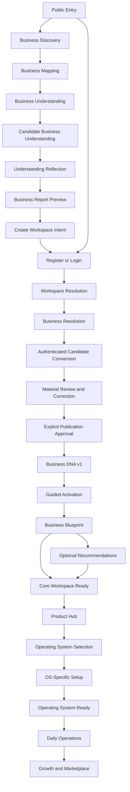

# Canonical Journey Mapping

| Field | Value |
|---|---|
| Version | 1.0 authority-mapping candidate |
| Status | Documentation authority candidate; UI/UX approval and implementation are not authorized |
| Owner | Product and Design Governance; canonical owners remain defined by Core Platform Architecture v1.1 |
| Controlling architecture | Core Platform Architecture v1.1 Freeze |
| Evidence snapshot | 2026-07-20 |
| Predecessors | Foundation Baseline v0.1, Foundation Journey Successor Addendum v1.0, and reconciled UI/UX candidate package |
| Successor use | Input to UI/UX Authority Review and, only after approval, future flows, presentation-state specifications, wireframes, and feature specifications |

## Purpose and Authority Boundary

This document is the single traceability map connecting the frozen journey to current frontend
evidence and to the documentation artifacts still required. It does not create a new journey,
screen, route, flow, state machine, wireframe, contract, feature, or implementation task.

The mapping is subordinate to:

1. [Core Platform Architecture v1.1 Freeze](../99-architecture-freeze/CORE-PLATFORM-v1.1-FREEZE.md);
2. Accepted [ADR-015](../00-governance/ADR/ADR-015-infer-before-asking-conversational-configuration.md),
   [ADR-016](../00-governance/ADR/ADR-016-business-architect-governed-pipeline.md),
   [ADR-042](../00-governance/ADR/ADR-042-pre-registration-business-discovery.md), and
   [ADR-043](../00-governance/ADR/ADR-043-foundation-discovery-and-business-architect-composition.md);
3. [Foundation Baseline v0.1](../00-governance/FOUNDATION-BASELINE-v0.1.md);
4. [Foundation Journey Successor Addendum v1.0](../01-genesis/21-FOUNDATION-JOURNEY-SUCCESSOR-ADDENDUM-v1.0.md);
5. [Business Brain Foundation Compatibility v1.0](../03-business-brain/13-BUSINESS-BRAIN-FOUNDATION-COMPATIBILITY-v1.0.md); and
6. the [Canonical Glossary](../00-governance/glossary/GLOSSARY.md).

The current file at `docs/01-genesis/11-CUSTOMER-JOURNEY.md` does not match the immutable v1.2 blob
recorded in the v1.1 source manifest. That existing issue remains
`UIAUTH-HYGIENE-001`; this mapping therefore uses the controlling Freeze, Accepted ADRs, Foundation
Baseline, and approved Journey Successor Addendum. It does not claim to repair Genesis provenance.

# 1. Journey Principles

## 1.1 Why this journey exists

The journey exists to provide credible business value before product promotion, turn temporary
knowledge into explicitly approved Business-scoped canonical understanding, and hand customers to
independent Operating Systems without moving ownership into the UI or Product Hub.

It supports both:

- the primary value-before-registration path; and
- the accepted direct Register/Login path.

Both converge before first Business DNA publication. Neither path creates an anonymous Workspace or
Business, bypasses review, or treats account data as Business DNA.

## 1.2 Journey ownership

| Journey concern | Owner | Mapping consequence |
|---|---|---|
| Public marketing presentation | Landing application | May offer Discovery and identity entry; does not own Discovery or identity |
| Business Discovery, Candidate Understanding, conversion orchestration | Core Platform | Temporary knowledge only before authenticated conversion |
| Identity, Workspace, Business, membership and authorization context | Core Platform | UI context is never proof of access |
| Business DNA | Exactly one Business; governed through its Core owner boundary | First publication requires authenticated context, review, correction opportunity, and explicit approval |
| Business Architect and Guided Activation | Core Platform governed pipeline | Pre-publication candidate work and post-publication continuation share one pipeline but not one invented UI lifecycle |
| Business Brain Decision and conceptual Business Insight | Business Brain Decision boundary | UI may present owner output; it creates no separate Insight write model |
| Recommendation | Recommendation Engine | Optional, capability-first, explainable, and human-controlled |
| Business Blueprint | Core non-writing projection | Derived from Business DNA and governed owner outputs; never canonical storage |
| Product Hub | Core composition and handoff | Does not own Recommendations, subscriptions, OS setup, or operational data |
| OS-Specific Setup, readiness, dashboard and operations | Applicable Operating System | Core may hand off context; the OS reauthorizes and owns the experience |

## 1.3 Architecture relationship

The journey orders owner boundaries; it does not define physical services or routes. The v1.1
Freeze section 5 is the controlling Foundation successor architecture. Its 52 inherited Core
guarantees remain unchanged, including tenant scope, one canonical owner, read-model non-ownership,
Core/OS separation, Product Hub composition, and distinct Core/OS readiness.

## 1.4 Business DNA relationship

Candidate Business Understanding, Understanding Reflection, and Business Report Preview are
temporary and pre-canonical. Canonical ownership begins only after identity, Workspace and Business
resolution, material review/correction, and explicit customer approval. Business DNA v1 is then
published for exactly one Business. Guided Activation may request governed revisions; presentation
surfaces never write Business DNA directly.

## 1.5 Operating System relationship

Capabilities and business value precede products. Product Hub may compose product and owner
projections and initiate a handoff. The selected Operating System owns its setup, configuration,
readiness, dashboard, permissions, operational facts, and daily workflows. Core Workspace Ready is
not Operating System Ready.

## 1.6 Presentation constraints

- Discovery is method-independent; Guided Business Conversation is one experience pattern only.
- The sequence is not a mandatory single wizard.
- Recommendations are optional and may produce no product suggestion.
- Existing routes are evidence, not target route authority.
- A stage need not become a separate screen when a combined presentation preserves its meaning.
- Loading/error/permission labels cannot create domain or Session states.
- English/LTR and Arabic/RTL, accessibility, responsive continuity, correction, and recovery apply
  to every customer-facing stage.

# 2. Canonical Journey

## 2.1 Primary value-before-registration path

```text
Visitor / Public Entry
→ Business Discovery
→ Business Mapping
→ Business Understanding
→ Candidate Business Understanding
→ Understanding Reflection
→ Business Report Preview (customer-facing Value Preview)
→ Create Workspace Intent
→ Register or Login
→ Workspace Resolution or Creation
→ Business Resolution or Creation
→ Authenticated Candidate Conversion
→ Material Candidate Review and Correction
→ Explicit Publication Approval
→ First Governed Business DNA v1 Publication
→ Business Architect Continuation as Guided Activation
→ Governed Authenticated Business Blueprint
→ Optional Governed Recommendations
→ Core Workspace Ready
→ Product Hub
→ Operating System Selection when chosen
→ OS-Specific Setup
→ Operating System Ready
→ OS Operational Dashboard and Daily Operations
→ Growth and Marketplace when applicable
```

“Business Report Preview” is the canonical pre-registration projection name in ADR-042 and the
Foundation Baseline. “Value Preview” is a customer-experience description, not a second canonical
artifact.

## 2.2 Compatible direct-registration branch

```text
Register or Login
→ Workspace Resolution or Creation
→ Business Resolution or Creation
→ Authenticated Business Architect candidate-acquisition path
→ Candidate Business Understanding
→ Material Review and Correction
→ Explicit Publication Approval
→ First Governed Business DNA v1 Publication
→ rejoin the primary journey at Guided Activation
```

This is not a second onboarding architecture. It converges on the same candidate/canonical boundary,
Business DNA owner, approval rule, and later journey.

## 2.3 Returning-customer entry

A returning customer may enter an authorized Workspace, Business, inherited Business Architect
Session continuation, incomplete Guided Activation context, Core Dashboard, Product Hub, or an
Operating System according to owner-reported context, Permission, and readiness. Existing canonical
understanding is not recreated merely to force the primary journey.

## 2.4 Conditional stages

Recommendations, OS selection/setup, and Growth/Marketplace are conditional. “Optional” does not
make their ownership or evidence requirements weaker. The journey may stop safely at an authorized
Core destination without product adoption.

# 3. Journey Stages

Current status is a repository-evidence classification, not an implementation authorization.

| Stage ID | Stage | Purpose | Actor | Inputs | Outputs | Business rules and dependencies | Authority source | Current status |
|---|---|---|---|---|---|---|---|---|
| CJ-00 | Visitor / Public Entry | Offer value exploration and valid identity entry | Visitor | Public product information, locale | Deliberate Discovery, Register, Login, or exit choice | No tenant context; Discovery is primary value path but not mandatory | Freeze 5.3; Addendum 3.1–3.2 | Existing Landing; requires reconciliation |
| CJ-01 | Business Discovery | Acquire material knowledge using the best approved method | Visitor or authenticated customer | Discovery Goal, Strategy, Knowledge Gaps | Evidence/material for mapping | Infer before asking; method-independent; no anonymous Workspace/Business | Freeze 5.1; ADR-042 sections 1–2 | Missing frontend destination |
| CJ-02 | Business Mapping | Normalize acquired material into structured candidate knowledge | Core capability with customer reviewability | Discovery evidence and provenance | Structured candidate material | Temporary output only; preserves provenance and contradictions | Foundation 8 and 12; Addendum 3.1 | Missing presentation; no separate screen required by authority |
| CJ-03 | Business Understanding | Derive governed candidate understanding | Core Business Understanding responsibility | Mapped evidence, Knowledge, Rules | Candidate facts/inferences/assessments with confidence | No autonomous canonical write or OS configuration | Foundation 9/13; Freeze 5.2 | Missing presentation; processing boundary only |
| CJ-04 | Candidate Business Understanding | Hold temporary reviewable understanding | Visitor or authenticated Business participant | Understanding output | Temporary candidate projection | Pre-canonical, correctable, non-authorizing; no Business owner before conversion | Freeze 5.2; ADR-042 section 3 | Missing |
| CJ-05 | Understanding Reflection | Expose facts, interpretations, uncertainty and contradictions | Candidate reviewer | Candidate understanding and evidence | Corrections, confirmations, remaining gaps | Review is not approval or publication | ADR-042 section 4; Foundation 11.3 | Missing |
| CJ-06 | Business Report Preview | Provide credible value before registration | Visitor | Reviewed temporary candidate | Temporary report/value projection and continue choice | Not DNA, Blueprint, Recommendation, entitlement, or implementation commitment | ADR-042 section 7; Addendum rule 9 | Missing |
| CJ-07 | Create Workspace Intent | Record deliberate intent to preserve/convert value | Visitor | Preview and customer choice | Authentication entry intent | Creates no Workspace or Business by itself | Foundation 12/16; Addendum 3.1 | Adjacent CTA evidence only |
| CJ-08 | Identity | Establish or recover authenticated identity | Visitor/customer | Register/Login/recovery/verification input | Authenticated actor/session evidence | Authentication is not authorization; registration cannot publish DNA | Freeze 5.3–5.4; ADR-043 | Existing partial mock |
| CJ-09 | Workspace Resolution | Resolve/create the tenant boundary | Authenticated actor | Identity and membership/creation authority | Authorized Workspace context | Workspace is not Business; server/owner authorization required | ADR-003/034; Freeze 5.3–5.4, 6 | Existing partial/conflicting mock |
| CJ-10 | Business Resolution | Resolve/create the Business that owns DNA | Authenticated Workspace member | Workspace context and authority | Authorized selected Business | Business and Business Unit are distinct; no legacy mapping promoted | ADR-004/005; Freeze 5.4, 6 | Canonical destination missing; legacy adjacent evidence |
| CJ-11 | Authenticated Candidate Conversion | Associate candidate work with one authenticated Business context | Authorized participant | Candidate, Workspace, Business, actor | Conversion review context | Conversion is not source of truth and cannot silently publish | ADR-042 section 8; Freeze 5.4 | Missing |
| CJ-12 | Material Review and Correction | Verify material candidate knowledge before publication | Authorized selected-Business participant | Converted/direct candidate, provenance, confidence | Reviewed/corrected candidate | Business Architect pipeline retained; review and correction separate from approval | ADR-016/043; Freeze 5.5 | Missing |
| CJ-13 | Explicit Publication Approval | Deliberately authorize first publication | Authorized Business approver | Materially reviewed candidate and consequence summary | Owner-validated publication request or safe failure | “Next”, registration, or form completion is insufficient | ADR-042 section 8; ADR-043 | Missing |
| CJ-14 | Business DNA v1 Publication | Establish first canonical Business understanding | Business DNA owner boundary | Approved candidate and authenticated Business | Versioned Business DNA v1 | Exactly one Business owner; software-independent; provenance preserved | ADR-005/042/043; Freeze 5.4 | Missing |
| CJ-15 | Guided Activation | Continue the retained pipeline after first publication | Authorized Business participant | Published DNA, remaining gaps, inherited Session evidence | Validated understanding, governed revision requests, Core readiness progress | Starts only after v1; not OS setup; inherited Session states remain separate | Freeze 5.5; Addendum 5 | Missing |
| CJ-16 | Business Blueprint | Present governed Business understanding | Authorized Business viewer | Current DNA and permission-filtered owner outputs | Non-writing authenticated projection | Not canonical storage, write model, or independent owner | Freeze 5.6; Addendum 6 | Missing |
| CJ-17 | Governed Recommendations | Present optional capability-first advice | Authorized Business viewer/decision-maker | Reviewed understanding, Decision/lineage, capabilities | Explainable optional Recommendations or no recommendation | Recommendation Engine owns; alternatives/customer agency preserved | Freeze 5.9; ADR-013/014 | Missing |
| CJ-18 | Core Workspace Ready | Establish usable Core destination independently of OS readiness | Authorized Workspace member | Core owner readiness/context projections | Core Dashboard/allowed Core access | Separate from OS Ready and subscription | ADR-018; Freeze preserved guarantees | Dashboard exists but current guard conflicts |
| CJ-19 | Product Hub | Compose product/access/readiness and hand off | Authorized customer | Core context and owner projections | Learn, commercial owner action, OS handoff, launch, or recovery | Does not own DNA, Recommendation, subscription source, or OS state | ADR-019/020; Freeze 5.10 | Existing partial mock |
| CJ-20 | Operating System Selection | Let customer deliberately choose an available OS | Authorized actor | Product Hub projections and permission | Selected OS/owner next action | Selection is not subscription, installation, setup, readiness, or access | Foundation 12/17; Freeze 5.10 | Current onboarding step is stale; Product Hub partial |
| CJ-21 | OS-Specific Setup | Configure the selected OS under its owner | Authorized OS setup actor | Reauthorized context and owner prerequisites | Owner-reported setup continuation/result | Applicable OS owns all setup behavior/data | ADR-024/026; Freeze 5.10 | Commerce setup exists as mock evidence |
| CJ-22 | Operating System Ready | Establish OS owner readiness | Authorized OS actor | Completed owner validation | OS Ready projection and launch eligibility | Distinct from Core readiness, subscription, and installation | ADR-018/026; Foundation 17 | Commerce readiness/dashboard evidence exists |
| CJ-23 | Operational Dashboard and Daily Operations | Perform independent OS work | Authorized operational actor | OS context, readiness, permissions | OS-owned operational facts and outcomes | Core owns no OS operational data or workflow | ADR-024; Freeze preserved guarantees | Substantial Commerce mock evidence |
| CJ-24 | Growth and Marketplace | Support later governed expansion and assets | Authorized customer/publisher as applicable | Operational context and Marketplace authority | Optional later growth/acquisition outcomes | Conditional later scope; Marketplace retains its bounded ownership | Foundation 12/17; Marketplace Freeze | No current Foundation journey screen; later scope |

# 4. Journey-to-Screen Mapping

“Required destination” is semantic. It does not require a separate page or approve a route.

| Stage | Existing screen evidence | Mapping disposition | Required semantic destination | Justification |
|---|---|---|---|---|
| CJ-00 | Landing `/` | Refactor | Public Entry | Current entry exists; CTA hierarchy must expose Discovery and retain Register/Login |
| CJ-01 | None | Future | Business Discovery | Missing capability presentation; exact method/screen count deferred |
| CJ-02 | None | Merge | Discovery acquisition and Candidate Reflection | Mapping is a processing responsibility and need not become a standalone screen |
| CJ-03 | None | Merge | Candidate Reflection / processing feedback | Business Understanding is an owner responsibility, not a required “engine screen” |
| CJ-04 | None | Future | Candidate Understanding presentation | A temporary, confidence/provenance-aware result must be distinguishable from DNA |
| CJ-05 | None | Merge | Candidate Reflection and Correction | Review belongs with candidate evidence; a separate route is not authorized |
| CJ-06 | None | Future | Business Report Preview / Value Preview | Distinct temporary projection required before authentication |
| CJ-07 | Landing/auth CTAs only | Merge | Preview continuation and identity entry | Intent is an explicit choice, not necessarily a standalone screen or stored aggregate |
| CJ-08 | Login, Register, Forgot/Reset Password, Verify Email | Refactor | Identity and Recovery | Existing screens cover entry; production behavior, parity and destination resolution remain incomplete |
| CJ-09 | Welcome, onboarding Workspace step, Context Switcher | Split | Workspace Resolution | Current composite onboarding mixes Workspace with OS/Plan and must be separated conceptually |
| CJ-10 | Legacy context label only | Future | Business Resolution | No canonical Business create/select screen exists; legacy BusinessUnit mapping is insufficient |
| CJ-11 | None | Merge | Authenticated Candidate Review entry | Conversion must be visible but need not be a separate screen from context/review |
| CJ-12 | None | Future | Candidate Review and Correction | Material review, provenance and correction are missing |
| CJ-13 | None | Future | Explicit Publication Approval | Dedicated consequence and approval interaction is required; exact screen is deferred |
| CJ-14 | None | Merge | Publication outcome on approval surface | Publication is an owner result, not a separate mandatory page |
| CJ-15 | None | Future | Guided Activation | Missing post-publication continuation; must not be OS setup |
| CJ-16 | None | Future | Business Blueprint | Missing governed authenticated non-writing projection |
| CJ-17 | None | Future | Optional Recommendations | Missing capability-first advice; stage may be skipped/no-result |
| CJ-18 | Core Dashboard | Refactor | Platform Dashboard | Current UI exists but mock Commerce completion can block Core entry |
| CJ-19 | `/dashboard/apps` | Refactor | Product Hub | Current cards/handoff are partial and use compatibility lifecycle data |
| CJ-20 | Onboarding OS step and Product Hub cards | Replace | Product Hub OS selection | Current onboarding placement is superseded; selection belongs in owner-projection composition |
| CJ-21 | Commerce `/setup` | Keep | OS-Specific Setup | Current owner is correct; quality/contracts remain future specification work |
| CJ-22 | Commerce Dashboard and handoff evidence | Refactor | OS Ready entry | Existing surface is useful evidence but mock readiness is not production authority |
| CJ-23 | Commerce Dashboard, POS, Products, Inventory, Customers, Orders, Invoices, Reports, Settings | Keep | OS Operational Dashboard and owned modules | Correct OS ownership; current browser data is not production readiness |
| CJ-24 | None | Future | Growth/Marketplace entry when separately approved | Later conditional scope; no Foundation screen is authorized now |

# 5. Current Screen Lifecycle

These are documentation dispositions for future feature intake. They do not authorize removal,
creation, route changes, or refactoring.

## 5.1 Route-level screens

| Application | Current screen/route | Disposition | Journey relationship and explanation |
|---|---|---|---|
| Landing | Public Landing `/` | Refactor | Keep public entry; add authority-aligned value path only through future approved work |
| Core | Root `/` redirect | Keep | Routing utility evidence; final destination policy remains deferred |
| Core | Login `/login` | Refactor | Valid direct/return entry; needs safe context/resume, localization and production identity specification |
| Core | Register `/register` | Refactor | Valid direct entry; must never imply DNA publication |
| Core | Forgot Password `/forgot-password` | Refactor | Identity recovery remains valid; exact recovery consolidation deferred |
| Core | Reset Password `/reset-password` | Refactor | Valid recovery surface; relationship with embedded reset requires identity UX decision |
| Core | Verify alias `/verify` | Keep | Compatibility evidence; route deprecation is not authorized here |
| Core | Verify Email `/verify-email` | Refactor | Valid identity stage; complete loading/error/localization/accessibility behavior later |
| Core | Workspace introduction `/welcome` | Refactor | Preserve Workspace meaning; place within approved identity/context sequence later |
| Core | Composite onboarding `/onboarding` | Split | Current Workspace→OS→Plan composition crosses CJ-09, CJ-19/20 and commercial concerns |
| Core | Platform Dashboard `/dashboard` | Refactor | Core home must remain reachable independently of Commerce readiness |
| Core | Product Hub `/dashboard/apps` | Refactor | Correct Core composition candidate; separate owner projections and lifecycle meanings |
| Core | Billing `/dashboard/billing` | Refactor | Commercial presentation remains distinct from OS setup/readiness/access |
| Core | Integrations `/dashboard/integrations` | Refactor | Valid later Core surface; current static/mock content is not integration authority |
| Core | Settings `/dashboard/settings` | Refactor | Preserve Core settings ownership; separate personal, Workspace and OS concerns in future specs |
| Core | Team and Access `/dashboard/team` | Refactor | Membership surface is valid; hard-coded role matrix is not canonical authority |
| Commerce | Root `/` redirect | Keep | OS-local navigation utility |
| Commerce | Setup `/setup` | Refactor | Keep OS ownership; exact current steps are evidence, not frozen lifecycle |
| Commerce | Dashboard `/dashboard` | Keep | Correct OS operational owner; production readiness remains unproven |
| Commerce | POS `/pos` | Keep | Correct Commerce operational surface |
| Commerce | Sale Success `/pos/success` | Refactor | Keep outcome evidence; complete permission/recovery/document behavior later |
| Commerce | Products `/products` | Keep | Correct Commerce owner and operational module |
| Commerce | Product Create/Edit `/products/new` | Keep | Correct Commerce owner; current route/query details are implementation evidence |
| Commerce | Inventory `/inventory` | Keep | Correct Commerce owner |
| Commerce | Transfers `/inventory/transfers` | Keep | Correct Commerce owner; transaction/compensation details remain outside this mapping |
| Commerce | Customers `/customers` | Keep | Correct Commerce transactional-customer owner |
| Commerce | Customer Detail `/customers/[id]` | Keep | Correct Commerce owner; route is evidence only |
| Commerce | Orders `/orders` | Keep | Correct Commerce owner |
| Commerce | Order Detail `/orders/[id]` | Keep | Correct Commerce owner |
| Commerce | Invoices `/invoices` | Keep | Correct Commerce owner |
| Commerce | Invoice Detail `/invoices/[id]` | Keep | Correct Commerce owner |
| Commerce | Invoice Document `/invoices/[id]/document` | Keep | Correct Commerce document owner |
| Commerce | Return Document `/returns/[id]/document` | Refactor | Valid owner evidence but not a complete Returns experience |
| Commerce | Reports `/reports` | Refactor | Correct owner; current browser projection/localization/accessibility remain incomplete |
| Commerce | Settings `/settings` | Refactor | Correct owner; production permission/state behavior remains incomplete |
| Commerce | Document Settings `/settings/documents` | Refactor | Correct owner; current mock behavior is not contract authority |

## 5.2 Verified embedded screens and stages

| Current embedded surface | Disposition | Explanation |
|---|---|---|
| Workspace creation step in Core onboarding | Split | Retain Workspace outcome but separate it from OS and Plan sequence conceptually |
| OS selection step in Core onboarding | Replace | Product Hub is the approved composition/selection boundary |
| Plan selection step in Core onboarding | Replace | Commercial owner presentation must not be a mandatory Foundation journey step |
| Core Workspace Context Switcher | Refactor | Preserve context function; complete multi-Workspace authorization/recovery behavior |
| Core Notifications dropdown | Keep | Valid Core shared surface; owner/permission details remain future scope |
| Core Profile/User menu | Refactor | Preserve personal entry; distinguish User from Workspace settings |
| Team invitation modal | Refactor | Preserve membership intent; canonical permissions/Audit remain future specification inputs |
| Team permission matrix | Replace | Current hard-coded roles are evidence only and must not become canonical catalog |
| Commerce Setup — Identity | Refactor | OS-owned, but current step name/sequence is not frozen |
| Commerce Setup — Preset | Refactor | OS-owned presentation evidence only |
| Commerce Setup — Mode | Refactor | OS-owned presentation evidence only |
| Commerce Setup — Tax | Refactor | OS-owned; owner policy and production behavior remain separate |
| Commerce Setup — Numbering | Refactor | OS-owned presentation evidence only |
| Commerce Setup — Templates | Refactor | OS-owned presentation evidence only |
| Commerce Setup — Categories | Refactor | OS-owned presentation evidence only |
| Commerce Setup — Review | Refactor | OS-owned review evidence; no universal OS state machine inferred |

## 5.3 Missing semantic destinations

The following are **Future** design/specification inputs, not approved screens or routes: Business
Discovery, Candidate Reflection, Business Report Preview, canonical Business Resolution,
authenticated Candidate Review/Correction, explicit Publication Approval, Guided Activation,
Business Blueprint, Business Insight presentation where owner output exists, optional
Recommendations, cross-flow Recovery, and later Growth/Marketplace entry.

# 6. Current Coverage

## 6.1 Scoring method

Scores are traceability indicators, not delivery estimates:

- **0%:** no repository evidence;
- **25%:** adjacent or legacy evidence only;
- **50%:** partial presentation in the correct broad area;
- **75%:** substantial current mock/evidence but incomplete or non-production;
- **100%:** complete approved authority or verified production evidence for the scored dimension.

`Current %` is the conservative minimum of Documentation, Frontend, and Authority coverage.
Authority coverage measures whether a stage is explicitly governed, not whether the working-tree
Genesis provenance issue is resolved.

| Stage | Existing screen evidence | Current % | Documentation % | Frontend % | Authority % |
|---|---|---:|---:|---:|---:|
| CJ-00 Public Entry | Landing | 75 | 90 | 75 | 100 |
| CJ-01 Discovery | None | 0 | 90 | 0 | 100 |
| CJ-02 Business Mapping | None | 0 | 75 | 0 | 100 |
| CJ-03 Business Understanding | None | 0 | 75 | 0 | 100 |
| CJ-04 Candidate Understanding | None | 0 | 90 | 0 | 100 |
| CJ-05 Understanding Reflection | None | 0 | 90 | 0 | 100 |
| CJ-06 Business Report Preview | None | 0 | 90 | 0 | 100 |
| CJ-07 Workspace Intent | Adjacent public/auth CTA | 25 | 75 | 25 | 100 |
| CJ-08 Identity | Login/Register/recovery/verify | 75 | 90 | 75 | 100 |
| CJ-09 Workspace Resolution | Welcome/onboarding/switcher | 50 | 90 | 50 | 100 |
| CJ-10 Business Resolution | Legacy adjacent context only | 25 | 75 | 25 | 100 |
| CJ-11 Candidate Conversion | None | 0 | 85 | 0 | 100 |
| CJ-12 Review/Correction | None | 0 | 90 | 0 | 100 |
| CJ-13 Publication Approval | None | 0 | 90 | 0 | 100 |
| CJ-14 Business DNA v1 | None | 0 | 90 | 0 | 100 |
| CJ-15 Guided Activation | None | 0 | 90 | 0 | 100 |
| CJ-16 Business Blueprint | None | 0 | 90 | 0 | 100 |
| CJ-17 Recommendations | None | 0 | 90 | 0 | 100 |
| CJ-18 Core Workspace Ready | Dashboard with conflicting guard | 50 | 85 | 50 | 100 |
| CJ-19 Product Hub | Applications/Product Hub page | 75 | 90 | 75 | 100 |
| CJ-20 OS Selection | Product cards plus stale onboarding step | 50 | 80 | 50 | 100 |
| CJ-21 OS-Specific Setup | Commerce Setup | 75 | 75 | 75 | 100 |
| CJ-22 Operating System Ready | Commerce setup/dashboard evidence | 75 | 75 | 75 | 100 |
| CJ-23 Daily Operations | Commerce operational routes | 75 | 75 | 75 | 100 |
| CJ-24 Growth/Marketplace | None in current delivery | 0 | 50 | 0 | 100 |

## 6.2 Coverage summary

| Measure | Result | Interpretation |
|---|---:|---|
| Canonical stage traceability | 25/25 — 100% | Every approved journey stage has an owner, rule, source and mapping |
| Current frontend coverage | 26% weighted stage coverage | Current UI is strongest at identity, Product Hub and Commerce; Foundation understanding stages are absent |
| Existing route inventory | 36/36 page routes classified | All verified Landing/Core/Commerce page routes have a lifecycle disposition |
| Embedded current surfaces | 16/16 classified | Current onboarding, shell and Commerce setup sub-surfaces are accounted for |
| Documentation coverage | 83% weighted stage coverage | Architecture is documented; UI authority remains candidate and downstream design artifacts are absent |
| Architecture authority coverage | 100% stage coverage | Every stage is present in a controlling source; exact routes/contracts/states remain deferred |

# 7. Gap Analysis

## 7.1 Missing stages in current frontend

CJ-01 through CJ-06, CJ-11 through CJ-17, and CJ-24 have no direct frontend screen evidence. CJ-10
has only a legacy adjacent model. Their architecture exists; their presentation does not.

## 7.2 Missing screens or destinations

Missing semantic destinations are listed in section 5.3. A future design phase must decide whether
they are separate pages, embedded stages, panels, or combined responsive compositions. This document
does not choose.

## 7.3 Missing documentation authority

| Gap | Evidence | Required next artifact |
|---|---|---|
| Genesis source integrity | `UIAUTH-HYGIENE-001`; active Customer Journey blob differs from v1.1 manifest | Authorized Genesis/documentation hygiene correction |
| Final UI/UX authority approval | Reconciliation record verdict is `REQUIRES FURTHER RECONCILIATION` | Resolve hygiene, then independent UI/UX review and approval |
| Exact route/screen decomposition | Freeze section 10 and Screen Map defer routes | Future approved IA/wireframe/feature specification |
| Exact role/action rules | Current role matrix is mock; ADR-034 provides scope but not catalog | Owning feature/authorization specification |
| Discovery retention/conversion mechanics | Freeze section 10 and RFC register defer them | Future Governance/feature decision as required |
| Recommendation review/invalidation lifecycle | Explicitly deferred | Future Recommendation authority/specification |
| Locale/timezone preference precedence | Localization authority records open ownership question | Future Governance/feature decision |

## 7.4 Missing UX design

- no approved Foundation successor wireframes;
- no approved screen decomposition or responsive layout decisions;
- no approved bilingual copy set for the stages;
- no approved method-specific Discovery experience design;
- no approved candidate comparison, confidence/provenance, correction, or publication confirmation
  design; and
- no approved Blueprint, Insight, Recommendation, or cross-flow recovery design.

The [Wireframe Authority Boundary](./08-WIREFRAMES.md) defines what later wireframes may decide; it
does not contain designs.

## 7.5 Missing contracts

The repository does not yet provide approved implementation contracts for the Foundation successor
presentation. Future feature work must identify, without transferring ownership:

- public Discovery/candidate continuity and privacy inputs;
- authenticated identity and Workspace/Business context inputs;
- candidate/provenance/confidence read inputs;
- correction, explicit publication and owner-result boundaries;
- Business Architect Session continuation projections;
- Blueprint, Business Brain Decision/Insight and Recommendation read projections;
- Product Hub owner projections and OS handoff validation; and
- localization, accessibility, Audit and observability evidence required by the feature.

This list identifies boundary needs only. It defines no API, DTO, Event, schema, service, repository,
storage, or runtime behavior.

## 7.6 Missing feature specifications

No approved Foundation successor feature specification exists. The planning-only backlog may not be
used as one. A future specification may start only after UI/UX authority approval explicitly
authorizes it and must follow the repository Spec Kit lifecycle.

## 7.7 Missing wireframes

No approved wireframes exist. Required future wireframe families correspond to the missing semantic
destinations, direct-entry convergence, context resolution, publication approval, recovery, and OS
handoff. Their number and layout remain undecided.

## 7.8 Missing state-machine authority

The [Presentation State Authority](./07-STATE-MACHINES.md) classifies state categories but deliberately
does not invent new exact domain lifecycles. Future feature specifications must define applicable
presentation loading, validation, permission, empty, error and recovery behavior. Exact Discovery,
Candidate, Guided Activation and Recommendation lifecycles remain deferred. The inherited Business
Architect Session terms remain owner evidence and must not be copied into other lifecycles.

# 8. Dependencies

## 8.1 Journey dependency graph



The Entry→Identity edge is the accepted direct-registration branch. The Blueprint→Core Ready edge
preserves the valid no-Recommendation outcome.

## 8.2 Documentation execution dependencies

```text
Resolve UIAUTH-HYGIENE-001
→ Independent UI/UX Authority Review
→ UI/UX Authority Approval
→ stage-level wireframes and presentation decisions
→ Foundation successor feature specification
→ plan and tasks with Constitution Checks
→ implementation readiness review
```

No later item is authorized by this mapping.

# 9. Readiness

## 9.1 Readiness vocabulary

- **Ready:** sufficient approved input exists for that dimension.
- **Conditional:** documented but blocked by approval or named deferred input.
- **Partial evidence:** current implementation exists but is not target/production proof.
- **Not ready:** required approved artifact is absent.
- **N/A:** the stage does not independently require that implementation dimension.

All frontend/backend implementation remains **NOT AUTHORIZED** irrespective of current evidence.

| Stage | Documentation Ready | UX Ready | Frontend Ready | Backend Ready | Production Ready |
|---|---|---|---|---|---|
| CJ-00 Public Entry | Conditional — source integrity/UI approval | Conditional — CTA hierarchy | Partial evidence; not authorized | N/A for mapping | Not ready |
| CJ-01 Discovery | Conditional | Not ready | Not ready | Not ready | Not ready |
| CJ-02 Business Mapping | Conditional | Not ready | Not ready | Not ready | Not ready |
| CJ-03 Business Understanding | Conditional | Not ready | Not ready | Not ready | Not ready |
| CJ-04 Candidate Understanding | Conditional | Not ready | Not ready | Not ready | Not ready |
| CJ-05 Reflection | Conditional | Not ready | Not ready | Not ready | Not ready |
| CJ-06 Report Preview | Conditional | Not ready | Not ready | Not ready | Not ready |
| CJ-07 Workspace Intent | Conditional | Not ready | Partial adjacent evidence; not authorized | Not ready | Not ready |
| CJ-08 Identity | Conditional | Conditional — current evidence requires approved target | Partial evidence; not authorized | Not ready for successor integration | Not ready |
| CJ-09 Workspace Resolution | Conditional | Conditional | Partial/conflicting evidence; not authorized | Not ready for successor integration | Not ready |
| CJ-10 Business Resolution | Conditional | Not ready | Not ready; legacy evidence only | Not ready | Not ready |
| CJ-11 Candidate Conversion | Conditional | Not ready | Not ready | Not ready | Not ready |
| CJ-12 Review/Correction | Conditional | Not ready | Not ready | Not ready | Not ready |
| CJ-13 Publication Approval | Conditional | Not ready | Not ready | Not ready | Not ready |
| CJ-14 Business DNA v1 | Conditional | Not ready | Not ready | Not ready | Not ready |
| CJ-15 Guided Activation | Conditional | Not ready | Not ready | Not ready | Not ready |
| CJ-16 Business Blueprint | Conditional | Not ready | Not ready | Not ready | Not ready |
| CJ-17 Recommendations | Conditional | Not ready | Not ready | Not ready | Not ready |
| CJ-18 Core Workspace Ready | Conditional | Conditional | Partial/conflicting evidence; not authorized | Not ready for target integration | Not ready |
| CJ-19 Product Hub | Conditional | Conditional | Partial evidence; not authorized | Not ready for target integration | Not ready |
| CJ-20 OS Selection | Conditional | Not ready | Partial/stale evidence; not authorized | Not ready | Not ready |
| CJ-21 OS Setup | Conditional by OS specification | Current Commerce UX evidence only | Partial evidence; not authorized | Not ready for production integration | Not ready |
| CJ-22 OS Ready | Conditional by OS specification | Current Commerce evidence only | Partial evidence; not authorized | Not ready for production integration | Not ready |
| CJ-23 Daily Operations | Conditional by Commerce specifications | Current Commerce evidence only | Substantial mock evidence; not production-ready | Not ready | Not ready |
| CJ-24 Growth/Marketplace | Deferred later scope | Not ready | Not ready | Not ready | Not ready |

# 10. Final Report

## 10.1 Journey completeness

- **Architecture-stage mapping:** 25 of 25 stages — **100% traceable**.
- **Primary path:** complete as an authority sequence.
- **Direct-registration compatibility:** complete as a branch that converges before publication.
- **Returning-customer entry:** authority exists, while exact destination resolution remains
  deferred.
- **Conditional stages:** Recommendations, OS adoption and Growth/Marketplace remain optional.

## 10.2 Repository coverage

- 36 current page routes were verified and classified.
- 16 embedded current surfaces/stages were classified.
- Weighted current frontend coverage of the canonical stages is **26%**.
- Current implementation is concentrated after identity and inside Commerce; the Foundation
  understanding/publication experience is largely absent.

## 10.3 Missing authority

The journey itself is frozen, but final UI/UX authority is blocked by `UIAUTH-HYGIENE-001` and has
not passed independent review/approval. Exact routes, screen decomposition, retention, permissions,
preference precedence, Recommendation lifecycle, and implementation contracts remain explicitly
deferred.

## 10.4 Required next phase

The next permitted phase is **Genesis/documentation hygiene remediation**, followed by the already
defined **Independent UI/UX Authority Review**. Only a passing review and approval may authorize
Foundation successor feature-specification preparation. User flows, exact presentation-state work,
wireframes and feature specifications are not generated in this phase.

## 10.5 Expected blockers

1. `UIAUTH-HYGIENE-001` — canonical Customer Journey v1.2 source/provenance mismatch.
2. No final UI/UX Authority Review or Approval.
3. No approved wireframes or screen decomposition.
4. No approved Foundation successor feature specification.
5. Legacy BusinessUnit-as-Business implementation evidence cannot satisfy canonical Business
   resolution.
6. Current Core onboarding and Dashboard guards encode pre-v1.1 product/OS ordering.
7. Required owner projections, permissions and production contracts remain unspecified.

## 10.6 Risk assessment

| Risk | Severity | Evidence | Consequence |
|---|---|---|---|
| Genesis source mismatch | Critical | UIAUTH-HYGIENE-001; source manifest blob differs from active file | Authority review cannot reproduce the approved journey source |
| Current onboarding mistaken for target | High | `/onboarding` Workspace→OS→Plan evidence | Product adoption could precede governed understanding |
| Legacy Business identity promoted | High | Current BusinessUnit-as-Business compatibility | Violates canonical organization hierarchy and DNA ownership |
| Candidate review/publication controls absent | Critical | CJ-11–CJ-14 frontend 0% | Future implementation could silently publish or collapse candidate/canonical state |
| UI documents treated as approved | High | Reconciliation verdict remains blocked | Candidate wording could be used prematurely in specifications |
| Backlog treated as authorization | High | Backlog is planning-only | Feature work could start without approved spec/plan/tasks |
| Exact lifecycle invented in UI | High | Freeze section 10 and Presentation State Authority | UI labels could create conflicting domain authority |
| Core/OS readiness collapsed | High | Current Core guard and compatibility state | Core value may be delayed and OS ownership obscured |
| Accessibility/localization deferred to implementation | High | Current route coverage is uneven | English/Arabic parity and critical accessibility would be structurally late |
| Later Marketplace scope pulled forward | Medium | CJ-24 is architectural but outside current delivery | Scope expansion without feature authority |

## 10.7 Documentation quality score

**86/100** for the active journey-mapping package:

| Dimension | Score |
|---|---:|
| Controlling-source traceability | 25/25 |
| Canonical stage completeness | 20/20 |
| Current screen inventory and disposition | 18/20 |
| Authority/evidence/planning separation | 14/15 |
| Local-link and terminology discipline | 9/10 |
| Canonical Genesis source integrity | 0/10 |

The score measures documentation quality, not product readiness. The critical source-integrity
failure prevents final authority approval despite strong mapping completeness.

## 10.8 Confidence score

**92/100 (High)** for the journey-stage and current-screen mapping. Confidence is supported by the
frozen v1.1 architecture, Accepted ADR-043, Foundation Baseline, approved Journey Successor
Addendum, complete current route inventory, and existing UI evidence matrices. It is reduced by the
Genesis blob mismatch, deferred route/contract/lifecycle choices, and lack of approved wireframes or
feature specifications.

## 10.9 Authorization status

| Milestone | Status |
|---|---|
| Canonical Journey Mapping candidate | Complete in this document |
| Final UI/UX authority | Blocked pending hygiene, independent review and approval |
| Future User Flows | Not generated; not authorized by this document |
| Future exact presentation-state specifications | Not generated |
| Future Wireframes | Not generated |
| Feature Specifications | Blocked |
| Frontend | Not authorized |
| Backend | Not authorized |
| Implementation | Not authorized |
| Feature 056 | Not started |
| Session 5 | Not started |

# 11. Evidence Index

## 11.1 Journey authority

- [Core Platform Architecture v1.1 Freeze](../99-architecture-freeze/CORE-PLATFORM-v1.1-FREEZE.md),
  especially sections 4–6, 10–11 and 14;
- [Foundation Baseline](../00-governance/FOUNDATION-BASELINE-v0.1.md), especially sections 8–17;
- [Foundation Journey Successor Addendum](../01-genesis/21-FOUNDATION-JOURNEY-SUCCESSOR-ADDENDUM-v1.0.md), sections 3–7;
- organization and ownership ADRs [ADR-003](../00-governance/ADR/ADR-003-workspace-customer-multi-business-boundary.md),
  [ADR-004](../00-governance/ADR/ADR-004-genesis-organization-hierarchy.md),
  [ADR-005](../00-governance/ADR/ADR-005-business-dna-business-scoped-software-independent.md), and
  [ADR-034](../00-governance/ADR/ADR-034-explicit-tenant-and-resource-scope.md);
- Foundation pipeline ADRs [ADR-015](../00-governance/ADR/ADR-015-infer-before-asking-conversational-configuration.md),
  [ADR-016](../00-governance/ADR/ADR-016-business-architect-governed-pipeline.md),
  [ADR-042](../00-governance/ADR/ADR-042-pre-registration-business-discovery.md), and
  [ADR-043](../00-governance/ADR/ADR-043-foundation-discovery-and-business-architect-composition.md);
- Recommendation ADRs [ADR-013](../00-governance/ADR/ADR-013-capability-first-explainable-recommendations.md)
  and [ADR-014](../00-governance/ADR/ADR-014-human-control-over-recommendations-and-ai.md);
- readiness, Product Hub, and OS ADRs
  [ADR-018](../00-governance/ADR/ADR-018-separate-core-and-os-readiness.md),
  [ADR-019](../00-governance/ADR/ADR-019-product-hub-discovery-and-os-handoff.md),
  [ADR-020](../00-governance/ADR/ADR-020-product-hub-composition-not-data-ownership.md),
  [ADR-024](../00-governance/ADR/ADR-024-independent-operating-system-domain-ownership.md), and
  [ADR-026](../00-governance/ADR/ADR-026-standard-operating-system-lifecycle.md);
- [Business Brain Foundation Compatibility](../03-business-brain/13-BUSINESS-BRAIN-FOUNDATION-COMPATIBILITY-v1.0.md); and
- [Marketplace Architecture v1.0 Freeze](../99-architecture-freeze/MARKETPLACE-v1.0-FREEZE.md); and
- [Canonical Glossary](../00-governance/glossary/GLOSSARY.md).

## 11.2 UI/UX authority and evidence

- [Platform Experience](./01-PLATFORM-EXPERIENCE.md)
- [Screen Map](./02-SCREEN-MAP.md)
- [Frontend Gap Analysis](./03-FRONTEND-EXPERIENCE-GAP-ANALYSIS.md)
- [Information Architecture](./04-INFORMATION-ARCHITECTURE.md)
- [User Journeys](./05-USER-JOURNEYS.md)
- [Presentation State Authority](./07-STATE-MACHINES.md)
- [Wireframe Authority Boundary](./08-WIREFRAMES.md)
- [Accessibility](./09-ACCESSIBILITY.md)
- [Localization](./10-LOCALIZATION.md)
- [UI Copy Guidelines](./11-UI-COPY-GUIDELINES.md)
- [Screen Status Matrix](./12-SCREEN-STATUS-MATRIX.md)
- [UX Gaps](./13-UX-GAPS.md)
- [Planning-only Frontend Backlog](./14-FRONTEND-BACKLOG.md)
- [UI/UX Authority Reconciliation](./UI-UX-AUTHORITY-RECONCILIATION-v1.0.md)

## 11.3 Current implementation evidence

- `apps/landing/src/app/`
- `apps/core-platform/app/`
- `apps/core-platform/components/`
- `apps/commerce/app/`
- `apps/commerce/features/`
- `packages/contracts/` and `packages/sdk/` as current compatibility evidence only

# 12. Validation Requirements

Before this mapping may be treated as an approved UI/UX authority input:

1. resolve `UIAUTH-HYGIENE-001` without rewriting historical evidence;
2. validate every relative link;
3. confirm the 25 stage IDs are unique and every stage has an authority citation;
4. confirm all current page routes and embedded surfaces remain represented;
5. confirm no future flow, state machine, wireframe, route, contract or implementation was created;
6. confirm no Freeze, Accepted ADR, Foundation source, code, test, package or configuration changed;
7. run `git diff --check`; and
8. preserve Feature 056 and Session 5 as not started.
