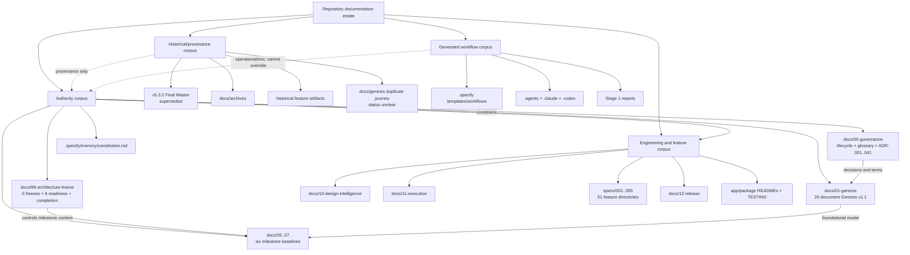
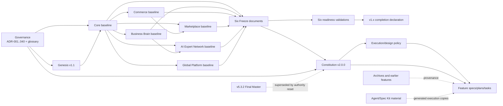

# Documentation Inventory

## 1. Scope

This inventory covers the documentation estate present in the repository at commit
`31937784e4b2c0951cff1d803ab1537835f6b14c` on branch
`055-commerce-order-command-boundary`, as inspected on 2026-07-18. Stage 1 reports
`docs/90-architecture-audit/00-EXECUTIVE-SUMMARY.md` and
`docs/90-architecture-audit/01-REPOSITORY-STATE.md` were read first and are included below as
generated context; they were not modified or treated as architecture authority.

The corpus includes:

- all repository Markdown, HTML, DOCX, and narrative TXT artifacts;
- workflow/configuration YAML whose content defines agent or Spec Kit behavior;
- README files under applications, packages, extensions, archived prototypes, and tooling;
- all feature specifications, plans, tasks, checklists, research, data models, quickstarts,
  contracts, design proposals, validation evidence, and implementation evidence under `specs/`;
- Governance, Genesis, milestone architecture, freeze/readiness, design, execution, release,
  archived, and generated-agent documentation;
- `playwright.config.ts` and `playwright.core.config.ts`, because their comments materially
  document browser-test topology and expected local servers.

Excluded from the documentation corpus were source files merely containing ordinary comments,
package lockfiles, `pnpm-workspace.yaml`, and `apps/landing/public/robots.txt`. Those files were
covered by Stage 1 repository discovery where applicable but do not constitute independently
maintained documentation sources. No implementation was used to validate a documentation claim in
this stage.

## 2. Audit Method

The audit used a recursive repository enumeration followed by content extraction and targeted
semantic reading.

1. Enumerate documentation and documentation-like files outside generated build/dependency
   directories.
2. Extract title, explicit status, version, date, owner, headings, cross-references, requirement
   language, decision language, TODO/deferred markers, and task checkboxes.
3. Read the authority-bearing corpus in the order stated by `AGENTS.md` section 1 and
   `.specify/memory/constitution.md` principle I: Freeze, Governance, Genesis, milestone
   baselines, Constitution, then feature/execution guidance.
4. Read the Stage 1 reports as context and inspect every documentation cluster, including
   generated agent commands/skills and archived narrative artifacts.
5. Compare documentation only. Source code, schemas, runtime behavior, and configuration behavior
   were not used to confirm or reject claims.
6. Classify authority using internal status, version/date, approval/freeze language, controlling
   references, incoming references, TODOs, current/future orientation, archive location,
   ownership, decision language, and generated/manual origin.

The complete-inventory flags are:

- `D`: contains an architectural/technical/product decision indicator;
- `R`: contains requirements or acceptance criteria;
- `I`: contains implementation, execution, validation, or operational instructions;
- `T`: contains an unresolved/deferred/TODO indicator or unchecked task;
- `-`: the corresponding indicator was not found.

`Refs in/out` is the number of other corpus files that name the file and the number of local
references emitted by the file. These are inventory signals, not proof of authority. Status,
purpose, audience, and orientation are explicit where the file states them; otherwise they are
marked or classified as inferred from content and location.

## 3. Documentation Summary

### 3.1 Corpus totals

| Measure | Count | Basis |
|---|---:|---|
| Total documentation artifacts reviewed | 669 | Complete corpus defined in section 1 |
| Markdown | 651 | Includes the two Stage 1 generated reports |
| HTML | 7 | Archived design/prototype narrative pages |
| DOCX | 3 | Archived Master, UX, and Architecture plans |
| Narrative TXT | 1 | Archived platform documentation export |
| YAML/YML | 5 | Spec Kit/extension workflow documentation |
| Commented TypeScript configuration | 2 | Root Playwright configurations |
| Files with decision indicators | 391 | Explicit decision/freeze/MUST/architecture signals |
| Files with requirement indicators | 333 | Requirements, acceptance criteria, MUST/SHALL, or feature requirement artifacts |
| Files with implementation instructions | 219 | Plans, tasks, quickstarts, agent workflows, or execution steps |
| Files with TODO/deferred/open indicators | 190 | TODO/TBD/deferred/unresolved text or unchecked tasks |
| Files with explicit version metadata detected | 65 | Front-matter/body metadata |
| Files with explicit date metadata detected | 17 | Front-matter/body metadata |
| Files with explicit owner/author metadata detected | 69 | Front-matter/body metadata |
| Archived or historical artifacts | 282 | Archived narrative plus superseded feature-era artifacts |

The decision, requirement, instruction, and TODO figures are content-indicator counts. A file can
contribute to several totals. “TODO” includes deliberately retained Deferred Decisions and open
task checkboxes; it does not imply an accidental omission.

### 3.2 Files by primary category

| Primary category | Files |
|---|---:|
| Implementation Prompt | 100 |
| Development Workflow | 49 |
| Supporting Documentation | 59 |
| User Experience | 88 |
| Architecture | 93 |
| Domain Model | 26 |
| Workflow and State Machines | 5 |
| Product Vision | 20 |
| Security | 12 |
| API Contracts | 32 |
| Monitoring and Observability | 3 |
| Infrastructure | 2 |
| Roadmap | 2 |
| Testing | 53 |
| Historical or Archived | 15 |
| Billing and Plans | 42 |
| Functional Requirements | 31 |
| Task Tracking | 26 |
| Multi-Tenancy | 11 |
| **Total** | **669** |

This is a single-primary-category count used to avoid double counting. Secondary categories appear
in the complete inventory.

### 3.3 Files by authority classification

| Authority classification | Files | Interpretation |
|---|---:|---|
| Authoritative | 72 | Explicit governing authority, accepted ADR/Genesis, or controlling Freeze/program baseline |
| Likely Authoritative | 43 | Approved milestone baseline expansion/readiness or current approved feature authority |
| Supporting Reference | 149 | Current guidance/evidence that cannot override frozen authority |
| Historical Reference | 282 | Archived or earlier feature-era provenance |
| Generated | 120 | Tool/agent/template output or Stage 1 generated context |
| Draft | 1 | ADR-041, explicitly Proposed |
| Superseded | 1 | v5.3.2 “Final Master Architecture,” superseded by the v1.x authority chain |
| Unclear Status | 1 | Duplicate `docs/genesis/11-CUSTOMER-JOURNEY.md` |
| **Total** | **669** | |

Authoritative plus Likely Authoritative documents total **115**.

### 3.4 Files by orientation

| Orientation | Files |
|---|---:|
| Normative or mixed | 164 |
| Future or mixed | 16 |
| Current-state/completion claim | 32 |
| Feature target/claim | 54 |
| Historical | 283 |
| Generated workflow | 120 |
| **Total** | **669** |

## 4. Complete Documentation Inventory

The status cell combines detected status with version/date/owner when present. Category ordering is
primary then secondary. Purpose, audience, and orientation are concise inventory interpretations;
authority and explicit metadata are reported separately.

| ID | File | Type | Category | Purpose / Audience | Status / Metadata | Orientation | Authority | D/R/I/T | Refs in/out |
|---|---|---|---|---|---|---|---|---|---|
| DOC-001 | `.agents/commands/speckit.analyze.md` | MD | Implementation Prompt; Development Workflow | Agent workflow: ---; audience: AI agents/contributors | Generated | Generated workflow | Generated | DRIT | 0/2 |
| DOC-002 | `.agents/commands/speckit.checklist.md` | MD | Implementation Prompt; Development Workflow | Agent workflow: ---; audience: AI agents/contributors | Generated | Generated workflow | Generated | -RIT | 0/2 |
| DOC-003 | `.agents/commands/speckit.clarify.md` | MD | Implementation Prompt; Development Workflow | Agent workflow: ---; audience: AI agents/contributors | Generated | Generated workflow | Generated | DRIT | 0/1 |
| DOC-004 | `.agents/commands/speckit.constitution.md` | MD | Implementation Prompt; Development Workflow; Architecture | Agent workflow: ---; audience: AI agents/contributors | Generated | Generated workflow | Generated | DRIT | 0/8 |
| DOC-005 | `.agents/commands/speckit.git.commit.md` | MD | Implementation Prompt; Development Workflow | Agent workflow: Auto-Commit Changes; audience: AI agents/contributors | Generated | Generated workflow | Generated | --I- | 2/1 |
| DOC-006 | `.agents/commands/speckit.git.feature.md` | MD | Implementation Prompt; Development Workflow | Agent workflow: Create Feature Branch; audience: AI agents/contributors | Generated | Generated workflow | Generated | -RI- | 2/2 |
| DOC-007 | `.agents/commands/speckit.git.initialize.md` | MD | Implementation Prompt; Development Workflow | Agent workflow: Initialize Git Repository; audience: AI agents/contributors | Generated | Generated workflow | Generated | --I- | 2/2 |
| DOC-008 | `.agents/commands/speckit.git.remote.md` | MD | Implementation Prompt; Development Workflow | Agent workflow: Detect Git Remote URL; audience: AI agents/contributors | Generated | Generated workflow | Generated | --I- | 2/0 |
| DOC-009 | `.agents/commands/speckit.git.validate.md` | MD | Implementation Prompt; Development Workflow | Agent workflow: Validate Feature Branch; audience: AI agents/contributors | Generated | Generated workflow | Generated | --I- | 2/1 |
| DOC-010 | `.agents/commands/speckit.implement.md` | MD | Implementation Prompt; Development Workflow | Agent workflow: ---; audience: AI agents/contributors | Generated | Generated workflow | Generated | -RI- | 0/1 |
| DOC-011 | `.agents/commands/speckit.plan.md` | MD | Implementation Prompt; Development Workflow; Billing and Plans | Agent workflow: ---; audience: AI agents/contributors | Generated | Generated workflow | Generated | DRIT | 0/2 |
| DOC-012 | `.agents/commands/speckit.specify.md` | MD | Implementation Prompt; Development Workflow | Agent workflow: ---; audience: AI agents/contributors | Generated | Generated workflow | Generated | -RI- | 0/6 |
| DOC-013 | `.agents/commands/speckit.tasks.md` | MD | Implementation Prompt; Development Workflow | Agent workflow: ---; audience: AI agents/contributors | Generated | Generated workflow | Generated | -RIT | 0/2 |
| DOC-014 | `.agents/commands/speckit.taskstoissues.md` | MD | Implementation Prompt; Development Workflow | Agent workflow: ---; audience: AI agents/contributors | Generated | Generated workflow | Generated | -RI- | 0/1 |
| DOC-015 | `.agents/skills/speckit-analyze/SKILL.md` | MD | Implementation Prompt; Development Workflow | Agent workflow: ---; audience: AI agents/contributors | Generated | Generated workflow | Generated | DRIT | 0/2 |
| DOC-016 | `.agents/skills/speckit-checklist/SKILL.md` | MD | Implementation Prompt; Development Workflow; Task Tracking | Agent workflow: ---; audience: AI agents/contributors | Generated | Generated workflow | Generated | -RIT | 0/2 |
| DOC-017 | `.agents/skills/speckit-clarify/SKILL.md` | MD | Implementation Prompt; Development Workflow | Agent workflow: ---; audience: AI agents/contributors | Generated | Generated workflow | Generated | DRIT | 0/1 |
| DOC-018 | `.agents/skills/speckit-constitution/SKILL.md` | MD | Implementation Prompt; Development Workflow; Architecture | Agent workflow: ---; audience: AI agents/contributors | Generated | Generated workflow | Generated | DRIT | 0/8 |
| DOC-019 | `.agents/skills/speckit-git-commit/SKILL.md` | MD | Implementation Prompt; Development Workflow | Agent workflow: Auto-Commit Changes; audience: AI agents/contributors | Generated | Generated workflow | Generated | --I- | 0/1 |
| DOC-020 | `.agents/skills/speckit-git-feature/SKILL.md` | MD | Implementation Prompt; Development Workflow | Agent workflow: Create Feature Branch; audience: AI agents/contributors | Generated | Generated workflow | Generated | -RI- | 0/2 |
| DOC-021 | `.agents/skills/speckit-git-initialize/SKILL.md` | MD | Implementation Prompt; Development Workflow | Agent workflow: Initialize Git Repository; audience: AI agents/contributors | Generated | Generated workflow | Generated | --I- | 0/2 |
| DOC-022 | `.agents/skills/speckit-git-remote/SKILL.md` | MD | Implementation Prompt; Development Workflow | Agent workflow: Detect Git Remote URL; audience: AI agents/contributors | Generated | Generated workflow | Generated | --I- | 0/0 |
| DOC-023 | `.agents/skills/speckit-git-validate/SKILL.md` | MD | Implementation Prompt; Development Workflow | Agent workflow: Validate Feature Branch; audience: AI agents/contributors | Generated | Generated workflow | Generated | --I- | 0/1 |
| DOC-024 | `.agents/skills/speckit-implement/SKILL.md` | MD | Implementation Prompt; Development Workflow | Agent workflow: ---; audience: AI agents/contributors | Generated | Generated workflow | Generated | -RI- | 0/1 |
| DOC-025 | `.agents/skills/speckit-plan/SKILL.md` | MD | Implementation Prompt; Development Workflow; Billing and Plans | Agent workflow: ---; audience: AI agents/contributors | Generated | Generated workflow | Generated | DRIT | 0/2 |
| DOC-026 | `.agents/skills/speckit-specify/SKILL.md` | MD | Implementation Prompt; Development Workflow | Agent workflow: ---; audience: AI agents/contributors | Generated | Generated workflow | Generated | -RI- | 0/6 |
| DOC-027 | `.agents/skills/speckit-tasks/SKILL.md` | MD | Implementation Prompt; Development Workflow | Agent workflow: ---; audience: AI agents/contributors | Generated | Generated workflow | Generated | -RIT | 0/2 |
| DOC-028 | `.agents/skills/speckit-taskstoissues/SKILL.md` | MD | Implementation Prompt; Development Workflow | Agent workflow: ---; audience: AI agents/contributors | Generated | Generated workflow | Generated | -RI- | 0/1 |
| DOC-029 | `.claude/commands/speckit.analyze.md` | MD | Implementation Prompt; Development Workflow | Agent workflow: ---; audience: AI agents/contributors | Generated | Generated workflow | Generated | DRIT | 0/2 |
| DOC-030 | `.claude/commands/speckit.checklist.md` | MD | Implementation Prompt; Development Workflow | Agent workflow: ---; audience: AI agents/contributors | Generated | Generated workflow | Generated | -RIT | 0/2 |
| DOC-031 | `.claude/commands/speckit.clarify.md` | MD | Implementation Prompt; Development Workflow | Agent workflow: ---; audience: AI agents/contributors | Generated | Generated workflow | Generated | DRIT | 0/1 |
| DOC-032 | `.claude/commands/speckit.constitution.md` | MD | Implementation Prompt; Development Workflow; Architecture | Agent workflow: ---; audience: AI agents/contributors | Generated | Generated workflow | Generated | DRIT | 0/8 |
| DOC-033 | `.claude/commands/speckit.git.commit.md` | MD | Implementation Prompt; Development Workflow | Agent workflow: Auto-Commit Changes; audience: AI agents/contributors | Generated | Generated workflow | Generated | --I- | 2/1 |
| DOC-034 | `.claude/commands/speckit.git.feature.md` | MD | Implementation Prompt; Development Workflow | Agent workflow: Create Feature Branch; audience: AI agents/contributors | Generated | Generated workflow | Generated | -RI- | 2/2 |
| DOC-035 | `.claude/commands/speckit.git.initialize.md` | MD | Implementation Prompt; Development Workflow | Agent workflow: Initialize Git Repository; audience: AI agents/contributors | Generated | Generated workflow | Generated | --I- | 2/2 |
| DOC-036 | `.claude/commands/speckit.git.remote.md` | MD | Implementation Prompt; Development Workflow | Agent workflow: Detect Git Remote URL; audience: AI agents/contributors | Generated | Generated workflow | Generated | --I- | 2/0 |
| DOC-037 | `.claude/commands/speckit.git.validate.md` | MD | Implementation Prompt; Development Workflow | Agent workflow: Validate Feature Branch; audience: AI agents/contributors | Generated | Generated workflow | Generated | --I- | 2/1 |
| DOC-038 | `.claude/commands/speckit.implement.md` | MD | Implementation Prompt; Development Workflow | Agent workflow: ---; audience: AI agents/contributors | Generated | Generated workflow | Generated | -RI- | 0/1 |
| DOC-039 | `.claude/commands/speckit.plan.md` | MD | Implementation Prompt; Development Workflow; Billing and Plans | Agent workflow: ---; audience: AI agents/contributors | Generated | Generated workflow | Generated | DRIT | 0/2 |
| DOC-040 | `.claude/commands/speckit.specify.md` | MD | Implementation Prompt; Development Workflow | Agent workflow: ---; audience: AI agents/contributors | Generated | Generated workflow | Generated | -RI- | 0/6 |
| DOC-041 | `.claude/commands/speckit.tasks.md` | MD | Implementation Prompt; Development Workflow | Agent workflow: ---; audience: AI agents/contributors | Generated | Generated workflow | Generated | -RIT | 0/2 |
| DOC-042 | `.claude/commands/speckit.taskstoissues.md` | MD | Implementation Prompt; Development Workflow | Agent workflow: ---; audience: AI agents/contributors | Generated | Generated workflow | Generated | -RI- | 0/1 |
| DOC-043 | `.claude/skills/brainstorming/scripts/frame-template.html` | HTML | Implementation Prompt; Development Workflow | Agent workflow: Superpowers Brainstorming; audience: AI agents/contributors | Generated | Generated workflow | Generated | ---- | 1/0 |
| DOC-044 | `.claude/skills/brainstorming/SKILL.md` | MD | Implementation Prompt; Development Workflow | Agent workflow: Brainstorming Ideas Into Designs; audience: AI agents/contributors | Generated | Generated workflow | Generated | DR-T | 0/1 |
| DOC-045 | `.claude/skills/brainstorming/spec-document-reviewer-prompt.md` | MD | Implementation Prompt; Development Workflow | Agent workflow: Spec Document Reviewer Prompt Template; audience: AI agents/contributors | Generated | Generated workflow | Generated | -R-T | 0/0 |
| DOC-046 | `.claude/skills/brainstorming/visual-companion.md` | MD | Implementation Prompt; Development Workflow | Agent workflow: Visual Companion Guide; audience: AI agents/contributors | Generated | Generated workflow | Generated | ---- | 1/0 |
| DOC-047 | `.claude/skills/dispatching-parallel-agents/SKILL.md` | MD | Implementation Prompt; Development Workflow | Agent workflow: Dispatching Parallel Agents; audience: AI agents/contributors | Generated | Generated workflow | Generated | D--- | 0/0 |
| DOC-048 | `.claude/skills/executing-plans/SKILL.md` | MD | Implementation Prompt; Development Workflow; Billing and Plans | Agent workflow: Executing Plans; audience: AI agents/contributors | Generated | Generated workflow | Generated | -RI- | 0/0 |
| DOC-049 | `.claude/skills/finishing-a-development-branch/SKILL.md` | MD | Implementation Prompt; Development Workflow | Agent workflow: Finishing a Development Branch; audience: AI agents/contributors | Generated | Generated workflow | Generated | --IT | 0/0 |
| DOC-050 | `.claude/skills/nexoraxs-fullstack/references/agent-workflow-rules.md` | MD | Implementation Prompt; Development Workflow; Workflow and State Machines | Agent workflow: NexoraXS Agent Workflow Rules; audience: AI agents/contributors | Generated | Generated workflow | Generated | --I- | 1/6 |
| DOC-051 | `.claude/skills/nexoraxs-fullstack/references/architecture-rules.md` | MD | Implementation Prompt; Development Workflow; Architecture | Agent workflow: Architecture Rules; audience: AI agents/contributors | Generated | Generated workflow | Generated | DRI- | 1/0 |
| DOC-052 | `.claude/skills/nexoraxs-fullstack/references/auth-session-rules.md` | MD | Implementation Prompt; Development Workflow; Security | Agent workflow: Auth and Session Rules; audience: AI agents/contributors | Generated | Generated workflow | Generated | ---- | 1/0 |
| DOC-053 | `.claude/skills/nexoraxs-fullstack/references/backend-patterns.md` | MD | Implementation Prompt; Development Workflow | Agent workflow: Laravel Backend Patterns; audience: AI agents/contributors | Generated | Generated workflow | Generated | ---- | 1/0 |
| DOC-054 | `.claude/skills/nexoraxs-fullstack/references/current-project-state.md` | MD | Implementation Prompt; Development Workflow | Agent workflow: NexoraXS Current Project State; audience: AI agents/contributors | Generated | Generated workflow | Generated | --I- | 1/9 |
| DOC-055 | `.claude/skills/nexoraxs-fullstack/references/docker-local-rules.md` | MD | Implementation Prompt; Development Workflow | Agent workflow: Docker and Local Development Rules; audience: AI agents/contributors | Generated | Generated workflow | Generated | ---- | 1/0 |
| DOC-056 | `.claude/skills/nexoraxs-fullstack/references/frontend-patterns.md` | MD | Implementation Prompt; Development Workflow | Agent workflow: Next.js Frontend Patterns; audience: AI agents/contributors | Generated | Generated workflow | Generated | --I- | 1/0 |
| DOC-057 | `.claude/skills/nexoraxs-fullstack/references/product-platform-context.md` | MD | Implementation Prompt; Development Workflow | Agent workflow: NexoraXS Product Platform Context; audience: AI agents/contributors | Generated | Generated workflow | Generated | ---- | 1/0 |
| DOC-058 | `.claude/skills/nexoraxs-fullstack/references/project-progress-roadmap.md` | MD | Implementation Prompt; Development Workflow; Roadmap | Agent workflow: NexoraXS Project Progress Roadmap; audience: AI agents/contributors | Generated | Generated workflow | Generated | --I- | 1/3 |
| DOC-059 | `.claude/skills/nexoraxs-fullstack/references/spec-driven-workflow.md` | MD | Implementation Prompt; Development Workflow; Workflow and State Machines | Agent workflow: Spec-Driven Workflow for NexoraXS; audience: AI agents/contributors | Generated | Generated workflow | Generated | --I- | 1/1 |
| DOC-060 | `.claude/skills/nexoraxs-fullstack/references/testing-checklists.md` | MD | Implementation Prompt; Development Workflow; Testing | Agent workflow: Testing Checklists; audience: AI agents/contributors | Generated | Generated workflow | Generated | --I- | 1/0 |
| DOC-061 | `.claude/skills/nexoraxs-fullstack/references/ui-ux-guidelines.md` | MD | Implementation Prompt; Development Workflow; User Experience | Agent workflow: UI/UX Guidelines; audience: AI agents/contributors | Generated | Generated workflow | Generated | D--- | 1/0 |
| DOC-062 | `.claude/skills/nexoraxs-fullstack/SKILL.md` | MD | Implementation Prompt; Development Workflow | Agent workflow: NexoraXS Full-Stack Skill; audience: AI agents/contributors | Generated | Generated workflow | Generated | D-I- | 0/2 |
| DOC-063 | `.claude/skills/nexoraxs-fullstack/templates/architecture-review.md` | MD | Implementation Prompt; Development Workflow; Architecture | Agent workflow: Architecture Review Template; audience: AI agents/contributors | Generated | Generated workflow | Generated | D--- | 1/0 |
| DOC-064 | `.claude/skills/nexoraxs-fullstack/templates/bugfix-task.md` | MD | Implementation Prompt; Development Workflow | Agent workflow: Bugfix Task Template; audience: AI agents/contributors | Generated | Generated workflow | Generated | --I- | 1/0 |
| DOC-065 | `.claude/skills/nexoraxs-fullstack/templates/feature-task.md` | MD | Implementation Prompt; Development Workflow | Agent workflow: Feature Task Template; audience: AI agents/contributors | Generated | Generated workflow | Generated | ---- | 1/0 |
| DOC-066 | `.claude/skills/nexoraxs-fullstack/templates/final-report.md` | MD | Implementation Prompt; Development Workflow | Agent workflow: Final Report Template; audience: AI agents/contributors | Generated | Generated workflow | Generated | ---- | 1/0 |
| DOC-067 | `.claude/skills/nexoraxs-fullstack/templates/ui-review.md` | MD | Implementation Prompt; Development Workflow; User Experience | Agent workflow: UI Review Template; audience: AI agents/contributors | Generated | Generated workflow | Generated | --I- | 1/0 |
| DOC-068 | `.claude/skills/receiving-code-review/SKILL.md` | MD | Implementation Prompt; Development Workflow | Agent workflow: Code Review Reception; audience: AI agents/contributors | Generated | Generated workflow | Generated | -R-- | 0/0 |
| DOC-069 | `.claude/skills/requesting-code-review/code-reviewer.md` | MD | Implementation Prompt; Development Workflow | Agent workflow: Code Reviewer Prompt Template; audience: AI agents/contributors | Generated | Generated workflow | Generated | -R-- | 2/0 |
| DOC-070 | `.claude/skills/requesting-code-review/SKILL.md` | MD | Implementation Prompt; Development Workflow | Agent workflow: Requesting Code Review; audience: AI agents/contributors | Generated | Generated workflow | Generated | -RI- | 0/0 |
| DOC-071 | `.claude/skills/subagent-driven-development/code-quality-reviewer-prompt.md` | MD | Implementation Prompt; Development Workflow; Testing | Agent workflow: Code Quality Reviewer Prompt Template; audience: AI agents/contributors | Generated | Generated workflow | Generated | ---- | 2/0 |
| DOC-072 | `.claude/skills/subagent-driven-development/implementer-prompt.md` | MD | Implementation Prompt; Development Workflow | Agent workflow: Implementer Subagent Prompt Template; audience: AI agents/contributors | Generated | Generated workflow | Generated | -R-- | 2/0 |
| DOC-073 | `.claude/skills/subagent-driven-development/SKILL.md` | MD | Implementation Prompt; Development Workflow | Agent workflow: Subagent-Driven Development; audience: AI agents/contributors | Generated | Generated workflow | Generated | -R-- | 0/0 |
| DOC-074 | `.claude/skills/subagent-driven-development/spec-reviewer-prompt.md` | MD | Implementation Prompt; Development Workflow | Agent workflow: Spec Compliance Reviewer Prompt Template; audience: AI agents/contributors | Generated | Generated workflow | Generated | -R-- | 2/0 |
| DOC-075 | `.claude/skills/systematic-debugging/condition-based-waiting.md` | MD | Implementation Prompt; Development Workflow | Agent workflow: Condition-Based Waiting; audience: AI agents/contributors | Generated | Generated workflow | Generated | ---- | 1/0 |
| DOC-076 | `.claude/skills/systematic-debugging/CREATION-LOG.md` | MD | Implementation Prompt; Development Workflow | Agent workflow: Creation Log: Systematic Debugging Skill; audience: AI agents/contributors | Generated | Generated workflow | Generated | D--- | 0/0 |
| DOC-077 | `.claude/skills/systematic-debugging/defense-in-depth.md` | MD | Implementation Prompt; Development Workflow | Agent workflow: Defense-in-Depth Validation; audience: AI agents/contributors | Generated | Generated workflow | Generated | ---- | 1/0 |
| DOC-078 | `.claude/skills/systematic-debugging/root-cause-tracing.md` | MD | Implementation Prompt; Development Workflow | Agent workflow: Root Cause Tracing; audience: AI agents/contributors | Generated | Generated workflow | Generated | ---- | 1/1 |
| DOC-079 | `.claude/skills/systematic-debugging/SKILL.md` | MD | Implementation Prompt; Development Workflow | Agent workflow: Systematic Debugging; audience: AI agents/contributors | Generated | Generated workflow | Generated | -R-- | 0/0 |
| DOC-080 | `.claude/skills/systematic-debugging/test-academic.md` | MD | Implementation Prompt; Development Workflow; Testing | Agent workflow: Academic Test: Systematic Debugging Skill; audience: AI agents/contributors | Generated | Generated workflow | Generated | ---- | 0/0 |
| DOC-081 | `.claude/skills/systematic-debugging/test-pressure-1.md` | MD | Implementation Prompt; Development Workflow; Testing | Agent workflow: Pressure Test 1: Emergency Production Fix; audience: AI agents/contributors | Generated | Generated workflow | Generated | D--- | 0/0 |
| DOC-082 | `.claude/skills/systematic-debugging/test-pressure-2.md` | MD | Implementation Prompt; Development Workflow; Testing | Agent workflow: Pressure Test 2: Sunk Cost + Exhaustion; audience: AI agents/contributors | Generated | Generated workflow | Generated | D--T | 0/0 |
| DOC-083 | `.claude/skills/systematic-debugging/test-pressure-3.md` | MD | Implementation Prompt; Development Workflow; Testing | Agent workflow: Pressure Test 3: Authority + Social Pressure; audience: AI agents/contributors | Generated | Generated workflow | Generated | D--- | 0/0 |
| DOC-084 | `.claude/skills/test-driven-development/SKILL.md` | MD | Implementation Prompt; Development Workflow; Testing | Agent workflow: Test-Driven Development (TDD); audience: AI agents/contributors | Generated | Generated workflow | Generated | D--T | 0/0 |
| DOC-085 | `.claude/skills/test-driven-development/testing-anti-patterns.md` | MD | Implementation Prompt; Development Workflow; Testing | Agent workflow: Testing Anti-Patterns; audience: AI agents/contributors | Generated | Generated workflow | Generated | ---- | 1/0 |
| DOC-086 | `.claude/skills/ui-ux-pro-max/SKILL.md` | MD | Implementation Prompt; Development Workflow; User Experience | Agent workflow: UI/UX Pro Max - Design Intelligence; audience: AI agents/contributors | Generated | Generated workflow | Generated | -R-T | 0/0 |
| DOC-087 | `.claude/skills/using-git-worktrees/SKILL.md` | MD | Implementation Prompt; Development Workflow | Agent workflow: Using Git Worktrees; audience: AI agents/contributors | Generated | Generated workflow | Generated | -RI- | 0/0 |
| DOC-088 | `.claude/skills/using-superpowers/references/codex-tools.md` | MD | Implementation Prompt; Development Workflow | Agent workflow: Codex Tool Mapping; audience: AI agents/contributors | Generated | Generated workflow | Generated | --I- | 1/0 |
| DOC-089 | `.claude/skills/using-superpowers/references/copilot-tools.md` | MD | Implementation Prompt; Development Workflow | Agent workflow: Copilot CLI Tool Mapping; audience: AI agents/contributors | Generated | Generated workflow | Generated | --I- | 1/0 |
| DOC-090 | `.claude/skills/using-superpowers/references/gemini-tools.md` | MD | Implementation Prompt; Development Workflow | Agent workflow: Gemini CLI Tool Mapping; audience: AI agents/contributors | Generated | Generated workflow | Generated | --I- | 0/0 |
| DOC-091 | `.claude/skills/using-superpowers/SKILL.md` | MD | Implementation Prompt; Development Workflow | Agent workflow: Using Skills; audience: AI agents/contributors | Generated | Generated workflow | Generated | -R-T | 0/0 |
| DOC-092 | `.claude/skills/verification-before-completion/SKILL.md` | MD | Implementation Prompt; Development Workflow | Agent workflow: Verification Before Completion; audience: AI agents/contributors | Generated | Generated workflow | Generated | DRI- | 0/0 |
| DOC-093 | `.claude/skills/writing-plans/plan-document-reviewer-prompt.md` | MD | Implementation Prompt; Development Workflow; Billing and Plans | Agent workflow: Plan Document Reviewer Prompt Template; audience: AI agents/contributors | Generated | Generated workflow | Generated | -R-- | 0/0 |
| DOC-094 | `.claude/skills/writing-plans/SKILL.md` | MD | Implementation Prompt; Development Workflow; Billing and Plans | Agent workflow: Writing Plans; audience: AI agents/contributors | Generated | Generated workflow | Generated | -R-T | 0/2 |
| DOC-095 | `.claude/skills/writing-skills/anthropic-best-practices.md` | MD | Implementation Prompt; Development Workflow | Agent workflow: Skill authoring best practices; audience: AI agents/contributors | Generated | Generated workflow | Generated | DR-T | 1/18 |
| DOC-096 | `.claude/skills/writing-skills/examples/CLAUDE_MD_TESTING.md` | MD | Implementation Prompt; Development Workflow; Testing | Agent workflow: Testing CLAUDE.md Skills Documentation; audience: AI agents/contributors | Generated | Generated workflow | Generated | -R-- | 1/0 |
| DOC-097 | `.claude/skills/writing-skills/persuasion-principles.md` | MD | Implementation Prompt; Development Workflow | Agent workflow: Persuasion Principles for Skill Design; audience: AI agents/contributors | Generated | Generated workflow | Generated | DRI- | 2/0 |
| DOC-098 | `.claude/skills/writing-skills/SKILL.md` | MD | Implementation Prompt; Development Workflow | Agent workflow: Writing Skills; audience: AI agents/contributors | Generated | Generated workflow | Generated | DR-T | 0/0 |
| DOC-099 | `.claude/skills/writing-skills/testing-skills-with-subagents.md` | MD | Implementation Prompt; Development Workflow; Testing | Agent workflow: Testing Skills With Subagents; audience: AI agents/contributors | Generated | Generated workflow | Generated | DR-T | 1/0 |
| DOC-100 | `.codex/skills/ui-ux-pro-max/SKILL.md` | MD | Implementation Prompt; Development Workflow; User Experience | ui-ux-pro-max; audience: AI agents/contributors | Generated | Generated workflow | Generated | -RIT | 0/0 |
| DOC-101 | `.specify/extensions.yml` | YML | Development Workflow; Task Tracking | Workflow/extension configuration: extensions.yml; audience: Engineers/agents/reviewers | Generated | Generated workflow | Generated | --I- | 27/0 |
| DOC-102 | `.specify/extensions/git/commands/speckit.git.commit.md` | MD | Development Workflow; Task Tracking | Auto-Commit Changes; audience: Engineers/agents/reviewers | Generated | Generated workflow | Generated | --I- | 2/1 |
| DOC-103 | `.specify/extensions/git/commands/speckit.git.feature.md` | MD | Development Workflow; Task Tracking | Create Feature Branch; audience: Engineers/agents/reviewers | Generated | Generated workflow | Generated | -RI- | 2/2 |
| DOC-104 | `.specify/extensions/git/commands/speckit.git.initialize.md` | MD | Development Workflow; Task Tracking | Initialize Git Repository; audience: Engineers/agents/reviewers | Generated | Generated workflow | Generated | --I- | 2/2 |
| DOC-105 | `.specify/extensions/git/commands/speckit.git.remote.md` | MD | Development Workflow; Task Tracking | Detect Git Remote URL; audience: Engineers/agents/reviewers | Generated | Generated workflow | Generated | --I- | 2/0 |
| DOC-106 | `.specify/extensions/git/commands/speckit.git.validate.md` | MD | Development Workflow; Task Tracking | Validate Feature Branch; audience: Engineers/agents/reviewers | Generated | Generated workflow | Generated | --I- | 2/1 |
| DOC-107 | `.specify/extensions/git/config-template.yml` | YML | Development Workflow; Task Tracking | Workflow/extension configuration: config-template.yml; audience: Engineers/agents/reviewers | Generated | Generated workflow | Generated | --I- | 1/0 |
| DOC-108 | `.specify/extensions/git/extension.yml` | YML | Development Workflow; Task Tracking | Workflow/extension configuration: extension.yml; audience: Engineers/agents/reviewers | Generated | Generated workflow | Generated | --I- | 0/0 |
| DOC-109 | `.specify/extensions/git/git-config.yml` | YML | Development Workflow; Task Tracking | Workflow/extension configuration: git-config.yml; audience: Engineers/agents/reviewers | Generated | Generated workflow | Generated | --I- | 11/0 |
| DOC-110 | `.specify/extensions/git/README.md` | MD | Development Workflow; Task Tracking | Git Branching Workflow Extension; audience: Engineers/agents/reviewers | Generated | Generated workflow | Generated | --I- | 0/1 |
| DOC-111 | `.specify/memory/constitution.md` | MD | Development Workflow; Task Tracking; Architecture | NexoraXS Constitution; audience: Engineers/agents/reviewers | Accepted/Baseline | Normative/Mixed | Authoritative | DRIT | 27/5 |
| DOC-112 | `.specify/templates/checklist-template.md` | MD | Development Workflow; Task Tracking | [CHECKLIST TYPE] Checklist: [FEATURE NAME]; audience: Engineers/agents/reviewers | Generated | Generated workflow | Generated | -RIT | 4/0 |
| DOC-113 | `.specify/templates/constitution-template.md` | MD | Development Workflow; Task Tracking; Architecture | [PROJECT_NAME] Constitution; audience: Engineers/agents/reviewers | Generated | Generated workflow | Generated | DRI- | 4/0 |
| DOC-114 | `.specify/templates/plan-template.md` | MD | Development Workflow; Task Tracking; Billing and Plans | Implementation Plan: [FEATURE]; audience: Engineers/agents/reviewers | Generated | Generated workflow | Generated | DRIT | 7/1 |
| DOC-115 | `.specify/templates/spec-template.md` | MD | Development Workflow; Task Tracking | Feature Specification: [FEATURE NAME]; audience: Engineers/agents/reviewers | Generated | Generated workflow | Generated | DR-T | 8/0 |
| DOC-116 | `.specify/templates/tasks-template.md` | MD | Development Workflow; Task Tracking | Tasks: [FEATURE NAME]; audience: Engineers/agents/reviewers | Generated | Generated workflow | Generated | -RIT | 8/0 |
| DOC-117 | `.specify/workflows/speckit/workflow.yml` | YML | Development Workflow; Task Tracking; Workflow and State Machines | Workflow/extension configuration: workflow.yml; audience: Engineers/agents/reviewers | Generated | Generated workflow | Generated | --I- | 1/0 |
| DOC-118 | `AGENTS.md` | MD | Supporting Documentation | NexoraXS Agent Instructions; audience: Repository stakeholders | Accepted/Baseline | Normative/Mixed | Authoritative | DR-T | 83/16 |
| DOC-119 | `apps/commerce/README.md` | MD | Development Workflow | NexoraXS Commerce OS frontend; audience: Developers | Unclear/Artifact | Normative/Mixed | Supporting Reference | D-I- | 2/1 |
| DOC-120 | `apps/core-platform/README.md` | MD | Development Workflow | or; audience: Developers | Generated | Generated workflow | Generated | ---- | 2/0 |
| DOC-121 | `apps/landing/README.md` | MD | User Experience; Development Workflow | or; audience: Developers | Generated | Generated workflow | Generated | ---- | 0/0 |
| DOC-122 | `docs/00-governance/ADR/ADR-001-business-operating-intelligence-platform.md` | MD | Architecture | ADR-001: Nexoraxs Is a Business Operating Intelligence Platform; audience: Governance/architects | Accepted | Normative/Mixed | Authoritative | D--- | 3/3 |
| DOC-123 | `docs/00-governance/ADR/ADR-002-core-shared-control-intelligence-plane.md` | MD | Architecture; Billing and Plans | ADR-002: Core Platform Is the Shared Control and Intelligence Plane; audience: Governance/architects | Accepted | Normative/Mixed | Authoritative | D--- | 7/4 |
| DOC-124 | `docs/00-governance/ADR/ADR-003-workspace-customer-multi-business-boundary.md` | MD | Architecture; Multi-Tenancy | ADR-003: Workspace Is the Customer and Tenant Boundary; audience: Governance/architects | Accepted | Normative/Mixed | Authoritative | D--- | 3/3 |
| DOC-125 | `docs/00-governance/ADR/ADR-004-genesis-organization-hierarchy.md` | MD | Architecture; Product Vision; Multi-Tenancy | ADR-004: Adopt the Genesis Organization Hierarchy; audience: Governance/architects | Accepted | Normative/Mixed | Authoritative | D--- | 3/4 |
| DOC-126 | `docs/00-governance/ADR/ADR-005-business-dna-business-scoped-software-independent.md` | MD | Architecture | ADR-005: Business DNA Is Business-Scoped and Software-Independent; audience: Governance/architects | Accepted | Normative/Mixed | Authoritative | D--- | 9/4 |
| DOC-127 | `docs/00-governance/ADR/ADR-006-workspace-intelligence-explicit-aggregation.md` | MD | Architecture; Multi-Tenancy | ADR-006: Workspace Intelligence Uses Explicit Non-Destructive Aggregation; audience: Governance/architects | Accepted | Normative/Mixed | Authoritative | D--- | 9/3 |
| DOC-128 | `docs/00-governance/ADR/ADR-007-capabilities-before-industries.md` | MD | Architecture | ADR-007: Capabilities Precede Industries and Software; audience: Governance/architects | Accepted | Normative/Mixed | Authoritative | D--- | 11/3 |
| DOC-129 | `docs/00-governance/ADR/ADR-008-modules-implement-capabilities.md` | MD | Architecture | ADR-008: Modules Are Operating System Implementation Details; audience: Governance/architects | Accepted | Normative/Mixed | Authoritative | D--- | 5/3 |
| DOC-130 | `docs/00-governance/ADR/ADR-009-shared-versioned-immutable-knowledge.md` | MD | Architecture | ADR-009: Knowledge and Published Platform Assets Are Shared, Versioned, and Immu; audience: Governance/architects | Accepted | Normative/Mixed | Authoritative | D--- | 12/3 |
| DOC-131 | `docs/00-governance/ADR/ADR-010-knowledge-packs-additive-immutable.md` | MD | Architecture | ADR-010: Knowledge Packs Extend Knowledge Additively; audience: Governance/architects | Accepted | Normative/Mixed | Authoritative | D--- | 5/3 |
| DOC-132 | `docs/00-governance/ADR/ADR-011-deterministic-versioned-explainable-rules.md` | MD | Architecture | ADR-011: Rules Are Deterministic, Versioned, and Explainable; audience: Governance/architects | Accepted | Normative/Mixed | Authoritative | D--- | 8/3 |
| DOC-133 | `docs/00-governance/ADR/ADR-012-business-brain-decision-engine.md` | MD | Architecture | ADR-012: Business Brain Is the Platform Decision Engine; audience: Governance/architects | Accepted | Normative/Mixed | Authoritative | D-I- | 15/3 |
| DOC-134 | `docs/00-governance/ADR/ADR-013-capability-first-explainable-recommendations.md` | MD | Architecture | ADR-013: Recommendations Are Capability-First, Explainable, and Optional; audience: Governance/architects | Accepted | Normative/Mixed | Authoritative | D--- | 13/3 |
| DOC-135 | `docs/00-governance/ADR/ADR-014-human-control-over-recommendations-and-ai.md` | MD | Architecture | ADR-014: Humans Retain Authority Over Consequential Decisions; audience: Governance/architects | Accepted | Normative/Mixed | Authoritative | D-I- | 14/3 |
| DOC-136 | `docs/00-governance/ADR/ADR-015-infer-before-asking-conversational-configuration.md` | MD | Architecture | ADR-015: Infer Before Asking and Make Configuration Conversational; audience: Governance/architects | Accepted | Normative/Mixed | Authoritative | D--- | 1/3 |
| DOC-137 | `docs/00-governance/ADR/ADR-016-business-architect-governed-pipeline.md` | MD | Architecture | ADR-016: Business Architect Is a Resumable Governed Pipeline; audience: Governance/architects | Accepted | Normative/Mixed | Authoritative | D--- | 2/3 |
| DOC-138 | `docs/00-governance/ADR/ADR-017-configuration-proposals-respect-domain-ownership.md` | MD | Architecture | ADR-017: Configuration Is Proposed Across Domain Boundaries; audience: Governance/architects | Accepted | Future/Mixed | Authoritative | D--- | 15/3 |
| DOC-139 | `docs/00-governance/ADR/ADR-018-separate-core-and-os-readiness.md` | MD | Architecture | ADR-018: Core Workspace Ready and Operating System Ready Are Separate; audience: Governance/architects | Accepted | Current-state claim | Authoritative | DR-- | 3/3 |
| DOC-140 | `docs/00-governance/ADR/ADR-019-product-hub-discovery-and-os-handoff.md` | MD | Architecture | ADR-019: Product Hub Owns Discovery and Handoff, Not OS Setup; audience: Governance/architects | Accepted | Normative/Mixed | Authoritative | D--- | 2/3 |
| DOC-141 | `docs/00-governance/ADR/ADR-020-product-hub-composition-not-data-ownership.md` | MD | Architecture | ADR-020: Product Hub Is a Composition Boundary, Not a Data Owner; audience: Governance/architects | Accepted | Normative/Mixed | Authoritative | D-I- | 6/3 |
| DOC-142 | `docs/00-governance/ADR/ADR-021-mandatory-workspace-entitlement.md` | MD | Architecture; Multi-Tenancy | ADR-021: Every Workspace Has a Mandatory Platform Entitlement; audience: Governance/architects | Accepted | Normative/Mixed | Authoritative | D--- | 1/3 |
| DOC-143 | `docs/00-governance/ADR/ADR-022-independent-os-subscriptions-and-canonical-plans.md` | MD | Architecture; Billing and Plans | ADR-022: Operating Systems Have Independent Subscriptions and Canonical Plans; audience: Governance/architects | Accepted | Normative/Mixed | Authoritative | D--- | 1/3 |
| DOC-144 | `docs/00-governance/ADR/ADR-023-workspace-subscription-business-unit-operation.md` | MD | Architecture; Multi-Tenancy; Billing and Plans | ADR-023: OS Subscription Is Workspace-Scoped and Operation Is Business Unit-Scop; audience: Governance/architects | Accepted | Normative/Mixed | Authoritative | D--T | 3/3 |
| DOC-145 | `docs/00-governance/ADR/ADR-024-independent-operating-system-domain-ownership.md` | MD | Architecture | ADR-024: Operating Systems Are Independent Domain Owners; audience: Governance/architects | Accepted | Normative/Mixed | Authoritative | D-I- | 20/3 |
| DOC-146 | `docs/00-governance/ADR/ADR-025-contract-based-optional-os-integration.md` | MD | Architecture | ADR-025: Operating System Integration Is Optional and Contract-Based; audience: Governance/architects | Accepted | Normative/Mixed | Authoritative | D-I- | 17/3 |
| DOC-147 | `docs/00-governance/ADR/ADR-026-standard-operating-system-lifecycle.md` | MD | Architecture; Workflow and State Machines | ADR-026: Every Operating System Follows the Standard Lifecycle; audience: Governance/architects | Accepted | Normative/Mixed | Authoritative | D--- | 2/3 |
| DOC-148 | `docs/00-governance/ADR/ADR-027-marketplace-bounded-context-within-core.md` | MD | Architecture | ADR-027: Marketplace Is a Bounded Context Within the Core Platform Offering; audience: Governance/architects | Accepted | Normative/Mixed | Authoritative | D-I- | 23/3 |
| DOC-149 | `docs/00-governance/ADR/ADR-028-immutable-marketplace-assets-scoped-state.md` | MD | Architecture | ADR-028: Marketplace Assets Are Shared and Immutable While Customer State Is Sco; audience: Governance/architects | Accepted | Normative/Mixed | Authoritative | D--- | 17/3 |
| DOC-150 | `docs/00-governance/ADR/ADR-029-ai-downstream-of-knowledge-rules-authorization.md` | MD | Architecture; Security; Authentication and Authorization | ADR-029: AI Is Downstream of Knowledge, Rules, and Authorization; audience: Governance/architects | Accepted | Normative/Mixed | Authoritative | D-I- | 30/3 |
| DOC-151 | `docs/00-governance/ADR/ADR-030-ai-coordinator-separated-orchestration.md` | MD | Architecture | ADR-030: AI Coordinator Separates Orchestration From Expertise and Execution; audience: Governance/architects | Accepted | Normative/Mixed | Authoritative | D-I- | 24/3 |
| DOC-152 | `docs/00-governance/ADR/ADR-031-coordinated-ai-expert-network.md` | MD | Architecture | ADR-031: AI Experts Are Coordinated Into One Platform Response; audience: Governance/architects | Accepted | Normative/Mixed | Authoritative | D--- | 15/3 |
| DOC-153 | `docs/00-governance/ADR/ADR-032-governed-ai-and-platform-learning.md` | MD | Architecture | ADR-032: Learning Cannot Directly Rewrite Business DNA, Knowledge, or Rules; audience: Governance/architects | Accepted | Normative/Mixed | Authoritative | D--- | 18/3 |
| DOC-154 | `docs/00-governance/ADR/ADR-033-enforced-modular-monolith.md` | MD | Architecture | ADR-033: Begin With an Enforced Modular Monolith; audience: Governance/architects | Accepted | Normative/Mixed | Authoritative | D--- | 9/2 |
| DOC-155 | `docs/00-governance/ADR/ADR-034-explicit-tenant-and-resource-scope.md` | MD | Architecture; Multi-Tenancy | ADR-034: Tenant and Resource Scope Are Explicit in Every Protected Operation; audience: Governance/architects | Accepted | Normative/Mixed | Authoritative | DR-- | 20/3 |
| DOC-156 | `docs/00-governance/ADR/ADR-035-technology-independent-compatible-contracts.md` | MD | Architecture; Infrastructure; Deployment | ADR-035: Architecture Contracts Are Technology-Independent and Backward-Compatib; audience: Governance/architects | Accepted | Normative/Mixed | Authoritative | D--- | 14/3 |
| DOC-157 | `docs/00-governance/ADR/ADR-036-contract-first-api-architecture.md` | MD | Architecture; API Contracts | ADR-036: API Gateway Is Part of a Contract-First API Architecture; audience: Governance/architects | Accepted | Normative/Mixed | Authoritative | D--- | 13/2 |
| DOC-158 | `docs/00-governance/ADR/ADR-037-context-preserving-navigation.md` | MD | Architecture | ADR-037: Navigation Preserves Explicit Context and Route Ownership; audience: Governance/architects | Accepted | Normative/Mixed | Authoritative | DR-- | 4/2 |
| DOC-159 | `docs/00-governance/ADR/ADR-038-append-only-audit-history.md` | MD | Architecture | ADR-038: Critical Audit History Is Append-Only; audience: Governance/architects | Accepted | Normative/Mixed | Authoritative | D--- | 18/3 |
| DOC-160 | `docs/00-governance/ADR/ADR-039-data-driven-configurable-platform-assets.md` | MD | Architecture | ADR-039: Platform Knowledge and Configuration Assets Are Data-Driven; audience: Governance/architects | Accepted | Normative/Mixed | Authoritative | D-I- | 7/3 |
| DOC-161 | `docs/00-governance/ADR/ADR-040-core-organization-identity-os-operational-data.md` | MD | Architecture; Multi-Tenancy | ADR-040: Core Owns Organization Identity and Operating Systems Own Operational D; audience: Governance/architects | Accepted | Normative/Mixed | Authoritative | D-I- | 9/4 |
| DOC-162 | `docs/00-governance/ADR/ADR-041-global-localization-internationalized-representation.md` | MD | Architecture; User Experience | ADR-041: Govern Global Localization and Internationalized Representation; audience: Governance/architects | Proposed | Normative/Mixed | Draft | DRIT | 0/33 |
| DOC-163 | `docs/00-governance/ADR/README.md` | MD | Architecture; Development Workflow | Architecture Decision Records; audience: Governance/architects | Accepted/Baseline | Normative/Mixed | Authoritative | D--- | 9/3 |
| DOC-164 | `docs/00-governance/glossary/GLOSSARY.md` | MD | Domain Model | Nexoraxs Canonical Glossary; audience: Governance/architects | Architectural Governance Foundation; v:1.0; o:Nexoraxs | Normative/Mixed | Authoritative | DR-- | 49/26 |
| DOC-165 | `docs/00-governance/MILESTONE-LIFECYCLE.md` | MD | Workflow and State Machines | Architectural Milestone Lifecycle; audience: Governance/architects | Governance Standard; v:1.0; o:Nexoraxs | Normative/Mixed | Authoritative | DR-T | 32/7 |
| DOC-166 | `docs/01-genesis/01-VISION.md` | MD | Product Vision | Nexoraxs Vision; audience: Product/architects/engineers | Foundation; v:1.0; o:Nexoraxs | Normative/Mixed | Authoritative | --I- | 16/0 |
| DOC-167 | `docs/01-genesis/02-CONSTITUTION.md` | MD | Architecture; Product Vision | Nexoraxs Constitution; audience: Product/architects/engineers | Foundation; v:1.0; o:Nexoraxs | Normative/Mixed | Authoritative | D--- | 34/0 |
| DOC-168 | `docs/01-genesis/03-BUSINESS-DNA.md` | MD | Product Vision | Business DNA; audience: Product/architects/engineers | Foundation; v:1.0; o:Nexoraxs | Normative/Mixed | Authoritative | DRI- | 24/0 |
| DOC-169 | `docs/01-genesis/04-CAPABILITIES.md` | MD | Product Vision | Capabilities Model; audience: Product/architects/engineers | Foundation; v:1.0; o:Nexoraxs | Normative/Mixed | Authoritative | ---- | 24/0 |
| DOC-170 | `docs/01-genesis/05-KNOWLEDGE-ENGINE.md` | MD | Product Vision | Knowledge Engine; audience: Product/architects/engineers | Foundation; v:1.0; o:Nexoraxs | Normative/Mixed | Authoritative | --I- | 25/0 |
| DOC-171 | `docs/01-genesis/06-BUSINESS-BRAIN.md` | MD | Product Vision | Business Brain; audience: Product/architects/engineers | Foundation; v:1.0; o:Nexoraxs | Normative/Mixed | Authoritative | D-I- | 25/0 |
| DOC-172 | `docs/01-genesis/07-RECOMMENDATION-ENGINE.md` | MD | Product Vision | Recommendation Engine; audience: Product/architects/engineers | Foundation; v:1.0; o:Nexoraxs | Normative/Mixed | Authoritative | D-I- | 21/0 |
| DOC-173 | `docs/01-genesis/08-AI-STRATEGY.md` | MD | Product Vision | AI Strategy; audience: Product/architects/engineers | Foundation; v:1.0; o:Nexoraxs | Normative/Mixed | Authoritative | --I- | 33/0 |
| DOC-174 | `docs/01-genesis/09-PLATFORM-BLUEPRINT.md` | MD | Product Vision | Nexoraxs Platform Blueprint; audience: Product/architects/engineers | Foundation; v:1.0; o:Nexoraxs | Normative/Mixed | Authoritative | --I- | 30/0 |
| DOC-175 | `docs/01-genesis/10-NEXORAXS-ONTOLOGY.md` | MD | Product Vision; Domain Model | Nexoraxs Ontology; audience: Product/architects/engineers | Foundation; v:1.0; o:Nexoraxs | Normative/Mixed | Authoritative | D--- | 28/0 |
| DOC-176 | `docs/01-genesis/11-CUSTOMER-JOURNEY.md` | MD | Product Vision | Customer Journey; audience: Product/architects/engineers | Foundation; v:1.0; o:Nexoraxs | Normative/Mixed | Authoritative | --I- | 15/0 |
| DOC-177 | `docs/01-genesis/12-WORKSPACE-LIFECYCLE.md` | MD | Product Vision; Multi-Tenancy; Workflow and State Machines | Workspace Lifecycle; audience: Product/architects/engineers | Foundation; v:1.0; o:Nexoraxs | Normative/Mixed | Authoritative | ---- | 20/0 |
| DOC-178 | `docs/01-genesis/13-PRODUCT-HUB.md` | MD | Product Vision | Product Hub; audience: Product/architects/engineers | Foundation; v:1.0; o:Nexoraxs | Normative/Mixed | Authoritative | ---- | 21/0 |
| DOC-179 | `docs/01-genesis/14-SUBSCRIPTION-MODEL.md` | MD | Product Vision; Billing and Plans | Subscription Model; audience: Product/architects/engineers | Foundation; v:1.0; o:Nexoraxs | Normative/Mixed | Authoritative | --I- | 18/0 |
| DOC-180 | `docs/01-genesis/15-BUSINESS-LIFECYCLE.md` | MD | Product Vision; Workflow and State Machines | Business Lifecycle; audience: Product/architects/engineers | Foundation; v:1.0; o:Nexoraxs | Normative/Mixed | Authoritative | ---- | 8/0 |
| DOC-181 | `docs/01-genesis/16-OPERATING-SYSTEM-LIFECYCLE.md` | MD | Product Vision; Workflow and State Machines | Operating System Lifecycle; audience: Product/architects/engineers | Foundation; v:1.0; o:Nexoraxs | Normative/Mixed | Authoritative | ---- | 27/0 |
| DOC-182 | `docs/01-genesis/17-MARKETPLACE-ARCHITECTURE.md` | MD | Architecture; Product Vision | Marketplace Architecture; audience: Product/architects/engineers | Foundation; v:1.0; o:Nexoraxs | Normative/Mixed | Authoritative | D-I- | 39/0 |
| DOC-183 | `docs/01-genesis/18-KNOWLEDGE-PACKS.md` | MD | Product Vision | Knowledge Packs; audience: Product/architects/engineers | Foundation; v:1.0; o:Nexoraxs | Normative/Mixed | Authoritative | D-I- | 30/0 |
| DOC-184 | `docs/01-genesis/19-AI-EXPERT-NETWORK.md` | MD | Product Vision | AI Expert Network; audience: Product/architects/engineers | Foundation; v:1.0; o:Nexoraxs | Normative/Mixed | Authoritative | --I- | 40/0 |
| DOC-185 | `docs/01-genesis/20-PLATFORM-ECOSYSTEM.md` | MD | Product Vision | Platform Ecosystem; audience: Product/architects/engineers | Foundation; v:1.0; o:Nexoraxs | Normative/Mixed | Authoritative | --I- | 54/0 |
| DOC-186 | `docs/02-core-platform/00-CORE-PLATFORM-PRINCIPLES.md` | MD | Supporting Documentation | Core Platform Architectural Principles; audience: Product/architects/engineers | Approved Architectural Foundation; v:1.0; o:Nexoraxs | Normative/Mixed | Likely Authoritative | DR-T | 25/47 |
| DOC-187 | `docs/02-core-platform/01-CORE-PLATFORM-VISION.md` | MD | Product Vision | Core Platform Vision; audience: Product/architects/engineers | Milestone 1 — Wave 1; v:1.0; o:Nexoraxs | Normative/Mixed | Likely Authoritative | D-I- | 19/16 |
| DOC-188 | `docs/02-core-platform/02-CORE-PLATFORM-ARCHITECTURE-PROPOSAL.md` | MD | Architecture | Core Platform Architecture Proposal; audience: Product/architects/engineers | Proposal — Review Required; v:0.2; o:Nexoraxs | Future/Mixed | Supporting Reference | DR-T | 46/0 |
| DOC-189 | `docs/02-core-platform/02-CORE-PLATFORM-ARCHITECTURE.md` | MD | Architecture | Core Platform Architecture; audience: Product/architects/engineers | Milestone 1 — Wave 1; v:1.0; o:Nexoraxs | Normative/Mixed | Likely Authoritative | DR-- | 43/19 |
| DOC-190 | `docs/02-core-platform/03-DOMAIN-MODEL.md` | MD | Domain Model | Core Platform Domain Model; audience: Product/architects/engineers | Milestone 1 — Wave 1; v:1.0; o:Nexoraxs | Normative/Mixed | Likely Authoritative | DR-T | 49/16 |
| DOC-191 | `docs/02-core-platform/04-DATA-OWNERSHIP.md` | MD | Supporting Documentation | Core Platform Data Ownership; audience: Product/architects/engineers | Milestone 1 — Wave 2; v:1.0; o:Nexoraxs | Normative/Mixed | Likely Authoritative | DR-T | 32/33 |
| DOC-192 | `docs/02-core-platform/05-PERMISSION-MODEL.md` | MD | Security; Authentication and Authorization | Core Platform Permission Model; audience: Product/architects/engineers | Milestone 1 — Wave 2; v:1.0; o:Nexoraxs | Normative/Mixed | Likely Authoritative | DR-T | 23/30 |
| DOC-193 | `docs/02-core-platform/06-EVENT-ARCHITECTURE.md` | MD | Architecture; Workflow and State Machines | Core Platform Event Architecture; audience: Product/architects/engineers | Milestone 1 — Wave 2; v:1.0; o:Nexoraxs | Normative/Mixed | Likely Authoritative | DRI- | 16/33 |
| DOC-194 | `docs/02-core-platform/07-API-PHILOSOPHY.md` | MD | API Contracts | Core Platform API Philosophy; audience: Product/architects/engineers | Milestone 1 — Wave 3; v:1.0; o:Nexoraxs | Normative/Mixed | Likely Authoritative | DR-- | 10/29 |
| DOC-195 | `docs/02-core-platform/08-SECURITY-MODEL.md` | MD | Security; Authentication and Authorization | Core Platform Security Model; audience: Product/architects/engineers | Milestone 1 — Wave 3; v:1.0; o:Nexoraxs | Normative/Mixed | Likely Authoritative | DR-T | 18/34 |
| DOC-196 | `docs/02-core-platform/09-OBSERVABILITY.md` | MD | Monitoring and Observability | Core Platform Observability; audience: Product/architects/engineers | Milestone 1 — Wave 3; v:1.0; o:Nexoraxs | Normative/Mixed | Likely Authoritative | DRI- | 18/32 |
| DOC-197 | `docs/02-core-platform/10-DEPLOYMENT-MODEL.md` | MD | Infrastructure; Deployment | Core Platform Deployment Model; audience: Product/architects/engineers | Approved baseline | Normative/Mixed | Likely Authoritative | DR-- | 6/26 |
| DOC-198 | `docs/02-core-platform/11-TECHNOLOGY-STACK.md` | MD | Infrastructure; Deployment | Core Platform Technology Stack; audience: Product/architects/engineers | Approved baseline | Normative/Mixed | Likely Authoritative | DR-T | 5/26 |
| DOC-199 | `docs/02-core-platform/12-CORE-PLATFORM-ROADMAP.md` | MD | Roadmap | Core Platform Roadmap; audience: Product/architects/engineers | Unclear/Artifact | Future/Mixed | Supporting Reference | DRIT | 8/38 |
| DOC-200 | `docs/02-core-platform/98-CORE-PLATFORM-PATCH-v1.0.1.md` | MD | Supporting Documentation | Core Platform Architecture Patch Plan v1.0.1; audience: Product/architects/engineers | Proposed Documentation Patch Plan; v:1.0.1; o:Nexoraxs | Normative/Mixed | Supporting Reference | D--- | 2/9 |
| DOC-201 | `docs/02-core-platform/99-CORE-PLATFORM-ARCHITECTURE-REVIEW.md` | MD | Architecture | Core Platform Architecture Quality Review; audience: Product/architects/engineers | Milestone 1 Quality Gate; v:1.0; o:Nexoraxs | Normative/Mixed | Supporting Reference | D--T | 7/20 |
| DOC-202 | `docs/02-core-platform/README.md` | MD | Development Workflow | Core Platform Documentation — Milestone 1; audience: Product/architects/engineers | Wave 1; v:1.0; o:Nexoraxs | Normative/Mixed | Supporting Reference | D--T | 2/21 |
| DOC-203 | `docs/03-BUSINESS-BRAIN-ARCHITECTURE-REREVIEW.md` | MD | Architecture | Business Brain Proposal Architecture Re-Review; audience: Product/architects/engineers | Final Proposal Quality Gate; v:0.1.1; o:Nexoraxs | Normative/Mixed | Supporting Reference | DR-T | 13/20 |
| DOC-204 | `docs/03-BUSINESS-BRAIN-ARCHITECTURE-REVIEW.md` | MD | Architecture | Business Brain Proposal Architecture Review; audience: Product/architects/engineers | Independent Proposal Quality Gate; v:0.1; o:Nexoraxs | Normative/Mixed | Supporting Reference | DR-T | 5/29 |
| DOC-205 | `docs/03-BUSINESS-BRAIN-PROPOSAL.md` | MD | Supporting Documentation | Business Brain Architecture Proposal; audience: Product/architects/engineers | Proposed; v:0.1; o:Nexoraxs | Future/Mixed | Supporting Reference | D--T | 16/62 |
| DOC-206 | `docs/03-business-brain/00-BUSINESS-BRAIN-DISCOVERY.md` | MD | Supporting Documentation | Business Brain Discovery; audience: Product/architects/engineers | Discovery — Non-Authoritative; v:0.1; o:Nexoraxs | Normative/Mixed | Supporting Reference | DR-T | 8/61 |
| DOC-207 | `docs/03-business-brain/01-BUSINESS-BRAIN-CAPABILITY-MAP.md` | MD | Supporting Documentation | Business Brain Capability Map; audience: Product/architects/engineers | Candidate Capability Map — Non-Authoritative; v:0.1; o:Nexoraxs | Normative/Mixed | Supporting Reference | D--T | 7/32 |
| DOC-208 | `docs/03-business-brain/02-BUSINESS-BRAIN-ARCHITECTURE.md` | MD | Architecture | Business Brain Architecture; audience: Product/architects/engineers | Wave 1 — Approved Proposal Expansion; v:1.0; o:Nexoraxs | Normative/Mixed | Likely Authoritative | D--T | 14/11 |
| DOC-209 | `docs/03-business-brain/03-BUSINESS-BRAIN-DOMAIN-MODEL.md` | MD | Domain Model | Business Brain Domain Model; audience: Product/architects/engineers | Wave 1 — Approved Proposal Expansion; v:1.0; o:Nexoraxs | Normative/Mixed | Likely Authoritative | D--T | 11/8 |
| DOC-210 | `docs/03-business-brain/03-BUSINESS-BRAIN-PROPOSAL-PATCH-v0.1.1.md` | MD | Supporting Documentation | Business Brain Proposal Freeze Alignment Patch v0.1.1; audience: Product/architects/engineers | Proposed; v:0.1.1; o:Nexoraxs | Future/Mixed | Supporting Reference | D--T | 14/8 |
| DOC-211 | `docs/03-business-brain/04-BUSINESS-BRAIN-DATA-OWNERSHIP.md` | MD | Supporting Documentation | Business Brain Data Ownership; audience: Product/architects/engineers | Wave 1 — Approved Proposal Expansion; v:1.0; o:Nexoraxs | Normative/Mixed | Likely Authoritative | DR-- | 13/11 |
| DOC-212 | `docs/03-business-brain/05-BUSINESS-BRAIN-CONTRACTS.md` | MD | Supporting Documentation | Business Brain Logical Contracts; audience: Product/architects/engineers | Wave 2 — Approved Baseline Expansion; v:1.0; o:Nexoraxs | Normative/Mixed | Likely Authoritative | DR-T | 8/9 |
| DOC-213 | `docs/03-business-brain/06-BUSINESS-BRAIN-EVENTS.md` | MD | Workflow and State Machines | Business Brain Domain Events; audience: Product/architects/engineers | Wave 2 — Approved Baseline Expansion; v:1.0; o:Business Brain | Normative/Mixed | Likely Authoritative | D-I- | 7/9 |
| DOC-214 | `docs/03-business-brain/07-BUSINESS-BRAIN-READ-MODELS.md` | MD | Supporting Documentation | Business Brain Read Models; audience: Product/architects/engineers | Wave 2 — Approved Baseline Expansion; v:1.0; o:Business Brain read side | Normative/Mixed | Likely Authoritative | D--T | 6/10 |
| DOC-215 | `docs/03-business-brain/08-BUSINESS-BRAIN-SECURITY.md` | MD | Security; Authentication and Authorization | Business Brain Security; audience: Product/architects/engineers | Approved-baseline expansion | Normative/Mixed | Likely Authoritative | D--- | 3/15 |
| DOC-216 | `docs/03-business-brain/09-BUSINESS-BRAIN-OBSERVABILITY.md` | MD | Monitoring and Observability | Business Brain Observability; audience: Product/architects/engineers | Approved-baseline expansion | Normative/Mixed | Likely Authoritative | D--- | 2/13 |
| DOC-217 | `docs/03-business-brain/10-BUSINESS-BRAIN-OPERATIONAL-BEHAVIOR.md` | MD | Workflow and State Machines | Business Brain Operational Behavior; audience: Product/architects/engineers | Approved-baseline expansion | Normative/Mixed | Likely Authoritative | D--T | 2/13 |
| DOC-218 | `docs/03-business-brain/11-BUSINESS-BRAIN-RELIABILITY.md` | MD | Monitoring and Observability | Business Brain Reliability; audience: Product/architects/engineers | Approved-baseline expansion | Normative/Mixed | Likely Authoritative | DR-- | 2/16 |
| DOC-219 | `docs/03-business-brain/12-BUSINESS-BRAIN-ARCHITECTURE-REVIEW.md` | MD | Architecture | Business Brain Final Architecture Review; audience: Product/architects/engineers | Final Milestone Architecture Quality Gate; o:Nexoraxs | Normative/Mixed | Supporting Reference | DR-T | 6/20 |
| DOC-220 | `docs/04-commerce-os/00-COMMERCE-OS-DISCOVERY.md` | MD | Supporting Documentation | Commerce OS Discovery; audience: Product/architects/engineers | Discovery — Exploratory, Non-Architectural; v:0.1; d:2026-07-12; o:Nexoraxs | Normative/Mixed | Supporting Reference | DR-T | 11/24 |
| DOC-221 | `docs/04-commerce-os/01-COMMERCE-OS-CAPABILITY-MAP.md` | MD | Supporting Documentation | Commerce OS Capability Map; audience: Product/architects/engineers | Logical Capability Mapping — Exploratory, Non-Architectural; v:0.1; d:2026-07-13; o:Nexoraxs | Normative/Mixed | Supporting Reference | D--T | 10/9 |
| DOC-222 | `docs/04-commerce-os/02-COMMERCE-OS-PROPOSAL.md` | MD | Supporting Documentation | Commerce OS Architecture Proposal v0.1; audience: Product/architects/engineers | Proposed — Pending Independent Architecture Review | Future/Mixed | Supporting Reference | DR-T | 9/7 |
| DOC-223 | `docs/04-commerce-os/03-COMMERCE-OS-ARCHITECTURE-REVIEW.md` | MD | Architecture | Commerce OS Proposal v0.1 — Independent Architecture Review; audience: Product/architects/engineers | Unclear/Artifact | Normative/Mixed | Supporting Reference | DR-T | 5/9 |
| DOC-224 | `docs/04-commerce-os/04-COMMERCE-OS-PROPOSAL-PATCH-v0.1.1.md` | MD | Supporting Documentation | Commerce OS Proposal Freeze Alignment Patch v0.1.1; audience: Product/architects/engineers | Proposed Patch — Pending Independent Re-Review | Future/Mixed | Supporting Reference | DR-T | 7/9 |
| DOC-225 | `docs/04-commerce-os/05-COMMERCE-OS-RE-REVIEW.md` | MD | Supporting Documentation | Commerce OS Proposal Baseline v0.1.1 — Independent Architecture Re-Review; audience: Product/architects/engineers | Unclear/Artifact | Normative/Mixed | Supporting Reference | D--T | 6/11 |
| DOC-226 | `docs/04-commerce-os/06-COMMERCE-OS-WAVE-1.md` | MD | Supporting Documentation | Commerce OS Documentation Wave 1; audience: Product/architects/engineers | Approved baseline | Normative/Mixed | Likely Authoritative | D--T | 6/10 |
| DOC-227 | `docs/04-commerce-os/07-COMMERCE-OS-WAVE-2.md` | MD | Supporting Documentation | Commerce OS Documentation Wave 2; audience: Product/architects/engineers | Documentation Wave 2 | Normative/Mixed | Likely Authoritative | DR-T | 4/11 |
| DOC-228 | `docs/04-commerce-os/08-COMMERCE-OS-WAVE-3.md` | MD | Supporting Documentation | Commerce OS Documentation Wave 3; audience: Product/architects/engineers | Documentation Wave 3 | Normative/Mixed | Likely Authoritative | D--T | 3/12 |
| DOC-229 | `docs/04-commerce-os/09-COMMERCE-OS-FINAL-ARCHITECTURE-REVIEW.md` | MD | Architecture | Commerce OS Final Architecture Review; audience: Product/architects/engineers | Unclear/Artifact | Normative/Mixed | Supporting Reference | DR-T | 6/14 |
| DOC-230 | `docs/05-marketplace/00-MARKETPLACE-DISCOVERY.md` | MD | Supporting Documentation | Marketplace Discovery v0.1; audience: Product/architects/engineers | Discovery | Normative/Mixed | Supporting Reference | DRIT | 11/19 |
| DOC-231 | `docs/05-marketplace/01-MARKETPLACE-CAPABILITY-MAP.md` | MD | Supporting Documentation | Marketplace Capability Map v0.1; audience: Product/architects/engineers | Logical Capability Map | Normative/Mixed | Supporting Reference | D--T | 10/7 |
| DOC-232 | `docs/05-marketplace/02-MARKETPLACE-PROPOSAL.md` | MD | Supporting Documentation | Marketplace Architecture Proposal v0.1; audience: Product/architects/engineers | Proposed — Pending Independent Architecture Review | Future/Mixed | Supporting Reference | DR-T | 10/12 |
| DOC-233 | `docs/05-marketplace/03-MARKETPLACE-ARCHITECTURE-REVIEW.md` | MD | Architecture | Marketplace Proposal v0.1 — Independent Architecture Review; audience: Product/architects/engineers | Independent Architecture Quality Gate | Normative/Mixed | Supporting Reference | D--T | 8/17 |
| DOC-234 | `docs/05-marketplace/04-MARKETPLACE-PROPOSAL-PATCH-v0.1.1.md` | MD | Supporting Documentation | Marketplace Proposal Patch v0.1.1; audience: Product/architects/engineers | Freeze Alignment Patch — Pending Independent Re-Review | Future/Mixed | Supporting Reference | DR-T | 8/14 |
| DOC-235 | `docs/05-marketplace/05-MARKETPLACE-RE-REVIEW.md` | MD | Supporting Documentation | Marketplace Proposal Baseline v0.1.1 — Independent Re-Review; audience: Product/architects/engineers | Final Proposal Baseline Validation | Normative/Mixed | Supporting Reference | D--T | 6/15 |
| DOC-236 | `docs/05-marketplace/06-MARKETPLACE-WAVE-1.md` | MD | Supporting Documentation | Marketplace Documentation Wave 1; audience: Product/architects/engineers | Documentation Quality Baseline | Normative/Mixed | Likely Authoritative | D--T | 5/16 |
| DOC-237 | `docs/05-marketplace/07-MARKETPLACE-WAVE-2.md` | MD | Supporting Documentation | Marketplace Documentation Wave 2; audience: Product/architects/engineers | Documentation traceability layer | Normative/Mixed | Likely Authoritative | D--T | 4/17 |
| DOC-238 | `docs/05-marketplace/08-MARKETPLACE-WAVE-3.md` | MD | Supporting Documentation | Marketplace Documentation Wave 3; audience: Product/architects/engineers | Final documentation-quality layer before Final Architecture Review | Normative/Mixed | Likely Authoritative | D--T | 3/30 |
| DOC-239 | `docs/05-marketplace/09-MARKETPLACE-FINAL-ARCHITECTURE-REVIEW.md` | MD | Architecture | Marketplace Final Architecture Review; audience: Product/architects/engineers | Final quality gate completed | Normative/Mixed | Supporting Reference | DR-T | 6/22 |
| DOC-240 | `docs/06-ai-expert-network/00-AI-EXPERT-NETWORK-DISCOVERY.md` | MD | Supporting Documentation | AI Expert Network Discovery v0.1; audience: Product/architects/engineers | Exploratory | Normative/Mixed | Supporting Reference | DR-T | 12/18 |
| DOC-241 | `docs/06-ai-expert-network/01-AI-EXPERT-NETWORK-CAPABILITY-MAP.md` | MD | Supporting Documentation | AI Expert Network Capability Map v0.1; audience: Product/architects/engineers | Candidate mapping | Normative/Mixed | Supporting Reference | D--T | 11/19 |
| DOC-242 | `docs/06-ai-expert-network/02-AI-EXPERT-NETWORK-PROPOSAL.md` | MD | Supporting Documentation | AI Expert Network Architecture Proposal v0.1; audience: Product/architects/engineers | Proposed — independent Architecture Review required | Future/Mixed | Supporting Reference | DR-T | 11/48 |
| DOC-243 | `docs/06-ai-expert-network/03-AI-EXPERT-NETWORK-PROPOSAL-PATCH-v0.1.1.md` | MD | Supporting Documentation | AI Expert Network Proposal Freeze Alignment Patch v0.1.1; audience: Product/architects/engineers | Proposed for independent Re-Review | Future/Mixed | Supporting Reference | D--T | 10/19 |
| DOC-244 | `docs/06-ai-expert-network/03A-AI-EXPERT-NETWORK-PROPOSAL-PATCH-v0.1.2.md` | MD | Supporting Documentation | AI Expert Network Corrective Proposal Patch v0.1.2; audience: Product/architects/engineers | Proposed for independent Re-Review | Future/Mixed | Supporting Reference | D--T | 7/20 |
| DOC-245 | `docs/06-ai-expert-network/04-AI-EXPERT-NETWORK-RE-REVIEW.md` | MD | Supporting Documentation | AI Expert Network Proposal Baseline v0.1.1 Independent Re-Review; audience: Product/architects/engineers | Completed | Normative/Mixed | Supporting Reference | D--T | 9/26 |
| DOC-246 | `docs/06-ai-expert-network/04A-AI-EXPERT-NETWORK-CONFLICT-ANALYSIS.md` | MD | Supporting Documentation | AI Expert Network Proposal Baseline v0.1.1 Conflict Analysis; audience: Product/architects/engineers | Completed | Normative/Mixed | Supporting Reference | DR-- | 8/15 |
| DOC-247 | `docs/06-ai-expert-network/04B-AI-EXPERT-NETWORK-RE-REVIEW-v0.1.2.md` | MD | Supporting Documentation | AI Expert Network Proposal Baseline v0.1.2 — Independent Re-Review; audience: Product/architects/engineers | Unclear/Artifact | Normative/Mixed | Supporting Reference | D--T | 6/21 |
| DOC-248 | `docs/06-ai-expert-network/05-AI-EXPERT-NETWORK-WAVE-1.md` | MD | Supporting Documentation | AI Expert Network Documentation Wave 1; audience: Product/architects/engineers | Proposed for review | Normative/Mixed | Likely Authoritative | D--T | 5/46 |
| DOC-249 | `docs/06-ai-expert-network/06-AI-EXPERT-NETWORK-WAVE-2.md` | MD | Supporting Documentation | AI Expert Network Documentation Wave 2; audience: Product/architects/engineers | Proposed for review | Normative/Mixed | Likely Authoritative | DR-T | 4/66 |
| DOC-250 | `docs/06-ai-expert-network/07-AI-EXPERT-NETWORK-WAVE-3.md` | MD | Supporting Documentation | AI Expert Network Documentation Wave 3; audience: Product/architects/engineers | Proposed for review | Normative/Mixed | Likely Authoritative | DR-T | 3/80 |
| DOC-251 | `docs/06-ai-expert-network/08-AI-EXPERT-NETWORK-FINAL-ARCHITECTURE-REVIEW.md` | MD | Architecture | AI Expert Network Final Architecture Review; audience: Product/architects/engineers | Unclear/Artifact | Normative/Mixed | Supporting Reference | DR-T | 3/66 |
| DOC-252 | `docs/07-global-platform/00-GLOBAL-PLATFORM-DISCOVERY.md` | MD | Supporting Documentation | Global Platform Discovery v0.1; audience: Product/architects/engineers | Discovery incomplete — required Genesis source unavailable; o:Nexoraxs | Normative/Mixed | Supporting Reference | DR-T | 13/43 |
| DOC-253 | `docs/07-global-platform/00A-GLOBAL-PLATFORM-DISCOVERY-PATCH-v0.1.1.md` | MD | Supporting Documentation | Global Platform Discovery Repository Alignment Patch v0.1.1; audience: Product/architects/engineers | Complete | Normative/Mixed | Supporting Reference | DR-T | 11/12 |
| DOC-254 | `docs/07-global-platform/01-GLOBAL-PLATFORM-CAPABILITY-MAP.md` | MD | Supporting Documentation | Global Platform Capability Map v0.1; audience: Product/architects/engineers | Candidate logical mapping complete; o:Nexoraxs | Normative/Mixed | Supporting Reference | DR-T | 11/12 |
| DOC-255 | `docs/07-global-platform/02-GLOBAL-PLATFORM-PROPOSAL.md` | MD | Supporting Documentation | Global Platform Architecture Proposal v0.1; audience: Product/architects/engineers | Proposed — pending independent Architecture Review; o:Nexoraxs | Future/Mixed | Supporting Reference | DR-T | 10/15 |
| DOC-256 | `docs/07-global-platform/03-GLOBAL-PLATFORM-ARCHITECTURE-REVIEW.md` | MD | Architecture | Global Platform Proposal — Independent Architecture Review; audience: Product/architects/engineers | Unclear/Artifact; o:Independent Architecture Review Board | Normative/Mixed | Supporting Reference | DR-T | 8/16 |
| DOC-257 | `docs/07-global-platform/03A-GLOBAL-PLATFORM-PROPOSAL-PATCH-v0.1.1.md` | MD | Supporting Documentation | Global Platform Proposal Alignment Patch v0.1.1; audience: Product/architects/engineers | Complete — pending independent Re-Review | Future/Mixed | Supporting Reference | D--T | 7/14 |
| DOC-258 | `docs/07-global-platform/04-GLOBAL-PLATFORM-RE-REVIEW.md` | MD | Supporting Documentation | Global Platform Proposal Baseline v0.1.1 — Independent Re-Review; audience: Product/architects/engineers | Complete; o:Independent Architecture Review Board | Normative/Mixed | Supporting Reference | D--T | 6/15 |
| DOC-259 | `docs/07-global-platform/05-GLOBAL-PLATFORM-DOCUMENTATION-WAVE-1.md` | MD | Supporting Documentation | Global Platform Documentation Wave 1; audience: Product/architects/engineers | Complete | Normative/Mixed | Likely Authoritative | DR-T | 5/17 |
| DOC-260 | `docs/07-global-platform/06-GLOBAL-PLATFORM-DOCUMENTATION-WAVE-2.md` | MD | Supporting Documentation | Global Platform Documentation Wave 2; audience: Product/architects/engineers | Complete | Normative/Mixed | Likely Authoritative | DR-T | 4/28 |
| DOC-261 | `docs/07-global-platform/07-GLOBAL-PLATFORM-DOCUMENTATION-WAVE-3.md` | MD | Supporting Documentation | Global Platform Documentation Wave 3; audience: Product/architects/engineers | Complete | Normative/Mixed | Likely Authoritative | DR-T | 3/19 |
| DOC-262 | `docs/07-global-platform/08-GLOBAL-PLATFORM-FINAL-ARCHITECTURE-REVIEW.md` | MD | Architecture | Global Platform Final Architecture Review; audience: Product/architects/engineers | Unclear/Artifact; o:Independent Architecture Review Board | Normative/Mixed | Supporting Reference | D--T | 3/20 |
| DOC-263 | `docs/08-implementation-audit/FRONTEND-CODE-RECONCILIATION-AUDIT-v1.0.md` | MD | Supporting Documentation | NexoraXS Frontend Code Reconciliation Audit v1.0; audience: Repository stakeholders | Unclear/Artifact | Normative/Mixed | Supporting Reference | D--T | 1/66 |
| DOC-264 | `docs/10-design-intelligence/01-DESIGN-PHILOSOPHY.md` | MD | User Experience | NexoraXS Design Philosophy; audience: Design/product/engineering | Unclear/Artifact | Normative/Mixed | Supporting Reference | DR-- | 1/0 |
| DOC-265 | `docs/10-design-intelligence/02-DESIGN-DNA.md` | MD | User Experience | NexoraXS Design DNA; audience: Design/product/engineering | Unclear/Artifact | Normative/Mixed | Supporting Reference | DRI- | 0/0 |
| DOC-266 | `docs/10-design-intelligence/03-OS-PERSONALITIES.md` | MD | User Experience | NexoraXS Product and OS Personalities; audience: Design/product/engineering | frozen platform surface; not an OS. | Normative/Mixed | Supporting Reference | D-I- | 0/0 |
| DOC-267 | `docs/10-design-intelligence/04-AI-DESIGN-RULES.md` | MD | User Experience | AI Design Rules; audience: Design/product/engineering | Unclear/Artifact | Normative/Mixed | Supporting Reference | DRIT | 3/0 |
| DOC-268 | `docs/10-design-intelligence/05-DESIGN-PATTERNS.md` | MD | User Experience | NexoraXS Design Patterns; audience: Design/product/engineering | Unclear/Artifact | Normative/Mixed | Supporting Reference | D--- | 0/0 |
| DOC-269 | `docs/10-design-intelligence/06-COMPONENT-GOVERNANCE.md` | MD | User Experience | Component Governance; audience: Design/product/engineering | Unclear/Artifact | Normative/Mixed | Supporting Reference | D-I- | 0/5 |
| DOC-270 | `docs/10-design-intelligence/07-UI-INNOVATION-POLICY.md` | MD | User Experience | UI Innovation Policy; audience: Design/product/engineering | Unclear/Artifact | Normative/Mixed | Supporting Reference | D-I- | 0/0 |
| DOC-271 | `docs/10-design-intelligence/08-NEXORAXS-DESIGN-LAYER.md` | MD | User Experience | NexoraXS Design Intelligence Layer; audience: Design/product/engineering | Unclear/Artifact | Normative/Mixed | Supporting Reference | DR-- | 2/0 |
| DOC-272 | `docs/10-design-intelligence/09-DESIGN-ROADMAP.md` | MD | User Experience; Roadmap | NexoraXS Design Roadmap; audience: Design/product/engineering | Unclear/Artifact | Future/Mixed | Supporting Reference | DRIT | 0/1 |
| DOC-273 | `docs/10-design-intelligence/DESIGN-QUALITY-CHECKLIST.md` | MD | Testing; User Experience | NexoraXS Design Quality Checklist; audience: Design/product/engineering | Unclear/Artifact; v:Review date: | Normative/Mixed | Supporting Reference | DRIT | 3/2 |
| DOC-274 | `docs/11-execution/01-DEVELOPMENT-LIFECYCLE.md` | MD | Workflow and State Machines | NexoraXS Development Lifecycle; audience: Engineers/agents/reviewers | Unclear/Artifact; o:Product Owner or delegated product lead. | Normative/Mixed | Supporting Reference | DRIT | 0/5 |
| DOC-275 | `docs/11-execution/02-AI-RESPONSIBILITY-MATRIX.md` | MD | Supporting Documentation | AI and Human Responsibility Matrix; audience: Engineers/agents/reviewers | Unclear/Artifact | Normative/Mixed | Supporting Reference | DR-T | 0/0 |
| DOC-276 | `docs/11-execution/03-FEATURE-EXECUTION-STANDARD.md` | MD | Supporting Documentation | Feature Execution Standard; audience: Engineers/agents/reviewers | Product/app/OS: | Normative/Mixed | Supporting Reference | DRIT | 0/1 |
| DOC-277 | `docs/11-execution/04-SPEC-KIT-WORKFLOW.md` | MD | Workflow and State Machines | Spec Kit Workflow; audience: Engineers/agents/reviewers | Unclear/Artifact | Normative/Mixed | Supporting Reference | DRIT | 0/0 |
| DOC-278 | `docs/11-execution/05-FRONTEND-FIRST-POLICY.md` | MD | Supporting Documentation | Frontend-First Policy; audience: Engineers/agents/reviewers | Unclear/Artifact | Normative/Mixed | Supporting Reference | DRIT | 0/5 |
| DOC-279 | `docs/11-execution/06-MOCK-DATA-STANDARD.md` | MD | Supporting Documentation | Mock Data Standard; audience: Engineers/agents/reviewers | Unclear/Artifact | Normative/Mixed | Supporting Reference | DRIT | 0/4 |
| DOC-280 | `docs/11-execution/07-REFACTORING-STANDARD.md` | MD | Supporting Documentation | Refactoring Standard; audience: Engineers/agents/reviewers | Unclear/Artifact | Normative/Mixed | Supporting Reference | DR-- | 0/1 |
| DOC-281 | `docs/11-execution/08-CODE-REVIEW-STANDARD.md` | MD | Supporting Documentation | Code Review Standard; audience: Engineers/agents/reviewers | Unclear/Artifact | Normative/Mixed | Supporting Reference | DRIT | 0/2 |
| DOC-282 | `docs/11-execution/09-DOCUMENTATION-POLICY.md` | MD | Supporting Documentation | Documentation Policy; audience: Engineers/agents/reviewers | Unclear/Artifact | Normative/Mixed | Supporting Reference | DRIT | 0/3 |
| DOC-283 | `docs/11-execution/10-EXECUTION-CHECKLIST.md` | MD | Supporting Documentation | NexoraXS Feature Execution Checklist; audience: Engineers/agents/reviewers | Unclear/Artifact | Normative/Mixed | Supporting Reference | DRIT | 0/0 |
| DOC-284 | `docs/11-execution/11-DESIGN-MEMORY.md` | MD | User Experience | NexoraXS Design Memory; audience: Engineers/agents/reviewers | Proposed / Approved / Rejected / Deferred / Superseded / Withdrawn | Normative/Mixed | Supporting Reference | D--T | 4/1 |
| DOC-285 | `docs/11-execution/12-ENGINEERING-ROADMAP.md` | MD | Roadmap | NexoraXS Engineering Roadmap; audience: Engineers/agents/reviewers | active foundation/reconciliation horizon. | Future/Mixed | Supporting Reference | DRIT | 0/2 |
| DOC-286 | `docs/12-release/FEATURE-050-VALIDATION-REPORT.md` | MD | Testing; Release Management | Feature 050 Validation Report; audience: Repository stakeholders | Unclear/Artifact | Current-state claim | Supporting Reference | D--T | 2/3 |
| DOC-287 | `docs/12-release/FEATURE-052-VALIDATION-REPORT.md` | MD | Testing; Release Management | Feature 052 Validation Report; audience: Repository stakeholders | Unclear/Artifact; d:2026-07-17 | Current-state claim | Supporting Reference | D-I- | 2/1 |
| DOC-288 | `docs/12-release/WINDOWS-VALIDATION.md` | MD | Testing; Release Management | Feature 050 Windows Validation; audience: Repository stakeholders | Unclear/Artifact | Current-state claim | Supporting Reference | D--T | 4/2 |
| DOC-289 | `docs/90-architecture-audit/00-EXECUTIVE-SUMMARY.md` | MD | Architecture | NexoraXS Repository Discovery — Executive Summary; audience: Repository stakeholders | Generated | Generated workflow | Generated | DRI- | 0/12 |
| DOC-290 | `docs/90-architecture-audit/01-REPOSITORY-STATE.md` | MD | Architecture | NexoraXS Repository State; audience: Repository stakeholders | Generated | Generated workflow | Generated | DRIT | 1/69 |
| DOC-291 | `docs/99-architecture-freeze/AI-EXPERT-NETWORK-READINESS.md` | MD | Architecture | AI Expert Network Architecture v1.0 Readiness Validation; audience: Governance/architects | Final/Complete; v:1.0; o:Nexoraxs | Current-state claim | Likely Authoritative | DR-T | 2/13 |
| DOC-292 | `docs/99-architecture-freeze/AI-EXPERT-NETWORK-v1.0-FREEZE.md` | MD | Architecture | AI Expert Network Architecture v1.0 Freeze; audience: Governance/architects | Frozen; v:AI Expert Network Architecture v1.0 | Normative/Mixed | Authoritative | DR-T | 15/69 |
| DOC-293 | `docs/99-architecture-freeze/BUSINESS-BRAIN-FREEZE-v1.0.md` | MD | Architecture | Business Brain Architecture v1.0 Freeze; audience: Governance/architects | Frozen; v:Business Brain Architecture v1.0; o:Nexoraxs | Normative/Mixed | Authoritative | D--T | 39/23 |
| DOC-294 | `docs/99-architecture-freeze/BUSINESS-BRAIN-READINESS.md` | MD | Architecture | Business Brain Milestone Readiness Validation; audience: Governance/architects | Final/Complete; v:1.0; o:Nexoraxs | Current-state claim | Likely Authoritative | DR-T | 13/14 |
| DOC-295 | `docs/99-architecture-freeze/COMMERCE-OS-READINESS.md` | MD | Architecture | Commerce OS Readiness Validation; audience: Governance/architects | Final/Complete; v:1.0; o:Nexoraxs | Current-state claim | Likely Authoritative | D--T | 13/16 |
| DOC-296 | `docs/99-architecture-freeze/COMMERCE-OS-v1.0-FREEZE.md` | MD | Architecture | Commerce OS Architecture v1.0 Freeze; audience: Governance/architects | Frozen; v:Commerce OS Architecture v1.0; o:Nexoraxs | Normative/Mixed | Authoritative | DR-T | 47/15 |
| DOC-297 | `docs/99-architecture-freeze/CORE-PLATFORM-v1.0-FREEZE.md` | MD | Architecture | Core Platform Architecture v1.0 Freeze; audience: Governance/architects | Frozen | Normative/Mixed | Authoritative | DR-- | 56/78 |
| DOC-298 | `docs/99-architecture-freeze/CORE-PLATFORM-v1.0.1-READINESS.md` | MD | Architecture | Core Platform v1.0.1 Milestone 2 Readiness Validation; audience: Governance/architects | Final/Complete; v:1.0.1 | Current-state claim | Likely Authoritative | DR-- | 38/13 |
| DOC-299 | `docs/99-architecture-freeze/GLOBAL-PLATFORM-v1.0-FREEZE.md` | MD | Architecture | Global Platform Architecture Freeze v1.0; audience: Governance/architects | Frozen; v:Global Platform v1.0 | Normative/Mixed | Authoritative | D--T | 3/21 |
| DOC-300 | `docs/99-architecture-freeze/GLOBAL-PLATFORM-v1.0-READINESS.md` | MD | Architecture | Global Platform Architecture v1.0 Readiness Validation; audience: Governance/architects | Final/Complete; v:1.0; o:Nexoraxs | Current-state claim | Likely Authoritative | D--T | 2/18 |
| DOC-301 | `docs/99-architecture-freeze/MARKETPLACE-READINESS.md` | MD | Architecture | Marketplace Architecture v1.0 Readiness Validation; audience: Governance/architects | Final/Complete; v:1.0; o:Nexoraxs | Current-state claim | Likely Authoritative | D--T | 7/35 |
| DOC-302 | `docs/99-architecture-freeze/MARKETPLACE-v1.0-FREEZE.md` | MD | Architecture | Marketplace Architecture v1.0 Freeze; audience: Governance/architects | Frozen; v:Marketplace Architecture v1.0 | Normative/Mixed | Authoritative | DR-T | 28/33 |
| DOC-303 | `docs/99-architecture-freeze/NEXORAXS-ARCHITECTURE-v1.x-COMPLETE.md` | MD | Architecture | Nexoraxs Architecture v1.x Program Completion; audience: Governance/architects | COMPLETE | Normative/Mixed | Authoritative | DR-T | 2/16 |
| DOC-304 | `docs/archives/claude.aidesign/NexoraXS Commerce OS Full MVP Journey.html` | HTML | Historical or Archived; User Experience | NexoraXS — Commerce OS Full MVP Journey; audience: Repository stakeholders | Historical/Archived | Historical | Historical Reference | ---- | 1/0 |
| DOC-305 | `docs/archives/implementation/business-commerce-setup-addresses.md` | MD | Historical or Archived | Business-Level Commerce Setup + Address Separation + Business Resources; audience: Repository stakeholders | Historical/Archived | Historical | Historical Reference | D--- | 4/2 |
| DOC-306 | `docs/archives/implementation/prototype-port-stabilization.md` | MD | Historical or Archived | Prototype Port Stabilization; audience: Repository stakeholders | Historical/Archived; d:2026-06-06 | Historical | Historical Reference | ---- | 0/12 |
| DOC-307 | `docs/archives/implementation/target-architecture-v2-alignment.md` | MD | Historical or Archived; Architecture | Target Architecture v2 Alignment; audience: Repository stakeholders | Historical/Archived | Historical | Historical Reference | D--- | 2/1 |
| DOC-308 | `docs/archives/magicpatterns/index.html` | HTML | Historical or Archived | NexoraXS Shops Onboarding Flow; audience: Repository stakeholders | Historical/Archived | Historical | Historical Reference | ---- | 0/0 |
| DOC-309 | `docs/archives/magicpatterns/README.md` | MD | Historical or Archived; Development Workflow | Magic Patterns - Vite Template; audience: Developers | Historical/Archived | Historical | Historical Reference | ---- | 0/0 |
| DOC-310 | `docs/archives/NexoraXS Landing v2.html` | HTML | Historical or Archived; User Experience | NexoraXS — Business Operating System; audience: Repository stakeholders | Historical/Archived | Historical | Historical Reference | ---- | 0/0 |
| DOC-311 | `docs/archives/NexoraXS Platform Documentation4.txt` | TXT | Historical or Archived | NexoraXS Platform Documentation; audience: Repository stakeholders | Historical/Archived; v:4.0 Final Architecture; o:NexoraXS SaaS Platform | Historical | Historical Reference | DR-- | 0/0 |
| DOC-312 | `docs/archives/NexoraXS Platform.html` | HTML | Historical or Archived | NexoraXS — Platform; audience: Repository stakeholders | Historical/Archived | Historical | Historical Reference | ---- | 5/0 |
| DOC-313 | `docs/archives/NexoraXS Shops.html` | HTML | Historical or Archived | NexoraXS — Shops; audience: Repository stakeholders | Historical/Archived | Historical | Historical Reference | ---- | 6/0 |
| DOC-314 | `docs/archives/NexoraXS Workspace Selector.html` | HTML | Historical or Archived; Multi-Tenancy | NexoraXS — Select Workspace; audience: Repository stakeholders | Historical/Archived | Historical | Historical Reference | ---- | 0/0 |
| DOC-315 | `docs/archives/NexoraXS_Chat_Summary.md` | MD | Historical or Archived | NexoraXS — ملخص الشات الكامل; audience: Repository stakeholders | Historical/Archived | Historical | Historical Reference | D-I- | 0/2 |
| DOC-316 | `docs/archives/NexoraXS-Architecture-Plan.docx` | DOCX | Historical or Archived; Billing and Plans | NexoraXS-Architecture-Plan; audience: Repository stakeholders | Historical/Archived | Historical | Historical Reference | D--- | 0/0 |
| DOC-317 | `docs/archives/NexoraXS-Master-Plan.docx` | DOCX | Historical or Archived; Billing and Plans | NexoraXS-Master-Plan; audience: Repository stakeholders | Historical/Archived | Historical | Historical Reference | ---- | 0/0 |
| DOC-318 | `docs/archives/NexoraXS-UX-Master-Plan.docx` | DOCX | Historical or Archived; Billing and Plans; User Experience | NexoraXS-UX-Master-Plan; audience: Repository stakeholders | Historical/Archived | Historical | Historical Reference | ---- | 2/0 |
| DOC-319 | `docs/genesis/11-CUSTOMER-JOURNEY.md` | MD | Product Vision | Customer Journey; audience: Repository stakeholders | Foundation; v:1.0; o:Nexoraxs | Normative/Mixed | Unclear Status | D--- | 15/0 |
| DOC-320 | `docs/NexoraXS_Platform_Documentation_v5_3_Final_Master_Architecture.md` | MD | Supporting Documentation | NexoraXS Platform Documentation; audience: Repository stakeholders | Superseded; v:5.3.2 Final Master Architecture — Onboarding Alignment; o:NexoraXS Business Operating Platform | Historical | Superseded | DRI- | 0/0 |
| DOC-321 | `packages/contracts/README.md` | MD | API Contracts; Development Workflow | `@nexoraxs/contracts`; audience: Developers | Unclear/Artifact | Normative/Mixed | Supporting Reference | D-I- | 3/0 |
| DOC-322 | `packages/sdk/README.md` | MD | API Contracts; Development Workflow | `@nexoraxs/sdk`; audience: Developers | Unclear/Artifact | Normative/Mixed | Supporting Reference | D--- | 3/0 |
| DOC-323 | `packages/shared/README.md` | MD | Development Workflow | `@nexoraxs/shared`; audience: Developers | Unclear/Artifact | Normative/Mixed | Supporting Reference | D--- | 3/0 |
| DOC-324 | `playwright.config.ts` | TS | Testing | Commented browser-test configuration: playwright.config.ts; audience: Repository stakeholders | Unclear/Artifact | Normative/Mixed | Supporting Reference | --I- | 8/0 |
| DOC-325 | `playwright.core.config.ts` | TS | Testing | Commented browser-test configuration: playwright.core.config.ts; audience: Repository stakeholders | Unclear/Artifact | Normative/Mixed | Supporting Reference | --I- | 13/0 |
| DOC-326 | `specs/001-landing-website/checklists/requirements.md` | MD | User Experience; Task Tracking; Functional Requirements | Requirements-quality checklist for 001-landing-website; audience: Feature team/reviewers/testers | Historical/Archived | Historical | Historical Reference | -R-- | 0/1 |
| DOC-327 | `specs/001-landing-website/contracts/component-interfaces.md` | MD | API Contracts; User Experience | Component Interfaces: NexoraXS Landing Website; audience: Feature team/reviewers/testers | Historical/Archived | Historical | Historical Reference | ---- | 2/0 |
| DOC-328 | `specs/001-landing-website/data-model.md` | MD | Domain Model; User Experience | Feature data model for 001-landing-website; audience: Feature team/reviewers/testers | Historical/Archived | Historical | Historical Reference | --I- | 0/0 |
| DOC-329 | `specs/001-landing-website/plan.md` | MD | Billing and Plans; User Experience; Development Workflow | Technical plan for 001-landing-website; audience: Feature team/reviewers/testers | Historical/Archived | Historical | Historical Reference | D-I- | 0/3 |
| DOC-330 | `specs/001-landing-website/quickstart.md` | MD | Testing; User Experience | Validation guide for 001-landing-website; audience: Feature team/reviewers/testers | Historical/Archived | Historical | Historical Reference | --IT | 0/11 |
| DOC-331 | `specs/001-landing-website/research.md` | MD | User Experience; Development Workflow | Research record for 001-landing-website; audience: Feature team/reviewers/testers | Historical/Archived | Historical | Historical Reference | DR-- | 0/0 |
| DOC-332 | `specs/001-landing-website/spec.md` | MD | User Experience; Functional Requirements; Business Requirements | Feature specification for 001-landing-website; audience: Feature team/reviewers/testers | Historical/Archived | Historical | Historical Reference | DR-- | 1/3 |
| DOC-333 | `specs/001-landing-website/tasks.md` | MD | User Experience; Task Tracking | Task plan for 001-landing-website; audience: Feature team/reviewers/testers | Historical/Archived | Historical | Historical Reference | ---- | 0/13 |
| DOC-334 | `specs/002-mobile-polish/checklists/requirements.md` | MD | User Experience; Task Tracking; Functional Requirements | Requirements-quality checklist for 002-mobile-polish; audience: Feature team/reviewers/testers | Historical/Archived | Historical | Historical Reference | -R-- | 0/1 |
| DOC-335 | `specs/002-mobile-polish/plan.md` | MD | Billing and Plans; Development Workflow | Technical plan for 002-mobile-polish; audience: Feature team/reviewers/testers | Historical/Archived | Historical | Historical Reference | --I- | 0/4 |
| DOC-336 | `specs/002-mobile-polish/quickstart.md` | MD | Testing; User Experience | Validation guide for 002-mobile-polish; audience: Feature team/reviewers/testers | Historical/Archived | Historical | Historical Reference | --IT | 0/0 |
| DOC-337 | `specs/002-mobile-polish/research.md` | MD | Development Workflow | Research record for 002-mobile-polish; audience: Feature team/reviewers/testers | Historical/Archived | Historical | Historical Reference | ---- | 0/0 |
| DOC-338 | `specs/002-mobile-polish/spec.md` | MD | Functional Requirements; Business Requirements | Feature specification for 002-mobile-polish; audience: Feature team/reviewers/testers | Historical/Archived | Historical | Historical Reference | DR-- | 1/1 |
| DOC-339 | `specs/002-mobile-polish/tasks.md` | MD | Task Tracking | Task plan for 002-mobile-polish; audience: Feature team/reviewers/testers | Historical/Archived | Historical | Historical Reference | DRI- | 0/8 |
| DOC-340 | `specs/003-seo-metadata/checklists/requirements.md` | MD | User Experience; Task Tracking; Functional Requirements | Requirements-quality checklist for 003-seo-metadata; audience: Feature team/reviewers/testers | Historical/Archived | Historical | Historical Reference | -R-- | 0/1 |
| DOC-341 | `specs/003-seo-metadata/plan.md` | MD | Billing and Plans; Development Workflow | Technical plan for 003-seo-metadata; audience: Feature team/reviewers/testers | Historical/Archived | Historical | Historical Reference | --I- | 0/3 |
| DOC-342 | `specs/003-seo-metadata/quickstart.md` | MD | Testing; User Experience | Validation guide for 003-seo-metadata; audience: Feature team/reviewers/testers | Historical/Archived | Historical | Historical Reference | --I- | 0/5 |
| DOC-343 | `specs/003-seo-metadata/research.md` | MD | Development Workflow | Research record for 003-seo-metadata; audience: Feature team/reviewers/testers | Historical/Archived | Historical | Historical Reference | D--- | 0/1 |
| DOC-344 | `specs/003-seo-metadata/spec.md` | MD | Functional Requirements; Business Requirements | Feature specification for 003-seo-metadata; audience: Feature team/reviewers/testers | Historical/Archived | Historical | Historical Reference | -R-- | 1/4 |
| DOC-345 | `specs/003-seo-metadata/tasks.md` | MD | Task Tracking | Task plan for 003-seo-metadata; audience: Feature team/reviewers/testers | Historical/Archived | Historical | Historical Reference | --I- | 0/4 |
| DOC-346 | `specs/004-footer-contact-emails/checklists/requirements.md` | MD | User Experience; Task Tracking; Functional Requirements | Requirements-quality checklist for 004-footer-contact-emails; audience: Feature team/reviewers/testers | Historical/Archived | Historical | Historical Reference | -R-- | 0/1 |
| DOC-347 | `specs/004-footer-contact-emails/spec.md` | MD | Functional Requirements; Business Requirements | Feature specification for 004-footer-contact-emails; audience: Feature team/reviewers/testers | Historical/Archived | Historical | Historical Reference | DR-T | 0/1 |
| DOC-348 | `specs/005-core-platform-shell/checklists/requirements.md` | MD | User Experience; Task Tracking; Functional Requirements | Requirements-quality checklist for 005-core-platform-shell; audience: Feature team/reviewers/testers | Historical/Archived | Historical | Historical Reference | -R-- | 0/1 |
| DOC-349 | `specs/005-core-platform-shell/contracts/component-interfaces.md` | MD | API Contracts | Component Interfaces: Core Platform UI Shell; audience: Feature team/reviewers/testers | Historical/Archived | Historical | Historical Reference | ---- | 2/1 |
| DOC-350 | `specs/005-core-platform-shell/data-model.md` | MD | Domain Model | Feature data model for 005-core-platform-shell; audience: Feature team/reviewers/testers | Historical/Archived | Historical | Historical Reference | ---- | 0/0 |
| DOC-351 | `specs/005-core-platform-shell/plan.md` | MD | Billing and Plans; Development Workflow | Technical plan for 005-core-platform-shell; audience: Feature team/reviewers/testers | Historical/Archived | Historical | Historical Reference | D-I- | 0/3 |
| DOC-352 | `specs/005-core-platform-shell/quickstart.md` | MD | Testing; User Experience | Validation guide for 005-core-platform-shell; audience: Feature team/reviewers/testers | Historical/Archived | Historical | Historical Reference | --IT | 0/0 |
| DOC-353 | `specs/005-core-platform-shell/research.md` | MD | Development Workflow | Research record for 005-core-platform-shell; audience: Feature team/reviewers/testers | Historical/Archived | Historical | Historical Reference | D--- | 0/0 |
| DOC-354 | `specs/005-core-platform-shell/spec.md` | MD | Functional Requirements; Business Requirements | Feature specification for 005-core-platform-shell; audience: Feature team/reviewers/testers | Historical/Archived | Historical | Historical Reference | -R-- | 1/1 |
| DOC-355 | `specs/006-core-platform-polish/checklists/requirements.md` | MD | User Experience; Task Tracking; Functional Requirements | Requirements-quality checklist for 006-core-platform-polish; audience: Feature team/reviewers/testers | Historical/Archived | Historical | Historical Reference | -R-- | 0/1 |
| DOC-356 | `specs/006-core-platform-polish/data-model.md` | MD | Domain Model | Feature data model for 006-core-platform-polish; audience: Feature team/reviewers/testers | Historical/Archived | Historical | Historical Reference | ---- | 0/0 |
| DOC-357 | `specs/006-core-platform-polish/plan.md` | MD | Billing and Plans; Development Workflow | Technical plan for 006-core-platform-polish; audience: Feature team/reviewers/testers | Historical/Archived | Historical | Historical Reference | D--- | 0/4 |
| DOC-358 | `specs/006-core-platform-polish/quickstart.md` | MD | Testing; User Experience | Validation guide for 006-core-platform-polish; audience: Feature team/reviewers/testers | Historical/Archived | Historical | Historical Reference | --IT | 0/0 |
| DOC-359 | `specs/006-core-platform-polish/research.md` | MD | Development Workflow | Research record for 006-core-platform-polish; audience: Feature team/reviewers/testers | Historical/Archived | Historical | Historical Reference | D--- | 0/0 |
| DOC-360 | `specs/006-core-platform-polish/spec.md` | MD | Functional Requirements; Business Requirements | Feature specification for 006-core-platform-polish; audience: Feature team/reviewers/testers | Historical/Archived | Historical | Historical Reference | -R-- | 1/2 |
| DOC-361 | `specs/007-workspace-selector-polish/checklists/requirements.md` | MD | Multi-Tenancy; User Experience; Task Tracking | Requirements-quality checklist for 007-workspace-selector-polish; audience: Feature team/reviewers/testers | Historical/Archived | Historical | Historical Reference | -R-- | 0/1 |
| DOC-362 | `specs/007-workspace-selector-polish/spec.md` | MD | Multi-Tenancy; Functional Requirements; Business Requirements | Feature specification for 007-workspace-selector-polish; audience: Feature team/reviewers/testers | Historical/Archived | Historical | Historical Reference | -R-- | 0/1 |
| DOC-363 | `specs/008-landing-v2-motion-polish/plan.md` | MD | Billing and Plans; User Experience; Development Workflow | Technical plan for 008-landing-v2-motion-polish; audience: Feature team/reviewers/testers | Historical/Archived; d:2026-05-13 | Historical | Historical Reference | D--- | 0/1 |
| DOC-364 | `specs/008-landing-v2-motion-polish/spec.md` | MD | User Experience; Functional Requirements; Business Requirements | Feature specification for 008-landing-v2-motion-polish; audience: Feature team/reviewers/testers | Historical/Archived; d:2026-05-13; o:Mustafa Mohamed | Historical | Historical Reference | -R-- | 0/1 |
| DOC-365 | `specs/008-landing-v2-motion-polish/tasks.md` | MD | User Experience; Task Tracking | Task plan for 008-landing-v2-motion-polish; audience: Feature team/reviewers/testers | Historical/Archived; d:2026-05-13 | Historical | Historical Reference | ---T | 0/1 |
| DOC-366 | `specs/009-core-platform-ui-qa/checklists/requirements.md` | MD | User Experience; Task Tracking; Functional Requirements | Requirements-quality checklist for 009-core-platform-ui-qa; audience: Feature team/reviewers/testers | Historical/Archived | Historical | Historical Reference | -R-- | 0/2 |
| DOC-367 | `specs/009-core-platform-ui-qa/plan.md` | MD | Billing and Plans; User Experience; Development Workflow | Technical plan for 009-core-platform-ui-qa; audience: Feature team/reviewers/testers | Historical/Archived | Historical | Historical Reference | DR-- | 0/5 |
| DOC-368 | `specs/009-core-platform-ui-qa/research.md` | MD | User Experience; Development Workflow | Research record for 009-core-platform-ui-qa; audience: Feature team/reviewers/testers | Historical/Archived | Historical | Historical Reference | DR-- | 1/0 |
| DOC-369 | `specs/009-core-platform-ui-qa/spec.md` | MD | User Experience; Functional Requirements; Business Requirements | Feature specification for 009-core-platform-ui-qa; audience: Feature team/reviewers/testers | Historical/Archived | Historical | Historical Reference | DR-- | 0/1 |
| DOC-370 | `specs/009-core-platform-ui-qa/tasks.md` | MD | User Experience; Task Tracking | Task plan for 009-core-platform-ui-qa; audience: Feature team/reviewers/testers | Historical/Archived | Historical | Historical Reference | ---- | 0/13 |
| DOC-371 | `specs/010-shops-app-foundation/checklists/requirements.md` | MD | User Experience; Task Tracking; Functional Requirements | Requirements-quality checklist for 010-shops-app-foundation; audience: Feature team/reviewers/testers | Historical/Archived | Historical | Historical Reference | -R-- | 0/1 |
| DOC-372 | `specs/010-shops-app-foundation/contracts/routes.md` | MD | API Contracts | UI Route Contracts: Shops App Foundation; audience: Feature team/reviewers/testers | Historical/Archived | Historical | Historical Reference | -R-- | 3/0 |
| DOC-373 | `specs/010-shops-app-foundation/plan.md` | MD | Billing and Plans; Development Workflow | Technical plan for 010-shops-app-foundation; audience: Feature team/reviewers/testers | Historical/Archived | Historical | Historical Reference | DR-- | 0/6 |
| DOC-374 | `specs/010-shops-app-foundation/research.md` | MD | Development Workflow | Research record for 010-shops-app-foundation; audience: Feature team/reviewers/testers | Historical/Archived | Historical | Historical Reference | DR-- | 1/3 |
| DOC-375 | `specs/010-shops-app-foundation/spec.md` | MD | Functional Requirements; Business Requirements | Feature specification for 010-shops-app-foundation; audience: Feature team/reviewers/testers | Historical/Archived | Historical | Historical Reference | DR-- | 1/2 |
| DOC-376 | `specs/010-shops-app-foundation/tasks.md` | MD | Task Tracking | Task plan for 010-shops-app-foundation; audience: Feature team/reviewers/testers | Historical/Archived | Historical | Historical Reference | ---- | 0/24 |
| DOC-377 | `specs/011-shops-app-ui-polish/checklists/requirements.md` | MD | User Experience; Task Tracking; Functional Requirements | Requirements-quality checklist for 011-shops-app-ui-polish; audience: Feature team/reviewers/testers | Historical/Archived | Historical | Historical Reference | -R-- | 0/1 |
| DOC-378 | `specs/011-shops-app-ui-polish/contracts/components.md` | MD | API Contracts; User Experience | Component Prop Contracts: Shops App UI Polish; audience: Feature team/reviewers/testers | Historical/Archived | Historical | Historical Reference | ---- | 3/0 |
| DOC-379 | `specs/011-shops-app-ui-polish/plan.md` | MD | Billing and Plans; User Experience; Development Workflow | Technical plan for 011-shops-app-ui-polish; audience: Feature team/reviewers/testers | Historical/Archived | Historical | Historical Reference | DR-- | 0/7 |
| DOC-380 | `specs/011-shops-app-ui-polish/research.md` | MD | User Experience; Development Workflow | Research record for 011-shops-app-ui-polish; audience: Feature team/reviewers/testers | Historical/Archived | Historical | Historical Reference | D--- | 1/1 |
| DOC-381 | `specs/011-shops-app-ui-polish/spec.md` | MD | User Experience; Functional Requirements; Business Requirements | Feature specification for 011-shops-app-ui-polish; audience: Feature team/reviewers/testers | Historical/Archived | Historical | Historical Reference | DR-- | 1/1 |
| DOC-382 | `specs/011-shops-app-ui-polish/tasks.md` | MD | User Experience; Task Tracking | Task plan for 011-shops-app-ui-polish; audience: Feature team/reviewers/testers | Historical/Archived | Historical | Historical Reference | ---- | 0/22 |
| DOC-383 | `specs/012-shops-app-ui-qa/checklists/requirements.md` | MD | User Experience; Task Tracking; Functional Requirements | Requirements-quality checklist for 012-shops-app-ui-qa; audience: Feature team/reviewers/testers | Historical/Archived | Historical | Historical Reference | -R-- | 0/1 |
| DOC-384 | `specs/012-shops-app-ui-qa/plan.md` | MD | Billing and Plans; User Experience; Development Workflow | Technical plan for 012-shops-app-ui-qa; audience: Feature team/reviewers/testers | Historical/Archived | Historical | Historical Reference | -R-- | 0/4 |
| DOC-385 | `specs/012-shops-app-ui-qa/spec.md` | MD | User Experience; Functional Requirements; Business Requirements | Feature specification for 012-shops-app-ui-qa; audience: Feature team/reviewers/testers | Historical/Archived | Historical | Historical Reference | DR-- | 1/1 |
| DOC-386 | `specs/012-shops-app-ui-qa/tasks.md` | MD | User Experience; Task Tracking | Task plan for 012-shops-app-ui-qa; audience: Feature team/reviewers/testers | Historical/Archived | Historical | Historical Reference | ---- | 0/10 |
| DOC-387 | `specs/013-platform-to-shops-flow/checklists/requirements.md` | MD | User Experience; Task Tracking; Functional Requirements | Requirements-quality checklist for 013-platform-to-shops-flow; audience: Feature team/reviewers/testers | Historical/Archived | Historical | Historical Reference | -R-- | 0/1 |
| DOC-388 | `specs/013-platform-to-shops-flow/contracts/app-card.md` | MD | API Contracts | UI Contract: AppCard (Extended); audience: Feature team/reviewers/testers | Historical/Archived | Historical | Historical Reference | D--- | 2/2 |
| DOC-389 | `specs/013-platform-to-shops-flow/plan.md` | MD | Billing and Plans; Development Workflow | Technical plan for 013-platform-to-shops-flow; audience: Feature team/reviewers/testers | Historical/Archived | Historical | Historical Reference | DR-- | 0/4 |
| DOC-390 | `specs/013-platform-to-shops-flow/research.md` | MD | Development Workflow | Research record for 013-platform-to-shops-flow; audience: Feature team/reviewers/testers | Historical/Archived | Historical | Historical Reference | D--- | 1/2 |
| DOC-391 | `specs/013-platform-to-shops-flow/spec.md` | MD | Functional Requirements; Business Requirements | Feature specification for 013-platform-to-shops-flow; audience: Feature team/reviewers/testers | Historical/Archived | Historical | Historical Reference | DR-- | 1/2 |
| DOC-392 | `specs/013-platform-to-shops-flow/tasks.md` | MD | Task Tracking | Task plan for 013-platform-to-shops-flow; audience: Feature team/reviewers/testers | Historical/Archived | Historical | Historical Reference | ---- | 0/13 |
| DOC-393 | `specs/014-shops-onboarding-v2/checklists/requirements.md` | MD | User Experience; Task Tracking; Functional Requirements | Requirements-quality checklist for 014-shops-onboarding-v2; audience: Feature team/reviewers/testers | Historical/Archived | Historical | Historical Reference | -R-- | 0/1 |
| DOC-394 | `specs/014-shops-onboarding-v2/plan.md` | MD | Billing and Plans; Development Workflow | Technical plan for 014-shops-onboarding-v2; audience: Feature team/reviewers/testers | Historical/Archived | Historical | Historical Reference | -R-- | 0/4 |
| DOC-395 | `specs/014-shops-onboarding-v2/spec.md` | MD | Functional Requirements; Business Requirements | Feature specification for 014-shops-onboarding-v2; audience: Feature team/reviewers/testers | Historical/Archived | Historical | Historical Reference | DR-- | 0/1 |
| DOC-396 | `specs/014-shops-onboarding-v2/tasks.md` | MD | Task Tracking | Task plan for 014-shops-onboarding-v2; audience: Feature team/reviewers/testers | Historical/Archived | Historical | Historical Reference | D--- | 0/10 |
| DOC-397 | `specs/015-shops-onboarding-flow/checklists/requirements.md` | MD | User Experience; Task Tracking; Functional Requirements | Requirements-quality checklist for 015-shops-onboarding-flow; audience: Feature team/reviewers/testers | Historical/Archived | Historical | Historical Reference | -R-- | 0/1 |
| DOC-398 | `specs/015-shops-onboarding-flow/plan.md` | MD | Billing and Plans; Development Workflow | Technical plan for 015-shops-onboarding-flow; audience: Feature team/reviewers/testers | Historical/Archived | Historical | Historical Reference | DR-- | 0/3 |
| DOC-399 | `specs/015-shops-onboarding-flow/research.md` | MD | Development Workflow | Research record for 015-shops-onboarding-flow; audience: Feature team/reviewers/testers | Historical/Archived | Historical | Historical Reference | D--- | 0/3 |
| DOC-400 | `specs/015-shops-onboarding-flow/spec.md` | MD | Functional Requirements; Business Requirements | Feature specification for 015-shops-onboarding-flow; audience: Feature team/reviewers/testers | Historical/Archived | Historical | Historical Reference | -R-- | 0/2 |
| DOC-401 | `specs/015-shops-onboarding-flow/tasks.md` | MD | Task Tracking | Task plan for 015-shops-onboarding-flow; audience: Feature team/reviewers/testers | Historical/Archived | Historical | Historical Reference | DR-- | 0/8 |
| DOC-402 | `specs/016-onboarding-flow-qa/checklists/requirements.md` | MD | User Experience; Task Tracking; Functional Requirements | Requirements-quality checklist for 016-onboarding-flow-qa; audience: Feature team/reviewers/testers | Historical/Archived | Historical | Historical Reference | -R-- | 0/1 |
| DOC-403 | `specs/016-onboarding-flow-qa/plan.md` | MD | Billing and Plans; Development Workflow | Technical plan for 016-onboarding-flow-qa; audience: Feature team/reviewers/testers | Historical/Archived | Historical | Historical Reference | -R-- | 0/2 |
| DOC-404 | `specs/016-onboarding-flow-qa/research.md` | MD | Development Workflow | Research record for 016-onboarding-flow-qa; audience: Feature team/reviewers/testers | Historical/Archived | Historical | Historical Reference | DR-- | 0/3 |
| DOC-405 | `specs/016-onboarding-flow-qa/spec.md` | MD | Functional Requirements; Business Requirements | Feature specification for 016-onboarding-flow-qa; audience: Feature team/reviewers/testers | Historical/Archived | Historical | Historical Reference | DR-- | 0/1 |
| DOC-406 | `specs/016-onboarding-flow-qa/tasks.md` | MD | Task Tracking | Task plan for 016-onboarding-flow-qa; audience: Feature team/reviewers/testers | Historical/Archived | Historical | Historical Reference | -R-- | 0/8 |
| DOC-407 | `specs/017-shops-operations-foundation/checklists/requirements.md` | MD | User Experience; Task Tracking; Functional Requirements | Requirements-quality checklist for 017-shops-operations-foundation; audience: Feature team/reviewers/testers | Historical/Archived | Historical | Historical Reference | -R-- | 0/1 |
| DOC-408 | `specs/017-shops-operations-foundation/plan.md` | MD | Billing and Plans; Development Workflow | Technical plan for 017-shops-operations-foundation; audience: Feature team/reviewers/testers | Historical/Archived | Historical | Historical Reference | -R-- | 0/2 |
| DOC-409 | `specs/017-shops-operations-foundation/research.md` | MD | Development Workflow | Research record for 017-shops-operations-foundation; audience: Feature team/reviewers/testers | Historical/Archived | Historical | Historical Reference | D--- | 0/5 |
| DOC-410 | `specs/017-shops-operations-foundation/spec.md` | MD | Functional Requirements; Business Requirements | Feature specification for 017-shops-operations-foundation; audience: Feature team/reviewers/testers | Historical/Archived | Historical | Historical Reference | -R-- | 0/1 |
| DOC-411 | `specs/017-shops-operations-foundation/tasks.md` | MD | Task Tracking | Task plan for 017-shops-operations-foundation; audience: Feature team/reviewers/testers | Historical/Archived | Historical | Historical Reference | ---- | 0/10 |
| DOC-412 | `specs/018-shops-operations-qa/checklists/requirements.md` | MD | User Experience; Task Tracking; Functional Requirements | Requirements-quality checklist for 018-shops-operations-qa; audience: Feature team/reviewers/testers | Historical/Archived | Historical | Historical Reference | -R-- | 0/1 |
| DOC-413 | `specs/018-shops-operations-qa/plan.md` | MD | Billing and Plans; Development Workflow | Technical plan for 018-shops-operations-qa; audience: Feature team/reviewers/testers | Historical/Archived | Historical | Historical Reference | -R-- | 0/2 |
| DOC-414 | `specs/018-shops-operations-qa/research.md` | MD | Development Workflow | Research record for 018-shops-operations-qa; audience: Feature team/reviewers/testers | Historical/Archived | Historical | Historical Reference | DR-- | 0/4 |
| DOC-415 | `specs/018-shops-operations-qa/spec.md` | MD | Functional Requirements; Business Requirements | Feature specification for 018-shops-operations-qa; audience: Feature team/reviewers/testers | Historical/Archived | Historical | Historical Reference | DR-- | 0/1 |
| DOC-416 | `specs/018-shops-operations-qa/tasks.md` | MD | Task Tracking | Task plan for 018-shops-operations-qa; audience: Feature team/reviewers/testers | Historical/Archived | Historical | Historical Reference | ---- | 0/11 |
| DOC-417 | `specs/019-shops-onboarding-business-type-flow/checklists/requirements.md` | MD | User Experience; Task Tracking; Functional Requirements | Requirements-quality checklist for 019-shops-onboarding-business-type-flow; audience: Feature team/reviewers/testers | Historical/Archived | Historical | Historical Reference | -R-- | 0/1 |
| DOC-418 | `specs/019-shops-onboarding-business-type-flow/contracts/step-components.md` | MD | API Contracts | UI Component Contracts: Shops Onboarding Steps; audience: Feature team/reviewers/testers | Historical/Archived | Historical | Historical Reference | ---- | 1/0 |
| DOC-419 | `specs/019-shops-onboarding-business-type-flow/plan.md` | MD | Billing and Plans; Development Workflow | Technical plan for 019-shops-onboarding-business-type-flow; audience: Feature team/reviewers/testers | Historical/Archived | Historical | Historical Reference | DR-- | 0/2 |
| DOC-420 | `specs/019-shops-onboarding-business-type-flow/research.md` | MD | Development Workflow | Research record for 019-shops-onboarding-business-type-flow; audience: Feature team/reviewers/testers | Historical/Archived | Historical | Historical Reference | DR-- | 0/13 |
| DOC-421 | `specs/019-shops-onboarding-business-type-flow/spec.md` | MD | Functional Requirements; Business Requirements | Feature specification for 019-shops-onboarding-business-type-flow; audience: Feature team/reviewers/testers | Historical/Archived | Historical | Historical Reference | DR-- | 0/2 |
| DOC-422 | `specs/019-shops-onboarding-business-type-flow/tasks.md` | MD | Task Tracking | Task plan for 019-shops-onboarding-business-type-flow; audience: Feature team/reviewers/testers | Historical/Archived | Historical | Historical Reference | D--- | 0/16 |
| DOC-423 | `specs/020-core-workspace-onboarding-flow/plan.md` | MD | Multi-Tenancy; Billing and Plans; Development Workflow | Technical plan for 020-core-workspace-onboarding-flow; audience: Feature team/reviewers/testers | Historical/Archived | Historical | Historical Reference | -R-- | 0/2 |
| DOC-424 | `specs/020-core-workspace-onboarding-flow/research.md` | MD | Multi-Tenancy; Development Workflow | Research record for 020-core-workspace-onboarding-flow; audience: Feature team/reviewers/testers | Historical/Archived | Historical | Historical Reference | DR-- | 0/7 |
| DOC-425 | `specs/020-core-workspace-onboarding-flow/spec.md` | MD | Multi-Tenancy; Functional Requirements; Business Requirements | Feature specification for 020-core-workspace-onboarding-flow; audience: Feature team/reviewers/testers | Historical/Archived | Historical | Historical Reference | DR-- | 0/3 |
| DOC-426 | `specs/020-core-workspace-onboarding-flow/tasks.md` | MD | Multi-Tenancy; Task Tracking | Task plan for 020-core-workspace-onboarding-flow; audience: Feature team/reviewers/testers | Historical/Archived | Historical | Historical Reference | ---- | 0/5 |
| DOC-427 | `specs/022-onboarding-country-currency-from-workspace/checklists/requirements.md` | MD | Multi-Tenancy; User Experience; Task Tracking | Requirements-quality checklist for 022-onboarding-country-currency-from-workspace; audience: Feature team/reviewers/testers | Historical/Archived | Historical | Historical Reference | -R-- | 0/1 |
| DOC-428 | `specs/022-onboarding-country-currency-from-workspace/plan.md` | MD | Multi-Tenancy; Billing and Plans; Development Workflow | Technical plan for 022-onboarding-country-currency-from-workspace; audience: Feature team/reviewers/testers | Historical/Archived | Historical | Historical Reference | -R-- | 0/8 |
| DOC-429 | `specs/022-onboarding-country-currency-from-workspace/research.md` | MD | Multi-Tenancy; Development Workflow | Research record for 022-onboarding-country-currency-from-workspace; audience: Feature team/reviewers/testers | Historical/Archived | Historical | Historical Reference | D--- | 0/9 |
| DOC-430 | `specs/022-onboarding-country-currency-from-workspace/spec.md` | MD | Multi-Tenancy; Functional Requirements; Business Requirements | Feature specification for 022-onboarding-country-currency-from-workspace; audience: Feature team/reviewers/testers | Historical/Archived | Historical | Historical Reference | -R-- | 0/2 |
| DOC-431 | `specs/022-onboarding-country-currency-from-workspace/tasks.md` | MD | Multi-Tenancy; Task Tracking | Task plan for 022-onboarding-country-currency-from-workspace; audience: Feature team/reviewers/testers | Historical/Archived | Historical | Historical Reference | ---- | 0/5 |
| DOC-432 | `specs/023-core-auth-workspace-routing-qa/checklists/requirements.md` | MD | Security; Authentication and Authorization; Multi-Tenancy | Requirements-quality checklist for 023-core-auth-workspace-routing-qa; audience: Feature team/reviewers/testers | Historical/Archived | Historical | Historical Reference | -R-- | 0/1 |
| DOC-433 | `specs/023-core-auth-workspace-routing-qa/plan.md` | MD | Security; Authentication and Authorization; Multi-Tenancy | Technical plan for 023-core-auth-workspace-routing-qa; audience: Feature team/reviewers/testers | Historical/Archived | Historical | Historical Reference | -R-- | 0/4 |
| DOC-434 | `specs/023-core-auth-workspace-routing-qa/research.md` | MD | Security; Authentication and Authorization; Multi-Tenancy | Research record for 023-core-auth-workspace-routing-qa; audience: Feature team/reviewers/testers | Historical/Archived | Historical | Historical Reference | DR-- | 0/6 |
| DOC-435 | `specs/023-core-auth-workspace-routing-qa/spec.md` | MD | Security; Authentication and Authorization; Multi-Tenancy | Feature specification for 023-core-auth-workspace-routing-qa; audience: Feature team/reviewers/testers | Historical/Archived | Historical | Historical Reference | DR-- | 0/1 |
| DOC-436 | `specs/023-core-auth-workspace-routing-qa/tasks.md` | MD | Security; Authentication and Authorization; Multi-Tenancy | Task plan for 023-core-auth-workspace-routing-qa; audience: Feature team/reviewers/testers | Historical/Archived | Historical | Historical Reference | ---- | 0/3 |
| DOC-437 | `specs/024-onboarding-branch-country-currency/checklists/requirements.md` | MD | User Experience; Task Tracking; Functional Requirements | Requirements-quality checklist for 024-onboarding-branch-country-currency; audience: Feature team/reviewers/testers | Historical/Archived | Historical | Historical Reference | -R-- | 0/1 |
| DOC-438 | `specs/024-onboarding-branch-country-currency/plan.md` | MD | Billing and Plans; Development Workflow | Technical plan for 024-onboarding-branch-country-currency; audience: Feature team/reviewers/testers | Historical/Archived | Historical | Historical Reference | -R-- | 0/2 |
| DOC-439 | `specs/024-onboarding-branch-country-currency/research.md` | MD | Development Workflow | Research record for 024-onboarding-branch-country-currency; audience: Feature team/reviewers/testers | Historical/Archived | Historical | Historical Reference | DR-- | 0/7 |
| DOC-440 | `specs/024-onboarding-branch-country-currency/spec.md` | MD | Functional Requirements; Business Requirements | Feature specification for 024-onboarding-branch-country-currency; audience: Feature team/reviewers/testers | Historical/Archived | Historical | Historical Reference | DR-- | 0/1 |
| DOC-441 | `specs/024-onboarding-branch-country-currency/tasks.md` | MD | Task Tracking | Task plan for 024-onboarding-branch-country-currency; audience: Feature team/reviewers/testers | Historical/Archived | Historical | Historical Reference | ---T | 0/6 |
| DOC-442 | `specs/026-core-mock-account-session/checklists/requirements.md` | MD | User Experience; Task Tracking; Functional Requirements | Requirements-quality checklist for 026-core-mock-account-session; audience: Feature team/reviewers/testers | Historical/Archived | Historical | Historical Reference | -R-- | 0/1 |
| DOC-443 | `specs/026-core-mock-account-session/plan.md` | MD | Billing and Plans; Development Workflow | Technical plan for 026-core-mock-account-session; audience: Feature team/reviewers/testers | Historical/Archived | Historical | Historical Reference | -R-- | 0/2 |
| DOC-444 | `specs/026-core-mock-account-session/research.md` | MD | Development Workflow | Research record for 026-core-mock-account-session; audience: Feature team/reviewers/testers | Historical/Archived | Historical | Historical Reference | DR-- | 0/11 |
| DOC-445 | `specs/026-core-mock-account-session/spec.md` | MD | Functional Requirements; Business Requirements | Feature specification for 026-core-mock-account-session; audience: Feature team/reviewers/testers | Historical/Archived | Historical | Historical Reference | DR-- | 0/1 |
| DOC-446 | `specs/026-core-mock-account-session/tasks.md` | MD | Task Tracking | Task plan for 026-core-mock-account-session; audience: Feature team/reviewers/testers | Historical/Archived | Historical | Historical Reference | -R-- | 0/8 |
| DOC-447 | `specs/027-full-mock-user-journey-qa/checklists/requirements.md` | MD | User Experience; Task Tracking; Functional Requirements | Requirements-quality checklist for 027-full-mock-user-journey-qa; audience: Feature team/reviewers/testers | Historical/Archived | Historical | Historical Reference | -R-- | 0/1 |
| DOC-448 | `specs/027-full-mock-user-journey-qa/plan.md` | MD | Billing and Plans; Development Workflow | Technical plan for 027-full-mock-user-journey-qa; audience: Feature team/reviewers/testers | Historical/Archived | Historical | Historical Reference | -R-- | 0/21 |
| DOC-449 | `specs/027-full-mock-user-journey-qa/research.md` | MD | Development Workflow | Research record for 027-full-mock-user-journey-qa; audience: Feature team/reviewers/testers | Historical/Archived | Historical | Historical Reference | DR-- | 0/9 |
| DOC-450 | `specs/027-full-mock-user-journey-qa/spec.md` | MD | Functional Requirements; Business Requirements | Feature specification for 027-full-mock-user-journey-qa; audience: Feature team/reviewers/testers | Historical/Archived | Historical | Historical Reference | DR-- | 0/3 |
| DOC-451 | `specs/027-full-mock-user-journey-qa/tasks.md` | MD | Task Tracking | Task plan for 027-full-mock-user-journey-qa; audience: Feature team/reviewers/testers | Historical/Archived | Historical | Historical Reference | ---- | 0/5 |
| DOC-452 | `specs/028-full-mock-data-language-qa/checklists/requirements.md` | MD | User Experience; Task Tracking; Functional Requirements | Requirements-quality checklist for 028-full-mock-data-language-qa; audience: Feature team/reviewers/testers | Historical/Archived | Historical | Historical Reference | -R-- | 0/1 |
| DOC-453 | `specs/028-full-mock-data-language-qa/plan.md` | MD | Billing and Plans; Development Workflow | Technical plan for 028-full-mock-data-language-qa; audience: Feature team/reviewers/testers | Historical/Archived | Historical | Historical Reference | -R-- | 0/11 |
| DOC-454 | `specs/028-full-mock-data-language-qa/research.md` | MD | Development Workflow | Research record for 028-full-mock-data-language-qa; audience: Feature team/reviewers/testers | Historical/Archived | Historical | Historical Reference | D--- | 0/0 |
| DOC-455 | `specs/028-full-mock-data-language-qa/spec.md` | MD | Functional Requirements; Business Requirements | Feature specification for 028-full-mock-data-language-qa; audience: Feature team/reviewers/testers | Historical/Archived | Historical | Historical Reference | -R-- | 0/3 |
| DOC-456 | `specs/028-full-mock-data-language-qa/tasks.md` | MD | Task Tracking | Task plan for 028-full-mock-data-language-qa; audience: Feature team/reviewers/testers | Historical/Archived | Historical | Historical Reference | ---- | 0/9 |
| DOC-457 | `specs/029-packages-foundation/spec.md` | MD | Functional Requirements; Business Requirements | Feature specification for 029-packages-foundation; audience: Feature team/reviewers/testers | Historical/Archived | Historical | Historical Reference | DR-- | 0/21 |
| DOC-458 | `specs/030-app-launcher-card-states/checklists/requirements.md` | MD | User Experience; Task Tracking; Functional Requirements | Requirements-quality checklist for 030-app-launcher-card-states; audience: Feature team/reviewers/testers | Historical/Archived | Historical | Historical Reference | -R-- | 0/1 |
| DOC-459 | `specs/030-app-launcher-card-states/data-model.md` | MD | Domain Model | Feature data model for 030-app-launcher-card-states; audience: Feature team/reviewers/testers | Historical/Archived | Historical | Historical Reference | ---- | 0/0 |
| DOC-460 | `specs/030-app-launcher-card-states/plan.md` | MD | Billing and Plans; Development Workflow | Technical plan for 030-app-launcher-card-states; audience: Feature team/reviewers/testers | Historical/Archived | Historical | Historical Reference | D--- | 0/8 |
| DOC-461 | `specs/030-app-launcher-card-states/research.md` | MD | Development Workflow | Research record for 030-app-launcher-card-states; audience: Feature team/reviewers/testers | Historical/Archived | Historical | Historical Reference | DR-- | 0/3 |
| DOC-462 | `specs/030-app-launcher-card-states/spec.md` | MD | Functional Requirements; Business Requirements | Feature specification for 030-app-launcher-card-states; audience: Feature team/reviewers/testers | Historical/Archived | Historical | Historical Reference | -R-- | 1/0 |
| DOC-463 | `specs/030-app-launcher-card-states/tasks.md` | MD | Task Tracking | Task plan for 030-app-launcher-card-states; audience: Feature team/reviewers/testers | Historical/Archived | Historical | Historical Reference | D--- | 0/7 |
| DOC-464 | `specs/031-pos-screen-full-ui/checklists/requirements.md` | MD | User Experience; Task Tracking; Functional Requirements | Requirements-quality checklist for 031-pos-screen-full-ui; audience: Feature team/reviewers/testers | Historical/Archived | Historical | Historical Reference | -R-- | 0/1 |
| DOC-465 | `specs/031-pos-screen-full-ui/contracts/ui-contracts.md` | MD | API Contracts; User Experience | UI Contracts: POS Screen — Full UI; audience: Feature team/reviewers/testers | Historical/Archived | Historical | Historical Reference | ---- | 2/0 |
| DOC-466 | `specs/031-pos-screen-full-ui/data-model.md` | MD | Domain Model; User Experience | Feature data model for 031-pos-screen-full-ui; audience: Feature team/reviewers/testers | Historical/Archived | Historical | Historical Reference | ---- | 0/2 |
| DOC-467 | `specs/031-pos-screen-full-ui/plan.md` | MD | Billing and Plans; User Experience; Development Workflow | Technical plan for 031-pos-screen-full-ui; audience: Feature team/reviewers/testers | Historical/Archived | Historical | Historical Reference | D--- | 0/5 |
| DOC-468 | `specs/031-pos-screen-full-ui/quickstart.md` | MD | Testing; User Experience | Validation guide for 031-pos-screen-full-ui; audience: Feature team/reviewers/testers | Historical/Archived | Historical | Historical Reference | --IT | 1/12 |
| DOC-469 | `specs/031-pos-screen-full-ui/research.md` | MD | User Experience; Development Workflow | Research record for 031-pos-screen-full-ui; audience: Feature team/reviewers/testers | Historical/Archived | Historical | Historical Reference | D--- | 0/3 |
| DOC-470 | `specs/031-pos-screen-full-ui/spec.md` | MD | User Experience; Functional Requirements; Business Requirements | Feature specification for 031-pos-screen-full-ui; audience: Feature team/reviewers/testers | Historical/Archived | Historical | Historical Reference | DR-- | 1/4 |
| DOC-471 | `specs/031-pos-screen-full-ui/tasks.md` | MD | User Experience; Task Tracking | Task plan for 031-pos-screen-full-ui; audience: Feature team/reviewers/testers | Historical/Archived | Historical | Historical Reference | -R-T | 0/20 |
| DOC-472 | `specs/032-shared-ui-library/checklists/requirements.md` | MD | User Experience; Task Tracking; Functional Requirements | Requirements-quality checklist for 032-shared-ui-library; audience: Feature team/reviewers/testers | Historical/Archived | Historical | Historical Reference | -R-- | 0/1 |
| DOC-473 | `specs/032-shared-ui-library/contracts/component-api.md` | MD | API Contracts; User Experience | Component API Contracts: packages/ui — @nexoraxs/ui; audience: Feature team/reviewers/testers | Historical/Archived | Historical | Historical Reference | ---- | 2/2 |
| DOC-474 | `specs/032-shared-ui-library/data-model.md` | MD | Domain Model; User Experience | Feature data model for 032-shared-ui-library; audience: Feature team/reviewers/testers | Historical/Archived | Historical | Historical Reference | ---- | 0/2 |
| DOC-475 | `specs/032-shared-ui-library/plan.md` | MD | Billing and Plans; User Experience; Development Workflow | Technical plan for 032-shared-ui-library; audience: Feature team/reviewers/testers | Historical/Archived | Historical | Historical Reference | D--- | 0/4 |
| DOC-476 | `specs/032-shared-ui-library/quickstart.md` | MD | Testing; User Experience | Validation guide for 032-shared-ui-library; audience: Feature team/reviewers/testers | Historical/Archived | Historical | Historical Reference | --IT | 0/12 |
| DOC-477 | `specs/032-shared-ui-library/research.md` | MD | User Experience; Development Workflow | Research record for 032-shared-ui-library; audience: Feature team/reviewers/testers | Historical/Archived | Historical | Historical Reference | D--- | 0/7 |
| DOC-478 | `specs/032-shared-ui-library/spec.md` | MD | User Experience; Functional Requirements; Business Requirements | Feature specification for 032-shared-ui-library; audience: Feature team/reviewers/testers | Historical/Archived | Historical | Historical Reference | DR-- | 1/10 |
| DOC-479 | `specs/032-shared-ui-library/tasks.md` | MD | User Experience; Task Tracking | Task plan for 032-shared-ui-library; audience: Feature team/reviewers/testers | Historical/Archived | Historical | Historical Reference | -R-- | 0/34 |
| DOC-480 | `specs/033-framer-motion-animation/checklists/requirements.md` | MD | User Experience; Task Tracking; Functional Requirements | Requirements-quality checklist for 033-framer-motion-animation; audience: Feature team/reviewers/testers | Historical/Archived | Historical | Historical Reference | -R-- | 0/1 |
| DOC-481 | `specs/033-framer-motion-animation/data-model.md` | MD | Domain Model | Feature data model for 033-framer-motion-animation; audience: Feature team/reviewers/testers | Historical/Archived | Historical | Historical Reference | ---- | 0/0 |
| DOC-482 | `specs/033-framer-motion-animation/plan.md` | MD | Billing and Plans; Development Workflow | Technical plan for 033-framer-motion-animation; audience: Feature team/reviewers/testers | Historical/Archived | Historical | Historical Reference | ---- | 0/6 |
| DOC-483 | `specs/033-framer-motion-animation/quickstart.md` | MD | Testing; User Experience | Validation guide for 033-framer-motion-animation; audience: Feature team/reviewers/testers | Historical/Archived | Historical | Historical Reference | --IT | 0/1 |
| DOC-484 | `specs/033-framer-motion-animation/research.md` | MD | Development Workflow | Research record for 033-framer-motion-animation; audience: Feature team/reviewers/testers | Historical/Archived | Historical | Historical Reference | D--- | 0/6 |
| DOC-485 | `specs/033-framer-motion-animation/spec.md` | MD | Functional Requirements; Business Requirements | Feature specification for 033-framer-motion-animation; audience: Feature team/reviewers/testers | Historical/Archived | Historical | Historical Reference | DR-- | 1/6 |
| DOC-486 | `specs/033-framer-motion-animation/tasks.md` | MD | Task Tracking | Task plan for 033-framer-motion-animation; audience: Feature team/reviewers/testers | Historical/Archived | Historical | Historical Reference | ---- | 0/7 |
| DOC-487 | `specs/034-landing-page-polish/checklists/requirements.md` | MD | User Experience; Task Tracking; Functional Requirements | Requirements-quality checklist for 034-landing-page-polish; audience: Feature team/reviewers/testers | Historical/Archived | Historical | Historical Reference | -R-- | 0/1 |
| DOC-488 | `specs/034-landing-page-polish/data-model.md` | MD | Domain Model; User Experience | Feature data model for 034-landing-page-polish; audience: Feature team/reviewers/testers | Historical/Archived | Historical | Historical Reference | ---- | 0/0 |
| DOC-489 | `specs/034-landing-page-polish/plan.md` | MD | Billing and Plans; User Experience; Development Workflow | Technical plan for 034-landing-page-polish; audience: Feature team/reviewers/testers | Historical/Archived | Historical | Historical Reference | D--- | 0/4 |
| DOC-490 | `specs/034-landing-page-polish/quickstart.md` | MD | Testing; User Experience | Validation guide for 034-landing-page-polish; audience: Feature team/reviewers/testers | Historical/Archived | Historical | Historical Reference | --IT | 0/0 |
| DOC-491 | `specs/034-landing-page-polish/research.md` | MD | User Experience; Development Workflow | Research record for 034-landing-page-polish; audience: Feature team/reviewers/testers | Historical/Archived | Historical | Historical Reference | DR-- | 0/0 |
| DOC-492 | `specs/034-landing-page-polish/spec.md` | MD | User Experience; Functional Requirements; Business Requirements | Feature specification for 034-landing-page-polish; audience: Feature team/reviewers/testers | Historical/Archived | Historical | Historical Reference | -R-- | 1/3 |
| DOC-493 | `specs/034-landing-page-polish/tasks.md` | MD | User Experience; Task Tracking | Task plan for 034-landing-page-polish; audience: Feature team/reviewers/testers | Historical/Archived | Historical | Historical Reference | -RI- | 0/11 |
| DOC-494 | `specs/035-shops-onboarding-redesign/checklists/requirements.md` | MD | User Experience; Task Tracking; Functional Requirements | Requirements-quality checklist for 035-shops-onboarding-redesign; audience: Feature team/reviewers/testers | Historical/Archived | Historical | Historical Reference | -R-- | 0/1 |
| DOC-495 | `specs/035-shops-onboarding-redesign/data-model.md` | MD | Domain Model; User Experience | Feature data model for 035-shops-onboarding-redesign; audience: Feature team/reviewers/testers | Historical/Archived | Historical | Historical Reference | ---- | 0/0 |
| DOC-496 | `specs/035-shops-onboarding-redesign/plan.md` | MD | Billing and Plans; User Experience; Development Workflow | Technical plan for 035-shops-onboarding-redesign; audience: Feature team/reviewers/testers | Historical/Archived | Historical | Historical Reference | DRI- | 0/1 |
| DOC-497 | `specs/035-shops-onboarding-redesign/quickstart.md` | MD | Testing; User Experience | Validation guide for 035-shops-onboarding-redesign; audience: Feature team/reviewers/testers | Historical/Archived | Historical | Historical Reference | --IT | 1/0 |
| DOC-498 | `specs/035-shops-onboarding-redesign/research.md` | MD | User Experience; Development Workflow | Research record for 035-shops-onboarding-redesign; audience: Feature team/reviewers/testers | Historical/Archived | Historical | Historical Reference | DR-- | 0/0 |
| DOC-499 | `specs/035-shops-onboarding-redesign/spec.md` | MD | User Experience; Functional Requirements; Business Requirements | Feature specification for 035-shops-onboarding-redesign; audience: Feature team/reviewers/testers | Historical/Archived | Historical | Historical Reference | DR-- | 0/1 |
| DOC-500 | `specs/035-shops-onboarding-redesign/tasks.md` | MD | User Experience; Task Tracking | Task plan for 035-shops-onboarding-redesign; audience: Feature team/reviewers/testers | Historical/Archived | Historical | Historical Reference | ---- | 0/15 |
| DOC-501 | `specs/036-commerce-operations-ui/plan.md` | MD | Billing and Plans; User Experience; Development Workflow | Technical plan for 036-commerce-operations-ui; audience: Feature team/reviewers/testers | Historical/Archived | Historical | Historical Reference | --I- | 0/3 |
| DOC-502 | `specs/036-commerce-operations-ui/quickstart.md` | MD | Testing; User Experience | Validation guide for 036-commerce-operations-ui; audience: Feature team/reviewers/testers | Historical/Archived | Historical | Historical Reference | --I- | 0/0 |
| DOC-503 | `specs/036-commerce-operations-ui/spec.md` | MD | User Experience; Functional Requirements; Business Requirements | Feature specification for 036-commerce-operations-ui; audience: Feature team/reviewers/testers | Historical/Archived | Historical | Historical Reference | DR-- | 0/3 |
| DOC-504 | `specs/036-commerce-operations-ui/tasks.md` | MD | User Experience; Task Tracking | Task plan for 036-commerce-operations-ui; audience: Feature team/reviewers/testers | Historical/Archived | Historical | Historical Reference | --I- | 0/11 |
| DOC-505 | `specs/037-auth-missing-screens/plan.md` | MD | Security; Authentication and Authorization; Billing and Plans | Technical plan for 037-auth-missing-screens; audience: Feature team/reviewers/testers | Historical/Archived | Historical | Historical Reference | ---- | 0/4 |
| DOC-506 | `specs/037-auth-missing-screens/quickstart.md` | MD | Security; Authentication and Authorization; Testing | Validation guide for 037-auth-missing-screens; audience: Feature team/reviewers/testers | Historical/Archived | Historical | Historical Reference | --I- | 0/1 |
| DOC-507 | `specs/037-auth-missing-screens/spec.md` | MD | Security; Authentication and Authorization; Functional Requirements | Feature specification for 037-auth-missing-screens; audience: Feature team/reviewers/testers | Historical/Archived | Historical | Historical Reference | DR-- | 0/2 |
| DOC-508 | `specs/037-auth-missing-screens/tasks.md` | MD | Security; Authentication and Authorization; Task Tracking | Task plan for 037-auth-missing-screens; audience: Feature team/reviewers/testers | Historical/Archived | Historical | Historical Reference | DR-- | 0/7 |
| DOC-509 | `specs/038-platform-alignment-localization-product-hub/checklists/requirements.md` | MD | User Experience; Task Tracking; Functional Requirements | Requirements-quality checklist for 038-platform-alignment-localization-product-hub; audience: Feature team/reviewers/testers | Historical/Archived | Historical | Historical Reference | -R-- | 0/1 |
| DOC-510 | `specs/038-platform-alignment-localization-product-hub/contracts/os-item.md` | MD | API Contracts; User Experience | Internal Contract: OSItem — Product Hub Data Interface; audience: Feature team/reviewers/testers | Historical/Archived | Historical | Historical Reference | DR-- | 3/1 |
| DOC-511 | `specs/038-platform-alignment-localization-product-hub/data-model.md` | MD | Domain Model; User Experience | Feature data model for 038-platform-alignment-localization-product-hub; audience: Feature team/reviewers/testers | Historical/Archived | Historical | Historical Reference | ---- | 2/1 |
| DOC-512 | `specs/038-platform-alignment-localization-product-hub/plan.md` | MD | Billing and Plans; User Experience; Development Workflow | Technical plan for 038-platform-alignment-localization-product-hub; audience: Feature team/reviewers/testers | Historical/Archived | Historical | Historical Reference | DR-- | 0/10 |
| DOC-513 | `specs/038-platform-alignment-localization-product-hub/quickstart.md` | MD | Testing; User Experience | Validation guide for 038-platform-alignment-localization-product-hub; audience: Feature team/reviewers/testers | Historical/Archived | Historical | Historical Reference | --I- | 1/0 |
| DOC-514 | `specs/038-platform-alignment-localization-product-hub/research.md` | MD | User Experience; Development Workflow | Research record for 038-platform-alignment-localization-product-hub; audience: Feature team/reviewers/testers | Historical/Archived | Historical | Historical Reference | D--- | 1/2 |
| DOC-515 | `specs/038-platform-alignment-localization-product-hub/spec.md` | MD | User Experience; Functional Requirements; Business Requirements | Feature specification for 038-platform-alignment-localization-product-hub; audience: Feature team/reviewers/testers | Historical/Archived | Historical | Historical Reference | DR-- | 1/5 |
| DOC-516 | `specs/038-platform-alignment-localization-product-hub/tasks.md` | MD | User Experience; Task Tracking | Task plan for 038-platform-alignment-localization-product-hub; audience: Feature team/reviewers/testers | Historical/Archived | Historical | Historical Reference | -R-- | 0/25 |
| DOC-517 | `specs/039-landing-page-v5-2-positioning/checklists/requirements.md` | MD | User Experience; Task Tracking; Functional Requirements | Requirements-quality checklist for 039-landing-page-v5-2-positioning; audience: Feature team/reviewers/testers | Historical/Archived | Historical | Historical Reference | -R-- | 0/2 |
| DOC-518 | `specs/039-landing-page-v5-2-positioning/contracts/os-item.md` | MD | API Contracts; User Experience | Contract: OS Product Card — Landing Page; audience: Feature team/reviewers/testers | Historical/Archived | Historical | Historical Reference | DR-- | 3/1 |
| DOC-519 | `specs/039-landing-page-v5-2-positioning/data-model.md` | MD | Domain Model; User Experience | Feature data model for 039-landing-page-v5-2-positioning; audience: Feature team/reviewers/testers | Historical/Archived | Historical | Historical Reference | --I- | 0/1 |
| DOC-520 | `specs/039-landing-page-v5-2-positioning/plan.md` | MD | Billing and Plans; User Experience; Development Workflow | Technical plan for 039-landing-page-v5-2-positioning; audience: Feature team/reviewers/testers | Historical/Archived | Historical | Historical Reference | D--- | 0/6 |
| DOC-521 | `specs/039-landing-page-v5-2-positioning/quickstart.md` | MD | Testing; User Experience | Validation guide for 039-landing-page-v5-2-positioning; audience: Feature team/reviewers/testers | Historical/Archived | Historical | Historical Reference | --IT | 1/2 |
| DOC-522 | `specs/039-landing-page-v5-2-positioning/research.md` | MD | User Experience; Development Workflow | Research record for 039-landing-page-v5-2-positioning; audience: Feature team/reviewers/testers | Historical/Archived | Historical | Historical Reference | D--- | 0/1 |
| DOC-523 | `specs/039-landing-page-v5-2-positioning/spec.md` | MD | User Experience; Functional Requirements; Business Requirements | Feature specification for 039-landing-page-v5-2-positioning; audience: Feature team/reviewers/testers | Historical/Archived | Historical | Historical Reference | DR-- | 1/0 |
| DOC-524 | `specs/039-landing-page-v5-2-positioning/tasks.md` | MD | User Experience; Task Tracking | Task plan for 039-landing-page-v5-2-positioning; audience: Feature team/reviewers/testers | Historical/Archived | Historical | Historical Reference | DRI- | 0/10 |
| DOC-525 | `specs/040-commerce-identity-tax-document-templates/checklists/requirements.md` | MD | User Experience; Task Tracking; Functional Requirements | Requirements-quality checklist for 040-commerce-identity-tax-document-templates; audience: Feature team/reviewers/testers | Historical/Archived | Historical | Historical Reference | -R-- | 0/2 |
| DOC-526 | `specs/040-commerce-identity-tax-document-templates/contracts/document-preview.md` | MD | API Contracts | Contract: Document Preview Component; audience: Feature team/reviewers/testers | Historical/Archived | Historical | Historical Reference | DR-- | 1/1 |
| DOC-527 | `specs/040-commerce-identity-tax-document-templates/contracts/settings-session-store.md` | MD | API Contracts | Contract: Settings Session Store; audience: Feature team/reviewers/testers | Historical/Archived | Historical | Historical Reference | DR-- | 1/2 |
| DOC-528 | `specs/040-commerce-identity-tax-document-templates/data-model.md` | MD | Domain Model | Feature data model for 040-commerce-identity-tax-document-templates; audience: Feature team/reviewers/testers | Historical/Archived | Historical | Historical Reference | ---- | 0/0 |
| DOC-529 | `specs/040-commerce-identity-tax-document-templates/plan.md` | MD | Billing and Plans; Development Workflow | Technical plan for 040-commerce-identity-tax-document-templates; audience: Feature team/reviewers/testers | Historical/Archived | Historical | Historical Reference | D--- | 0/3 |
| DOC-530 | `specs/040-commerce-identity-tax-document-templates/quickstart.md` | MD | Testing; User Experience | Validation guide for 040-commerce-identity-tax-document-templates; audience: Feature team/reviewers/testers | Historical/Archived | Historical | Historical Reference | --IT | 1/1 |
| DOC-531 | `specs/040-commerce-identity-tax-document-templates/research.md` | MD | Development Workflow | Research record for 040-commerce-identity-tax-document-templates; audience: Feature team/reviewers/testers | Historical/Archived | Historical | Historical Reference | DR-- | 0/0 |
| DOC-532 | `specs/040-commerce-identity-tax-document-templates/spec.md` | MD | Functional Requirements; Business Requirements | Feature specification for 040-commerce-identity-tax-document-templates; audience: Feature team/reviewers/testers | Historical/Archived | Historical | Historical Reference | -R-- | 1/0 |
| DOC-533 | `specs/040-commerce-identity-tax-document-templates/tasks.md` | MD | Task Tracking | Task plan for 040-commerce-identity-tax-document-templates; audience: Feature team/reviewers/testers | Historical/Archived | Historical | Historical Reference | -RI- | 0/18 |
| DOC-534 | `specs/041-core-platform-ux-alignment/checklists/requirements.md` | MD | User Experience; Task Tracking; Functional Requirements | Requirements-quality checklist for 041-core-platform-ux-alignment; audience: Feature team/reviewers/testers | Historical/Archived | Historical | Historical Reference | -R-- | 0/2 |
| DOC-535 | `specs/041-core-platform-ux-alignment/contracts/onboarding-stepper.md` | MD | API Contracts; User Experience | Contract: Onboarding Stepper Component; audience: Feature team/reviewers/testers | Historical/Archived | Historical | Historical Reference | DR-- | 1/1 |
| DOC-536 | `specs/041-core-platform-ux-alignment/contracts/session-contract.md` | MD | API Contracts; User Experience | Contract: Core Platform Session Storage; audience: Feature team/reviewers/testers | Historical/Archived | Historical | Historical Reference | DR-- | 1/0 |
| DOC-537 | `specs/041-core-platform-ux-alignment/contracts/topbar-controls.md` | MD | API Contracts; User Experience | Contract: Topbar Controls; audience: Feature team/reviewers/testers | Historical/Archived | Historical | Historical Reference | -R-- | 1/0 |
| DOC-538 | `specs/041-core-platform-ux-alignment/data-model.md` | MD | Domain Model; User Experience | Feature data model for 041-core-platform-ux-alignment; audience: Feature team/reviewers/testers | Historical/Archived | Historical | Historical Reference | ---- | 0/0 |
| DOC-539 | `specs/041-core-platform-ux-alignment/plan.md` | MD | Billing and Plans; User Experience; Development Workflow | Technical plan for 041-core-platform-ux-alignment; audience: Feature team/reviewers/testers | Historical/Archived | Historical | Historical Reference | D--- | 0/3 |
| DOC-540 | `specs/041-core-platform-ux-alignment/quickstart.md` | MD | Testing; User Experience | Validation guide for 041-core-platform-ux-alignment; audience: Feature team/reviewers/testers | Historical/Archived | Historical | Historical Reference | --IT | 1/0 |
| DOC-541 | `specs/041-core-platform-ux-alignment/research.md` | MD | User Experience; Development Workflow | Research record for 041-core-platform-ux-alignment; audience: Feature team/reviewers/testers | Historical/Archived | Historical | Historical Reference | DR-- | 0/5 |
| DOC-542 | `specs/041-core-platform-ux-alignment/spec.md` | MD | User Experience; Functional Requirements; Business Requirements | Feature specification for 041-core-platform-ux-alignment; audience: Feature team/reviewers/testers | Historical/Archived | Historical | Historical Reference | DR-- | 2/1 |
| DOC-543 | `specs/041-core-platform-ux-alignment/tasks.md` | MD | User Experience; Task Tracking | Task plan for 041-core-platform-ux-alignment; audience: Feature team/reviewers/testers | Historical/Archived | Historical | Historical Reference | DRI- | 0/33 |
| DOC-544 | `specs/042-claude-prototype-local-port/checklists/requirements.md` | MD | User Experience; Task Tracking; Functional Requirements | Requirements-quality checklist for 042-claude-prototype-local-port; audience: Feature team/reviewers/testers | Historical/Archived | Historical | Historical Reference | -R-- | 0/1 |
| DOC-545 | `specs/042-claude-prototype-local-port/contracts/routes.md` | MD | API Contracts | UI Route Contract; audience: Feature team/reviewers/testers | Historical/Archived | Historical | Historical Reference | ---- | 3/1 |
| DOC-546 | `specs/042-claude-prototype-local-port/contracts/store-api.md` | MD | API Contracts | Store / AppProvider API Contract; audience: Feature team/reviewers/testers | Historical/Archived | Historical | Historical Reference | ---- | 2/0 |
| DOC-547 | `specs/042-claude-prototype-local-port/data-model.md` | MD | Domain Model | Feature data model for 042-claude-prototype-local-port; audience: Feature team/reviewers/testers | Historical/Archived | Historical | Historical Reference | ---- | 0/0 |
| DOC-548 | `specs/042-claude-prototype-local-port/plan.md` | MD | Billing and Plans; Development Workflow | Technical plan for 042-claude-prototype-local-port; audience: Feature team/reviewers/testers | Historical/Archived | Historical | Historical Reference | DR-- | 1/8 |
| DOC-549 | `specs/042-claude-prototype-local-port/quickstart.md` | MD | Testing; User Experience | Validation guide for 042-claude-prototype-local-port; audience: Feature team/reviewers/testers | Historical/Archived | Historical | Historical Reference | --I- | 0/13 |
| DOC-550 | `specs/042-claude-prototype-local-port/research.md` | MD | Development Workflow | Research record for 042-claude-prototype-local-port; audience: Feature team/reviewers/testers | Historical/Archived | Historical | Historical Reference | DR-- | 0/1 |
| DOC-551 | `specs/042-claude-prototype-local-port/spec.md` | MD | Functional Requirements; Business Requirements | Feature specification for 042-claude-prototype-local-port; audience: Feature team/reviewers/testers | Historical/Archived | Historical | Historical Reference | DR-- | 1/6 |
| DOC-552 | `specs/042-claude-prototype-local-port/tasks.md` | MD | Task Tracking | Task plan for 042-claude-prototype-local-port; audience: Feature team/reviewers/testers | Historical/Archived | Historical | Historical Reference | D-IT | 0/80 |
| DOC-553 | `specs/043-mvp-end-to-end-flow/checklists/requirements.md` | MD | User Experience; Task Tracking; Functional Requirements | Requirements-quality checklist for 043-mvp-end-to-end-flow; audience: Feature team/reviewers/testers | Historical/Archived | Historical | Historical Reference | -R-- | 0/2 |
| DOC-554 | `specs/043-mvp-end-to-end-flow/contracts/shared-mock-db-contract.md` | MD | API Contracts | Contract: Shared Mock-DB Surface (`@nexoraxs/shared`, `@nexoraxs/types`); audience: Feature team/reviewers/testers | Historical/Archived | Historical | Historical Reference | DR-- | 5/4 |
| DOC-555 | `specs/043-mvp-end-to-end-flow/data-model.md` | MD | Domain Model | Feature data model for 043-mvp-end-to-end-flow; audience: Feature team/reviewers/testers | Historical/Archived | Historical | Historical Reference | -R-- | 1/3 |
| DOC-556 | `specs/043-mvp-end-to-end-flow/plan.md` | MD | Billing and Plans; Development Workflow | Technical plan for 043-mvp-end-to-end-flow; audience: Feature team/reviewers/testers | Historical/Archived | Historical | Historical Reference | DRI- | 0/11 |
| DOC-557 | `specs/043-mvp-end-to-end-flow/quickstart.md` | MD | Testing; User Experience | Validation guide for 043-mvp-end-to-end-flow; audience: Feature team/reviewers/testers | Historical/Archived | Historical | Historical Reference | -RI- | 1/0 |
| DOC-558 | `specs/043-mvp-end-to-end-flow/research.md` | MD | Development Workflow | Research record for 043-mvp-end-to-end-flow; audience: Feature team/reviewers/testers | Historical/Archived | Historical | Historical Reference | DR-- | 0/6 |
| DOC-559 | `specs/043-mvp-end-to-end-flow/spec.md` | MD | Functional Requirements; Business Requirements | Feature specification for 043-mvp-end-to-end-flow; audience: Feature team/reviewers/testers | Historical/Archived | Historical | Historical Reference | DR-- | 1/0 |
| DOC-560 | `specs/043-mvp-end-to-end-flow/tasks.md` | MD | Task Tracking | Task plan for 043-mvp-end-to-end-flow; audience: Feature team/reviewers/testers | Historical/Archived | Historical | Historical Reference | DRIT | 0/45 |
| DOC-561 | `specs/044-commerce-relationships-branches-transfers-returns/checklists/requirements.md` | MD | User Experience; Task Tracking; Functional Requirements | Requirements-quality checklist for 044-commerce-relationships-branches-transfers-returns; audience: Feature team/reviewers/testers | Historical/Archived | Historical | Historical Reference | DR-- | 0/1 |
| DOC-562 | `specs/044-commerce-relationships-branches-transfers-returns/contracts/shared-mock-db-contract.md` | MD | API Contracts | Contract: Shared Mock-DB Surface (`@nexoraxs/shared`, `@nexoraxs/types`); audience: Feature team/reviewers/testers | Historical/Archived | Historical | Historical Reference | DR-- | 5/2 |
| DOC-563 | `specs/044-commerce-relationships-branches-transfers-returns/data-model.md` | MD | Domain Model | Feature data model for 044-commerce-relationships-branches-transfers-returns; audience: Feature team/reviewers/testers | Historical/Archived | Historical | Historical Reference | DR-- | 0/3 |
| DOC-564 | `specs/044-commerce-relationships-branches-transfers-returns/plan.md` | MD | Billing and Plans; Development Workflow | Technical plan for 044-commerce-relationships-branches-transfers-returns; audience: Feature team/reviewers/testers | Historical/Archived | Historical | Historical Reference | DR-- | 0/9 |
| DOC-565 | `specs/044-commerce-relationships-branches-transfers-returns/quickstart.md` | MD | Testing; User Experience | Validation guide for 044-commerce-relationships-branches-transfers-returns; audience: Feature team/reviewers/testers | Historical/Archived | Historical | Historical Reference | DRI- | 1/0 |
| DOC-566 | `specs/044-commerce-relationships-branches-transfers-returns/research.md` | MD | Development Workflow | Research record for 044-commerce-relationships-branches-transfers-returns; audience: Feature team/reviewers/testers | Historical/Archived | Historical | Historical Reference | DR-- | 0/8 |
| DOC-567 | `specs/044-commerce-relationships-branches-transfers-returns/spec.md` | MD | Functional Requirements; Business Requirements | Feature specification for 044-commerce-relationships-branches-transfers-returns; audience: Feature team/reviewers/testers | Historical/Archived | Historical | Historical Reference | DR-- | 1/0 |
| DOC-568 | `specs/044-commerce-relationships-branches-transfers-returns/tasks.md` | MD | Task Tracking | Task plan for 044-commerce-relationships-branches-transfers-returns; audience: Feature team/reviewers/testers | Historical/Archived | Historical | Historical Reference | DRIT | 0/30 |
| DOC-569 | `specs/047-onboarding-flow-optimization-v2/checklists/requirements.md` | MD | User Experience; Task Tracking; Functional Requirements | Requirements-quality checklist for 047-onboarding-flow-optimization-v2; audience: Feature team/reviewers/testers | Historical/Archived | Historical | Historical Reference | -R-- | 0/1 |
| DOC-570 | `specs/047-onboarding-flow-optimization-v2/contracts/shared-mock-db-contract.md` | MD | API Contracts | Contract: Shared Mock DB Architecture Alignment; audience: Feature team/reviewers/testers | Historical/Archived | Historical | Historical Reference | D-I- | 5/0 |
| DOC-571 | `specs/047-onboarding-flow-optimization-v2/data-model.md` | MD | Domain Model | Feature data model for 047-onboarding-flow-optimization-v2; audience: Feature team/reviewers/testers | Historical/Archived | Historical | Historical Reference | D--- | 0/0 |
| DOC-572 | `specs/047-onboarding-flow-optimization-v2/plan.md` | MD | Billing and Plans; Development Workflow | Technical plan for 047-onboarding-flow-optimization-v2; audience: Feature team/reviewers/testers | Historical/Archived | Historical | Historical Reference | D--- | 0/9 |
| DOC-573 | `specs/047-onboarding-flow-optimization-v2/quickstart.md` | MD | Testing; User Experience | Validation guide for 047-onboarding-flow-optimization-v2; audience: Feature team/reviewers/testers | Historical/Archived | Historical | Historical Reference | --I- | 1/0 |
| DOC-574 | `specs/047-onboarding-flow-optimization-v2/research.md` | MD | Development Workflow | Research record for 047-onboarding-flow-optimization-v2; audience: Feature team/reviewers/testers | Historical/Archived | Historical | Historical Reference | DR-- | 0/0 |
| DOC-575 | `specs/047-onboarding-flow-optimization-v2/spec.md` | MD | Functional Requirements; Business Requirements | Feature specification for 047-onboarding-flow-optimization-v2; audience: Feature team/reviewers/testers | Historical/Archived | Historical | Historical Reference | DR-- | 1/0 |
| DOC-576 | `specs/047-onboarding-flow-optimization-v2/tasks.md` | MD | Task Tracking | Task plan for 047-onboarding-flow-optimization-v2; audience: Feature team/reviewers/testers | Historical/Archived | Historical | Historical Reference | --I- | 0/19 |
| DOC-577 | `specs/048-business-commerce-setup-addresses/checklists/requirements.md` | MD | User Experience; Task Tracking; Functional Requirements | Requirements-quality checklist for 048-business-commerce-setup-addresses; audience: Feature team/reviewers/testers | Historical/Archived | Historical | Historical Reference | -R-- | 0/1 |
| DOC-578 | `specs/048-business-commerce-setup-addresses/contracts/business-commerce-setup-contract.md` | MD | API Contracts | Contract: Business-Level Commerce Setup Alignment; audience: Feature team/reviewers/testers | Historical/Archived | Historical | Historical Reference | D--- | 0/1 |
| DOC-579 | `specs/048-business-commerce-setup-addresses/data-model.md` | MD | Domain Model | Feature data model for 048-business-commerce-setup-addresses; audience: Feature team/reviewers/testers | Historical/Archived | Historical | Historical Reference | D--- | 0/0 |
| DOC-580 | `specs/048-business-commerce-setup-addresses/plan.md` | MD | Billing and Plans; Development Workflow | Technical plan for 048-business-commerce-setup-addresses; audience: Feature team/reviewers/testers | Historical/Archived | Historical | Historical Reference | ---- | 0/3 |
| DOC-581 | `specs/048-business-commerce-setup-addresses/quickstart.md` | MD | Testing; User Experience | Validation guide for 048-business-commerce-setup-addresses; audience: Feature team/reviewers/testers | Historical/Archived | Historical | Historical Reference | --I- | 0/1 |
| DOC-582 | `specs/048-business-commerce-setup-addresses/research.md` | MD | Development Workflow | Research record for 048-business-commerce-setup-addresses; audience: Feature team/reviewers/testers | Historical/Archived | Historical | Historical Reference | D--- | 0/0 |
| DOC-583 | `specs/048-business-commerce-setup-addresses/spec.md` | MD | Functional Requirements; Business Requirements | Feature specification for 048-business-commerce-setup-addresses; audience: Feature team/reviewers/testers | Historical/Archived | Historical | Historical Reference | DR-- | 0/2 |
| DOC-584 | `specs/048-business-commerce-setup-addresses/tasks.md` | MD | Task Tracking | Task plan for 048-business-commerce-setup-addresses; audience: Feature team/reviewers/testers | Historical/Archived | Historical | Historical Reference | ---T | 0/1 |
| DOC-585 | `specs/049-onboarding-architecture-v2/checklists/requirements.md` | MD | Architecture; User Experience; Task Tracking | Requirements-quality checklist for 049-onboarding-architecture-v2; audience: Feature team/reviewers/testers | Historical/Archived | Historical | Historical Reference | DR-- | 0/1 |
| DOC-586 | `specs/049-onboarding-architecture-v2/contracts/onboarding-flow-contract.md` | MD | Architecture; API Contracts | Contract: Onboarding Architecture v2 Flow; audience: Feature team/reviewers/testers | Historical/Archived | Historical | Historical Reference | D--- | 2/0 |
| DOC-587 | `specs/049-onboarding-architecture-v2/data-model.md` | MD | Architecture; Domain Model | Feature data model for 049-onboarding-architecture-v2; audience: Feature team/reviewers/testers | Historical/Archived | Historical | Historical Reference | D--- | 0/0 |
| DOC-588 | `specs/049-onboarding-architecture-v2/plan.md` | MD | Architecture; Billing and Plans; Development Workflow | Technical plan for 049-onboarding-architecture-v2; audience: Feature team/reviewers/testers | Historical/Archived | Historical | Historical Reference | D-I- | 1/8 |
| DOC-589 | `specs/049-onboarding-architecture-v2/quickstart.md` | MD | Architecture; Testing; User Experience | Validation guide for 049-onboarding-architecture-v2; audience: Feature team/reviewers/testers | Historical/Archived | Historical | Historical Reference | D-I- | 1/0 |
| DOC-590 | `specs/049-onboarding-architecture-v2/research.md` | MD | Architecture; Development Workflow | Research record for 049-onboarding-architecture-v2; audience: Feature team/reviewers/testers | Historical/Archived | Historical | Historical Reference | D--- | 0/0 |
| DOC-591 | `specs/049-onboarding-architecture-v2/spec.md` | MD | Architecture; Functional Requirements; Business Requirements | Feature specification for 049-onboarding-architecture-v2; audience: Feature team/reviewers/testers | Historical/Archived | Historical | Historical Reference | DR-- | 3/0 |
| DOC-592 | `specs/049-onboarding-architecture-v2/tasks.md` | MD | Architecture; Task Tracking | Task plan for 049-onboarding-architecture-v2; audience: Feature team/reviewers/testers | Historical/Archived | Historical | Historical Reference | DRIT | 0/0 |
| DOC-593 | `specs/050-core-shell-stabilization/checklists/requirements.md` | MD | User Experience; Task Tracking; Functional Requirements | Requirements-quality checklist for 050-core-shell-stabilization; audience: Feature team/reviewers/testers | Unclear/Artifact | Feature target/claim | Supporting Reference | DR-T | 0/1 |
| DOC-594 | `specs/050-core-shell-stabilization/contracts/shell-presentation-contracts.md` | MD | API Contracts | Core Shell Frontend Presentation Contracts; audience: Feature team/reviewers/testers | Unclear/Artifact | Feature target/claim | Supporting Reference | DR-- | 2/1 |
| DOC-595 | `specs/050-core-shell-stabilization/data-model.md` | MD | Domain Model | Feature data model for 050-core-shell-stabilization; audience: Feature team/reviewers/testers | Unclear/Artifact | Feature target/claim | Supporting Reference | D-I- | 2/0 |
| DOC-596 | `specs/050-core-shell-stabilization/evidence/accessibility-localization-matrix.md` | MD | Testing; User Experience | Feature 050 Accessibility and Localization Matrix; audience: Feature team/reviewers/testers | Unclear/Artifact | Current-state claim | Supporting Reference | --I- | 4/1 |
| DOC-597 | `specs/050-core-shell-stabilization/evidence/characterization.md` | MD | Testing | Feature 050 Characterization and Compatibility Evidence; audience: Feature team/reviewers/testers | Unclear/Artifact | Current-state claim | Supporting Reference | DR-T | 5/27 |
| DOC-598 | `specs/050-core-shell-stabilization/evidence/design-quality-checklist.md` | MD | Testing; User Experience | Feature 050 Design Quality Checklist; audience: Feature team/reviewers/testers | Unclear/Artifact | Current-state claim | Supporting Reference | D-IT | 3/3 |
| DOC-599 | `specs/050-core-shell-stabilization/evidence/t046-commerce-regression.md` | MD | Testing | T046 Commerce Regression Investigation; audience: Feature team/reviewers/testers | Unclear/Artifact | Current-state claim | Supporting Reference | ---- | 2/3 |
| DOC-600 | `specs/050-core-shell-stabilization/evidence/usability-validation.md` | MD | Testing | Feature 050 SC-009 Usability Validation; audience: Feature team/reviewers/testers | Unclear/Artifact | Current-state claim | Supporting Reference | D--- | 3/0 |
| DOC-601 | `specs/050-core-shell-stabilization/Phase-A-Completion-Report.md` | MD | Supporting Documentation | Feature 050 Phase A Completion Report; audience: Feature team/reviewers/testers | Unclear/Artifact | Current-state claim | Supporting Reference | ---- | 0/10 |
| DOC-602 | `specs/050-core-shell-stabilization/plan.md` | MD | Billing and Plans; Development Workflow | Technical plan for 050-core-shell-stabilization; audience: Feature team/reviewers/testers | Unclear/Artifact | Feature target/claim | Supporting Reference | DRIT | 2/62 |
| DOC-603 | `specs/050-core-shell-stabilization/quickstart.md` | MD | Testing; User Experience | Validation guide for 050-core-shell-stabilization; audience: Feature team/reviewers/testers | Unclear/Artifact | Feature target/claim | Supporting Reference | --I- | 2/1 |
| DOC-604 | `specs/050-core-shell-stabilization/research.md` | MD | Development Workflow | Research record for 050-core-shell-stabilization; audience: Feature team/reviewers/testers | Unclear/Artifact | Feature target/claim | Supporting Reference | DR-T | 2/5 |
| DOC-605 | `specs/050-core-shell-stabilization/spec.md` | MD | Functional Requirements; Business Requirements | Feature specification for 050-core-shell-stabilization; audience: Feature team/reviewers/testers | Unclear/Artifact | Feature target/claim | Supporting Reference | DRIT | 4/2 |
| DOC-606 | `specs/050-core-shell-stabilization/tasks.md` | MD | Task Tracking | Task plan for 050-core-shell-stabilization; audience: Feature team/reviewers/testers | Mixed/In progress | Feature target/claim | Supporting Reference | DRIT | 2/92 |
| DOC-607 | `specs/051-implementation-documentation-reconciliation/checklists/requirements.md` | MD | User Experience; Task Tracking; Functional Requirements | Requirements-quality checklist for 051-implementation-documentation-reconciliation; audience: Feature team/reviewers/testers | Unclear/Artifact | Feature target/claim | Supporting Reference | DRIT | 0/1 |
| DOC-608 | `specs/051-implementation-documentation-reconciliation/contracts/reconciliation-report-contract.md` | MD | API Contracts | Feature 051 Reconciliation Report Contract; audience: Feature team/reviewers/testers | Unclear/Artifact | Feature target/claim | Supporting Reference | DRI- | 3/10 |
| DOC-609 | `specs/051-implementation-documentation-reconciliation/data-model.md` | MD | Domain Model | Feature data model for 051-implementation-documentation-reconciliation; audience: Feature team/reviewers/testers | Unclear/Artifact | Feature target/claim | Supporting Reference | DR-T | 0/1 |
| DOC-610 | `specs/051-implementation-documentation-reconciliation/plan.md` | MD | Billing and Plans; Development Workflow | Technical plan for 051-implementation-documentation-reconciliation; audience: Feature team/reviewers/testers | Unclear/Artifact | Feature target/claim | Supporting Reference | DRIT | 0/9 |
| DOC-611 | `specs/051-implementation-documentation-reconciliation/quickstart.md` | MD | Testing; User Experience | Validation guide for 051-implementation-documentation-reconciliation; audience: Feature team/reviewers/testers | Unclear/Artifact | Feature target/claim | Supporting Reference | DRIT | 0/3 |
| DOC-612 | `specs/051-implementation-documentation-reconciliation/research.md` | MD | Development Workflow | Research record for 051-implementation-documentation-reconciliation; audience: Feature team/reviewers/testers | Unclear/Artifact | Feature target/claim | Supporting Reference | DRIT | 0/10 |
| DOC-613 | `specs/051-implementation-documentation-reconciliation/spec.md` | MD | Functional Requirements; Business Requirements | Feature specification for 051-implementation-documentation-reconciliation; audience: Feature team/reviewers/testers | Unclear/Artifact | Feature target/claim | Supporting Reference | DRIT | 1/17 |
| DOC-614 | `specs/052-frontend-repository-foundation/checklists/requirements.md` | MD | User Experience; Task Tracking; Functional Requirements | Requirements-quality checklist for 052-frontend-repository-foundation; audience: Feature team/reviewers/testers | Unclear/Artifact | Feature target/claim | Supporting Reference | DR-- | 0/2 |
| DOC-615 | `specs/052-frontend-repository-foundation/contracts/frontend-internal-products.md` | MD | API Contracts | Frontend-Internal Products Compatibility Contract; audience: Feature team/reviewers/testers | Unclear/Artifact | Feature target/claim | Supporting Reference | D-I- | 2/2 |
| DOC-616 | `specs/052-frontend-repository-foundation/data-model.md` | MD | Domain Model | Feature data model for 052-frontend-repository-foundation; audience: Feature team/reviewers/testers | Unclear/Artifact | Feature target/claim | Supporting Reference | ---- | 0/0 |
| DOC-617 | `specs/052-frontend-repository-foundation/evidence/characterization.md` | MD | Testing | Feature 052 Products Characterization Evidence; audience: Feature team/reviewers/testers | Unclear/Artifact | Current-state claim | Supporting Reference | D-I- | 6/0 |
| DOC-618 | `specs/052-frontend-repository-foundation/evidence/e2e-accessibility-localization.md` | MD | Testing; User Experience | Feature 052 E2E, Accessibility, and Localization Evidence; audience: Feature team/reviewers/testers | Unclear/Artifact; d:2026-07-17 | Current-state claim | Supporting Reference | ---- | 1/0 |
| DOC-619 | `specs/052-frontend-repository-foundation/evidence/excluded-domain-regression.md` | MD | Testing | Feature 052 Excluded-Domain Regression Evidence; audience: Feature team/reviewers/testers | Unclear/Artifact; d:2026-07-17 | Current-state claim | Supporting Reference | ---- | 1/0 |
| DOC-620 | `specs/052-frontend-repository-foundation/evidence/foundation-typecheck.md` | MD | Testing | Feature 052 Foundational Type-Check Evidence; audience: Feature team/reviewers/testers | Unclear/Artifact | Current-state claim | Supporting Reference | --I- | 1/1 |
| DOC-621 | `specs/052-frontend-repository-foundation/evidence/quality-gates.md` | MD | Testing | Feature 052 Quality Gates; audience: Feature team/reviewers/testers | Unclear/Artifact; d:2026-07-17 | Current-state claim | Supporting Reference | ---- | 2/0 |
| DOC-622 | `specs/052-frontend-repository-foundation/evidence/source-boundaries.md` | MD | Testing | Feature 052 Source Boundary Evidence; audience: Feature team/reviewers/testers | Unclear/Artifact; d:2026-07-17 | Current-state claim | Supporting Reference | ---- | 2/1 |
| DOC-623 | `specs/052-frontend-repository-foundation/evidence/traceability.md` | MD | Testing | Feature 052 Requirement Traceability; audience: Feature team/reviewers/testers | Unclear/Artifact; d:2026-07-17 | Current-state claim | Supporting Reference | DRI- | 1/3 |
| DOC-624 | `specs/052-frontend-repository-foundation/evidence/us1-products-journey.md` | MD | Testing | US1 Products Journey Evidence; audience: Feature team/reviewers/testers | Unclear/Artifact; d:2026-07-17 | Current-state claim | Supporting Reference | ---- | 1/0 |
| DOC-625 | `specs/052-frontend-repository-foundation/evidence/us2-scope-isolation.md` | MD | Testing | US2 Scope Isolation Evidence; audience: Feature team/reviewers/testers | Unclear/Artifact; d:2026-07-17 | Current-state claim | Supporting Reference | ---- | 2/0 |
| DOC-626 | `specs/052-frontend-repository-foundation/evidence/us3-repository-contract.md` | MD | Testing | US3 Internal Repository Contract Evidence; audience: Feature team/reviewers/testers | Unclear/Artifact | Current-state claim | Supporting Reference | --I- | 1/0 |
| DOC-627 | `specs/052-frontend-repository-foundation/evidence/us4-composition-root.md` | MD | Testing | US4 Composition Root Evidence; audience: Feature team/reviewers/testers | Unclear/Artifact; d:2026-07-17 | Current-state claim | Supporting Reference | ---- | 1/0 |
| DOC-628 | `specs/052-frontend-repository-foundation/evidence/us5-compatibility-facade.md` | MD | Testing | US5 Compatibility Facade Evidence; audience: Feature team/reviewers/testers | Unclear/Artifact; d:2026-07-17 | Current-state claim | Supporting Reference | ---- | 1/0 |
| DOC-629 | `specs/052-frontend-repository-foundation/evidence/us6-determinism.md` | MD | Testing | US6 Determinism Evidence; audience: Feature team/reviewers/testers | Unclear/Artifact; d:2026-07-17 | Current-state claim | Supporting Reference | ---- | 2/0 |
| DOC-630 | `specs/052-frontend-repository-foundation/plan.md` | MD | Billing and Plans; Development Workflow | Technical plan for 052-frontend-repository-foundation; audience: Feature team/reviewers/testers | Unclear/Artifact | Feature target/claim | Supporting Reference | DR-T | 1/2 |
| DOC-631 | `specs/052-frontend-repository-foundation/quickstart.md` | MD | Testing; User Experience | Validation guide for 052-frontend-repository-foundation; audience: Feature team/reviewers/testers | Unclear/Artifact | Feature target/claim | Supporting Reference | D-I- | 1/1 |
| DOC-632 | `specs/052-frontend-repository-foundation/research.md` | MD | Development Workflow | Research record for 052-frontend-repository-foundation; audience: Feature team/reviewers/testers | Unclear/Artifact | Feature target/claim | Supporting Reference | D--T | 0/4 |
| DOC-633 | `specs/052-frontend-repository-foundation/spec.md` | MD | Functional Requirements; Business Requirements | Feature specification for 052-frontend-repository-foundation; audience: Feature team/reviewers/testers | Unclear/Artifact | Feature target/claim | Supporting Reference | DR-T | 2/4 |
| DOC-634 | `specs/052-frontend-repository-foundation/tasks.md` | MD | Task Tracking | Task plan for 052-frontend-repository-foundation; audience: Feature team/reviewers/testers | Complete claim | Feature target/claim | Supporting Reference | DRI- | 0/76 |
| DOC-635 | `specs/053-commerce-repository-expansion/checklists/requirements.md` | MD | User Experience; Task Tracking; Functional Requirements | Requirements-quality checklist for 053-commerce-repository-expansion; audience: Feature team/reviewers/testers | Unclear/Artifact | Feature target/claim | Supporting Reference | -R-T | 0/1 |
| DOC-636 | `specs/053-commerce-repository-expansion/compatibility-mapping.md` | MD | Supporting Documentation | Feature 053 Compatibility Mapping; audience: Feature team/reviewers/testers | Unclear/Artifact | Feature target/claim | Supporting Reference | D--- | 1/0 |
| DOC-637 | `specs/053-commerce-repository-expansion/contracts/compatibility-read-models.md` | MD | API Contracts | Compatibility Read Models, Hooks, and Runtime Contract; audience: Feature team/reviewers/testers | Unclear/Artifact | Feature target/claim | Supporting Reference | ---- | 1/1 |
| DOC-638 | `specs/053-commerce-repository-expansion/contracts/frontend-internal-commerce-repositories.md` | MD | API Contracts | Frontend-Internal Commerce Repository Contracts; audience: Feature team/reviewers/testers | Unclear/Artifact | Feature target/claim | Supporting Reference | -R-T | 1/0 |
| DOC-639 | `specs/053-commerce-repository-expansion/data-model.md` | MD | Domain Model | Feature data model for 053-commerce-repository-expansion; audience: Feature team/reviewers/testers | Unclear/Artifact | Feature target/claim | Supporting Reference | D--- | 0/0 |
| DOC-640 | `specs/053-commerce-repository-expansion/implementation-evidence.md` | MD | Testing | Feature 053 Implementation Evidence; audience: Feature team/reviewers/testers | Unclear/Artifact | Current-state claim | Supporting Reference | DRIT | 4/1 |
| DOC-641 | `specs/053-commerce-repository-expansion/plan.md` | MD | Billing and Plans; Development Workflow | Technical plan for 053-commerce-repository-expansion; audience: Feature team/reviewers/testers | Unclear/Artifact | Feature target/claim | Supporting Reference | DR-T | 0/12 |
| DOC-642 | `specs/053-commerce-repository-expansion/quickstart.md` | MD | Testing; User Experience | Validation guide for 053-commerce-repository-expansion; audience: Feature team/reviewers/testers | Unclear/Artifact | Feature target/claim | Supporting Reference | D-IT | 0/2 |
| DOC-643 | `specs/053-commerce-repository-expansion/research.md` | MD | Development Workflow | Research record for 053-commerce-repository-expansion; audience: Feature team/reviewers/testers | Unclear/Artifact | Feature target/claim | Supporting Reference | DRIT | 0/1 |
| DOC-644 | `specs/053-commerce-repository-expansion/spec.md` | MD | Functional Requirements; Business Requirements | Feature specification for 053-commerce-repository-expansion; audience: Feature team/reviewers/testers | Unclear/Artifact | Feature target/claim | Supporting Reference | DR-T | 1/4 |
| DOC-645 | `specs/053-commerce-repository-expansion/tasks.md` | MD | Task Tracking | Task plan for 053-commerce-repository-expansion; audience: Feature team/reviewers/testers | Complete claim | Feature target/claim | Supporting Reference | DRIT | 0/121 |
| DOC-646 | `specs/053-commerce-repository-expansion/test-matrix.md` | MD | Testing | Feature 053 Acceptance-to-Test Matrix; audience: Feature team/reviewers/testers | Unclear/Artifact | Feature target/claim | Supporting Reference | -R-- | 1/0 |
| DOC-647 | `specs/054-architecture-hardening/checklists/requirements.md` | MD | Architecture; User Experience; Task Tracking | Requirements-quality checklist for 054-architecture-hardening; audience: Feature team/reviewers/testers | Unclear/Artifact | Feature target/claim | Supporting Reference | DR-- | 0/1 |
| DOC-648 | `specs/054-architecture-hardening/contracts/application-runtime-boundaries.md` | MD | Architecture; API Contracts | Application Runtime Boundaries; audience: Feature team/reviewers/testers | Unclear/Artifact | Feature target/claim | Supporting Reference | D-I- | 2/3 |
| DOC-649 | `specs/054-architecture-hardening/contracts/architecture-enforcement.md` | MD | Architecture; API Contracts | Frontend Architecture Enforcement Contract; audience: Feature team/reviewers/testers | Unclear/Artifact | Feature target/claim | Supporting Reference | D-IT | 2/7 |
| DOC-650 | `specs/054-architecture-hardening/contracts/legacy-operational-handoffs.md` | MD | Architecture; API Contracts | Legacy Operational Services, Projections, and Handoffs; audience: Feature team/reviewers/testers | Unclear/Artifact | Feature target/claim | Supporting Reference | D--- | 2/1 |
| DOC-651 | `specs/054-architecture-hardening/data-model.md` | MD | Architecture; Domain Model | Feature data model for 054-architecture-hardening; audience: Feature team/reviewers/testers | Unclear/Artifact | Feature target/claim | Supporting Reference | D--T | 1/2 |
| DOC-652 | `specs/054-architecture-hardening/implementation-evidence.md` | MD | Architecture; Testing | Feature 054 Implementation Evidence; audience: Feature team/reviewers/testers | Unclear/Artifact | Current-state claim | Supporting Reference | D-IT | 4/2 |
| DOC-653 | `specs/054-architecture-hardening/plan.md` | MD | Architecture; Billing and Plans; Development Workflow | Technical plan for 054-architecture-hardening; audience: Feature team/reviewers/testers | Unclear/Artifact | Feature target/claim | Supporting Reference | DR-T | 0/13 |
| DOC-654 | `specs/054-architecture-hardening/quickstart.md` | MD | Architecture; Testing; User Experience | Validation guide for 054-architecture-hardening; audience: Feature team/reviewers/testers | Unclear/Artifact | Feature target/claim | Supporting Reference | D-IT | 1/5 |
| DOC-655 | `specs/054-architecture-hardening/research.md` | MD | Architecture; Development Workflow | Research record for 054-architecture-hardening; audience: Feature team/reviewers/testers | Unclear/Artifact | Feature target/claim | Supporting Reference | DR-- | 0/4 |
| DOC-656 | `specs/054-architecture-hardening/spec.md` | MD | Architecture; Functional Requirements; Business Requirements | Feature specification for 054-architecture-hardening; audience: Feature team/reviewers/testers | Unclear/Artifact | Feature target/claim | Supporting Reference | DRIT | 1/4 |
| DOC-657 | `specs/054-architecture-hardening/tasks.md` | MD | Architecture; Task Tracking | Task plan for 054-architecture-hardening; audience: Feature team/reviewers/testers | Complete claim | Feature target/claim | Supporting Reference | D-IT | 0/147 |
| DOC-658 | `specs/055-commerce-order-command-boundary/checklists/requirements.md` | MD | User Experience; Task Tracking; Functional Requirements | Requirements-quality checklist for 055-commerce-order-command-boundary; audience: Feature team/reviewers/testers | Unclear/Artifact | Feature target/claim | Supporting Reference | -RI- | 0/1 |
| DOC-659 | `specs/055-commerce-order-command-boundary/contracts/inventory-storage-and-enforcement.md` | MD | API Contracts | Contract: Inventory Effects, Storage, Composition, and Enforcement; audience: Feature team/reviewers/testers | Unclear/Artifact | Feature target/claim | Supporting Reference | --I- | 2/2 |
| DOC-660 | `specs/055-commerce-order-command-boundary/contracts/order-command-boundary.md` | MD | API Contracts | Contract: Orders Command Boundary; audience: Feature team/reviewers/testers | Unclear/Artifact | Feature target/claim | Supporting Reference | --I- | 2/0 |
| DOC-661 | `specs/055-commerce-order-command-boundary/contracts/pos-command-boundary.md` | MD | API Contracts | Contract: POS Draft and Checkout Boundary; audience: Feature team/reviewers/testers | Unclear/Artifact | Feature target/claim | Supporting Reference | D-I- | 2/0 |
| DOC-662 | `specs/055-commerce-order-command-boundary/data-model.md` | MD | Domain Model | Feature data model for 055-commerce-order-command-boundary; audience: Feature team/reviewers/testers | Unclear/Artifact | Feature target/claim | Supporting Reference | D-I- | 1/0 |
| DOC-663 | `specs/055-commerce-order-command-boundary/implementation-evidence.md` | MD | Testing | Feature 055 Implementation Evidence; audience: Feature team/reviewers/testers | Unclear/Artifact | Current-state claim | Supporting Reference | D-IT | 4/0 |
| DOC-664 | `specs/055-commerce-order-command-boundary/plan.md` | MD | Billing and Plans; Development Workflow | Technical plan for 055-commerce-order-command-boundary; audience: Feature team/reviewers/testers | Approved baseline | Feature target/claim | Likely Authoritative | DRIT | 2/12 |
| DOC-665 | `specs/055-commerce-order-command-boundary/quickstart.md` | MD | Testing; User Experience | Validation guide for 055-commerce-order-command-boundary; audience: Feature team/reviewers/testers | Unclear/Artifact | Feature target/claim | Supporting Reference | D-IT | 1/7 |
| DOC-666 | `specs/055-commerce-order-command-boundary/research.md` | MD | Development Workflow | Research record for 055-commerce-order-command-boundary; audience: Feature team/reviewers/testers | Unclear/Artifact | Feature target/claim | Supporting Reference | DRIT | 0/4 |
| DOC-667 | `specs/055-commerce-order-command-boundary/spec.md` | MD | Functional Requirements; Business Requirements | Feature specification for 055-commerce-order-command-boundary; audience: Feature team/reviewers/testers | Approved baseline | Feature target/claim | Likely Authoritative | DRIT | 1/2 |
| DOC-668 | `specs/055-commerce-order-command-boundary/tasks.md` | MD | Task Tracking | Task plan for 055-commerce-order-command-boundary; audience: Feature team/reviewers/testers | Complete claim | Feature target/claim | Likely Authoritative | D-IT | 0/86 |
| DOC-669 | `TESTING.md` | MD | Testing | Testing; audience: Developers | Unclear/Artifact | Normative/Mixed | Supporting Reference | ---- | 2/0 |

## 5. Documentation by Category

### 5.1 Product, domain, and architecture

- `docs/01-genesis/` contains the 20-document Genesis v1.1 product ontology and platform
  definition: vision, constitution, Business DNA, Capabilities, Knowledge, Business Brain,
  Recommendations, AI, blueprint, ontology, customer/workspace/business/OS lifecycles, Product
  Hub, subscriptions, Marketplace, Knowledge Packs, AI Expert Network, and ecosystem.
- `docs/00-governance/` contains 40 Accepted ADRs, one Proposed ADR, the canonical glossary, and
  milestone lifecycle. These documents turn Genesis concepts into stable decisions.
- `docs/02-core-platform/` through `docs/07-global-platform/` hold the milestone lifecycle
  chain: discovery/capability map, proposal, review, patch/re-review where required, approved
  documentation waves, final review, and the Freeze/readiness artifacts in
  `docs/99-architecture-freeze/`.
- `docs/NexoraXS_Platform_Documentation_v5_3_Final_Master_Architecture.md` and the narrative
  artifacts in `docs/archives/` describe earlier platform, UX, technology, and delivery models.
  Their filenames use “Final” or “Master,” but their current role is superseded/historical under
  the explicit authority chain.

### 5.2 Design and user experience

- `docs/10-design-intelligence/` is a ten-document design-governance cluster covering philosophy,
  Design DNA, OS personalities, AI rules, patterns, component governance, innovation, the design
  layer, roadmap, and quality checklist.
- Feature-local `design-proposal.md`, HTML prototypes, quickstarts, and UX validation evidence
  provide narrower feature-level design records.
- Three archived DOCX plans and archived HTML/prototype README files retain earlier screen maps,
  product routes, onboarding flows, and UI status claims.

### 5.3 Engineering, specifications, and execution

- `docs/11-execution/` contains 12 current engineering-process documents: lifecycle,
  responsibility matrix, feature standard, Spec Kit workflow, frontend-first policy, mock-data
  standard, refactoring and review standards, documentation policy, checklist, Design Memory, and
  engineering roadmap.
- `specs/` contains 51 numbered feature directories and 343 documentation artifacts. The corpus
  includes 51 specifications, 48 plans, 45 task lists, 43 research files, 25 data models, 28
  quickstarts, 46 requirements checklists, 33 contract files, and feature-specific evidence/design
  artifacts.
- `.specify/`, `.agents/`, `.claude/`, and `.codex/` contain 117 workflow/template/agent
  artifacts plus three governing/supporting files within those trees. Generated command copies
  repeat the same Spec Kit processes across agent surfaces.
- `apps/commerce/README.md` and package READMEs for contracts, SDK, and shared document the
  Feature 052–053 frontend-internal compatibility seam. The Landing and Core READMEs remain
  generic Create Next App instructions.

### 5.4 Security, operations, infrastructure, and release

- Security, authorization, tenancy, Audit, API, Events, deployment, observability, and technology
  obligations are broadly defined in Governance, Genesis, Core, milestone waves, and the
  Constitution.
- Concrete release evidence is concentrated in `docs/12-release/` and feature-local evidence.
- Physical providers, products, schemas, pipelines, recovery objectives, and runbooks are
  explicitly deferred by `docs/02-core-platform/10-DEPLOYMENT-MODEL.md` section 1 and
  `docs/02-core-platform/11-TECHNOLOGY-STACK.md` section 4.1.

## 6. Documentation by Authority

### 6.1 Authoritative

The authority chain is explicit in
`docs/99-architecture-freeze/NEXORAXS-ARCHITECTURE-v1.x-COMPLETE.md` section 4.1,
`.specify/memory/constitution.md` principle I, and `AGENTS.md` section 1:

1. Six milestone Freeze artifacts in `docs/99-architecture-freeze/`.
2. Governance lifecycle, ADR-001 through ADR-040, and canonical glossary under
   `docs/00-governance/`.
3. Genesis v1.1 under `docs/01-genesis/`.
4. The approved content named by each controlling milestone Freeze.
5. The Constitution for Spec Kit/engineering governance, then subordinate runtime and feature
   guidance.

The program-completion declaration is authoritative for program status and baseline inventory,
but its “Declaration Boundary” explicitly says it creates no architectural decisions.

### 6.2 Likely authoritative

The 43 Likely Authoritative artifacts comprise:

- 12 approved Core Platform baseline documents `00`–`11`;
- 10 approved Business Brain architecture/domain/contract/operations documents `02`–`11`;
- three documentation waves each for Commerce, Marketplace, AI Expert Network, and Global
  Platform;
- six completed readiness validations;
- the active Feature 055 `spec.md`, `plan.md`, and `tasks.md` within their approved feature
  scope.

Their authority is bounded by their controlling Freeze and Accepted ADRs.

### 6.3 Supporting, generated, historical, and unclear

- Discovery, capability maps, proposals, patches, reviews, engineering policies, design guidance,
  release evidence, application/package READMEs, and current Feature 050–054 artifacts are
  Supporting References unless a controlling Freeze incorporates them at a higher level.
- Agent commands, skills, Spec Kit templates, workflows, and the Stage 1 reports are Generated.
  They can guide work but do not create product architecture.
- Feature artifacts 001–049 and archived documents are Historical References for provenance and
  documented completion claims. They cannot override the current frozen baseline.
- ADR-041 remains Draft because its internal `## Status` is `Proposed`.
- The second customer-journey file under `docs/genesis/` has no status/owner/version marker and
  is outside the canonical Genesis path; its status is unclear.

## 7. Documentation by Status

The corpus uses many literal status strings—`Accepted`, `Frozen`, `Complete`, `Proposed`,
`Approved-baseline expansion`, `Discovery`, `Blocked by Environment`, and task checkboxes.
For estate-level reporting they normalize as follows:

| Normalized status | Count | Evidence rule |
|---|---:|---|
| Accepted/frozen/approved or current likely authority | 115 | Authority chain plus internal status/freeze language |
| Current supporting reference/evidence | 149 | Maintained, non-controlling material |
| Historical/archived | 282 | Archive location or pre-current feature authority |
| Generated | 120 | Agent/tool/template/generated audit context |
| Draft/proposed | 1 | ADR-041 |
| Superseded | 1 | v5.3.2 master architecture |
| Unclear | 1 | duplicate customer journey |
| **Total** | **669** | |

Status is not inferred from filenames alone. For example, the v5.3.2 file calls itself “Final
Master Architecture,” but the Constitution sync report explicitly records removal of its former
superior authority and the v1.x completion declaration names a different controlling corpus.

## 8. Documentation by System Area

| Documentation area | Files | Principal contents |
|---|---:|---|
| Governance/Freeze (`docs/00`, `docs/99`) | 57 | ADRs, glossary, lifecycle, six freezes/readiness gates, program completion |
| Genesis | 21 | Canonical 20-document tree plus one duplicate customer journey |
| Core Platform | 17 | Principles, vision, architecture, domain, ownership, permissions, Events, API, security, observability, deployment, stack, roadmap, provenance |
| Business Brain | 14 | Proposal/reviews plus architecture, domain, contracts, Events, read models, security, operations, reliability |
| Commerce OS | 10 | Discovery through final review |
| Marketplace | 10 | Discovery through final review |
| AI Expert Network | 12 | Discovery through final review, including patch/conflict lineage |
| Global Platform | 11 | Discovery through final review and repository-alignment patch |
| Design Intelligence | 10 | Design governance and reusable product design rules |
| Execution | 12 | Engineering lifecycle and operating policy |
| Release | 3 | Feature 050/052 validation and Windows checklist |
| Implementation audit | 1 | Frontend code reconciliation audit |
| Root/current master and test guidance | 4 | Superseded master, AGENTS, TESTING, commented Playwright configs |
| Application/package READMEs | 6 | App/package behavior and setup guidance |
| Stage 1 generated reports | 2 | Repository discovery context |
| Archived narrative artifacts | 15 | Earlier master/UX/architecture plans and prototype guidance |
| Feature specifications and evidence | 343 | 51 feature documentation sets |
| Agent/Spec Kit generated workflow | 117 | Commands, skills, templates, extension/workflow definitions |
| **Total** | **669** | |

## 9. Documentation Structure Map

The estate is organized chiefly by authority/lifecycle and feature number, not solely by
application or package. Application/package-specific documentation is comparatively small and
concentrated in six READMEs and feature artifacts.

## 10. Document Relationship Map

Identifiable supersession and overlap relationships:

- Constitution version 2.0.0 supersedes its former v5.3 authority delegation and records the
  change in its Sync Impact Report.
- The canonical `docs/01-genesis/11-CUSTOMER-JOURNEY.md` and the unclassified
  `docs/genesis/11-CUSTOMER-JOURNEY.md` overlap but are not identical.
- Milestone proposals/patches/reviews are retained as provenance; the relevant Freeze names the
  accepted baseline and precedence.
- Feature 052–055 artifacts build an additive documentation lineage around frontend repositories,
  compatibility boundaries, hardening, and the Commerce Order command boundary.
- `.agents/commands/`, `.claude/commands/`, and their corresponding skill copies repeat Spec
  Kit command definitions; the templates and Constitution remain the controlling process inputs.

## 11. Initial Observations

1. The repository contains a formal and unusually explicit architecture authority hierarchy.
   `docs/99-architecture-freeze/NEXORAXS-ARCHITECTURE-v1.x-COMPLETE.md` section 4 reports six of
   six frozen milestones, 40 Accepted ADRs, 20 Genesis documents, and 157 resolved release links.
2. Authority is clear inside the current governance corpus but not obvious from filenames alone.
   A prominent root document still identifies itself as “Final Master Architecture” despite its
   superseded role.
3. Documentation volume is dominated by feature artifacts (343) and generated agent/workflow
   material (117), while application/package READMEs total six.
4. Version/date/owner metadata is uneven: 65 files expose a detected version, 17 a detected date,
   and 69 an owner/author. The current Documentation Policy section 12 asks every document to have
   purpose, audience, status, owner, authority, and review metadata, but most historical/generated
   artifacts predate or do not follow that format.
5. Architecture lifecycle provenance is intentionally retained rather than rewritten. Discovery,
   proposals, patches, reviews, waves, freezes, and readiness gates therefore overlap by design.
6. The feature corpus is not structurally uniform: 51 specifications exist, but only 48 plans and
   45 task lists. Features 004, 007, and 029 lack plans; features 004, 005, 006, 007, 029, and 051
   lack task lists.
7. The documentation estate contains 1,195 checked and 209 unchecked task-list items. These are
   documentation claims only; Stage 2 does not verify them against implementation.
8. The requested EasyCar/dealer/finance/broker/insurance vocabulary is absent from the corpus:
   no documentation file contains `EasyCar`, dealer tenant, finance tenant, broker tenant,
   `need_docs`, `no_insurance`, customer document upload, vehicle change request,
   `/easycar`, `apps/site`, `apps/web`, or `basePath`.
9. No standalone OpenAPI/Swagger, PlantUML, Draw.io, incident-runbook, backup-runbook, or disaster
   recovery procedure was found. Architecture documents describe logical obligations and
   explicitly defer many physical choices.
10. This inventory records the estate as found. It does not select a replacement architecture,
    resolve Deferred Decisions, or assess implementation conformance.
