# Target Architecture


> **Execution Scope Decision — 2026-07-18**
> EasyCar is a separate standalone application and is excluded from the current NexoraXS Core + Commerce execution plan.
> No EasyCar feature, dependency, milestone, sprint, backlog item, release gate, or implementation task is authorized by this document set.
> EasyCar will have its own repository/application architecture, audit, roadmap, specifications, backlog, and release plan.

## 1. Executive Summary

The target is an **enforced modular monolith with separate first-party frontend applications**.
It preserves the working Landing, Core Platform and Commerce applications, replaces browser
authority incrementally through SDK contracts, and introduces one server runtime whose modules
mirror the frozen canonical owners. It is not a microservice program and not a rewrite.

The logical architecture is authoritative from existing Freezes and Accepted ADRs. The proposed
physical profile—Laravel, PostgreSQL, S3-compatible object storage, a transactional outbox/worker
and a VPS-equivalent single-site deployment—remains conditional on the technical ADRs/spikes in
S4-ADR-005/006/020/021/029/032. No schema or runtime work at those boundaries is authorized by
this report.

EasyCar, Dealer/Finance/Broker tenant types, application/insurance/portal workflows, plan limits,
delegation, bank submissions and related entities have no controlling product definition in
Stages 1–3. They are represented as product-decision boundaries, not silently added to the
NexoraXS target. Workspace remains the only tenant boundary and typed Workspaces remain
forbidden.

**Evidence:** S2 `03-DOCUMENTATION-AUDIT.md` §§2,4,11; S3
`04-IMPLEMENTATION-VERIFICATION.md` §§4–14 and `05-GAP-ANALYSIS.md` GAP-001–033;
`docs/00-governance/ADR/ADR-033-enforced-modular-monolith.md`; Core Deployment/Technology Stack;
S4-ADR-001–047.

## 2. Target Architecture Principles

1. **Frozen authority controls.** Stage 4 proposals do not amend a Freeze or resolve a Deferred
   Decision.
2. **Workspace is the tenant.** Every tenant-owned operation resolves Workspace and applicable
   organization/resource ancestry server-side.
3. **One canonical owner.** Read models and compositions never gain write ownership.
4. **Modular monolith first.** Physical extraction requires measured evidence and an ADR.
5. **Apps remain independent.** No app imports another app or relies on another origin's browser
   storage.
6. **Contract first.** Domain meaning precedes routes, framework models and database schemas.
7. **Server is authoritative.** Client identifiers, route guards, roles and flags are inputs, not
   proof of access.
8. **Incremental replacement.** Stable frontend facades select mock or HTTP adapters; production
   never silently falls back to browser data.
9. **Security/Audit/operability ship with each slice.** They are not a final overlay.
10. **Business intelligence remains deterministic first.** AI is downstream of versioned DNA,
    Capabilities, Knowledge, Rules and completed Decisions.
11. **Bilingual and accessible by construction.** Arabic/English, RTL/LTR and critical-flow
    accessibility are gates.
12. **Unknown product scope stays absent.** Fail closed instead of inventing statuses, roles,
    limits or tenant types.

## 3. Selected Architecture Style

### 3.1 Style

| Aspect | Target |
|---|---|
| Logical style | Domain-driven, clean/hexagonal modules inside an enforced modular monolith |
| Frontend style | Separate Next.js applications using ports/facades and server-owned APIs |
| Integration style | In-process module contracts; versioned REST/API and Events at runtime boundaries |
| Persistence style | One deployable database initially, with module-owned write tables/schemas and prohibited foreign writes |
| Deployment style | One environment-isolated application stack initially; horizontally scalable units only when needed |
| Evolution style | Vertical-slice strangler migration; compatible additive contracts; no big-bang rewrite |

“Service-oriented monolith” is a useful description of the explicit module contracts, but it does
not imply network calls between co-deployed modules. Microservices are rejected as the initial
target by S4-ADR-038. **Evidence:** ADR-033; Core Deployment Model §§1–6,15; S3 GAP-006 and
readiness §14.

### 3.2 Physical selection boundary

| Category | Logical target | Physical candidate | Approval state |
|---|---|---|---|
| Backend | modular owner modules and first-party API | Laravel | Technical Spike Required |
| Database | relational constraints and module ownership | PostgreSQL | Technical Spike Required |
| Authentication | server session, revocation, CSRF and recovery | Laravel/Sanctum-style stateful session | Mechanism included in backend/security approval |
| Queue | transactional outbox and idempotent workers | Laravel Queue with Redis or database transport | Technical Spike Required |
| Object storage | private owner-authorized object access | S3-compatible service | Technical Spike Required |
| Compute | isolated single-site stack | VPS-equivalent hosts/containers | Proposed; provider deferred |

## 4. System Context

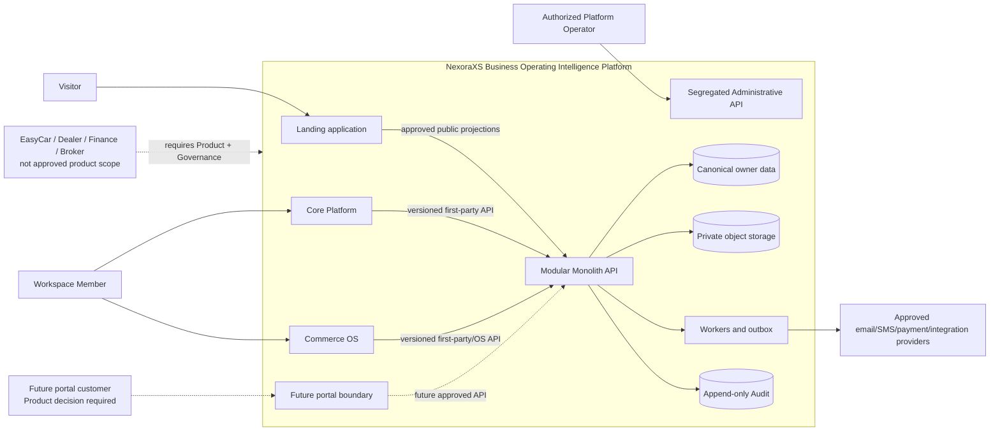

Core is the shared control/intelligence plane. Commerce owns its operational workflow and remains
usable without another OS. External providers are adapters, never canonical owners. **Evidence:**
ADR-002, ADR-024/025, Core/Commerce Freezes; S3 architecture verification.

## 5. Application and Container Architecture

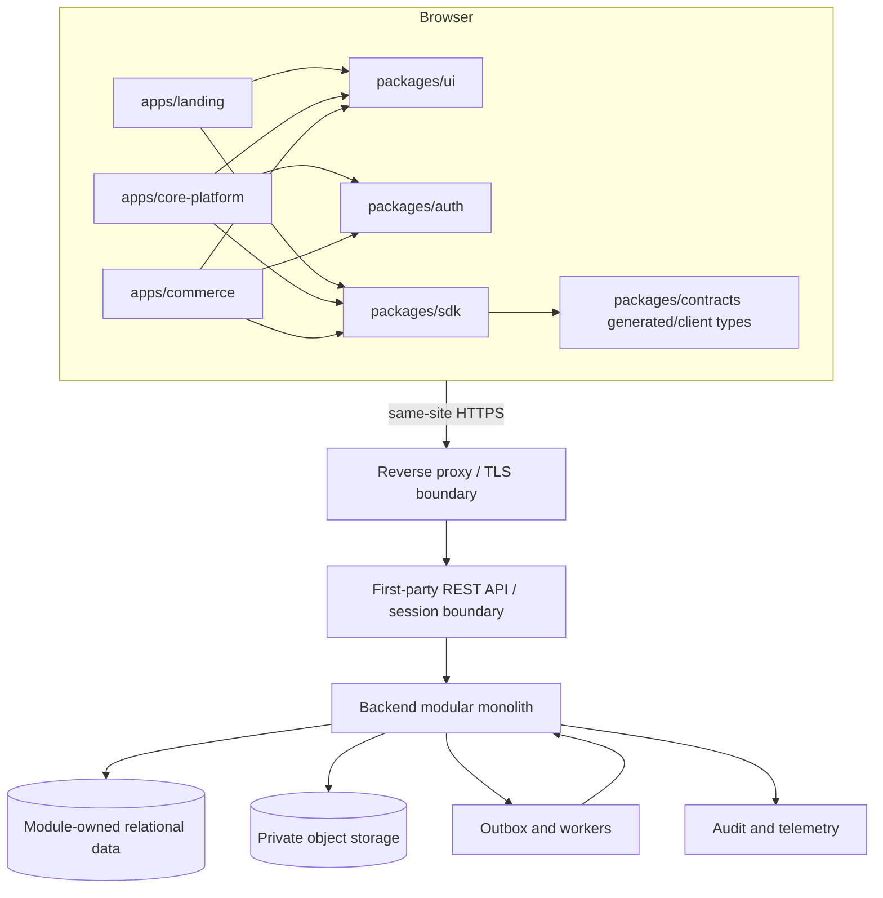

The preferred production routing is same-site HTTPS so cookies are not shared through unsafe
cross-origin workarounds. Exact host/basePath mapping remains deployment detail, but every app
uses configured URLs and secure handoffs rather than hard-coded localhost values.

## 6. Repository Architecture

### 6.1 Target directory structure

```text
apps/
  landing/                 retained marketing/discovery frontend
  core-platform/           retained Core first-party frontend
  commerce/                retained Commerce OS frontend
backend/                   conditional on approved backend technology ADR
  modules/
    core/                  Core owner modules
    commerce/              Commerce owner modules
  platform/                framework entry, HTTP, workers, persistence adapters
  tests/                   backend module/contract/integration tests
packages/
  ui/                      shared presentation primitives only
  auth/                    browser session/context helpers only
  contracts/               language-neutral schemas + generated TS views
  sdk/                     generated transport base + hand-written facades/adapters
  types/                   context-neutral/shared generated value types only
  shared/                  non-owning deterministic utilities only
tests/
  architecture/            repository dependency and ownership conformance
  contract/                mock/HTTP and producer/consumer compatibility
  integration/             environment/API/tenant/security tests
  e2e/                     critical browser journeys
scripts/                   repeatable build/check/contract/migration verification
docs/                      governed authority, feature, API, operations and evidence
.specify/                  Constitution and Spec Kit workflow
```

`backend/` is the repository location already named by `AGENTS.md` §16. Its framework-specific
subtree is not created until S4-ADR-005 is approved. Existing app directories are not renamed to
`site` or `web`; that would add migration cost without architectural benefit.

### 6.2 Directory responsibilities and dependency rules

| Directory | Responsibility/owner | Allowed dependencies/public interface | Prohibited | Migration source |
|---|---|---|---|---|
| `apps/landing` | Landing/Marketing | UI, SDK public projections, config | canonical commercial writes; app imports | current Landing |
| `apps/core-platform` | Core experiences | UI, auth, SDK, contracts | Commerce internals; browser authority | current Core app/provider |
| `apps/commerce` | Commerce experiences | UI, auth, SDK, Commerce contracts | Core/other app internals; foreign owner writes | current Commerce app/services |
| `backend/modules/core` | Core canonical owners | own domain/application/ports; published module contracts | Commerce tables/private services | new; behavior characterized from Core |
| `backend/modules/commerce` | Commerce canonical owners | own domain/application/ports; Core published contracts | Core/other OS tables/private services | current browser Commerce behavior |
| `backend/platform` | adapters/composition | approved module ports | business invariants/ownership | new after tech ADR |
| `packages/ui` | design-system presentation | public component API | SDK, storage, domain mutations | current UI and selective app primitives |
| `packages/auth` | frontend auth/session adapter | approved session API types | permission authority/credentials | new bounded package when required |
| `packages/contracts` | governed schemas/contracts | language-neutral schemas; generated views | persistence/framework models; business implementation | current legacy contracts, reclassified adapters |
| `packages/sdk` | client/facade boundary | contracts and transport | canonical state; app imports | current mock facades/runtime |
| `packages/types` | neutral values/generated types | no runtime ownership | canonical owner logic/legacy aggregate dumping | current types split by ownership |
| `packages/shared` | neutral deterministic helpers | platform-neutral utilities | catalogs, roles, plans, domain rules | current shared schema cleansed per slice |
| `tests` | cross-surface evidence | public interfaces/test fixtures | production ownership | current Vitest/Playwright estate |

### 6.3 Dependency direction

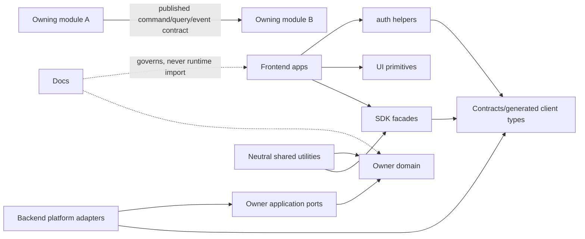

No dependency points from contracts/domain toward frameworks, frontend apps, storage adapters, or
another module's private implementation.

## 7. Backend Architecture

### 7.1 Module model

Each module has Domain, Application, Ports and Adapters. Domain contains aggregates/invariants;
Application coordinates one owner's use cases; Ports declare owned reads/commands/events;
Adapters connect HTTP, database, queue, storage and external providers. Cross-module transactions
are avoided unless a single approved owner contains the invariant; otherwise use explicit command
coordination, outbox events, idempotency and reconciliation.

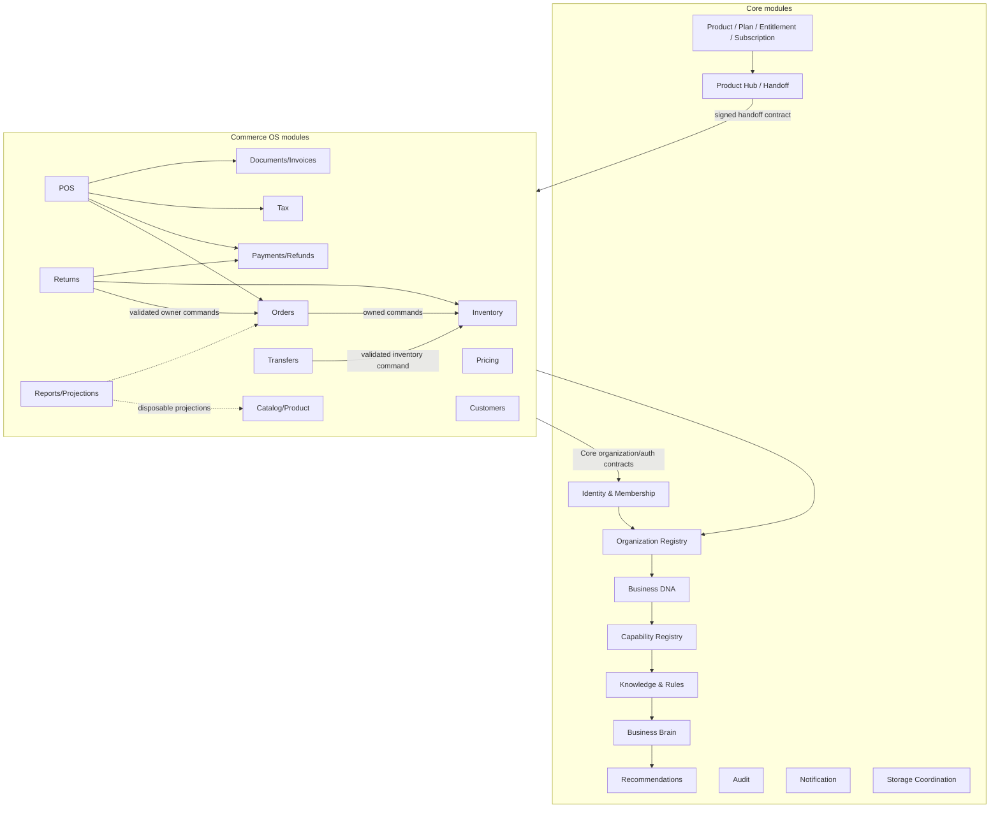

Arrows show contract use, not data ownership transfer. The graph must remain acyclic at module
source-dependency level; orchestration ports may invert dependencies.

### 7.2 Backend boundary rules

- Every command carries actor, Workspace, applicable Business/Business Unit/Department/Branch,
  OS, resource, action, contract version, correlation and idempotency context as applicable.
- A module writes only its own tables/aggregates and publishes facts after commit.
- Framework ORM models are persistence adapters, never public DTOs.
- Product Hub and reports use projections; projection loss is recoverable.
- Audit failure behavior is specified per critical command before release.
- Business Brain records version references for deterministic reproduction.

## 8. Frontend Architecture

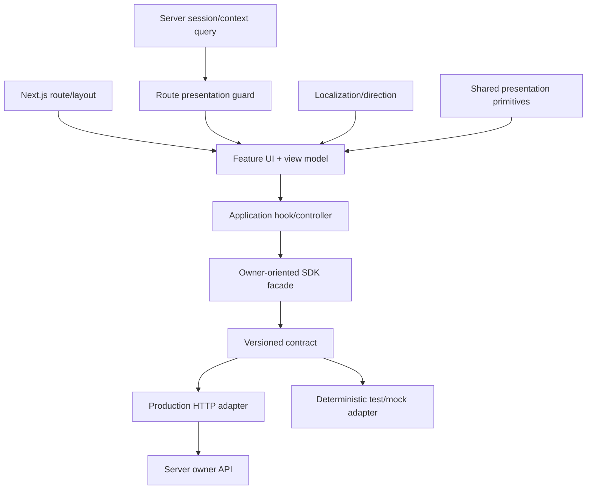

### 8.1 Retained patterns

- separate application route trees and no app-to-app imports;
- feature folders and owner-oriented application services;
- injectable repository/facade ports and deterministic mock adapters;
- React Query only outside the application/domain layer;
- static architecture tests and explicit composition roots.

### 8.2 Changed patterns

- production state and authentication move from local/session storage to server APIs/sessions;
- Core-to-Commerce navigation uses S4-ADR-035, not shared keys/query identifiers;
- route guards provide presentation/recovery only; server policies make final decisions;
- hard-coded plans/presets and owner records are replaced by authorized projections;
- all loading, empty, error, unauthorized, expired-handoff and degraded states are contract-driven.

## 9. Domain Architecture

### 9.1 Authoritative baseline and product phase

“MVP” below means the **currently confirmed Core + Commerce production slice**, not an EasyCar
MVP. EasyCar phase labels cannot be assigned until S4-ADR-039 is approved.

| Entity/concept | Purpose and owner | Tenant scope/source of truth | Lifecycle/relationships | Target status and migration implication |
|---|---|---|---|---|
| User | Core identity for a person | global identity; Core Identity | memberships/sessions | Baseline/MVP; replace browser User/password authority |
| Tenant | semantic tenant boundary | exactly Workspace; no separate table/type | not a typed industry tenant | Baseline; map all `tenant_id` language to `workspace_id` contractually |
| Workspace | customer boundary; Core Workspace Management | canonical Workspace record | has Businesses, memberships, commercial state | Baseline/MVP; current record needs server persistence |
| Membership | User↔Workspace relationship; Core Identity | Workspace-scoped canonical record | status plus scoped role assignments | Baseline/MVP; migrate `WorkspaceMember` semantics only after mapping |
| Role | groups Permissions; Core/OS owner by concern | assignment has Workspace and optional narrower scope | versioned definition/assignment lifecycle | Baseline; names/product content unresolved |
| Permission | owner-defined action capability | owner catalog; evaluated in context | immutable/versioned keys preferred | Baseline; UI constants are not source |
| Business | legal/operational organization; Core Registry | belongs one Workspace | owns one Business DNA; has Business Units | Baseline/MVP; new canonical identity and high-risk mapping |
| Business Unit | operating division; Core Registry identity | belongs one Business | OS operational anchor; has Departments/Branches | Baseline/MVP; legacy BU requires compatibility mapping |
| Department | organization identity; Core Registry | belongs one Business Unit | distinct from Branch | Baseline; absent today |
| Branch | location identity; Core Registry | belongs one Business Unit | referenced by OS facts | Baseline/MVP; parent backfill required |
| Product/OS Product | commercial product definition; Core Catalog | global/shared catalog | offers Plans/subscriptions | Baseline/MVP |
| Plan | versioned commercial offer; Core Catalog | global/product-scoped | Starter/Pro/Business/Enterprise where applicable | Baseline; mock values replaced only after Product decision |
| Workspace Entitlement | Workspace product eligibility; Core Commercial | Workspace-scoped | distinct from subscription/access | Baseline/MVP; missing today |
| Subscription | Workspace commercial OS state; Core Commercial | Workspace-scoped | does not imply setup/access | Baseline/MVP; legacy subscription mapping |
| Feature | no generic business owner; use Capability or product/module definition | applicable owner | distinct from rollout flag | Avoid ambiguous aggregate |
| Feature Flag | operational rollout configuration; Platform Configuration | environment + optional tenant/cohort scope | owner/default/expiry/removal | Production foundation; new registry |
| Usage Limit | versioned entitlement rule + metered usage | Workspace/product/period scope | values Product-owned | Product Decision; no mock-value migration |
| Business DNA | one Business identity/context; Core | Business-scoped canonical versions | versioned/provenanced/reviewed | Earliest post-org/security intelligence slice |
| Capability | platform-owned need/outcome definition | shared immutable/versioned registry | implemented by OS modules | Business Brain foundation |
| Knowledge/Rule | versioned immutable decision inputs; Core | shared/authorized applicability | published versions never mutated | Business Brain foundation |
| Brain Decision | deterministic result; Business Brain | Business/context scoped | references exact input versions | Business Brain MVP after foundation |
| Recommendation | explainable optional advice; Recommendation owner | Business/context scoped | downstream of Decision; never executes | Later in Brain slice |
| Audit Log / AuditRecord | append-only consequential-action evidence; Core Audit | always resolves Workspace when tenant-related | actor/context/outcome/correlation | Production foundation; no synthetic history claimed |
| Notification | delivery coordination/status; Core Notification | Workspace/recipient scoped | source event, preference, attempts | Production foundation/later channel adapters |
| Marketing Page | public presentation; Landing/Product | global/public or approved targeting | consumes projections; no canonical operations | Retained current scope |
| Commerce Product | item identity/classification; Commerce Catalog | Workspace + Business Unit; Branch only if owner rule requires | separate from price/stock | Commerce MVP; split current combined record |
| Inventory Item/Position | stock position/movement; Commerce Inventory | Workspace + Business Unit + Branch | product reference; owner-controlled movement | Commerce MVP; separate from Product |
| Order | commercial order fact; Commerce Orders | Workspace + BU + Branch | separate payment/tax/document facts | Commerce MVP; normalize combined snapshots |
| POS Transaction | checkout orchestration fact; Commerce POS | Workspace + BU + Branch | coordinates owner commands | Commerce MVP; absent today |
| Payment/Refund | monetary facts; Commerce Payments | Workspace + organization/resource scope | references Order/POS/Return | Commerce MVP; absent aggregate |
| Invoice/Document | issued document fact; Commerce Documents | Workspace + BU + Branch | references owner snapshots/version | Commerce MVP; stop foreign direct writes |
| Return | return intent/lifecycle; Commerce Returns | Workspace + BU + Branch | coordinates owner effects | Commerce MVP; normalize effects |
| Transfer | transfer intent/lifecycle; Commerce Transfers | Workspace + BU + branches | Inventory owns stock effects | Commerce MVP; normalize effects |
| Car | prompt-supplied candidate | owner/scope/source unknown | relationships unknown | Product Decision; no target entity yet |
| Application | prompt-supplied EasyCar candidate | owner/scope/source unknown | state machine unresolved | Product Decision; blocked |
| Application Offer | candidate financial offer | owner and relation to Finance tenant unknown | lifecycle unknown | Product Decision; blocked |
| Application Document | candidate business document metadata | owner/access/retention unknown | object via Storage Coordination if approved | Product/Security decision; blocked |
| Portal Link/Session | candidate customer access evidence | identity/tenant/resource scope unknown | expiry/revocation/OTP unresolved | Product/Security decision; blocked |
| Insurance Record | candidate insurance workflow fact | owner/integration unknown | relation to Application unresolved | Product Decision; blocked |
| Vehicle Change Request | candidate request/workflow | owner/invariants unknown | relation to Car/Application unknown | Product Decision; blocked |
| Reservation | candidate commerce/vehicle intent | owner unknown; must not collide with Commerce Order | lifecycle unknown | Product Decision; blocked |
| Deposit | candidate monetary fact | payment owner/regulatory semantics unknown | relation to reservation/application unknown | Product/Finance decision; blocked |
| Bank Submission | future candidate integration | owner/external contract unknown | lifecycle unknown | Deferred until Product approval |

### 9.2 Domain relationship diagram

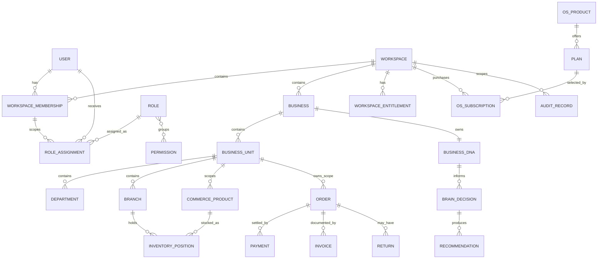

EasyCar candidate entities are intentionally absent from the ER diagram because their ownership
and relationships are Product decisions, not target facts.

## 10. Multi-Tenancy Architecture

### 10.1 Tenant model

- `Workspace` is the customer and tenant identifier; `Tenant` is not a parallel aggregate.
- A User may belong to multiple Workspaces through independent Workspace Memberships.
- Dealer, Finance and Broker cannot become Workspace subtypes. If approved, they are product/domain
  classifications or roles whose exact owner and semantics Product defines.
- Global records are limited to explicitly shared catalog/governance assets (for example OS
  Products, Plan definitions, published Capabilities/Knowledge). Applicability and customer state
  remain scoped.
- Cross-Workspace access is denied by default. Platform administration uses a segregated service
  or operator role, explicit reason/approval where required, and append-only Audit; it is never an
  unscoped “super-admin bypass.”

### 10.2 Tenant resolution and isolation flow

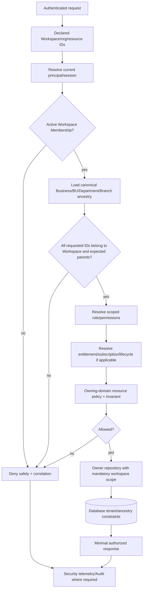

### 10.3 Controls by layer

| Layer | Mandatory control | Not sufficient alone |
|---|---|---|
| Database | non-null `workspace_id` on tenant-owned rows; FKs/composite ancestry constraints; unique indexes include scope; restricted credentials; optional RLS only after DB spike | ORM global scope |
| ORM/model | immutable resolved scope on loads/writes; no mass assignment of authority fields | client DTO IDs |
| Repository/service | workspace and applicable resource context required in every owner operation | filtering after unscoped fetch |
| Policy | membership, scoped permission, ancestry, lifecycle, ownership and workflow guards | role name only |
| Middleware | authenticate; parse/resolve coarse context; correlation/rate limits | final resource authorization |
| API | canonical owner endpoints, minimal fields, stable denial semantics, idempotency | frontend route guard |
| Frontend | current context visible; unauthorized/expired recovery; never infer access | hidden buttons |
| Queue/cache | every job/key/event carries verified Workspace scope; consumer revalidates; keys partitioned; invalidation explicit | producer claims |
| Files | opaque object IDs; metadata and authorization resolve Workspace; paths not trusted from client | unguessable URL |
| Audit/telemetry | Workspace/correlation included; sensitive data minimized; access protected | raw payload logs |
| Tests | two-Workspace negative matrix for reads/writes/jobs/cache/files/search/handoff | one happy-path tenant |

## 11. Authentication and Authorization

### 11.1 Target request and authentication flow

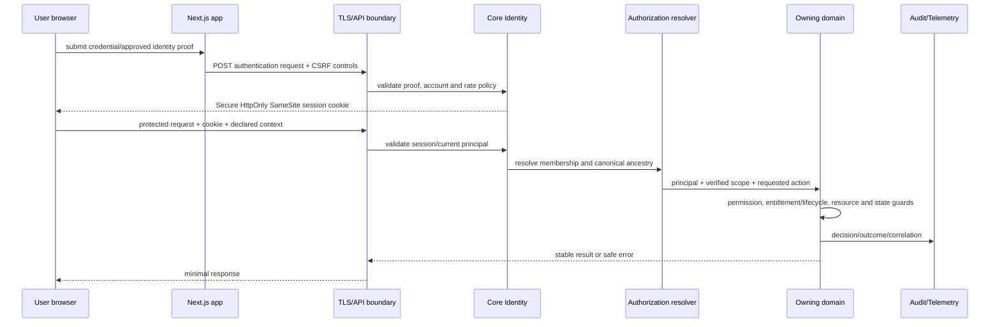

The exact identity provider, password policy, session lifetime, OTP and recovery implementation
remain technology/product decisions. Required behavior is server authority, revocation, secure
recovery, session expiry, CSRF protection, rate/abuse controls and reauthorization after context
switch/handoff. Customer portal authentication is separately blocked by S4-ADR-040.

| Authentication channel | Target rule | Decision boundary |
|---|---|---|
| Employee/member web | server-managed revocable browser session; no token/credential in localStorage | provider and exact lifetime need technical approval |
| Password reset/recovery | one-use, purpose-bound, expiring proof; enumeration-safe request; session revocation after sensitive change | delivery channel/lifetime are Security implementation decisions |
| Service/API identity | narrow service identity or scoped API credential; rotation/revocation; never a User-role shortcut | public/partner API issuance is future scope |
| Optional OTP/step-up | required only by approved risk/product policy; cannot be inferred from a role label | Product/Security decision |
| Portal customer | separate purpose/resource-bound portal identity/session | S4-ADR-040 blocks selection |
| Cross-app handoff | opaque, audience-bound, one-use or short-lived exchange; target reauthorizes | S4-ADR-035 |

### 11.2 Authorization dimensions

Authorization is the intersection of:

```text
authenticated principal
AND active Workspace Membership/service relationship
AND verified organization/resource ancestry
AND scoped role/Permission
AND applicable entitlement/subscription/lifecycle
AND workflow-state guard
AND owning-domain invariant
```

Any missing term denies the action. Ownership (for example, creator/customer relationship) is a
policy input, not a substitute for membership or permission.

### 11.3 Role/action matrix

Role labels below are **archetypes**, not approved canonical role names. `P` means an explicit
permission at the shown scope is required; `C` means additional context/state/ownership guards;
`—` is denied. Viewer and delegated approver availability require S4-ADR-042.

| Action | Platform operator | Workspace admin archetype | Business/OS manager archetype | Operational member | Viewer candidate | Portal customer candidate |
|---|---:|---:|---:|---:|---:|---:|
| View own Workspace context | P+C | P+C | P+C | P+C | P+C | — |
| Manage Workspace membership | segregated P+C | P+C | — | — | — | — |
| Manage Business/BU identities | segregated P+C | P+C | P+C | — | — | — |
| Manage Product/Plan catalog | segregated P+C | — | — | — | — | — |
| Subscribe/configure OS commercial state | segregated P+C | P+C | — | — | — | — |
| Launch Commerce | support-only P+C | P+C | P+C | P+C | P+C | — |
| Read Commerce operational data | support-only P+C | P+C | P+C | P+C | P+C | — |
| Create/update Commerce records | support-only P+C | P+C | P+C | P+C | — | — |
| Approve/delegate application candidate | unresolved | unresolved | unresolved | unresolved | — | unresolved |
| Access own portal candidate | — | — | — | — | — | Product/Security decision |
| View Audit | segregated P+C | P+C | limited P+C | — | — | — |
| Break-glass cross-tenant support | explicit approval + Audit | — | — | — | — | — |

Frontend guards mirror the server result for UX but never create access.

## 12. Workflow Architecture

### 12.1 Confirmed target pattern

Any approved workflow is owned by one domain and implemented as an explicit state machine with:
versioned states; allowed transitions; actor/permission/resource guards; optimistic concurrency;
idempotent commands; immutable transition/Audit evidence; transactional outbox side effects; safe
unknown-state handling; and a separately approved compatibility map.

### 12.2 EasyCar candidate workflow status

Stages 2–3 found no authoritative definition for `waiting`, `need_docs`, `approved`, `insured`,
`no_insurance`, `archived`, `rejected` or `reject`. Therefore no authoritative transition list can
be produced without making a business decision. The only safe target behavior is to reject unknown
transitions and block persistence/API work until S4-ADR-019/041/042 are approved.

| Candidate term | Current status | Unresolved questions |
|---|---|---|
| `waiting` | Product Decision Required | waiting for whose action/evidence; entry conditions |
| `need_docs` | Product Decision Required | repeatability, requested document set, return transition |
| `approved` | Product Decision Required | final/conditional; delegation/manager guard |
| `insured` | Product Decision Required | application status or Insurance sub-workflow result |
| `no_insurance` | Product Decision Required | waiver, ineligible, optional, declined or terminal meaning |
| `archived` | Product Decision Required | lifecycle state versus orthogonal archive marker; reopen policy |
| `rejected` / `reject` | Product Decision Required | canonical spelling, terminality, appeal/reopen policy |

Actors, side effects, notification recipients, approval delegation, plan/tenant variation and
backward mappings are likewise unresolved. No transition is currently “valid” or “invalid” in an
authoritative model because the model does not exist.

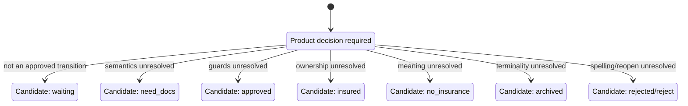

This diagram is a decision map, not a state machine specification.

## 13. API and Contract Architecture

### 13.1 Target API surfaces

| Surface | Consumers | Target behavior |
|---|---|---|
| Core Module Contract | co-deployed Core modules | typed commands/queries/domain events; no table access |
| First-Party Experience API | Landing/Core frontends | task/resource APIs for owned Core capabilities |
| OS Integration API | Commerce and future approved OSs | identity/context/org/commercial/handoff/readiness contracts |
| Commerce First-Party API | Commerce frontend | Commerce-owner resources/commands |
| Administrative API | segregated operators | stronger auth, narrow operations, mandatory Audit |
| Public/Partner API | future approved consumers | absent until separately scoped; same owner/version rules |
| Event/Webhook API | workers/integrations | minimized versioned facts, signed delivery when external |
| AI Tool API | future AI Coordinator | narrow authorized tools; no direct execution authority |

### 13.2 Proposed wire standard

- REST/JSON under an explicit major version (exact path/header syntax approved with S4-ADR-014).
- OpenAPI 3.1 is the wire source; domain contracts remain technology-independent.
- Successful single-resource/command responses use a documented `data` member; collections use
  `data` plus `meta` and pagination links/cursors. Empty commands use the appropriate HTTP status
  without an invented payload. Errors use one problem-style envelope and never mix success data.
- Request DTOs never accept authority fields as proof; server resolves ancestry and actor.
- Validation errors use stable codes and field pointers; general errors include a correlation ID
  and safe message, never stack traces/secrets.
- Cursor pagination is preferred for changing large collections; bounded offset pagination is
  acceptable only where stable and documented.
- Filtering/sorting fields are allow-listed and bounded; unbounded export is a separate operation.
- Create/repeatable commands accept a tenant+actor+operation-scoped idempotency key.
- Concurrency-sensitive changes use version/ETag or expected revision.
- File upload is a two-step authorized operation: create intent, upload to private object target,
  confirm/scan/attach through owner.
- Webhooks are future scope; if approved they are signed, versioned, replay-safe and revocable.

### 13.3 Existing API disposition

There are no production APIs to retain. Current `packages/contracts` and `packages/sdk` shapes are
frontend-internal compatibility contracts: retain behind facades, wrap with target DTO mappers,
version production contracts separately, and deprecate legacy exports only after all consumers
move. SDK production mode fails closed if HTTP is unavailable.

## 14. Data Architecture

- Canonical write tables are module-owned; database placement never grants another module write
  access.
- Cross-owner references use stable IDs plus application contracts; enforced foreign keys are
  allowed only when they preserve ownership and migration independence.
- Read models for Product Hub, reports, search and dashboards are reconstructable and disposable.
- Published DNA snapshots, Capabilities, Knowledge, Rules and other frozen immutable assets create
  new versions rather than in-place updates.
- Every tenant-owned row has `workspace_id`; applicable Business/BU/Department/Branch IDs are
  validated by ancestry and constrained.
- Soft deletion is not universal. Each owner defines archive/delete/retention semantics; Audit is
  append-only and retained under approved policy.
- Database migrations use expand/backfill/validate/switch/contract phases where compatibility is
  required; destructive contraction follows backup and rollback-window closure.
- No browser mock record is automatically imported as customer truth. Demonstration fixtures may
  be regenerated; any real pilot data needs explicit provenance/consent/validation.

## 15. Storage and File Architecture

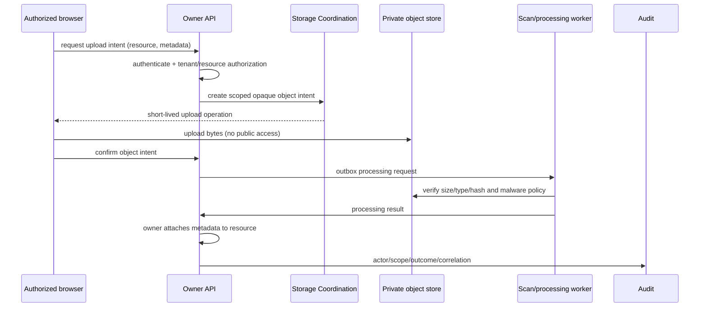

Object keys are opaque and tenant-partitioned internally; clients never choose canonical paths.
Downloads repeat current authorization and return a short-lived response/stream. Quotas, versioning,
retention, deletion, residency, encryption and recovery require S4-ADR-020/027/032 approvals.

## 16. Queue and Background Processing

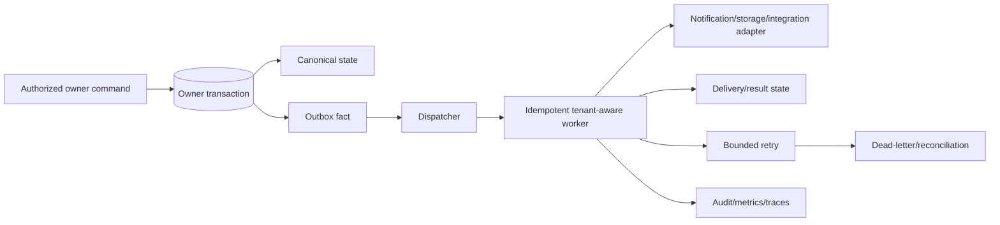

No global ordering is assumed. Ordering is declared only per approved aggregate/stream. Jobs carry
minimal identifiers and reauthorize/reload current state when execution could be consequential.
Retries never bypass current permission/owner policy. Queue product, retention, retry schedule and
DLQ operations remain a technical spike.

## 17. Audit and Observability

### 17.1 Audit flow

1. API boundary assigns/accepts a safe correlation identifier.
2. Identity and authorization decisions resolve actor and verified scope.
3. Owner validates and commits or rejects the command.
4. Required AuditRecord captures action, resource, policy outcome, result and version references.
5. Outbox/worker side effects retain the correlation and record attempt/outcome.
6. Operators can search authorized Audit projections; no one mutates Audit history.

Audit and telemetry are separate. Logs/metrics/traces diagnose; Audit proves consequential history.
Both minimize data and protect tenant access. Health endpoints reveal dependency state without
secrets. SLI/SLO/retention/sampling and tools remain technical/operational decisions.

## 18. Infrastructure and Deployment

### 18.1 Proposed initial topology

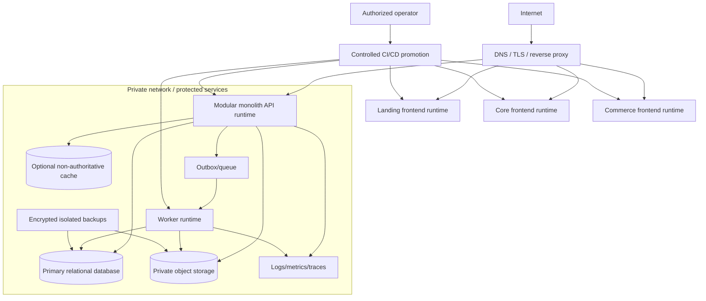

The diagram is product-neutral. VPS-equivalent infrastructure is acceptable only with isolated
environments, least-privilege identities, secret management, TLS, protected private services,
backup/restore evidence, health/telemetry, controlled promotion and rollback. Multi-region,
orchestration, replicas and service extraction remain deferred until risk/scale evidence exists.

### 18.2 Environment model

- isolated local/test/staging/production configuration and credentials;
- no production secrets in repository/build artifacts/browser bundles;
- immutable build artifact promoted between environments where feasible;
- database/file/queue compatibility checked before deploy;
- migrations run under a dedicated least-privilege role and recorded release plan;
- safe degraded behavior when optional integrations fail.

## 19. Security Architecture

| Threat/control area | Target control |
|---|---|
| Credential theft | server-side password/identity proof, secure cookie, rate/abuse controls, revocation, protected recovery |
| Tenant ID tampering | IDs treated as inputs; membership/ancestry/owner policy resolves truth |
| IDOR | owner policy checks tenant, resource, action and relationship on every operation |
| CSRF/XSS/session theft | SameSite/HttpOnly/Secure cookies, CSRF defenses, CSP/output escaping, session rotation |
| Privilege escalation | versioned scoped permissions, no implicit inheritance, audited admin/break-glass |
| File abuse | private objects, size/type/hash validation, scan/quarantine, authorized download |
| Replay/duplicate commands | idempotency, expiry/audience for handoff, expected revisions |
| Data leakage in telemetry | structured allow-listed fields, redaction, tenant-safe access and retention |
| Supply chain/secrets | locked dependencies, scanning, secret manager, least privilege, reproducible CI |
| Cross-domain mutation | enforced module graph, owner ports, database privileges/tests |
| Recovery bypass | restore into isolated validation, integrity/tenant checks before writes resume |

Privacy classification, retention, legal basis, incident process and regulatory obligations require
Product/Legal/Operations decisions before production data is collected.

## 20. Testing Architecture

| Layer | Required evidence |
|---|---|
| Domain unit | invariants, transitions, deterministic rules, versions, denials |
| Architecture | import/module graph, no foreign table/write, no cycles, package exports |
| Contract | OpenAPI/schema conformance, provider/consumer, error/idempotency compatibility |
| Integration | persistence, transaction/outbox, tenancy, authorization, files, Audit, workers |
| E2E | critical Landing/Core/Commerce journeys, handoff/recovery, failure and rollback modes |
| Security | OWASP-style auth/IDOR/CSRF/rate/file/secret/tenant negative tests |
| Localization/a11y | Arabic/English, RTL/LTR, keyboard, focus, semantics and assistive checks |
| Migration | source counts, mappings, quarantines, dual-read comparison, rollback rehearsal |
| Operations | build/deploy/health/telemetry/backup/restore/failover/degraded-mode rehearsal |

Current Vitest/Playwright/static tests are retained. Coverage thresholds and tools are approved with
CI policy; no percentage can waive a required risk scenario.

## 21. Documentation Architecture

### 21.1 Authority and locations

- Frozen architecture stays under `docs/99-architecture-freeze/`.
- Accepted/Proposed ADRs and glossary stay under `docs/00-governance/` with explicit status.
- Product requirements belong in approved product/feature sources; no prompt becomes authority.
- Feature specifications/plans/tasks stay under `specs/<id>/` and trace requirements to code/tests.
- OpenAPI and event schemas live with `packages/contracts` as the generated/public contract source;
  rendered API docs are generated and marked Generated.
- Operations/runbooks/release evidence live under governed docs paths selected before Wave 1 and
  name owner/review date/environment.
- Historical artifacts remain intact; a status index links them to successors.

### 21.2 Traceability chain

```text
Product requirement / Accepted ADR
  -> approved feature specification
  -> plan and contract/migration design
  -> dependency-ordered tasks
  -> implementation and tests
  -> deployment/runbook/release evidence
  -> requirement and decision verification
```

Every behavior-changing change updates affected artifacts in the same change set.

## 22. Deferred Architecture Areas

| Area | Why deferred/blocked | Earliest resolution point |
|---|---|---|
| `OSEnablement` successor | ADR-023 explicit unresolved decision | Wave 0 Governance decision before commercial lifecycle schema |
| backend/database products | architecture register defers named products | Wave 0 technical ADRs/spikes |
| object storage/queue/recovery products | logical behavior fixed, product/operations absent | Wave 0–1 spikes before dependent production slice |
| exact auth provider/session lifetime/OTP | product/security mechanism deferred | employee auth ADR in Wave 0; portal separately Product decision |
| EasyCar/domain tenant types | no product authority | Product discovery/Governance before roadmap entry |
| application/insurance workflow | no state semantics or owner | Product decision before schema/API/UI spec |
| plan limits/branding/billing provider | business/financial policy absent | Product/Finance decision before enforcement |
| Marketplace/AI/global runtime | later architecture, no current authorization | separate future product features |
| microservice extraction/multi-region | no measured need | post-production evidence and ADR |

## 23. Target Architecture Verdict

The safest target is a retained frontend monorepo over an enforced modular-monolith backend, with
Workspace tenancy, canonical organization identities, owner-enforced security, versioned REST/API
contracts, private storage, transactional asynchronous effects, append-only Audit and observable
deployment. It preserves current UI value and mock contract tests while eliminating browser state
as production authority one owner slice at a time.

The logical direction is high-confidence because it follows the Freeze and Accepted ADRs. Physical
technology selection is conditionally clear, not approved. EasyCar-specific entities and workflow
remain outside the target baseline until nine Product decision clusters close. Business DNA and a
deterministic Business Brain can begin at the earliest architecturally safe point after canonical
Business identity, authorization, versioning and Audit foundations; Marketplace and AI need not
block that value.
