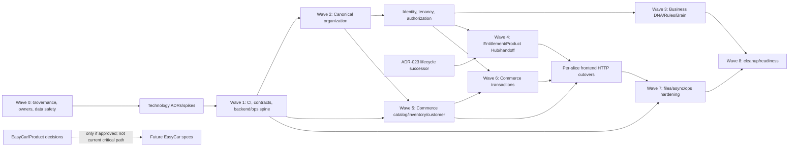

# Migration Plan


> **Execution Scope Decision — 2026-07-18**
> EasyCar is a separate standalone application and is excluded from the current NexoraXS Core + Commerce execution plan.
> No EasyCar feature, dependency, milestone, sprint, backlog item, release gate, or implementation task is authorized by this document set.
> EasyCar will have its own repository/application architecture, audit, roadmap, specifications, backlog, and release plan.

## 1. Executive Summary

The migration uses nine controlled waves (Wave 0 through Wave 8). It preserves current frontend
routes and owner-oriented facades, introduces production authority through vertical slices, and
keeps deterministic mocks as test adapters until each real client passes parity and rollback
gates. No big-bang data import, UI rewrite, or microservice split is planned.

Execution is currently **Not Ready**. Wave 0 must close five technology spikes, establish data and
operator ownership, and route nine Product decision clusters. The `OSEnablement` successor remains
an explicit hard blocker for the affected commercial/operational lifecycle boundary. EasyCar
workflow/domain work is not on the migration path until Product authorization exists.

**Evidence:** S3 GAP-001–006, dependency risks DR-01–12 and readiness §14; Engineering Roadmap
§§3–15; S4-ADR-001–047; `06-TARGET-ARCHITECTURE.md`.

## 2. Migration Objectives

1. Preserve working Landing/Core/Commerce behavior while replacing browser authority.
2. Establish canonical Workspace → Business → Business Unit → Department/Branch identity safely.
3. Enforce server authentication, tenant/resource authorization and append-only Audit before
   production writes.
4. Introduce stable owner contracts and a production SDK without route-component rewrites.
5. Correct Commerce ownership without losing current UI projections.
6. Deliver Business DNA and deterministic Business Brain at the earliest safe post-organization
   foundation point.
7. Separate product/business decisions from technical migration work.
8. Make every cutover measurable, reversible and supported by backup/reconciliation evidence.
9. Reach a production feature-readiness gate without permanent compatibility debt.

## 3. Migration Principles

- **Expand → backfill → validate → switch → contract.** Destructive contraction is last.
- **One owner slice at a time.** Data/API/UI/Audit/observability migrate together.
- **No silent fallback.** Production HTTP failure is visible; it never writes browser storage.
- **Read compatibility before write compatibility.** Dual-write is exceptional because it creates
  two authorities.
- **Fail closed at unresolved boundaries.** Unknown status, role, limit or tenant type is
  quarantined/rejected, not guessed.
- **Mocks remain tests, not recovery storage.** Rollback returns traffic/API version, not customer
  state to localStorage.
- **Backup is not rollback until restored.** Every high-risk migration rehearses recovery.
- **Feature flags control rollout only.** They do not replace entitlement/permission/lifecycle.
- **Evidence closes waves.** Calendar time or checkbox count does not.

## 4. Current-to-Target Summary

| Area | Current State | Target State | Migration Type | Risk | Priority |
|---|---|---|---|---|---|
| Product terminology | Landing identity drift | canonical “Business Operating Intelligence Platform” | Documentation Change / UI Migration | Low | Medium |
| Frontend apps | separate working Next.js apps | retained apps over governed APIs | No Change / UI Migration | Medium | High |
| Backend | absent | enforced modular monolith | Full Replacement (new boundary) | Critical | Critical |
| Persistence | browser local/session storage | module-owned durable relational state | Data Migration / Full Replacement | Critical | Critical |
| Tenant/org | legacy Workspace→BU→Branch | Workspace→Business→BU→Department/Branch | Data Migration / Compatibility Layer | Critical | Critical |
| Authentication | browser passwords/session | secure server session/recovery | Security Hardening / Full Replacement | Critical | Critical |
| Authorization | client scopes/UI matrix | server owner policies and scoped RBAC/ABAC constraints | Security Hardening | Critical | Critical |
| Commercial lifecycle | Subscription + `OSEnablement` collapse | separated entitlement/subscription/setup/readiness/access | Data Migration / Deprecation | Critical | Critical; blocked ADR-023 |
| Contracts | frontend-internal TS compatibility | versioned OpenAPI/wire and module contracts | API Migration | High | Critical |
| SDK | mock only; HTTP unavailable | generated transport + retained facades + mock adapters | Compatibility Layer / API Migration | High | High |
| Product Hub handoff | client IDs/browser storage | opaque short-lived exchange + reauthorization | Security Hardening / API Migration | Critical | Critical |
| Commerce Product | includes price/cost/stock | separate Catalog/Pricing/Inventory owners | Data Migration / API Migration | High | High |
| Commerce transactions | owner facts collapsed/cross-written | owner commands, outbox and failure semantics | Refactor / Data/API Migration | Critical | High |
| Business DNA/Brain | absent | canonical versioned deterministic modules | Full Replacement (new capability) | High | High |
| Files | data URLs/browser storage | private object storage + owner metadata | Storage/Data Migration | High | High |
| Notifications/queue | toasts only/no async | source facts + outbox + tenant-aware delivery | Infrastructure Migration | High | High |
| Audit/observability | absent | append-only Audit + correlated telemetry | Security/Infrastructure Migration | Critical | Critical |
| CI/deployment/recovery | absent | gated promotion, backups, restore/rollback evidence | Infrastructure Migration | Critical | Critical |
| EasyCar workflow/domain | undocumented/unimplemented | no target until Product decision | Deferred/Product Decision | Critical if guessed | Frozen |

## 5. Preconditions

Before any migration implementation specification is approved:

1. Stage 4 reports receive Architecture/Governance disposition; they are not self-approving.
2. S4-ADR-005/006 select backend and database or explicitly approve a bounded spike environment.
3. Exact owners exist for Architecture, Product, Core Identity/Organization/Commercial, Commerce,
   Security, Data, Operations, QA, SDK/contracts and Documentation.
4. Any pilot/customer/browser data is classified by provenance, sensitivity and recoverability;
   absence of customer data is confirmed rather than assumed.
5. Current storage keys, routes, DTOs, UI journeys and test baselines are frozen as compatibility
   evidence.
6. A protected CI environment can run current lint/type/unit/architecture/build tests.
7. Data backup/restore and release rollback formats are selected before the first durable write.
8. ADR-023 remains blocked; no lifecycle schema includes inferred `OSEnablement` semantics.
9. EasyCar/product-decision work is excluded unless its Product decision closes.
10. Every wave receives its own future Spec Kit artifacts; Stage 4 creates none.

## 6. Migration Dependency Graph



Hard dependencies use solid arrows. Product decisions for EasyCar are external to the confirmed
Core+Commerce migration path. Wave 3 can run in parallel with later Commerce design once Wave 2
identity/organization security is stable.

## 7. Migration Waves

### Wave 0 — Governance, Product Boundaries, and Safety Preparation

- **Objective:** make migration decisions executable without changing runtime.
- **Scope:** approve/reject Stage 4 directions; run backend/database/storage/queue/recovery spikes;
  assign owners; classify data; freeze compatibility inventory; route Product decisions; establish
  ADR-023 stop boundary.
- **Excluded:** source/schema/API/route changes, data backfills, EasyCar feature design.
- **Prerequisites/dependencies:** completed Stages 1–4; Governance availability.
- **Migration activities:** technology evaluation evidence; threat/data classification; route/key/
  DTO inventory; operator and approval matrix; product-decision log; draft recovery objectives.
- **Compatibility measures:** none introduced; current browser behavior is only characterized.
- **Entry criteria:** reports 00–09 available and unchanged inputs verified.
- **Validation/exit criteria:** required ADR dispositions recorded; owners named; data provenance
  known; spike outcomes and exit criteria approved; all blocked decisions have IDs/deadlines.
- **Tests/evidence:** reproducible current test/build baseline; backup of any material pilot data;
  architecture/documentation review minutes.
- **Deployment impact:** none.
- **Rollback/abort:** withdraw proposal/spike; no runtime rollback. Abort if Governance cannot
  approve a technology or data owner.
- **Risks:** false approval through this report; undocumented real data; pressure to infer Product
  scope.
- **Blocked downstream work:** all durable backend/auth/schema work; all EasyCar work.

### Wave 1 — Delivery, Contract, and Runtime Spine

- **Objective:** establish an empty but operable modular runtime and contract pipeline.
- **Scope:** approved backend skeleton; module dependency enforcement; OpenAPI/contract registry;
  HTTP SDK base; CI gates; environment configuration/secrets; health/correlation; migration runner;
  Audit/outbox interfaces and test harnesses.
- **Excluded:** canonical customer data, broad endpoint catalog, Commerce rewrite, Product decisions.
- **Prerequisites/dependencies:** Wave 0 technology approvals and owners.
- **Migration activities:** define modules/public ports; create version policy/error envelope;
  generate client test; establish staging database/object/queue isolation; baseline release manifest.
- **Compatibility measures:** COMP-001 mock/HTTP facade selector; COMP-002 legacy contract namespace.
- **Entry criteria:** approved S4-ADR-005/006/014/029 disposition; CI environment and secret owner.
- **Validation/exit criteria:** clean build/deploy; no module cycles/foreign writes; generated client
  parity sample; health/telemetry/Audit/outbox scaffolds testable; empty migration rollback works.
- **Tests/evidence:** architecture, contract generation, config/secret, deployment smoke, migration
  up/down rehearsal and restore smoke.
- **Deployment impact:** non-customer staging runtime only.
- **Rollback/abort:** redeploy last empty artifact; drop only isolated staging resources from
  approved backup/template. Abort on module-boundary or secret-isolation failure.
- **Risks:** framework shape becoming contract; premature infrastructure complexity.
- **Blocked downstream work:** production data and API traffic until gate QG-01–04 pass.

### Wave 2 — Canonical Identity, Organization, Tenancy, and Authorization Slice

- **Objective:** establish the trusted tenant/security foundation and cut one Core journey end to
  end.
- **Scope:** User/session/recovery; Workspace Membership; Workspace/Business/Business Unit/
  Department/Branch identities; scoped roles/permissions; owner policies; tenant constraints;
  append-only Audit; Core SDK/API/UI context migration.
- **Excluded:** `OSEnablement` successor, EasyCar tenant types/workflow, OS commercial access.
- **Prerequisites/dependencies:** Wave 1; S4-ADR-010–013 approved; data mapping owner.
- **Migration activities:** expand canonical organization tables/contracts; map legacy BU records;
  quarantine ambiguous parents; introduce server sessions; migrate one Core context flow; enforce
  deny-by-default policies.
- **Compatibility measures:** COMP-003 legacy Business label/read mapping; COMP-004 ID mapping;
  COMP-005 session transition only in non-production/demo environments.
- **Entry criteria:** mapping rules approved; backup/restore rehearsed; two-Workspace fixtures;
  no ambiguous record silently mapped.
- **Validation/exit criteria:** full ancestry constraints; cross-Workspace negative matrix passes;
  no browser password authority; scoped policy/Audit evidence; current Core flow passes via HTTP.
- **Tests/evidence:** domain, DB constraints, IDOR/CSRF/session, membership/permission, migration
  reconciliation, bilingual/a11y E2E and rollback rehearsal.
- **Deployment impact:** canary Workspace/cohort only after shadow-read parity.
- **Rollback/abort:** route facade to prior read-only/mock demonstration mode; stop production
  writes; restore DB or reverse compatible writes using ID map. Never restore browser auth as a
  production fallback.
- **Risks:** tenant leakage, identity misassociation, account lockout, ambiguous Business mapping.
- **Blocked downstream work:** commercial handoff, Brain, and Commerce production writes until
  tenant/security gates pass.

### Wave 3 — Business DNA and Deterministic Business Brain Foundation

- **Objective:** deliver the earliest safe intelligence vertical slice without AI or Marketplace.
- **Scope:** Business DNA identity/version/provenance; Capability Registry; minimal versioned
  Knowledge/Rules; deterministic Brain Decision; explanation/evidence; optional read-only
  recommendation candidate; Audit/telemetry and Core UI/API.
- **Excluded:** AI providers/actions, Marketplace assets, automatic target mutation, broad industry
  packs, Product-decision EasyCar logic.
- **Prerequisites/dependencies:** Wave 2 canonical Business/auth; versioning and Audit from Wave 1/2.
- **Migration activities:** introduce immutable version stores/contracts; create one approved
  deterministic decision slice; migrate no browser data unless provenance is approved.
- **Compatibility measures:** none for canonical facts; existing setup suggestions remain clearly
  mock/non-canonical until removed.
- **Entry criteria:** Business owner/scope and deterministic rule source approved; no hard-coded
  Product decision disguised as Knowledge.
- **Validation/exit criteria:** exact input versions reproduce result; unauthorized context denied;
  explanation/evidence complete; no AI or owner writes; bilingual accessible UI.
- **Tests/evidence:** deterministic replay, immutable publication, provenance, authorization,
  recommendation non-execution, Audit/correlation and recovery.
- **Deployment impact:** feature-flagged read-only/advisory cohort; flag is rollout only.
- **Rollback/abort:** disable presentation/decision invocation; preserve immutable versions/Audit;
  no canonical OS state needs reversal.
- **Risks:** hard-coded business assumptions, stale rules, false authority from advisory output.
- **Blocked downstream work:** AI/action proposals until later authorization.

### Wave 4 — Commercial Lifecycle and Product Hub Handoff

- **Objective:** implement owner-correct Product/Plan/Entitlement/Subscription composition and
  secure Core→Commerce setup/launch.
- **Scope:** canonical catalog projections; Workspace Entitlement; OS Subscription; approved
  lifecycle successor; Product Hub projections; opaque handoff exchange; recovery navigation.
- **Excluded:** any lifecycle semantics not approved by ADR-023 successor; exact plan limits without
  S4-ADR-027; OS-owned setup implementation in Core.
- **Prerequisites/dependencies:** Wave 2; approved ADR-023 successor; Product/Finance decisions for
  exposed catalog behavior; handoff threat model.
- **Migration activities:** expand owner models; map subscription records; shadow-compose access;
  add secure handoff; migrate Core/Product Hub UI through SDK.
- **Compatibility measures:** COMP-006 read-only `OSEnablement` adapter if successor ADR allows;
  COMP-007 legacy Product Hub route redirect; COMP-008 handoff compatibility only in test/demo.
- **Entry criteria:** lifecycle state/owner/backfill/rollback approved; no unresolved plan value
  included.
- **Validation/exit criteria:** lifecycle distinctions testable; OS setup remains Commerce-owned;
  handoff expiry/replay/audience/reauthorization/recovery tests pass; cross-origin storage removed.
- **Tests/evidence:** contract, lifecycle, permission, entitlement, handoff adversarial E2E,
  reconciliation and rollback.
- **Deployment impact:** canary Product Hub cohort with old route available during rollback window.
- **Rollback/abort:** switch projection/route to previous read-only Product Hub while preserving
  canonical commercial writes; disable new handoff issuance; reconcile in-flight references.
- **Risks:** wrong access grants, subscription loss, orphaned setup, replay.
- **Blocked downstream work:** production OS launch/access until exit gate.

### Wave 5 — Commerce Catalog, Pricing, Inventory, and Customer Slices

- **Objective:** replace broad browser operational storage for lower-coupling Commerce owners.
- **Scope:** Product identity, Pricing, Inventory positions/movements, Customers; branch scope;
  owner APIs; reports/read projections; per-feature SDK/UI cutover.
- **Excluded:** POS checkout, Order/Payment/Tax/Document, Returns/Transfers command cutover until
  owner contracts stabilize.
- **Prerequisites/dependencies:** Waves 1–2; canonical BU/Branch scope; S4-ADR-018.
- **Migration activities:** split current Product projection; establish owner tables/contracts;
  transform approved demo/pilot data; shadow reads; cut each facade independently.
- **Compatibility measures:** COMP-009 combined Product read projection; COMP-010 legacy BU scope
  mapper; mock adapter parity.
- **Entry criteria:** field ownership matrix and source provenance approved; tenant/auth gates pass.
- **Validation/exit criteria:** owner writes only; UI parity; stock/pricing no longer Product write
  fields; cross-tenant/branch tests; report projections rebuild.
- **Tests/evidence:** unit/contract/integration/E2E, backfill counts/totals, concurrency and rollback.
- **Deployment impact:** feature-by-feature canary and read shadowing.
- **Rollback/abort:** switch reads to old projection during window; stop target writes; reverse only
  through recorded change journal/backup. Dual-write is allowed only if formally proven.
- **Risks:** price/stock misassociation, scope leakage, stale combined projections.
- **Blocked downstream work:** transaction slice until Catalog/Inventory contracts stable.

### Wave 6 — Commerce Transaction Owner Normalization

- **Objective:** establish consistent Orders, POS, Payment/Refund, Tax, Documents, Returns and
  Transfers with explicit failure behavior.
- **Scope:** owner aggregates/contracts; command orchestration; idempotency/concurrency; outbox;
  compensation/reconciliation; per-flow frontend cutover and Audit.
- **Excluded:** EasyCar reservations/deposits/bank workflow; cross-OS dependencies.
- **Prerequisites/dependencies:** Waves 2 and 5; payment/tax/document product/legal rules for the
  selected Commerce scope.
- **Migration activities:** expand separate facts; transform existing snapshots; run shadow
  totals; route checkout/return/transfer commands to owners; rebuild projections.
- **Compatibility measures:** COMP-011 legacy combined Order/Invoice DTO; COMP-012 return/transfer
  command facade; versioned v1 API support window.
- **Entry criteria:** owner matrix, transaction/compensation policy and reconciliation runbook
  approved; no direct foreign write remains in target path.
- **Validation/exit criteria:** partial failures reconcile; duplicate commands are idempotent;
  financial/inventory/document totals match; owner/Audit/tenant gates pass.
- **Tests/evidence:** golden totals, concurrent stock, duplicate payment/checkout, failure injection,
  return/transfer compensation, migration comparison and rollback rehearsal.
- **Deployment impact:** low-volume canary, kill switch on command routing, heightened monitoring.
- **Rollback/abort:** stop new target commands; drain/quarantine outbox; use compatibility reads;
  reconcile committed owner facts—never delete financial/Audit history.
- **Risks:** money/stock divergence, duplicate effects, document inconsistency.
- **Blocked downstream work:** broad production rollout until reconciliation is zero/approved.

### Wave 7 — Files, Async Delivery, Infrastructure, and Operational Hardening

- **Objective:** close production storage, notification, observability, backup/recovery and delivery
  requirements across migrated slices.
- **Scope:** private object storage; scan/quarantine; notification channels; queue/DLQ operations;
  dashboards/alerts; capacity/security testing; production deployment pipeline; backup/restore and
  incident/recovery runbooks.
- **Excluded:** future Marketplace/AI/global and unapproved portal uploads.
- **Prerequisites/dependencies:** approved S4-ADR-020/021/029/032; stable owner APIs.
- **Migration activities:** object metadata/import for approved files; enable workers/channels;
  promote immutable artifacts; run restore/degraded/failure exercises.
- **Compatibility measures:** COMP-013 legacy media read adapter for validated assets; channel
  toggles; no public object fallback.
- **Entry criteria:** data classification, retention, provider/security approvals and restore
  targets defined.
- **Validation/exit criteria:** private access/expiry/scan passes; DLQ/replay safe; telemetry and
  alerts actionable; restore meets approved objectives; rollback runbook executed.
- **Tests/evidence:** file abuse/tenant tests, worker retries, notification localization, load,
  secret scan, deploy rollback, backup restore and incident drill.
- **Deployment impact:** production-like staging then controlled production readiness rehearsal.
- **Rollback/abort:** disable new uploads/channels/workers; retain objects and canonical metadata;
  restore prior artifacts/config; use validated backup only under runbook.
- **Risks:** file exposure, lost notifications, unrecoverable data, secret/config drift.
- **Blocked downstream work:** production go-live.

### Wave 8 — Compatibility Removal and Feature Readiness

- **Objective:** close migration debt and establish a clean feature-development baseline.
- **Scope:** remove expired legacy adapters/keys/routes/DTOs/flags; contract old schemas; update
  status/supersession indexes; final conformance/security/ops/release evidence.
- **Excluded:** new product features and deferred platform contexts.
- **Prerequisites/dependencies:** all retained consumers on target; removal conditions met; rollback
  windows closed by owners.
- **Migration activities:** consumer inventory verification; final export/archive of test fixtures;
  destructive contraction only after backup; readiness review.
- **Compatibility measures:** only explicitly extended versions with owner/date; no indefinite shim.
- **Entry criteria:** zero active legacy consumers; reconciliation complete; incidents/blockers
  closed.
- **Validation/exit criteria:** clean architecture scan; no production browser authority; no legacy
  canonical terminology; all quality/go-live gates pass; accountable operations accepted.
- **Tests/evidence:** full regression/security/tenant/contract/migration/restore suite and release
  sign-off.
- **Deployment impact:** controlled deprecation release; old endpoints/routes return documented
  terminal behavior after support window.
- **Rollback/abort:** restore previous artifact/API version during final window; restore contracted
  schema only from verified backup if required. Abort on any unknown consumer.
- **Risks:** hidden consumers, premature schema contraction, documentation drift.
- **Blocked downstream work:** architecture-sensitive new features until final readiness verdict.

## 8. Data Migration Catalogue

No production database exists today. These are required migration designs for future schemas and
for any approved pilot data; they are not migration files. Browser demo data is regenerated by
default, not promoted as customer truth.

| ID | Data Area | Source | Target | Validation | Rollback | Risk |
|---|---|---|---|---|---|---|
| MIG-001 | Organization | Workspace→legacy BusinessUnit→Branch | Workspace→Business→BU→Department/Branch | one-to-one ID map, ancestry/FK/count reconciliation, ambiguity quarantine | retain source/read adapter; restore target + ID map | Critical |
| MIG-002 | Tenant scope | client `workspaceId` filters/missing durable rows | non-null `workspace_id` plus organization scope constraints | two-Workspace negative tests; orphan/duplicate scan | stop writes; restore scoped backup | Critical |
| MIG-003 | Identity | browser User/plain password/session | server User, credential/recovery/session authority | no password import; verified account claim/reset; session revocation | disable new auth; operator recovery; never browser fallback | Critical |
| MIG-004 | Membership/roles | `WorkspaceMember` + UI constants | membership, role definition/assignment, permission versions | per-user/scope matrix and denial comparison | restore assignment snapshot; revoke uncertain grants | Critical |
| MIG-005 | Commercial catalog | hard-coded OS/plans/limits | owner Product/Plan versions and approved limits | Product sign-off, code/name/version reconciliation | keep prior catalog version active | High |
| MIG-006 | OS lifecycle | `OSSubscription` + `OSEnablement` + `completedOS` | approved entitlement/subscription/setup/readiness/access model | blocked until state mapping and owner approved | source retained read-only; no backfill before decision | Critical |
| MIG-007 | Handoff | URL identifiers/sessionStorage | opaque exchange records with expiry/audience/use status | replay/expiry/context/consumer reconciliation | disable issuance; route recovery; invalidate outstanding tokens | Critical |
| MIG-008 | Commerce Product | combined identity/price/cost/stock | Catalog Product + Pricing facts + Inventory positions | record/totals/branch comparison, orphan scan | combined read projection; restore snapshot | High |
| MIG-009 | Commerce transactions | combined Order/Invoice and missing POS/Payment/Tax aggregates | separate owner facts and immutable snapshots | financial/tax/stock/document golden totals | stop commands; compatibility reads; reconcile, never erase facts | Critical |
| MIG-010 | Return/Transfer | foreign Invoice/Inventory mutations | intent owner + owner-command effects | effect ledger exactly once; no direct foreign writes | quarantine/reconcile pending commands | Critical |
| MIG-011 | EasyCar statuses | no authoritative source | none until Product state model | mapping approved for every observed value; unknown quarantine | retain source and reject writes | Critical/Blocked |
| MIG-012 | Files/media | data URL/browser metadata | private object + hash + owner metadata + scan status | byte/hash/count/tenant/access/restore checks | retain validated source until cutover window closes | High |
| MIG-013 | Feature flags | absent/ad hoc rollout behavior | owner/scoped/versioned rollout registry | every flag owner/default/expiry; fail-safe evaluation | disable flag or restore previous registry version | Medium |
| MIG-014 | Audit | no trusted history | append-only records from cutover forward | sequence/correlation/immutability/access tests | restore append-only store; no invented backfill | Critical |
| MIG-015 | API payloads | legacy TS records | v1 wire DTOs and mappers | provider/consumer and round-trip compatibility | retain old API/facade version during window | High |
| MIG-016 | Routes/config | hard-coded localhost and legacy handoff routes | environment-resolved same-site URLs and redirects | route/link/session E2E in every environment | revert proxy/app config and route version | High |

### 8.1 Migration validation record

Every executed migration later records source/target versions; start/end time; record counts;
checksums/totals; quarantined records; operator; backup identifier; application compatibility
version; validation queries; rollback decision and final disposition. Unknown data blocks contraction.

## 9. API Migration Strategy

1. Approve owner resource/action and v1 OpenAPI contract before implementation.
2. Generate transport client/types; wrap them under the existing owner-oriented facade.
3. Run mock and HTTP adapters against the same contract suite.
4. Deploy read endpoints and shadow/compare authorized responses.
5. Enable target writes for an isolated cohort with idempotency/Audit/telemetry.
6. Maintain old facade/API response projection through a declared support window.
7. Move all known consumers; publish deprecation telemetry and owner/date.
8. Disable old writes first, then reads; contract schemas only after zero consumers and rollback
   window closure.

Existing browser contracts are **wrapped**, not declared public v1. There are no production APIs to
retain. Breaking changes create a new major version and a consumer-transition plan; a feature flag
cannot mask incompatible wire semantics indefinitely.

## 10. Frontend Migration Strategy

- Preserve routes, page composition and visual behavior unless a target contract requires an
  approved UX change.
- Migrate by facade: mock adapter → shadow HTTP reads → canary HTTP writes → default HTTP → remove
  production mock option.
- Keep deterministic mock adapters in unit/component/contract tests.
- Move session/current-context acquisition to server-owned APIs; clear browser credentials and
  authority keys only after successful cutover and recovery evidence.
- Introduce error/unauthorized/expired-handoff/degraded states before enabling the real endpoint.
- Keep combined read projections where UI needs current shapes while canonical owners split.
- Verify Arabic/English, RTL/LTR, keyboard/focus, responsive, dark and performance behavior on each
  migrated journey.
- Production configuration fails closed on missing API/session configuration; no localhost or mock
  fallback.

## 11. Tenant and Authorization Migration

### 11.1 Sequence

1. Inventory every legacy User/Workspace/BusinessUnit/Branch/member/role identifier and reference.
2. Approve deterministic Business/Business Unit parent mapping; quarantine ambiguity.
3. Expand canonical organization/membership/role tables and ID map without removing source fields.
4. Backfill and validate ancestry/uniqueness/non-null Workspace constraints.
5. Add server repositories/policies and shadow authorization decisions.
6. Cut a read-only Core context flow, then narrowly scoped writes.
7. Compare allow/deny outcomes; any unexplained broader target grant aborts cutover.
8. Migrate remaining consumers and disable legacy authorization writes.
9. Contract legacy fields only after ID maps/support window/restore gate close.

### 11.2 Required negative matrix

At minimum test User A/Workspace A against Workspace B records; sibling Business/BU/Branch;
inactive membership; missing role; role at wrong scope; expired session; disabled entitlement;
client-tampered IDs; job/cache/file from another Workspace; administrative endpoint without
segregated operator permission; and handoff for wrong audience/resource.

## 12. Workflow Migration

The EasyCar workflow cannot migrate until Product approves states, meanings, guards, actors and
terminal/reopen behavior. When approved, its future migration follows:

1. collect every source value and transition history without normalization;
2. approve a complete one-to-one/many-to-one/quarantine map;
3. introduce target state and immutable transition records alongside source value;
4. backfill with provenance and no inferred timestamps/actors;
5. run old/new interpretation comparison on read-only traffic;
6. enable commands only after permission/guard/side-effect/Audit tests;
7. reject unknown states and preserve them in quarantine;
8. remove legacy spelling/status only after no consumers and reversible backup.

Whether insurance and archive are main states or separate lifecycle dimensions must be decided
before step 2. No plan/tenant variation is encoded without Product approval.

## 13. Storage Migration

1. classify each approved file's owner, Workspace/resource, sensitivity, retention and source
   provenance;
2. create opaque target metadata/object intent and copy bytes server-side where possible;
3. compute hash/size/type, scan/quarantine and verify owner scope;
4. keep source immutable during comparison; serve target to an authorized cohort;
5. confirm download authorization, expiry, range/stream behavior and Audit;
6. close source only after hash/count/restore and consumer validation;
7. delete old bytes only under owner retention decision and after rollback window.

Browser data URLs without trustworthy provenance are demo fixtures, not production imports. A file
mapping never proves the associated business record is authorized.

## 14. Infrastructure Migration

| Stage | Infrastructure outcome | Gate |
|---|---|---|
| Sandbox | isolated tech-spike resources; no customer data | technology ADR evidence |
| Integration | backend/database/object/queue/telemetry contract harness | module/config/secret gates |
| Staging | production-like routing, migration, workers, backups and restore | full security/migration/rollback suite |
| Canary | restricted Workspace/cohort, elevated telemetry, kill switch | owner and operations approval |
| Production | controlled promotion of immutable artifact | go/no-go gates and operator acceptance |

Configuration aliases are temporary and inventoried. Secrets are rotated when moving from any
legacy/manual environment. Infrastructure rollback restores application/config compatibility first;
data rollback uses the migration-specific recovery plan, never an uncoordinated VM snapshot.

## 15. Compatibility Layer Register

| ID | Compatibility Mechanism | Purpose | Introduced In | Owner / duration | Removal Condition | Risk / test requirement |
|---|---|---|---|---|---|---|
| COMP-001 | mock/HTTP facade selector | preserve UI and deterministic tests | Wave 1 | SDK; through per-slice acceptance | production HTTP default; mocks test-only | silent fallback; environment/fail-closed tests |
| COMP-002 | `legacy` contract namespace | prevent temporary records appearing canonical | Wave 1 | Contracts; until consumers move | zero imports outside adapters/tests | promotion risk; export scan |
| COMP-003 | Business label/legacy BU read mapper | preserve current UI while canonical Business/BU split | Wave 2 | Core Org; bounded support window | every consumer uses canonical IDs/labels | identity confusion; mapping/E2E tests |
| COMP-004 | legacy→canonical ID map | reconcile references and rollback | Wave 2 | Data owner; retained per audit policy | no active legacy references; retention approved | wrong ancestry; uniqueness/count tests |
| COMP-005 | demo session transition | allow non-production characterization | Wave 2 | Identity; non-production only | server auth flow stable | credential leakage; environment assertion |
| COMP-006 | read-only `OSEnablement` adapter | interpret old UI only if successor ADR permits | Wave 4 | Core Commercial; date set by ADR | lifecycle consumers target canonical projections | unauthorized semantics; no-write contract test |
| COMP-007 | legacy Product Hub route redirect | preserve bookmarks/recovery | Wave 4 | Core frontend; one support window | route telemetry zero | loop/context leak; route E2E |
| COMP-008 | demo handoff adapter | preserve old demo tests | Wave 4 | Core/Commerce; test/demo only | secure exchange E2E stable | accidental production enablement; config tests |
| COMP-009 | combined Product read projection | keep current UI shape during owner split | Wave 5 | Commerce projection; temporary | UI consumes owner-aware DTO or approved projection | stale fields; projection parity tests |
| COMP-010 | legacy Commerce BU scope mapper | preserve repository contracts during org cutover | Wave 5 | Commerce integration | canonical scope reaches all consumers | cross-tenant mapping; negative tests |
| COMP-011 | combined Order/Invoice v1 DTO | preserve frontend reads during fact split | Wave 6 | Commerce API; version support window | consumers use target contract/version | financial drift; golden totals |
| COMP-012 | return/transfer command facade | preserve hooks while owner commands replace direct writes | Wave 6 | Commerce app | no direct operations-store path | partial effects; failure injection |
| COMP-013 | legacy media read adapter | serve only validated migrated media | Wave 7 | Storage owner | hashes/objects/consumers validated | exposure/missing file; auth/hash tests |
| COMP-014 | temporary role mapping | map approved old labels to target assignments | Wave 2 | Core Identity | all assignments reviewed/versioned | privilege escalation; allow/deny matrix |
| COMP-015 | versioned API compatibility endpoint | bounded old consumer support | Waves 4–6 | API/domain owner | published sunset, zero traffic, backup closed | permanent debt; traffic/contract tests |
| COMP-016 | environment variable alias | permit one release window for renamed configuration keys | Wave 1/7 | Operations; one documented release window | all environments use canonical key; old key telemetry zero | secret/config ambiguity; precedence and missing-config tests |
| COMP-017 | rollout feature toggle | limit cohort while target server model is already valid | Waves 2–7 | feature owner; expires at cohort completion | 100% target or rollback complete; flag removed | flag becomes policy; server authorization and default-state tests |

Dual-write is not a default mechanism. It requires one authoritative writer, an idempotent change
journal, comparison/reconciliation, bounded duration and a proven stop/rollback path.

## 16. Rollback and Recovery Plan

| Area | Rollback trigger / abort condition | Procedure and compatibility | Data/backup requirement | Validation checkpoints | Responsible role |
|---|---|---|---|---|---|
| Database schema | migration error, constraint failure, unacceptable lock/latency | stop writes; keep expand schema; revert compatible app; contract only later | pre-migration verified backup/PITR and migration journal | counts, checksums, constraints, restore rehearsal | Data owner + Operations |
| Tenant scoping | any cross-Workspace read/write or orphan/mis-parent | disable target route; revoke access; preserve evidence; restore/reconcile scoped data | immutable source snapshot + ID map | two-tenant matrix before/during/after | Security + Core Org |
| Roles/permissions | broader grant, unexplained denial, admin bypass | freeze assignments; revert policy/catalog version; revoke uncertain grants | versioned assignment snapshot and Audit | role/scope matrix and denial telemetry | Core Identity + Security |
| Workflow states | unknown mapping, invalid transition, lost history | disable target commands; serve compatibility reads; quarantine records | source values/history preserved | mapping totals and transition replay | Product + workflow owner |
| APIs/SDK | contract error rate, incompatible consumer, duplicate effect | route traffic to prior supported API/client; disable new writes | backward-compatible DB and idempotency journal | provider/consumer, traffic and error comparison | API + domain owner |
| Frontend routes/handoff | session loss, redirect loop, context leak, replay | revert proxy/app artifact; disable new handoffs; recovery route | no customer data in frontend rollback | E2E context/expiry/route checks | App owners + Security |
| File storage | hash mismatch, unauthorized access, scan failure | disable uploads/download target; retain/quarantine objects; serve validated source only | source copy + object inventory/hash + restore | byte/hash/count/access and restore | Storage + Security |
| Commerce transactions | money/stock/document divergence or duplicate | stop commands, drain/quarantine outbox, reconcile owner facts; compatibility reads | canonical backups + change/outbox/idempotency ledgers | financial/stock/document totals | Commerce owners + Finance/Ops |
| Deployment/config | health/security/secret/config regression | promote previous immutable artifact/config; hold migrations at compatible expand state | release manifest, secret rotation plan, DB compatibility | smoke/health/telemetry and rollback drill | Release/Operations |

No rollback deletes Audit or financial facts. When forward recovery is safer than schema reversal,
the runbook records that disposition and reconciles under owner approval.

## 17. Verification Gates

| Gate | Evidence required | Owner | Pass condition | Fail condition / blocked work |
|---|---|---|---|---|
| QG-01 Architecture approval | decision register disposition, Freeze/ADR trace, owners | Architect/Governance | no unresolved authority at slice boundary | all implementation at boundary blocked |
| QG-02 Documentation source | status/index, approved spec/plan/contracts, links | Documentation owner | one controlling source and traceability | implementation/release blocked |
| QG-03 Data backup | inventory, backup ID, successful isolated restore | Data/Ops | restore and integrity verified | any durable migration blocked |
| QG-04 Schema validation | expand/backfill queries, counts/checksums/constraints | Data/domain owner | zero unexplained mismatch | cutover/contraction blocked |
| QG-05 Tenant isolation | multi-Workspace matrix across API/DB/job/cache/file | Security/QA | all cross-scope attempts denied/no leak | production traffic blocked |
| QG-06 Authorization | role/scope/resource/state allow/deny matrix and Audit | Identity/domain owner | expected decisions only; no bypass | protected writes blocked |
| QG-07 Workflow | Product-approved states/map/guards/transition tests | Product/workflow owner | complete mapping; unknown fail closed | workflow schema/API blocked |
| QG-08 API contract | OpenAPI lint, provider/consumer, errors/idempotency/version | API owner | all consumers compatible | SDK/UI cutover blocked |
| QG-09 Frontend regression | route/journey/state/localization/a11y/performance | App/QA/Design | baseline and target journeys pass | cohort expansion blocked |
| QG-10 Security | threat model, SAST/dependency/secret, auth/IDOR/CSRF/file tests | Security | no critical/high unresolved exposure | release blocked |
| QG-11 Test evidence | required categories or approved N/A | QA/domain owner | risk matrix complete and green | wave exit blocked |
| QG-12 Deployment | immutable artifact, config/secrets, health/telemetry, canary | Operations | rehearsal and canary within thresholds | promotion blocked |
| QG-13 Rollback readiness | triggers, owner, prior artifact, compatibility, rehearsal | Release/Data/Ops | rollback executed within approved objective | cutover blocked |

## 18. Critical Path

```text
Stage 4 approval and owner assignment
  → backend/database/security technology ADRs
  → CI + contract + runtime spine
  → canonical Business hierarchy
  → server identity, tenant isolation and authorization
  → [Business DNA/Brain can start]
  → ADR-023 lifecycle successor
  → entitlement/subscription/Product Hub secure handoff
  → Commerce owner data/API slices
  → transaction consistency and per-slice frontend cutover
  → files/async/backup/restore/security operations
  → compatibility removal and feature-readiness gate
```

The longest hard blocker is not frontend work; it is canonical identity/security plus the unresolved
commercial lifecycle. EasyCar is outside this path until Product approves its scope.

## 19. Parallel Workstreams

| Workstream | May run in parallel after | Must not cross |
|---|---|---|
| Documentation status/index | Wave 0 | cannot rewrite historical/Freeze content |
| Current frontend characterization/a11y | immediately, isolated | no new canonical semantics/storage writes |
| Technology spikes | Wave 0 owner assignment | no customer data or production selection without ADR |
| Contract tooling/CI design | Wave 0 | no public contract before owner approval |
| Business DNA/Brain slice | Wave 2 exit | no AI/action execution or EasyCar assumptions |
| Commerce read-model/UI parity | Wave 1 | no production writes before tenancy/owner gates |
| Operations/backup design | Wave 0 | go-live blocked until actual restore proof |
| Product discovery for EasyCar | independently Product-owned | cannot enter implementation roadmap without Governance |

## 20. Migration Completion Criteria

Migration is complete only when:

- production authentication, tenancy and owner authorization are server-enforced;
- canonical organization and commercial models are approved, migrated and reconciled;
- no production write uses browser storage, legacy BusinessUnit-as-Business semantics, or direct
  cross-owner stores;
- all production APIs/contracts are versioned and every consumer is inventoried;
- Product Hub handoff is opaque/short-lived/reauthorized and route recovery works;
- Commerce owner facts and transactional effects reconcile;
- required DNA/Brain deterministic slice meets frozen ordering if included in approved scope;
- Audit/telemetry/files/queue/backups/restore/deployment runbooks pass gates;
- all temporary compatibility mechanisms meet removal or explicitly approved extension conditions;
- Arabic/English, RTL/LTR, accessibility and critical E2E evidence pass;
- no critical/high migration risk lacks accepted treatment and owner;
- Operations accepts production ownership and rollback responsibility.

## 21. Post-Migration Cleanup

Cleanup is a controlled contraction phase, not opportunistic deletion. It removes production mock
selection, browser authority keys, legacy contract exports, combined owner DTOs where no longer
supported, old API versions/routes after sunset, temporary ID/role/status mappers after retention,
and flags after rollout. It updates generated/public API docs, runbooks, release evidence and
supersession indexes while preserving historical artifacts and Audit.

Any unknown consumer, unresolved record, active traffic or missing backup postpones cleanup.

## 22. Stage 5 Inputs

Future feature/implementation specifications are required for these architecture areas; none are
created in Stage 4:

1. technology decision spikes and approved backend/runtime foundation;
2. CI/contract/release spine;
3. canonical organization and legacy BusinessUnit compatibility/data mapping;
4. production identity/session/recovery;
5. tenant/resource authorization and role/permission catalog;
6. Workspace Entitlement/Subscription and ADR-023 lifecycle successor after approval;
7. secure Product Hub↔Commerce handoff;
8. Business DNA registry and deterministic Brain decision vertical slice;
9. Commerce Product/Pricing/Inventory ownership split;
10. Commerce Order/POS/Payment/Tax/Document owner commands and transaction recovery;
11. Return/Transfer owner-boundary migration;
12. private file storage and approved document metadata;
13. outbox/worker/notification delivery;
14. Audit/observability/security hardening;
15. backup/restore/deployment/incident readiness;
16. compatibility removal/release-readiness closure;
17. separate Product discovery/specifications for any approved EasyCar/portal/insurance/bank scope.

Each future specification must cite its controlling Freeze/ADR, owning domain, tenant/resource
scope, contract, compatibility/data migration, tests, deployment, rollback and documentation
updates.
