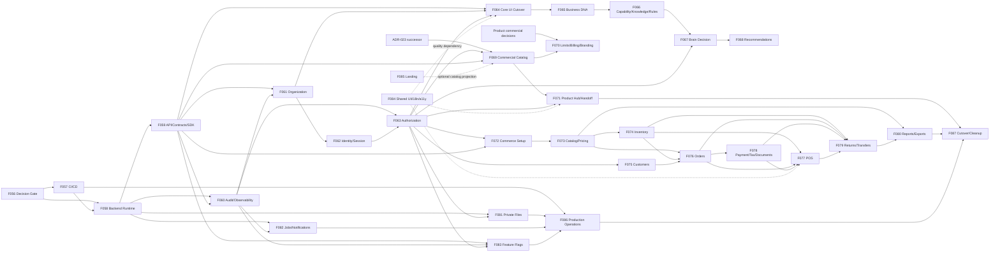

# Delivery Roadmap


> **Execution Scope Decision — 2026-07-18**

## 1. Roadmap Model

This roadmap contains **9 milestones and 18 logical sprints**. A logical sprint is a dependency
and acceptance increment, not a calendar estimate; an XL feature may span several team iterations
inside its assigned sprint boundary. No sprint starts merely because its number is next—entry
criteria and Stage 4 quality gates control progression.

Only Sprint S00 and the bounded presentation work in S01 are currently Ready. Later sprints are
product or workflow.

## 2. Milestone Plan

| Milestone | Objective | Sprints | Features | Entry criteria | Exit criteria |
|---|---|---|---|---|---|
| M0 Architecture and Safe Frontend Baseline | close decisions and preserve safe current value | S00–S01 | F056, F084, F085 | reports 00–14 complete | decision owners/statuses recorded; current frontend quality/marketing baseline approved |
| M1 Delivery and Runtime Spine | create governed execution, contract and evidence foundations | S02–S03 | F057–F060 | F056 technology decisions accepted | staging runtime/CI/contracts/Audit/telemetry foundations pass empty rollback and conformance gates |
| M2 Identity and Multi-Tenancy Alpha | establish canonical tenant, organization, access and safe rollout controls | S04–S05 | F061–F064, F083 | M1 plus data backup/mapping | trusted Core context runs over HTTP; two-tenant/auth/authorization/flag-safety gates pass |
| M3 Deterministic Intelligence Alpha | deliver Business DNA to explainable advice without AI | S06–S07 | F065–F068 | M2 canonical Business/security/Audit | one approved decision is versioned, deterministic, explainable and non-executing |
| M4 Commercial and Product Hub Beta | establish commercial composition and secure Commerce launch | S08–S09 | F069–F071 | ADR-023 successor and Product commercial decisions | entitlement/subscription/setup/access distinct; secure handoff/recovery passes |
| M5 Commerce Foundation Beta | migrate setup, product/price, inventory and customers | S10–S11 | F072–F075 | M2 and API foundation; owner mappings | owner-correct lower-coupling Commerce slices operate through HTTP with parity/reconciliation |
| M6 Commerce Transactions Beta | migrate order/checkout/financial/return/report flows | S12–S13 | F076–F080 | M5 stable contracts and Product/Finance rules | money/stock/tax/document effects reconcile; failures/idempotency/Audit pass |
| M7 Production Services and Release Candidate | secure files/async delivery and prove operations | S14–S16 | F081–F082, F086 | migrated owner slices; approved infrastructure/recovery decisions | RC passes storage, queue, security, deploy, monitoring, backup/restore and rollback gates |
| M8 Production Baseline | remove expired compatibility and establish feature-ready production | S17 | F087 | zero unknown consumers; all prior gates | one production authority, clean architecture, operations acceptance and Production DoD |

### 2.1 Milestone exclusions

- M0 does not create canonical schema or runtime.
- M1 contains no customer/domain aggregate.
- M3 contains no AI provider or consequential target action.
- M4 contains no unapproved limits/billing/branding or Core-owned Commerce setup.
- M7 does not introduce future Marketplace/AI/global execution.
- M8 does not delete unknown data, consumers, historical docs or Audit.

## 3. Exact Feature Dependency Graph



Solid arrows are hard dependencies for the Core+Commerce roadmap. Dotted arrows represent quality,

## 4. Sprint Plan

| Sprint | Objective | Included features | Dependencies | Exit criteria | Blocked work |
|---|---|---|---|---|---|
| S00 | resolve authority, technology, Product and data-safety entry gates | F056 | reports 00–14 | 5 tech decisions and 9 Product clusters disposed/owned; ADR-023 boundary explicit; data provenance known | all runtime/schema/domain work |
| S01 | protect current frontend value without domain change | F084, F085 | current frontend authority; approved copy | selected critical flows pass bilingual/RTL/a11y/theme; Landing identity/claims canonical | live commercial projection until F069; domain writes |
| S02 | establish delivery and empty modular runtime | F057, F058 | S00 technology approval | CI clean run, staging deploy/rollback, module graph and secret/config gates pass | owner data/APIs |
| S03 | establish contracts, SDK, Audit and telemetry spine | F059, F060 | S02 | v1 conformance sample, generated client parity, end-to-end correlation and immutable Audit sample | customer/domain writes |
| S04 | create canonical tenant and organization owner | F061 | S03; backup/mapping approval | all source records mapped/quarantined; ancestry/tenant constraints and rollback pass | auth/commercial/Commerce writes |
| S05 | migrate identity, authorization, rollout controls and Core context | F062, F063, F064, F083 | S04 | server session, allow/deny matrix, flag-safety and Core HTTP journeys pass; browser credentials non-authoritative | commercial/OS launch until lifecycle decision |
| S06 | establish Business DNA and governed input assets | F065, F066 | S05 | immutable DNA/Capability/Knowledge/Rule versions and permissions pass | Brain execution before approved rule slice |
| S07 | deliver first deterministic decision and advisory output | F067, F068 | S06 | deterministic replay/explanation/non-mutation and UI evidence pass | AI/action execution |
| S08 | implement approved commercial catalog and policy | F069, F070 | S05; ADR-023 successor; Product/Finance decisions | commercial distinctions and approved limit/billing/branding rules pass | Product Hub launch if lifecycle incomplete |
| S09 | secure Product Hub launch and recovery | F071 | S08 | replay/expiry/audience/authorization/recovery E2E passes; no cross-origin storage | broad Commerce rollout without foundation |
| S10 | migrate Commerce setup, catalog/pricing and customers | F072, F073, F075 | S05/S03 | owner APIs, parity, tenant/permission and UI gates pass | inventory/order writes |
| S11 | migrate branch Inventory ownership | F074 | S10 | concurrency/idempotency/movement reconciliation and branch isolation pass | checkout/return/transfer |
| S12 | establish Orders and financial/document owners | F076, F078 | S10–S11; Product/Finance rules | duplicate-safe orders and reconciled monetary/tax/document facts pass | POS/return commands |
| S13 | cut POS, Return/Transfer and Reporting projections | F077, F079, F080 | S12 | failure injection, exactly-once effects, totals and authorized export/rebuild pass | RC rollout until operations services |
| S14 | enable private files and asynchronous delivery | F081, F082 | S03/S05; approved products | file security/restore and outbox/DLQ/localized delivery pass | production promotion |
| S15 | build production topology and observability/recovery runbooks | F086 (deployment/monitoring tranche) | S14, F057 | production-like staging, health/alerts/secrets/capacity and operator ownership pass | RC until restore/rollback rehearsal |
| S16 | rehearse RC backup, restore, deploy rollback and incidents | F086 (recovery/RC tranche) | S15; migrated slices | restore meets approved objectives; canary/rollback/incident drill passes; no Critical risk open | Production cutover |
| S17 | remove expired compatibility and accept production baseline | F087 | S09–S16; zero consumers/mismatches | no browser production authority/expired adapters; full gates and Operations acceptance pass | new architecture-sensitive features until DoD |

## 5. Sprint Sequencing Rules

1. S01 may run alongside S00 only within the Ready scopes in F084/F085.
2. S06–S07 may run in parallel with planning for S08–S11 after S05, but neither may borrow the
   other's owner data.
3. S08 cannot start its lifecycle schema until ADR-023 successor is Accepted.
4. S10 read-model/UI characterization can start after S03, but target writes wait for S05 tenant/
   authorization and the feature's migration gate.
5. S14 platform-service design may run after S03; production use waits for relevant owner slices.
6. Sprint exit means all listed acceptance and quality gates pass; partially completed features
   remain in the same logical sprint rather than being declared complete by date.

## 6. Critical Path

```text
F056 Decision Gate
  → F057/F058 Delivery and Backend Runtime
  → F059/F060 Contracts, SDK, Audit and Telemetry
  → F061 Canonical Organization
  → F062/F063 Identity and Authorization
  → F069 Commercial Model + ADR-023 successor
  → F071 Secure Product Hub Handoff
  → F073/F074/F075 Commerce Foundation
  → F076/F078 Order and Financial Owners
  → F077/F079 Transaction Coordination
  → F081/F082 Platform Services
  → F086 Deploy/Restore/Operations
  → F087 Compatibility Removal and Production Baseline
```

The deterministic intelligence branch F065→F066→F067→F068 starts immediately after trusted
Business/security context and is an Alpha value path, not a prerequisite for Commerce transaction

## 7. Parallel Workstreams

| Workstream | Features | Earliest start | Synchronization point |
|---|---|---|---|
| Governance/Product/Data | F056 | S00 | every blocked sprint entry |
| Frontend quality/marketing | F084–F085 | S01 | each user-facing feature DoD |
| Runtime/API/Developer Experience | F057–F060 | S02 | S03 foundation gate |
| Identity/Organization/Security | F061–F064 | S04 | S05 tenant/auth gate |
| Business Intelligence | F065–F068 | S06 | Alpha release |
| Commercial/Product Hub | F069–F071 | after S05 + decisions | Beta launch gate |
| Commerce Foundation | F072–F075 | contract design after S03; writes after S05 | S11 owner gate |
| Commerce Transactions | F076–F080 | S12 | S13 reconciliation gate |
| Platform Services/Operations | F081–F086 | design after S03 | RC gate S16 |
| Migration Closure | F087 | evidence collection ongoing; execution S17 | Production DoD |

## 8. Roadmap Change Control

- Reordering that crosses a hard dependency requires Architecture review and synchronized catalog,
  specification, backlog and release-plan updates.
- Product may reprioritize approved features but cannot bypass ADR-023, tenant/security, backup or
  rollback gates.
- A feature split/merge retains its original requirements and traceability; it cannot hide an open
  Product decision.
- Dates/team capacity are intentionally absent. They belong in an approved delivery plan once
  owners and velocity exist.

## 9. Roadmap Verdict

The execution blueprint delivers useful frontend quality immediately, then establishes trusted
runtime and identity before domain writes. Business DNA and deterministic Brain value appear at
M3, before commercial/Commerce production migration is complete. Backend and frontend work remain
paired by owner slice, and production hardening is explicit rather than mixed into product scope.
